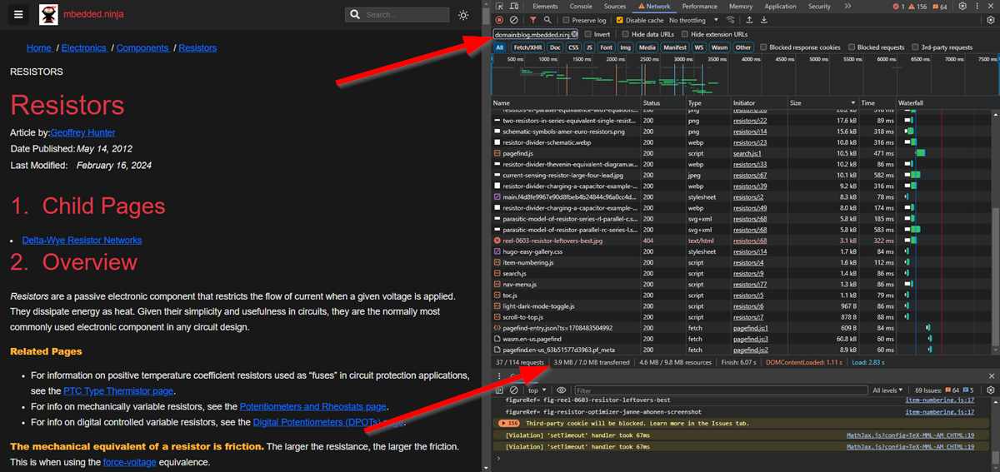

## Overview

This repo contains the code which is used to build my blog at <blog.mbedded.ninja>.

The static site generator Hugo is used to build the website from the files in this repo. Netlify is used to deploy and host the website.

[](https://app.netlify.com/sites/blog-mbedded-ninja/deploys)

## Development

1. The recommended code editor is [Visual Studio Code](https://code.visualstudio.com/).

1. Follow the instructions [here](https://gohugo.io/getting-started/installing) to install Hugo (using `chocolatey` to install is recommended when running Windows). **Make sure to install the extended version, as we need to compile `.scss` files into `.css`**.

1. To start a development server that will watch for file changes (`w`), build drafts (`D`) and build future content (`F`). Since this is a large site, we'll also use `--renderToDisk` otherwise it can take up 6GB of memory!!! Also add in `--navigateToChanged` so that when you save a source file, the server will automatically redirect the browser to the changed page:

    ```sh
    $ hugo server -wDF --renderToDisk --navigateToChanged
    ```

1. Development server should now be live at `localhost:1313`.

Sometimes hugo gets out of sync with the latest file changes. If this happens, you can force hugo to rebuild everything when detecting a file change (warning: this slows down build times):

```sh
$ hugo server -wDF --disableFastRender --renderToDisk
```

There are test pages filled with different shortcode and style tests.

* Markdown: `/posts/tests/markdown`

### pagefind

[pagefind](https://pagefind.app/) is used to create a static search for the blog. This is run AFTER the hugo build step on Netlify during the deployment process. If developing locally, this is not run by default. If you want the search to work when running locally, make sure you have `npx` installed (as of Feb 2024 it is bundled with [npm](https://docs.npmjs.com/downloading-and-installing-node-js-and-npm)) and then run:

```shell
npx -y pagefind@v1.0.4 --site public
```

This command takes some time to run (a few mins on my laptop). You generally do not need to re-run it the next time you set up a dev server, unless you want content you've added since the last time you ran it to appear in the search.

Running pagefind locally relied on the hugo dev server being started in `--renderToDisk` mode (which is recommended) because it can't scan files in memory!

## To Build

To build site and place files in `public` directory:

```sh
$ hugo
```

This is not normally run on a development machine, but rather only run as part of the deployment process on Netlify.

## Directory Structure

Below is an explanation of the directory structure used for this site:

```text
|-- .vscode/
|  |--settings.json -> Contains the word dictionary for VS Code (under "cSpell.words")
|-- assets/
|  |-- main.scss -> Main stylesheet. This requires `hugo-extended` to compile.
|-- content/ -> Markdown files which contain the content which creates the sites pages and posts.
|  |-- example-page-1/
|     |-- _assets/ -> All images, Python scripts used to generate images, Affinity Designer/Photo files 
|     |               used to generate images and any other files used to create content for the page go in this `_assets/`
|     |               directory.
|     |-- example-nested-page-1/ -> Content pages can be nested to arbitrary depths depending on the
|     |                             desired hierarchy. This folder contains the same info as `example-page-1/`. 
|     |-- _index.md -> The markdown file containing the textual content for the page.
|-- layouts/
|  |-- shortcodes -> Hugo shortcodes.
|  |-- calculators -> Contains the HTML/CSS/jQuery based interactive calculators 
|                     which are embedded into certain pages (deprecated, these are now part of NinjaCalc)
|-- old/ -> Deprecated content which is kept around just in case I need it again.
|-- requirements/ -> Contains a requirements.txt used to create a Python virtual environment
|                    for running the various Python scripts in this repo.
|-- scripts/ -> Useful Python scripts to automate some laborious tasks.
|-- templates/ -> Contains Affinity Designer diagram template, various Python script templates and a Markdown page template.
```

NOTE: Placing all the 

## Recommended VS Code Plugins

* `Code Spell Checker`: Prevents spelling mistakes. Additional dictionary definitions are included in `.vscode/settings.json` under `"cSpell.words"`. Make sure to add new words to the "workspace directory" so they get added to this file.
* `Vim`: If you're a vim fan!
* `EditorConfig for VS Code`: Promotes consistent coding styles, incl. indentation rules. Reads rules from `.editorconfig` in this repo's root directory.
* `AsciiDoc`: For syntax highlighting of AsciiDoc pages (with the `.adoc` extension). Don't rely on it for rendering, use the browser with `hugo` and live file watching for that.

## Markdown Extensions

The syntax `<www.google.com>` can be used (instead of `[www.google.com](www.google.com)`) to include a link in where the displayed text is the same as the href.

## Diagrams

Diagrams are drawn in Affinity Designer.

Diagrams used to be drawn in _LibreOffice Draw_ and then exported to `.svg` to display on a page. The Draw file (`.odg`) is usually located in the same content directory as the page the diagram is shown on.

## Photos

Photos are edited in Affinity Photo. 

## Statistics

The code to generate blog statistics (e.g. number of visitors, increases since last year) is all contained in the separate repo <https://github.com/gbmhunter/blog-stats> (it needs to be separate because when it runs, it checks out specific commits of this repo).

## Link Checking

I have found Broken Link Checker to be the best tool to check links. See the Broken Link Checker section below.

### lychee

[lychee](https://github.com/lycheeverse/lychee) did not work so well since it's not that reliable to check the markdown file links, and it doesn't support recursive checking over HTML.

### Broken Link Checker (blc)

[broken-link-checker](https://github.com/stevenvachon/broken-link-checker) is the recommended way. Run this locally once you have a hugo develop server up and running:

```bash
blc -rofe http://localhost:1313/ --requests 10

# Exclude tags can categories pages
blc -rofe http://localhost:1313/ --requests 10 --exclude */tags/* --exclude */categories/*
```

WARNING: Increasing the concurrency from 10 to 50 actually slows it down, because it overloads the development server.

### linkcheck

[linkcheck](https://github.com/filiph/linkcheck) runs out of memory.

## Page Sizes

The below image shows a screenshot of Chrome dev tools analysing the Resistors page size as of Feb 2024.



As highlighted, `3.9MB` of data was transferred from the domain `blog.mbedded.ninja` (a filter is set up to exclude third-party downloads). Netlify reports that blog.mbedded.ninja is using approx. 50GB of it's 100GB limit per month.
