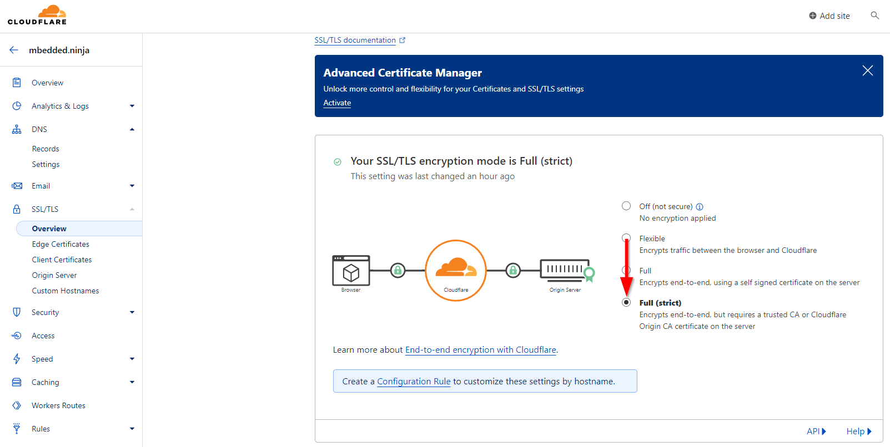

# mbedded.ninja blog

This repo contains the source code which is used to build the embedded engineering blog at https://blog.mbedded.ninja.

The static site generator Astro.js is used to build the website from the files in this repo. Netlify is used to deploy and host the website.

[](https://app.netlify.com/sites/blog-mbedded-ninja/deploys)

## Development

1. The recommended code editor is [Visual Studio Code](https://code.visualstudio.com/).

1. Make sure you have node.js installed.

1. Clone this repo locally.

1. Run `npm install` from the command-line in the root-level directory of this repo. 

1. Run `npm run dev` to start a dev. server that will be accessible at `localhost:4321`.

### pagefind

[pagefind](https://pagefind.app/) is used to create a static search for the blog. The is run automatically as part of the build process.

### Python Environment

Python is used to run scripts inside of the `scripts/` directory. They are primarily used for doing bulk edits of content that would take too long to do manually.

```shell
python -m venv .venv
./.venv/scripts/activate # Windows
pip install -r scripts/requirements.txt
```

`scripts/util` is automatically added to the `PYTHONPATH` by `.vscode/settings.json` if running the Python scripts from inside Visual Studio Code.

## To Build

To build the site and place files in `dist` directory:

```sh
npm run build
```

This is not normally run on a development machine, but rather only run as part of the deployment process on Netlify.

## Directory Structure

Below is an explanation of the directory structure used for this site:

```text
|-- .vscode/
|  |--settings.json -> Contains the word dictionary for VS Code (under "cSpell.words")
|-- src/ -> Contains page content, page structure and reusable Astro components.
|  |-- content/ -> Contains content collections, which includes pages and updates.
|  |  |-- pages/ -> Contains page data (all "normal" pages, except for updates about this blog).
|     |  |-- example-page-1/
|     |  |-- _assets/ -> All images, Python scripts used to generate images, Affinity Designer/Photo files 
|     |  |               used to generate images and any other files used to create content for the page go in this `_assets/`
|     |  |               directory.
|     |  |-- example-nested-page-1/ -> Content pages can be nested to arbitrary depths depending on the
|     |  |                             desired hierarchy. This folder contains the same info as `example-page-1/`. 
|     |  |-- _index.md -> The markdown file containing the textual content for the page.
|     |-- updates/ -> Contains update pages
|-- old/ -> Deprecated content which is kept around just in case I need it again.
|-- scripts/ -> Useful Python scripts to automate some laborious tasks.
|-- templates/ -> Contains Affinity Designer diagram template, various Python script templates and a Markdown page template.
```

## Recommended VS Code Plugins

See `.vscode/extensions.json`.

The VS Code MDX extension requires `npm install` to be run because it uses `remark-math` to provide syntax highlighting the `.mdx` files (this is configured in `tsconfig.json`). If you get errors in VS Code about the MDX server crashing, this is likely to be the cause.

## Pages

The preferred file format for all pages (both docs and blog posts) is `.mdx` (markdown with JSX). This is because it allows for the easy embedding of React components into a Markdown file.

## Images

The preferred file format for all images (diagrams and photos) is `.webp`. This is because it is a modern format that provides good compression and quality.

1280x720px images are recommended for use as page cover images.

Aspect ratios:

* 1:1 (1.0) - Square
* 4:3 - Traditional
* 3:2 (1.5) - Common
* 16:9 (1.78) - Common landscape. Common pixel size is 1280x720 (HD).
* 1.91:1 (1.91) - E.g. 1200x630. Recommended by Facebook

### Diagrams

Diagrams are drawn in Affinity Designer

Diagrams used to be drawn in _LibreOffice Draw_ and then exported to `.svg` to display on a page. The Draw file (`.odg`) is usually located in the same content directory as the page the diagram is shown on.

### Photos

Photos are edited in Affinity Photo. 

## Statistics

The code to generate blog statistics (e.g. number of visitors, increases since last year) is all contained in the separate repo <https://github.com/gbmhunter/blog-stats> (it needs to be separate because when it runs, it checks out specific commits of this repo).

## Broken Link Checking

There is a custom Javascript script at `scripts/link-checker.js` for finding broken internal links. This script leverages the broken-link-checker library. It is much fast to build the site, serve it and run the scan on that rather than run the scan on the development server.

Firstly, build the site (it's faster this way, even when factoring in the build time):

```shell
npm run build
```

Spin up a simple server to serve this, which should use port `3000`:

```shell
npx serve dist/
```

Then from another terminal, run the link checker script:

```shell
node scripts/link-checker.js
```

The link checker script normally takes about 10-20 mins to run. I normally run it manually (on my local machine) a few times per year to tidy up any broken links.

## Page Sizes

The below image shows a screenshot of Chrome dev tools analysing the Resistors page size as of Feb 2024.


As highlighted, `3.9MB` of data was transferred from the domain `blog.mbedded.ninja` (a filter is set up to exclude third-party downloads). Netlify reports that blog.mbedded.ninja is using approx. 50GB of it's 100GB limit per month.

## Analytics

Google Analytics was used for many years (now GA4), but ad blockers also block the GA tracking script.

On 2024-03-22, I created a AWS Lightsail instance than runs Umami, a basic, open-source and free to use (if self-hosted) analytics engine.

I largely followed the tutorial at https://www.digitalocean.com/community/tutorials/how-to-install-umami-web-analytics-software-on-ubuntu-20-04.

Umami can be started by running:

```shell
cd /opt/umami
docker-compose up -d
```

This will start Umami, which listens on 127.0.0.1:3000 (localhost only). An nginx server is placed in front of the Umami server to add SSL/https functionality. The SSL certificate is provided using certbot and Let's Encrypt. nginx is exposed to the public and reverse proxies the traffic to Umami. 

There is a DNS A record for `umami.mbedded.ninja` which points to the AWS Lightsail instance. This might need to be converted into a AAAA and IPv6 record in the future (to reduce running costs?).

The "SSL/TLS encryption mode" in Cloudflare has to be changed from the default of "Flexible" to "Full (strict)" for https to Umami to work correctly:


