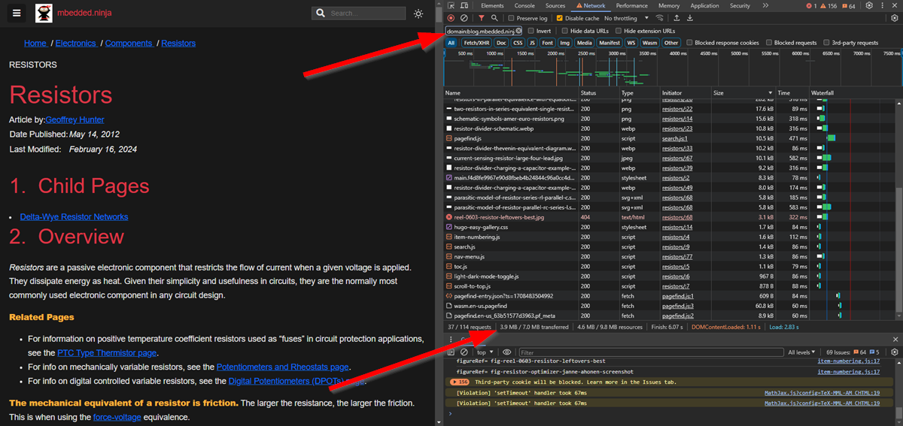
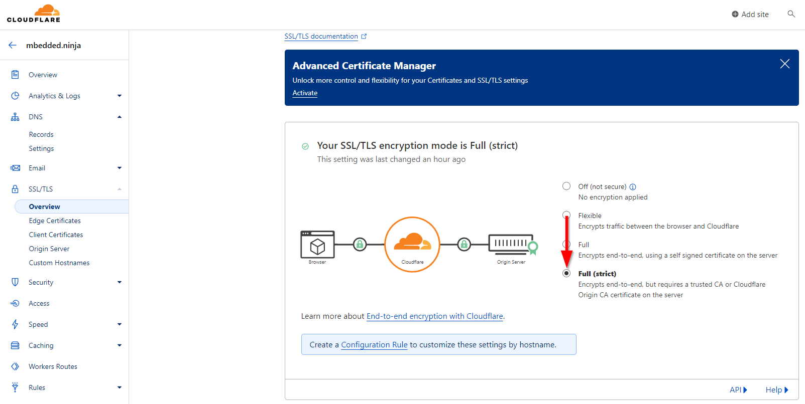

# mbedded.ninja blog

This repo contains the source code which is used to build the embedded engineering blog at https://blog.mbedded.ninja.

The static site generator Astro.js is used to build the website from the files in this repo. Netlify is used to deploy and host the website.

[](https://app.netlify.com/sites/blog-mbedded-ninja/deploys)

## Development

1. The recommended code editor is [Visual Studio Code](https://code.visualstudio.com/).

1. Make sure you have node.js installed.

1. Clone this repo locally.

1. Run `npm install` from the command-line in the root-level directory of this repo. 

1. Run `npm run dev` to start a dev. server that will be accessible at `localhost:4321`.

### pagefind

[pagefind](https://pagefind.app/) is used to create a static search for the blog. The is run automatically as part of the build process.

### Python Environment

Python is used to run scripts inside of the `scripts/` directory. They are primarily used for doing bulk edits of content that would take too long to do manually.

```shell
python -m venv .venv
./.venv/scripts/activate # Windows
pip install -r scripts/requirements.txt
```

`scripts/util` is automatically added to the `PYTHONPATH` by `.vscode/settings.json` if running the Python scripts from inside Visual Studio Code.

## To Build

To build the site and place files in `dist` directory:

```sh
npm run build
```

This is not normally run on a development machine, but rather only run as part of the deployment process on Netlify.

## Directory Structure

Below is an explanation of the directory structure used for this site:

```text
|-- .vscode/
|  |--settings.json -> Contains the word dictionary for VS Code (under "cSpell.words")
|-- src/ -> Contains page content, page structure and reusable Astro components.
|  |-- content/ -> Contains content collections, which includes pages and updates.
|  |  |-- pages/ -> Contains page data (all "normal" pages, except for updates about this blog).
|     |  |-- example-page-1/
|     |  |-- _assets/ -> All images, Python scripts used to generate images, Affinity Designer/Photo files 
|     |  |               used to generate images and any other files used to create content for the page go in this `_assets/`
|     |  |               directory.
|     |  |-- example-nested-page-1/ -> Content pages can be nested to arbitrary depths depending on the
|     |  |                             desired hierarchy. This folder contains the same info as `example-page-1/`. 
|     |  |-- _index.md -> The markdown file containing the textual content for the page.
|     |-- updates/ -> Contains update pages
|-- old/ -> Deprecated content which is kept around just in case I need it again.
|-- scripts/ -> Useful Python scripts to automate some laborious tasks.
|-- templates/ -> Contains Affinity Designer diagram template, various Python script templates and a Markdown page template.
```

## Recommended VS Code Plugins

See `.vscode/extensions.json`.

The VS Code MDX extension requires `npm install` to be run because it uses `remark-math` to provide syntax highlighting to the `.mdx` files (this is configured in `tsconfig.json`). If you get errors in VS Code about the MDX server crashing, this is likely to be the cause.

## Pages

The preferred file format for all pages (both docs and blog posts) is `.mdx` (markdown with JSX). This is because it allows for the easy embedding of React components into a Markdown file.

## Images

The preferred file format for all images (diagrams and photos) is `.webp`. This is because it is a modern format that provides good compression and quality.

1280x720px images are recommended for use as page cover images.

Aspect ratios:

* 1:1 (1.0) - Square
* 4:3 - Traditional
* 3:2 (1.5) - Common
* 16:9 (1.78) - Common landscape. Common pixel size is 1280x720 (HD).
* 1.91:1 (1.91) - E.g. 1200x630. Recommended by Facebook

### Diagrams

Diagrams are drawn in Affinity Designer

Diagrams used to be drawn in _LibreOffice Draw_ and then exported to `.svg` to display on a page. The Draw file (`.odg`) is usually located in the same content directory as the page the diagram is shown on.

### Photos

Photos are edited in Affinity Photo. 

### Videos

Videos are best converted to the `.webm` format.

```shell
ffmpeg -y -i "input-video.mp4" -c:v libvpx-vp9 -crf 35 -b:v 0 -b:a 64k -c:a libopus -vf "scale=450:-1" -row-mt 1 -threads 4 "output-video.webm"
```

Key parameters:

* -y: Overwrite output file without asking
* -c:v libvpx-vp9: Use VP9 video codec

This one applies a watermark to the video. But I couldn't not fix a rotation issue in where it looked fine in VLC but was rotated 90 degrees in the browser.

```shell
ffmpeg -y -i "input-video.mp4" -i
  "watermark.png" -filter_complex
  "[0:v]scale=480:854,setsar=1[v];[1:v]scale=80:-1[wm];[v][wm]overlay=W-w-10:H-h-10:
  enable='gte(t,0)'" -c:v libvpx-vp9 -crf 35 -b:v 0 -b:a 64k -c:a libopus
  -metadata:s:v rotate=0 -row-mt 1 -threads 4
  "output-video.webm"
```

Key parameters:

* -y: Overwrite output file without asking
* -filter_complex: Combines video scaling and watermark overlay
* scale=480:854: Resize video to portrait 480x854
* scale=80:-1: Resize watermark to 80px width (height auto)
* overlay=W-w-10:H-h-10: Position watermark 10px from bottom-right corner
* -crf 35: Higher compression for smaller file size
* -b:a 64k: Lower audio bitrate to save space

## Statistics

The code to generate blog statistics (e.g. number of visitors, increases since last year) is all contained in the separate repo <https://github.com/gbmhunter/blog-stats> (it needs to be separate because when it runs, it checks out specific commits of this repo).

## Broken Link Checking

There is a custom Javascript script at `scripts/link-checker.js` for finding broken internal links. This script leverages the broken-link-checker library. It is much fast to build the site, serve it and run the scan on that rather than run the scan on the development server.

Firstly, build the site (it's faster this way, even when factoring in the build time):

```shell
npm run build
```

Spin up a simple server to serve this, which should use port `3000`:

```shell
npx serve dist/
```

Then from another terminal, run the link checker script:

```shell
node scripts/link-checker.js
```

The link checker script normally takes about 10-20 mins to run. I normally run it manually (on my local machine) a few times per year to tidy up any broken links.

## Page Sizes

The below image shows a screenshot of Chrome dev tools analysing the Resistors page size as of Feb 2024.



As highlighted, `3.9MB` of data was transferred from the domain `blog.mbedded.ninja` (a filter is set up to exclude third-party downloads). Netlify reports that blog.mbedded.ninja is using approx. 50GB of it's 100GB limit per month.

## Analytics

Google Analytics was used for many years (now GA4), but ad blockers also block the GA tracking script.

On 2024-03-22, I created a AWS Lightsail instance than runs Umami, a basic, open-source and free to use (if self-hosted) analytics engine.

I largely followed the tutorial at https://www.digitalocean.com/community/tutorials/how-to-install-umami-web-analytics-software-on-ubuntu-20-04.

Umami can be started by running:

```shell
cd /opt/umami
docker-compose up -d
```

This will start Umami, which listens on 127.0.0.1:3000 (localhost only). An nginx server is placed in front of the Umami server to add SSL/https functionality. The SSL certificate is provided using certbot and Let's Encrypt. nginx is exposed to the public and reverse proxies the traffic to Umami. 

There is a DNS A record for `umami.mbedded.ninja` which points to the AWS Lightsail instance. This might need to be converted into a AAAA and IPv6 record in the future (to reduce running costs?).

The "SSL/TLS encryption mode" in Cloudflare has to be changed from the default of "Flexible" to "Full (strict)" for https to Umami to work correctly:



## Calculator widgets

Each subfolder under `src/components/calculators/` is a self-contained interactive calculator embedded somewhere on the blog. The `/calculators/` index page (`src/content/pages/calculators/index.mdx`) aggregates them all into a searchable card grid via `src/components/calculator-index/`.

For the **widget code structure and Astro / Preact conventions**, see `.claude/skills/calculator/SKILL.md`.

### Folder layout (per calculator)

```
src/components/calculators/<calculator-name>/
├── <CalculatorName>.jsx     # main Preact component
├── calc.js                  # pure logic / parsers
├── catalog.js               # metadata for the calculator index
├── styles.css               # scoped CSS for the widget
└── tile.svg                 # icon shown on the calculator index card
                             # (or tile.png / tile.webp / tile.jpg — see below)
```

### Tile icon guidelines

#### Format

Two formats are supported. **Raster (PNG / WebP) is preferred** — most tiles reuse existing artwork or screenshots, and a well-sized raster reads cleanly in the card. SVG is the fallback for icons that are genuinely vector (schematic symbols, simple geometric marks) where the sharpness and small file size pay off.

**Raster (PNG, JPG, WebP) (preferred):**

- **Recommended format:** **WebP** — best compression-to-quality ratio and supports transparency. PNG and JPG also work, but prefer WebP for new tiles.
- **File name:** `tile.webp` (or `.png`, `.jpg`) inside the widget folder.
- **Recommended size:** **900 × 600 px (3:2 landscape).** The card displays the tile at ~144 px wide on a typical screen, so 900 px wide is comfortably past 2× for crisp high-DPI rendering. 600 × 400 is the practical minimum.
- **Aspect ratio:** **3:2 landscape is preferred** — it reads as a tidy landscape image and is the ratio the rest of the tiles are moving towards. Other ratios still work (see the card-slot note below); they're just letterboxed rather than cropped, so nothing is clipped.
- **Background:** transparent (PNG / WebP) is preferred so the image blends with the card background in both light and dark themes. JPGs always have a background; in that case use a neutral colour that works on both themes (a mid-gray or pure white usually).
- **File size:** target < 50 KB. Optimise with [Squoosh](https://squoosh.app/) or similar if needed.

**SVG (fallback):**

- **File name:** `tile.svg` inside the widget folder.
- **`viewBox`:** `0 0 150 100` — a **3:2 landscape canvas**, which matches the recommended raster ratio above and reads better in the card than a square. (Older tiles use a square `0 0 96 96` viewBox and still work — they're just letterboxed; see note on the card slot below.)
- **Always include explicit `width` and `height` attributes** on the root `<svg>` (e.g. `width="150" height="100"`) — browsers loading SVGs via `` need intrinsic dimensions, or `naturalWidth` reports 0 and `aspect-ratio` fallbacks have to kick in.
- **Avoid `<defs>` with `<radialGradient>` or other internal references** — when the SVG is rendered via `` (which is how the index card renders tiles), browsers restrict internal references for security reasons and the icon can fail to render. Stick to flat fills + strokes. A `<linearGradient>` is OK if you must; radial gradients are the ones that broke.

**Catalog import:** in `catalog.js`, always import with the `?url` suffix regardless of format:

```js
import tile from './tile.svg?url';  // or './tile.png?url', './tile.webp?url', etc.
```

Without `?url`, Astro returns a component factory for SVGs and a metadata object for raster — neither works as a plain `` value.

#### The card slot (why 3:2, and why off-ratio still works)

On the `/calculators/` index, each tile is rendered inside a **fixed-height slot** (`.calc-index__card-tile`, currently `height: 10rem`) with `object-fit: contain`. The fixed height is deliberate: it guarantees every card's title and description start at the same vertical position regardless of the image. The slot height is **not** tied to the image aspect ratio (an earlier attempt to use `aspect-ratio: 3 / 2` on the slot broke that alignment, because the slot height then varied with card width).

Because the slot is a fixed height and `contain` never crops, a 3:2 image renders as a centred landscape image with thin letterbox bars top and bottom — which still looks like a clean landscape tile. Authoring at 3:2 keeps all tiles visually consistent; off-ratio images are tolerated but will letterbox more.

#### Colours (SVG only)

Use this palette consistently:

| Hex         | Role                             | Notes                                                              |
|-------------|----------------------------------|--------------------------------------------------------------------|
| **`#c60e00`** | Primary accent (brand red)     | Matches `--sl-color-accent` (dark mode `#c60e00` / light `#c90e00`). Use for the focal stroke/fill — the element that makes the icon recognisably "ours". |
| `#6b7280`   | Secondary gray                   | Mid-tone gray for context elements (rails, gridlines, secondary labels). Tailwind's `gray-500`. |
| `#5b6472` / `#4b5563` | Tertiary gray                | Slightly darker / cooler gray for subtle structure (latitude lines, frame outlines). |
| `#1f2937` / `#27313f` | Filled disc / panel backgrounds | Dark slate fill for things like the globe disc on the EIRP map tile. Works on both light + dark themes since the surrounding card background is itself dark in both. |
| `#cbd5e1` / `#9ca3af` | Light text on dark fills    | For monospace bytes inside the `#1f2937` packet cells on the BLE tile. |
| `#2d9d4f`   | "Compliant" green                | Only used for status indicators that mean "OK / under limit". Mirrors the EIRP widget's `--eirp-fill-compliant`. |
| `#c93030`   | "Exceeds" red                    | Only used for status indicators that mean "over limit". Slightly brighter / more orange than the brand red so the two can be distinguished on the EIRP tile where both appear. |

**Rule of thumb:** if an element conveys the calculator's identity or its primary action, paint it `#c60e00`. If it provides context (labels, frames, grids), use a gray. Only reach for the status colours (`#2d9d4f` / `#c93030`) if the calculator itself uses them.

