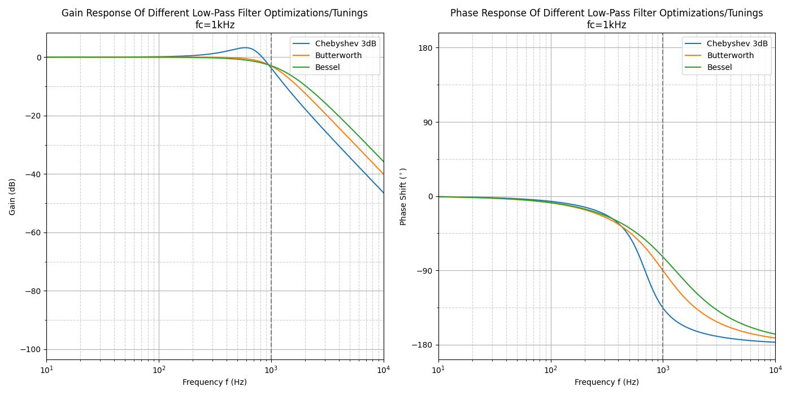
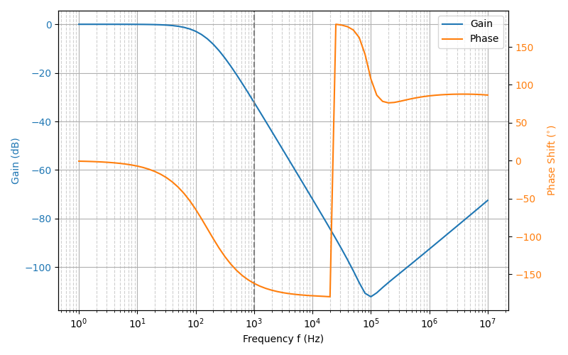
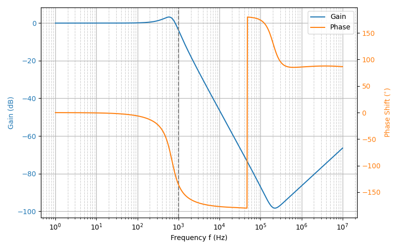

## Overview

### Passive vs. Active

Even in the pass-band, passive filters almost always increase the impedance of the signal, post filter. For a trace on a circuit board, this actually makes the post-filter trace more susceptible to picking up external noise. For this reason, when using a passive filter to filter out induced noise of a sensitive trace, always place a passive filter as close as possible to the receiving end of the signal (e.g. as close as possible to an ADC pin on a microcontroller).

Low-pass filters have an additional advantage when used on the analogue outputs from microcontrollers. If the DAC does not work properly for some reason (assuming you are using a DAC), you can sometimes implement the desired behaviour by using PWM instead. With the cut-off frequency set correctly, the PWM signal will be filtered so that a DC voltage proportional to the duty cycle remains, which is what you wished to implement with the DAC in the first place.

Active filters are electronic waveform filters which require their own power source (such as any filter powered with an link:/electronics/components/op-amps[op-amp]), as opposed to passive filters (such as RC filters) which do not require an external power source. Active filters allow higher roll-of and better transfer characteristics than passive filters, but require more componentry and consume power.

### Filter Topologies vs. Tunings

* Filter topologies define the what components go where.
* Filter tunings define the values of the components in a particular topology. Filter tunings include Butterworth, Chebyshev and Bessel.

### Filter Parameters

#### Cutoff Frequency (fc)

The _cutoff frequency_ (a.k.a. _corner frequency_ or _break frequency_) is the frequency which marks the **transition from a pass band to a stop band**. It marks the frequency at which the energy (whether it be voltage, current or both) stops being passed through and begins being blocked. For any real filter, there is a transition from the passband to the stopband, as so the cutoff frequency is usually defined at the "-3dB" point --- the point at which the **signal degrades to -3dB (half power) of the nominal passband value**.

The symbol stem:[f_c] is usually used to represent the cutoff frequency. Sometimes you may see stem:[f_{-3dB}] instead.

#### Gain Factor (K)

At frequencies stem:[f << f_c], the circuit multiplies the input signal by gain factor `K`.

#### Component Spread

_Component spread_ is a measure of ratio between the highest and lowest valued components required to construct a filter. Low component spread is a good property for a filter to have, as it aids manufacturability.

#### Filter Optimizations

_Filter optimizations_ maximize a certain characteristic of a filter topology, such as maximum pass-band flatness or steepest roll-off. Butterworth, Chebyshev and Bessel are examples of filter optimizations.

## 1st Order Filters

### First-Order Low-Pass RC Filter

#### Schematic

A first-order low-pass RC filter consists of a single series resistor and then a single capacitor to ground.

.Schematic of a simple low-pass RC filter. Schematic from https://workspace.circuitmaker.com/Projects/Details/GeoffreyHunter/mbedded-ninja.
image::low-pass-rc-filter-schematic.png[width=500px]

The low-pass RC filter lets through low frequencies but dampens high frequencies.

#### How To Choose R And C

The cut-off frequency is determined by **both the value of the resistor and the value of the capacitor**, and is equal to:

[stem]
++++
f_{c} = \frac{1}{2\pi RC}
++++

[.text-center]
where: +
stem:[R] is the resistance, in Ohms +
stem:[C] is the capacitance, in Farads +
stem:[f_c] is the cut-off frequency, in Hertz +

As usual, the choice of stem:[R] and stem:[C] is a design decision which involves trade-offs. In terms of choosing stem:[R]:

* A resistance which is too small could draw too much current, either presenting too much load to the input, or overheating. It also could mean that the capacitor has to be very large and/or expensive to get the desired cut-off frequency.
* A resistance which is too large increases the output impedance of the filter, resulting in distortions if too much load is applied to stem:[V_{out}]. It also increases the noise susceptibility of the circuit.

Typically, a resistance between stem:[1k\Omega] and stem:[100k\Omega] is used. Then the capacitance is chosen to give the desired cut-off frequency.

#### Frequency Response

The following plot shows the frequency response (also known as a _bode plot_) of a low-pass filter, with values stem:[R = 1k\Omega] and stem:[C = 1\mu F]. Magnitude is plotted in blue and phase in green.

.The frequency response (magnitude and phase) of a low-pass RC filter.

The magnitude of the RC output voltage stem:[V_{out}] when in the input is a sine wave at frequency stem:[f] and magnitude stem:[V_{in}] is given by:

[stem]
++++
V_{out} = V_{in} \frac{X_c}{\sqrt{R^2 + X_c^2}}
++++

[.text-center]
where: +
stem:[V_{in}] is the magnitude of the input signal at frequency stem:[f], in Volts +
stem:[X_c] is the impedance of the capacitor at frequency stem:[f], in Ohms +
stem:[R] is the resistance of the resistor, in Ohms +

Remember that the impedance of a capacitor is:

[stem]
++++
X_c = \frac{1}{2\pi fC}
++++

The low-pass RC filter also effects the phase of the signal. The higher the frequency, the greater the lag.

[stem]
++++
\phi = -\arctan{(2\pi fRC)}
++++

The cut-off frequency (also called the _break frequency_ or _turnover frequency_<<bib-wikipedia-low-pass-filter>>), stem:[f_c] is not the frequency at which all higher frequencies are stopped (remember, this is an ideal filter, but in real-life they always let through some fraction of the higher-frequencies). Instead, it is the frequency at where:

[stem]
++++
V_{out} = \frac{1}{\sqrt{2}} V_{in} = 0.707*V_{in}
++++

The choice of resistor and capacitor above gives a cut-off frequency of stem:[f_c = 159Hz].

Low-pass RC filters are typically used for applications up to 100kHz, above 100kHz RLC filters are used<<bib-elec-tutorial-filters>>.

#### Time Constant

The time constant stem:[\tau] of a low-pass RC filter is<<bib-wikipedia-low-pass-filter>>:

[stem]
++++
\tau = RC
++++

#### Typical Uses

The low-pass RC filter is one (if not) the most commonly used filters on circuit board designs. Its popularity results from it's simplicity (two passive components), low cost (one resistor, one capacitor), small size, and it's myriad of uses.

Due to the presence of the resistor, it is a lossy filter, and therefore not suited for high-power applications (use a low-pass LC filter instead).

The low-pass RC filter can be used to provide filtering on analogue inputs to a microcontroller before being sampled by the ADC. One example could be to filter the output of an analogue temperature sensor. Note that is **normally advantageous to place the filter as close as possible to the microcontroller**, rather than close to the sensor producing the voltage. This is because the series resistor of the RC filter increases the source impedance of the analogue signal, **making the PCB track less immune to noise once it passes through the resistor**.

Another way to reduce the reduction in noise immunity due to the resistor in the RC low-pass filter is **to make the capacitor as large as practically possible** (for a particular cut-off frequency). Both the resistance and the capacitance influence the cut-off frequency. If you increase the capacitance by 10x, and reduce the resistance by 10x, you get the same cut-off frequency, but far better noise immunity since the source impedance is not altered as much.

**Another consideration is the effect of the increase in source impedance (due to the resistor in the RC filter) when connecting the output to something like a {}).** The input impedance of an non-buffered ADC pin on a microcontroller is usually somewhere between stem:[20-500k\Omega] (note that this is usually variable, and can change with sampling rate). This will form a resistor divider with the RC filter resistance, increasing the ADC measurement error. As a general rule, **you want the RC filter resistance to be much lower than the ADC input impedance**.

[stem]
++++
R_{RC filter} << R_{ADC}
++++

**A RC filter resistance which is at least 50x lower than the ADC input impedance is acceptable in most cases.** For a standard ADC input impedance of stem:[50k\Omega], this means that the resistor in the RC filter should be no more than stem:[1k\Omega].

#### Transient Response

The equation for the voltage across the capacitor is:

[stem]
++++
V_c = V_s(1 - e^{(\frac{t}{RC})})
++++

[.text-center]
where: +
stem:[V_c] = voltage across the capacitor, Volts +
stem:[V_s] = supply voltage, Volts +
stem:[t] = time since supply was turned on, Seconds +
stem:[R] = resistance, Ohms +
stem:[C] = capacitance, Farads +

This equation can be re-arranged to find the time stem:[t], and which the capacitor is at a certain voltage:

[stem]
++++
t = -log(\frac{V-V_c}{V})RC
++++

This form of the equation can be useful to calculate the delay (aka the time stem:[t]), that the RC circuit will provide before something happens.

### Building A VDAC From An ADC And Low-pass RC Filter

**Low-pass RC filters can also be used to create a VDAC (voltage-based digital-to-analogue converter) from a {}.** This is useful since many microcontrollers have one (or more) PWM peripherals, but rarely a built-in VDAC. A simple RC filter placed on the output pin of the PWM signal can convert it into a VDAC, in where the **duty cycle** determines the analogue voltage output.

### Low-Pass LC Filter

The basic low-pass LC filter consists of a single inductor and capacitor.

.A basic schematic of a low-pass LC filter.
image::lc-low-pass-filter-basic-diagram-schematic.png[width=556px]

Unlike the low-pass RC filter, the low-pass LC filter is theoretically loss-less. This means that it does not dissipate energy as heat. However, the presence of the inductance usually makes the LC filter larger and more expensive than the RC filter.

This makes an LC low-pass filter suitable for higher-power applications. You will see LC low-pass filters being used on the output of buck converters (they are essentially part of the buck converter), to filter the output of an H-bridge, and to filter audio signals before they reach the speakers.

The cut-off frequency is given by the following equation:

[stem]
++++
f_c = \frac{1}{2\pi \sqrt{LC}}
++++

The characteristic impedance is:

[stem]
++++
Z = \sqrt{LC}
++++

which you will notice is also present in the cut-off frequency equation.

#### Parasitic elements

The main parasitic element to consider with a low-pass LC filter is the parasitic coil resistance of the inductor. This dampens the output signal.

.A schematic of a LC low-pass filter with parasitic inductor resistance included.
image::lc-low-pass-filter-schematic-with-parasitic-inductor-resistance.png[width=539px]

This is equivalent to a low-pass RLC filter.

### Low-pass RLC Filter

The quality factor is equal to:

[stem]
++++
Q = \frac{2\pi f}{R}
++++

As you increase the series resistance, the quality factor decreases.

The damping factor is equal to:

[stem]
++++
\begin{align}
d_0 &= \frac{1}{Q} \\
d_0 &= \frac{R}{2\pi fL} \\
\end{align}
++++

### Low-Pass Pi And t Filters

Low-pass Pi (π) and t-filters are one step better than the low-pass LC or RC filter.

A 1st-order low-pass π-filter has two capacitors and one inductor. The first capacitor absorbs the most AC by shunting it to ground (assuming the input has a finite source impedance). The inductor then blocks remaining AC, allowing only DC to pass through to the second capacitor. The second capacitor then shunts any remaining AC signal back through ground.

The equations for a 1st order filter are:

[stem]
++++
C = \frac{z_o}{\pi f_c} \\
L = \frac{1}{z_o \pi f_c} \\
f_c = \frac{1}{\pi \sqrt{LC}} \\
++++

[.text-center]
where: +
stem:[C] = total capacitance ,Farads +
stem:[L] = total inductance, Henrys +
stem:[z_o] = characteristic impedance, Ohms +
stem:[f_c] = -3dB cut-off frequency, Hz +

NOTE: Mentioned is total capacitance or total inductance, as in the case of the π-filter each capacitor is C/2, and in the case of the t-filter, each inductor is L/2.

The typical value to use for the characteristic impedance is stem:[ z_o = 50 \Omega ]. Use this if you are unsure on what to set it to. This value is only important if your are matching two RF circuits.

A t-filter is usually better at suppressing high-frequencies than a π-filter, as parasitic coupling between input and output due to PCB layout tends to turn the π filter into a notch filter. However, π-filters are more common because they are cheaper (capacitors are cheaper than inductors).

Both π and t filters may use link:/electronics/components/capacitors#feedthrough-capacitors[feedthrough capacitors] instead of standard caps for better performance (feedthrough capacitors have lower parasitic series inductance).

### Pre-packaged Pi And T Filters

π and t filters can come in pre-packaged components which take all the hassle out of designing the filter correctly and reduce the BOM count of your design. They are commonly in link:/pcb-design/component-packages/chip-eia-component-packages/[EIAxxxx chip packages].

One such example is the link:http://www.digikey.com/product-search/en?FV=ffec061a[TDK Corporation MEM Series].

## 2nd-Order Passive Filters

This chaining is also called _cascading_. The benefit of doing this is that a second-order filter has a roll-off of -40dB/decade, twice that of a first-order filter.

### Second-Order Low-Pass RC

The corner frequency stem:[f_c] is equal to:

[stem]
++++
f_c = \frac{1}{2\pi \sqrt{R_1C_1R_2C_2}}
++++

Is is important to remember that for a second-order filter, the gain at the corner frequency is no longer -3dB. Instead it is -6dB. In general, the gain can be described for stem:[n] stages with:

[stem]
++++
G = \left( \frac{1}{\sqrt{2}} \right) ^n
++++

The reduce the effects of each stages dynamic impedance effecting it's neighbours, its recommended that the following stages resistance should be around 10x the previous stage, and the capacitance 1/10th of the previous stage.

### Passive RC Networks With Voltage Gain > 1

It might seem hard to believe, but you can build RC networks which increase the input voltage at specific frequencies. See link:http://www.oldfriend.url.tw/article/IEEE_paper/Synthesis%20of%20Passive%20RC%20Networks%20with%20Gains.pdf[Herman Epstein - Synthesis Of Passive RC Networks With Gains Greater Than Unity] link:./herman-epstein-synthesis-of-passive-rc-networks-with-gains-greater-than-unity.pdf[(cached copy, 2021-01-23)] for a detailed analysis.

## Filter Optimizations

_Filter optimizations_ are specific tunings of filters to maximise a particular characteristic of it's response. Filter optimization directly specifies what the filter coefficients must be.

* **Butterworth** Optimized for the flattest response through the pass-band, at the expense of having a low transition between the pass and stop-band.
* **Chebyshev**: Designed to have a steep transition between the pass and stop-band, at the expense of gain ripple in either the pass or stopband (_type 1_ or _type 2_). Also called  Chevyshev, Tschebychev, Tschebyscheff or Tchevysheff, depending on exactly how you translate the original Russian name. There are two types of Chebyshev filters:
    * **Type 1:** _Type 1 Chebyshev filters_ (a.k.a. just a _Chebyshev filter_) have ripple in the passband, but no ripple in the stopband.
    * **Type 2:** _Type 2 Chebyshev filters_ (a.k.a. an _inverse Chebyshev filter_) have ripple in the stopband, but no ripple in the passband.
* **Bessel**: Optimized for linear phase response up to (or down to for high-pass filters) the cutoff frequency stem:[f_c], at the expense of a slower transition to the stop-band. This is useful to minimizing the signal distortion (a linear _phase response_ in the frequency domain is a constant _time delay_ in the time domain).
* **Elliptic:** Designed to have the fastest transition from the passband to the stopband, at the expense of ripple in both of these bands (Chebyshev optimization only produces ripple in one of the bands but is not as fast in the transition). Also called _Cauer_ filters or _Rational Chebyshev_ filters.

The graphs below show the differences in response (bode plots, gain and phase) for these various filter optimizations:

.A comparison of different filter optimizations. Gain shown in dB.

Sometimes the differences can been visualized better by display the gain as V/V:

.A comparison of different filter optimizations. Gain shown in V/V.
image::low-pass-filter-optimization-comparison-gain-vv.png[width=700px]

The linear phase delay of the Bessel filter is best visualized in the below plot where the phase in plotted on a linear scale rather than a logarithmic:

.Phase delay of different filter optimizations, with the frequency plotted on a linear axis rather than a logarithmic axis. This is the best way to visualize the linear phase delay of the Bessel optimization.

### Chebyshev Optimization

Chebyshev filters with even order numbers (e.g. 2nd order, 4th order, ...) generate ripples above the 0dB line, filters with odd order numbers (e.g. 3rd order, 5th order, ...) generate ripples below the 0dB line.

Because Chebyshev filters have ripple in the pass-band, **their cutoff frequency is usually defined in a completely different way to all other filter optimizations**. Rather than specifying stem:[f_c] as the -3dB point, the stem:[f_c] for Chebyshev filters is defined at the point at which the gain leaves the allowed ripple region (i.e. > 0.5dB for a 0.5dB Chebyshev filter, > 3dB for a 3dB Chebyshev filter).

### Bessel Optimization

Commonly used in analogue-crossover circuitry.

### Filter Coefficient Tables

* stem:[n] is the filter order
* stem:[i] is the partial filter order
* stem:[a_i] and stem:[b_i] are the filter coefficients
* stem:[k_i] is the ratio between the corner frequency of the partial filter stem:[f_{ci}] and the corner frequency of the overall filter stem:[f_c]. In equation form:
+
[stem]
++++
\begin{align} k_i = \frac{f_{ci}}{f_c} \end{align}
++++
* stem:[Q_i] is the quality factor of the partial filter

#### Butterworth Coefficients

|===
| stem:[n] | stem:[i] | stem:[a_i] | stem:[b_i] | stem:[k_i] | stem:[Q_i]

| 1       | 1       | 1.0000    | 0.0000    | 1.000     | n/a
| 2       | 1       | 1.4142    | 1.0000    | 1.000     | 0.71
| 3       | 1       | 1.0000    | 0.0000    | 1.000     | n/a
|         | 2       | 1.0000    | 1.0000    | 1.272     | 1.00
|===

#### Chebyshev Coefficients For 3dB Passband Ripple

|===
| stem:[n] | stem:[i] | stem:[a_i] | stem:[b_i] | stem:[k_i] | stem:[Q_i]

| 1       | 1       | 1.0000    | 0.0000    | 1.000     | n/a
| 2       | 1       | 1.0650    | 1.9305    | 1.000     | 1.30
| 3       | 1       | 2.7994    | 0.0000    | 0.357     | n/a
|         | 2       | 0.4300    | 1.2036    | 1.378     | 2.55
|===

#### Bessel Coefficients

|===
| stem:[n] | stem:[i] | stem:[a_i] | stem:[b_i] | stem:[k_i] | stem:[Q_i]

| 1       | 1       | 1.0000    | 0.0000    | 1.000     | n/a
| 2       | 1       | 1.3617    | 0.6180    | 1.000     | 0.58
| 3       | 1       | 0.7560    | 0.0000    | 1.323     | n/a
|         | 2       | 0.9996    | 0.4772    | 1.414     | 0.69
|===

### 2nd Order Filter Topologies

A filter topology is an actual circuit configuration which can realize a number of different filter designs. This is different from the configurations such as Butterworth, Chebyshev and Bessel which define the component tuning

* Sallen-Key (a.k.a. KRC filters)
* Tow-Thomas
* Multiple-Feedback Filters (a.k.a. infinite-gain filters)
* State-Variable Filters: As known as _KHN filters_ after the inventors W. J. Kerwin, L. P. Huelsman and R. W. Newcomb, first reported in 1967<<bib-sergio-franco-design-with-op-amps>>.

## Sallen-Key Filters

The Sallen-Key filter is one of the **most popular active 2nd-order analogue filters**. It can be configured as a low-pass, high-pass, band-pass or band-stop filter. Also called a _Sallen and Key_ filter. It was first introduced in 1955 by R.P. Sallen and E.L. Key of MIT's Lincoln Labs, whose last names give this filter it's name.

It has low _component spread_ (low ratios of highest to lowest capacitor and resistor values). It also has a high input impedance and low output impedance, allowing for multiple filters to be chained together without intermediary buffers. However, one issue with the Sallen-Key filter is the strong dependence on the op-amp having low output impedance. An op-amp's output impedance rises with frequency, and thus the filtering ability begins to suffer around the 50-500kHz range.

It is closely related to a link:#voltage-controlled-voltage-source-vcvs-filters[_voltage-controlled voltage source_ (VCVS) filter], however the VCVS filter also includes gain by connected a resistor divider from the output to the inverting terminal of the op-amp.

### Low-Pass Sallen-Key Filter

The schematic for a unity-gain low-pass Sallen-Key filter is shown below:

.The schematic for a unity-gain low-pass Sallen-Key filter.

It looks like 2 cascaded RC filters, except with the other terminal of the 1st capacitor connected to the op-amp's output rather than ground! What does this mean?

TODO: Add more info here.

WARNING: Take note of labelling of the resistors and capacitors if reading other material on Sallen-Key filters, there is no one popular convention as the resistor and capacitor orders are switched frequently.

A Sallen-Key filter has a gain which begins to increase again after a certain frequency in the stop band.

We will simulate the response of a Sallen-Key filter designed with a cutoff frequency of 1kHz. Below is the KiCad schematic used for the simulation:

.Simulation schematics of a low-pass Sallen-Key filter designed for a cutoff frequency of 1kHz.

The KiCad schematic for this simulation can be <a href="low-pass-sallen-key/low-pass-sallen-key.sch" download>downloaded here</a>. The simulated gain (magnitude) and phase response is shown below:

.The simulated gain (magnitude) and phase response of a low-pass Sallen-Key filter designed for a cutoff frequency of 1kHz. The dotted line shows the cutoff frequency.

The transfer function:

[stem]
++++
\begin{align}
\frac{v_{out}}{v_{in}} = \frac{\frac{1}{R1C1R2C2}}{s^2 + \left(\frac{1}{R1C1} + \frac{1}{R2C2}\right)s + \frac{1}{R1C1R2C2}}
\end{align}
++++

The resistance of the resistors stem:[R1] and stem:[R2] are related to the capacitances and filter coefficients by the following equation:

[stem]
++++
\begin{align}
\label{eqn:r1r2eq}
R1, R2 = \frac{a_1 C1 \mp \sqrt{ (a_1 C1)^2 - 4 b_1 C1C2}}{4\pi f_c C1 C2}
\end{align}
++++

You use the stem:[-] sign when calculating stem:[R1] and the stem:[+] sign for calculating stem:[R2].

To obtain real values under the square root, stem:[C1] must obey the follow condition:

[stem]
++++
\begin{align}
\label{eqn:c1geq}
C1 \geq C2 \frac{4b_1}{a_1^2}
\end{align}
++++

These equations give you enough info to calculate all the resistances and capacitors for a Sallen-Key filter. See the design example below to show how you would go about it.

#### Design Example: 2nd-Order Low-Pass Unity-Gain 3dB-Chebyshev Sallen-Key Filter

The task is to design a 2nd-order unity-gain Sallen-Key filter optimized with Chebyshev 3dB ripple coefficients (this will give us a sharp transition from the passband to the stopband) and a corner frequency must be stem:[f_c = 1kHz].

. Look up the link:#filter-coefficient-tables[Chebyshev filter coefficients]. From the table we get:
+
[stem]
++++
\begin{align}
a_1 = 1.0650 \\
b_1 = 1.9305
\end{align}
++++

. Choose a capacitance for stem:[C2]. This is rather arbitrary, but a good recommended starting range is something between stem:[1-100nF]. Lets pick:
+
[stem]
++++
\begin{align}
C2 = 10nF
\end{align}
++++

. Calculate the capacitance of stem:[C1] from stem:[Eq. \ref{eqn:c1geq}]:
+
[stem]
++++
\begin{align}
C1 &\geq C2 \frac{4b_1}{a_1^2} \\
    &\geq 10nF \frac{4\cdot1.9305}{1.0650^2} \\
    &\geq 68.1nF
\end{align}
++++
+
Pick the next largest E12 value:
+
[stem]
++++
\begin{align}
C1 = 82nF
\end{align}
++++

. Calculate stem:[R1] and stem:[R2] using stem:[Eq. \ref{eqn:r1r2eq}]:
+
[stem]
++++
\begin{align}
R1 &= \frac{a_1 C1 - \sqrt{(a_1 C1)^2 - 4 b_1 C1C2}}{4\pi f_c C1 C2} \\
    &= \frac{1.0650 \cdot 82nF - \sqrt{1.0650^2 \cdot 82nF^2 - 4 \cdot 1.9305 \cdot 10nF \cdot 82nF}}{4\pi \cdot 1kHz \cdot 10nF \cdot 82nF} \\
    &= 4.98k\Omega
\end{align}
++++
+
[stem]
++++
\begin{align}
R2 &= \frac{a_1 C2 + \sqrt{a_1^2 C2^2 - 4 b_1 C1C2}}{4\pi f_c C1 C2} \\
    &= \frac{1.0650 \cdot 82nF + \sqrt{1.0650^2 \cdot 82nF^2 - 4 \cdot 1.9305 \cdot 10nF \cdot 82nF}}{4\pi \cdot 1kHz \cdot 10nF \cdot 82nF} \\
    &= 12.0k\Omega
\end{align}
++++
+
Pick the closest E96 values:
+
[stem]
++++
\begin{align}
R1 = 4.99k\Omega \\
R2 = 12.1k\Omega
\end{align}
++++
+
. Build the circuit! It should look like this:
+
.Schematic of the design example (2nd-order 3dB Chebyshev Sallen-Key low-pass filter with a cutoff frequency of 1kHz) above.

. And just good measure this was simulated, to make sure the response is as expected.

.Simulated response of the design example (2nd-order 3dB Chebyshev Sallen-Key low-pass filter with a cutoff frequency of 1kHz) above.

### Dependence On Op-Amp Output Impedance

A Sallen-Key filter is strongly dependent on the op-amp having a low output impedance. A op-amp's output impedance increases with increasing frequency, thus the performance of the Sallen-Key begins to suffer around the 50-500kHz range.

This can be seen in the following bode plot for a 2nd-order low-pass Sallen-Key filter, with a cutoff frequency stem:[f_c] of 1kHz:

.Gain plot of a low-pass Sallen-Key filter showing the reversal to increasing again once a certain frequency is reached, owing to the increasing op-amp output impedance.

## Voltage-Controlled Voltage-Source (VCVS) Filters

Voltage-controlled voltage-source (VCVS) filters are an extension of the link:#sallen-key-filters[Sallen-Key filter] (in that sense, the _Sallen-Key filter_ can be thought of as a simplification of the VCVS filter in where the voltage gain of the op-amp is set to one) in where standard resistor divider feedback is added between the op-amp's output and the inverting input, allowing the gain of the filter to be something other than stem:[1].

They are called VCVS filters because the op-amp is used as a voltage amplifier.

.Schematic of a generic VCVS filter. Note how it is very similar to the Sallen-Key filter, except with the additional resistors R3 and R4 to set a voltage gain other than unity.

## Design Tools

### OKAWA Filter Design and Analysis

Website: link:http://sim.okawa-denshi.jp/en/Fkeisan.htm[http://sim.okawa-denshi.jp/en/Fkeisan.htm]

Great site with web-based calculators and design tools for active and passive filters. Very detailed site with many configuration options and the site even outputs graphs of your designed filter response.

.Screenshot of the homepage for the OKAWA Filter Design and Analysis website. Image from http://sim.okawa-denshi.jp/en/Fkeisan.htm, retrieved 2021-03-27.

### PSoC Microcontrollers And The PSoC Creator IDE

The PSoC microcontroller features an in-built and versatile digital filter block, and the IDE has a graphically-edited method of configuring the DFB to do exactly what you want. The IDE even shows you graphs of the expected response (magnitude, phase, step plots e.t.c).

## External Resources

* The link:https://web.njit.edu/~gilhc/EE494/ee494b.pdf[New Jersey Institute of Technology EE 494 Laboratory IV Part B lab manual] is a great practical resource for learning how to design active filters.
* The link:https://www.mheducation.com/highered/product/design-operational-amplifiers-analog-integrated-circuits-franco/M9780078028168.html[Design With Operational Amplifiers And Analog Integrated Circuits by Sergio Franco, Fourth Edition] is a great book to purchase if you are interesting in further reading and getting right into the weeds of analogue filter design!
* link:https://web.mit.edu/6.101/www/reference/op_amps_everyone.pdf[Op Amps For Everyone by Ron Mancini (SLOD006B)] has some detailed sections on op-amp filter circuits.
* link:https://www.ti.com/lit/an/sloa024b/sloa024b.pdf[SLOA024B: Analysis of the Sallen-Key Architecture - Application Report, by Texas Instruments] can be used for further reading on the Sallen-Key and VCVS amplifiers (<a href="sloa024b-analysis-of-the-sallen-key-architecture-application-report-texas-instruments.pdf" download>cached local copy</a>).
* Texas Instruments link:https://www.ti.com/design-resources/design-tools-simulation/filter-designer.html[Filter Designer] is a free online tool to design filters.
* The Analog Devices link:https://tools.analog.com/en/filterwizard/[Filter Wizard] is an alternative to the Texas Instruments version.   

[bibliography]
== References

* [[[bib-wikipedia-low-pass-filter, 1]]] Wikipedia. _Low-pass filter_. Retrieved 2021-03-25, from https://en.wikipedia.org/wiki/Low-pass_filter.
* [[[bib-elec-tutorial-filters, 2]]] Electronic Tutorials. _Passive Low Pass Filter_. Retrieved 2021-03-25, from https://www.electronics-tutorials.ws/filter/filter_2.html.
* [[[bib-sergio-franco-design-with-op-amps, 3]]] Franco, Sergio. _Design With Operational Amplifiers And Analog Integrated Circuits_. Fourth Edition. McGraw-Hill Education. Copyright 2015.
