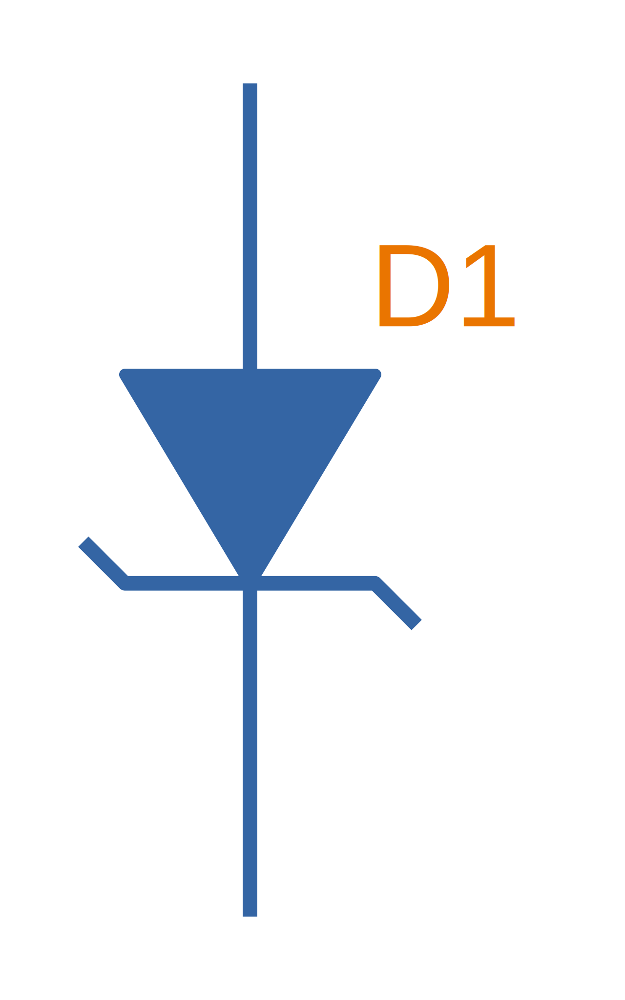

== Overview

Component designators and schematic symbols are used to quickly identify components both on schematics and PCBs. They usually consist of a short acronym representing the type of component, followed by unique number to distinguish it from other components of the same type (e.g. `R3`, `R4`, `C3`).

Over the years, many standards have been released that specify particular designator prefixes for component types. These include:

* Australian Standard AS1102:1995 (Graphical symbols for electrotechnology)
* IEC 60617
* IEEE 315-1975.

However, many schematic and PCB silkscreen designs do not strictly follow any standard (although the similarities are usually quite high). The following list shows non-standard specific, commonly used acronyms and the type of component they represent.

== List of Common Component Designators And Symbols

Sorted by alphabetic order.

=== Antennas (ANT)

There are a number of different schematic symbols for an antenna, but they all look similar and should be easily recognizable. The designator `E` is also used, however `ANT` is my personal preference.

Designator(s):

* `ANT` (recommended)
* `E`

Recommended schematic symbols(s):

[.imagerow]
--
.A schematic symbol for an antenna with an open top.


.A schematic symbol for an antenna with an closed top.

--

### Assemblies (A)

Separate assembly or sub-assembly (e.g. daughter board). I do not see this designator used much in practice (and I myself have never used it, for things such as GPS modules with an LGA footprint I have always used the designator `U`).

Recommended designator(s):

* `A`

### Batteries (BT)

The designator `BT` is commonly used for a battery. The schematic symbol shown below is typical for a battery, although sometimes the distinction between a single-celled and multi-celled battery is made. If the battery is single-celled, this can be represented by a symbol with only one pair of long/short lines (representing the two electrodes of the cell). If the battery is multi-celled, two pairs of long/short lines with a dotted line connecting them (representing many plates) can be used. I prefer to just use the below symbol for any battery type.

Recommended designator(s):

* `BT`

Recommended schematic symbol(s):

.The schematic symbol for a battery.


### Capacitors (C)

`C` is the recommended designator for capacitors (both polarised and non-polarised). Sometimes you will see `VC` used for a variable capacitor (these are not common). I recommend using two different schematic symbols, flat plates for a non-polarised capacitor, and one plate which is curved for a polarised capacitor.

Recommended designator(s):

* `C`

Recommended schematic symbol(s):

[.imagerow]
--
.The schematic symbol for a non-polarised capacitor.


.The schematic symbol for a polarised capacitor.


.The schematic symbol for a variable capacitor.

--

Recommended parameters to show on the schematics:

* Capacitance (e.g. `10uF`)
* Voltage (e.g. `16V`)

For special high tolerance (e.g. 1% or less) capacitors it can be useful to show the tolerance also.

=== Diodes (D)

The designator `D` can be used for most diodes. Sometimes `Z` is used for a Zener diode, and `LED` for a light-emitting diode, however TVS, Schottky and general purpose diodes are still just `D`.

Recommended designator(s):

* `D`

Recommended symbol(s):

[.imagerow]
--
.The recommended schematic symbol for an general purpose diode.


.The recommended schematic symbol for an zener diode.


.The recommended schematic symbol for an LED.

--

=== Fuse/Fuse Holders (F, XF)

`F` is the designator used for fuses (wired, electrical, e.t.c). `XF` is commonly used for a fuse holder.

Recommended designator(s):

* `F` (fuse)
* `XF` (fuse holder)

Recommended symbol(s):

.Schematic symbol for a fuse.
image::fuse-symbol.svg[width=200px]

### Ferrite Beads (FB, FEB)

Designator(s):

* `FB` (recommended)
* `FEB`

Schematic symbol(s):

.The schematic symbol for a ferrite bead.
image::ferrite-bead-symbol.svg[width=200px]

Recommended parameters to display on the schematic:

* Impedance (typically rated @ 100MHz)
* Max. current

Read more about ferrite beads link:/electronics/components/ferrite-beads[here].

### Fiducials (FID)

Recommended designator(s):

* `FID`

Recommended schematic symbol(s):

.The schematic symbol for a fiducial.


=== Gas Discharge Tubes (GDT)

Recommended designator:

* `GDT`

Recommended schematic symbols(s):

[.imagerow]
--
.Schematic symbol and designator for a 2-electrode gas discharge tube (GDT). 


.Schematic symbol and designator for a 3-electrode gas discharge tube (GDT). 

--

Read more about GDTs link:/electronics/components/gas-discharge-tubes-gdts/[here].

=== Ground (GND, AGND, DGND)

Sometimes `GND` is used for all ground points, and sometimes grounds are split based on noise boundaries such as `AGND` and `DGND` (this is common in high-frequency circuits).

Designator(s):

* `GND`: For general purpose use.
* `AGND`: Specialised analogue ground.
* `DGND`: Specialised digital ground.

TIP: Ground designators are not usually shown on schematics next to the symbols, as they are obvious from the symbol alone and are not included in the BoM.

Schematic symbol(s):

[.imagerow]
--
.The schematic symbol for a signal (general) ground. 


.The schematic symbol for a earth ground. 


.The schematic symbol for a chassis ground. 

--

=== Integrated Circuits (U)

`U` is the designator for integrated circuits. ICs include microcontrollers, liner voltage regulators, op-amps, e.t.c.

Why `U`? One theory is that `U` was the the designator for anything "Unspecified". It makes sense that when ICs first came into use that they would of been labelled as such. The name stuck, and now `U` is used for ICs (and no longer for anything "unspecified"). Another theory is that `U` stood for "Unrepairable"<<ics>>.

In older schematics you may also see `IC` or `Z` used for integrated circuits.

Recommended designator(s):

* `U`

Recommended schematic symbol(s):

.Recommended schematic symbol for an integrated circuit (IC).


### Jack (J)

A jack/socket/female connector. Also defined in IEEE 315 as the least moving part of a connector set (which also includes a plug, `P`).

Recommended designator(s):

* `J`

### Jumper (JP)

Jumper or link (L is for inductor, not link). This maybe a simple piece of wire, a physical jumper component, or perhaps a `\(0\Omega\)` resistor).

Recommended designator(s):

* `JP`

### Inductor (L)

`L` is used as a designator for inductors. This is probably in honour of the physicist Heinrich Lenz who was a pioneer in the discovery of electromagnetism (and because `I` is commonly used to represent current).

Recommended designator(s):

* `L`

### Motor (M)

Recommended designator(s):

* `M`

### Mechanical Part (MP)

A mechanical part. This is an umbrella term for many different things, such as screws, standoffs, brackets, e.t.c.

Recommended designator(s):

* `MP`

### Plug (P)

A plug/male connector. Also defined in IEEE 315 as the most moving part of a connector set (which also includes a jack, `J`).

Recommended designator(s):

* `P`

### Photovoltaics/Solar Panels (PV)

`PV` is the designator for photovoltaics (aka solar panels).

Recommended designator(s):

* `PV`

### Resistors (R, VR)

Sometimes you will see `LDR` for light-dependent resistors. For more info see the 

Recommended designator(s):

* `R`: Standard 2-pin resistors
* `RN`: Resistor networks (more than one resistor in the same package, sometimes sharing a common connection).
* `VR`: Variable resistors (aka potentiometers or rheostats). I have seen the reverse, `RV` is use before, along with `POT`. 

Recommended schematic symbol(s):

[.imagerow]
--
.The schematic symbol for a standard resistor.


.The schematic symbol for a variable resistor (potentiometer).

--

### Switches (S, SW)

`S` is the designator used for a switch. `SW` is also commonly used. Sometimes you will see switches labelled according to their type (e.g. `PB` for push-button switches, `DPDT` for double-pole double-throw switches), **but this is not recommended**.

Recommended designator(s):

* `S`

### Spark Gap (SG)

Recommended designator(s):

* `SG`

Recommended schematic symbol(s):

.A schematic symbol for a spark gap. This spark gap is created with two triangles of copper on the PCB, with a gap of 200um between them. As this is made purely from the PCB, there is no BOM component needed.


### Transformer (T)

Designator(s):

* `T` (recommended)
* `TF` (<<an-component-designators>>)

### Transistors (Q)

Typically, `Q` is used for all transistors, no matter if they are BJTs, MOSFETs, JFETs, e.t.c. 

Designator(s):

* `Q` (sometimes `Q` is also used for an integrated circuit, but I prefer using `U`)

Recommended schematic symbol(s):

[.imagerow]
--
.The schematic symbol for an N-channel MOSFET.
image::n-channel-mosfet-schematic-symbol.png[width=250px, height=200px]

.The schematic symbol for a P-channel MOSFET.
image::p-channel-mosfet-schematic-symbol.png[width=250px, height=200px]
--

### Test Point (TP)

Test point. These may be physical components on the PCB, or just places of exposed copper (e.g. pads, holes or vias).

Recommended designator(s):

* `TP`

### Wire/Cable (W)

Wire/cable.

Recommended designator(s):

* `W`

### Crystals/Oscillators (XC, XTAL, Y)

Timing crystals. `XTAL` or `Y` are also used.

Recommended designator(s):

* `XC` 

Recommended schematic symbols:

.The schematic symbol for a crystal.


## Regex

The regex pattern to match any valid component designator, which is one or more capital letters followed by one or more numerals, is:

```text
^[A-Z][A-Z]*[0-9][0-9]*$
```

The above pattern also contains the start and end-of-line anchors `^` and `$`, to enforce that there is no text before or after the designator. These can be removed if desired. More on using regex with component designators can be found on the link:/electronics/general/altium/altium-scripting-and-using-the-api[Altium Scripting page].

[bibliography]
== References

* [[[an-component-designators]]]: RF Cafe (<publish date unknown>). _AN (Army / Navy) Component Designators & Designations_. RF Cafe. Retrieved 2021-07-06, from https://www.rfcafe.com/references/electrical/an-component-designators.htm
* [[[ics]]]: https://electronics.stackexchange.com/questions/25655/why-is-u-used-for-ics-on-circuit-diagrams, fetched on 2019-05-03.