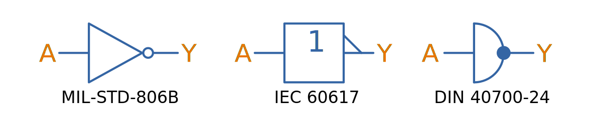
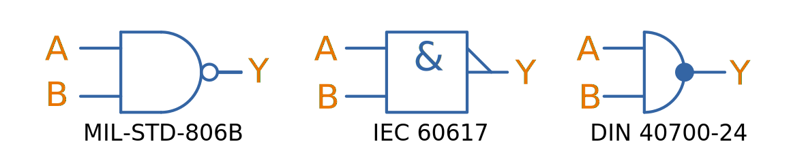
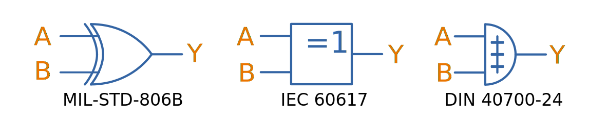
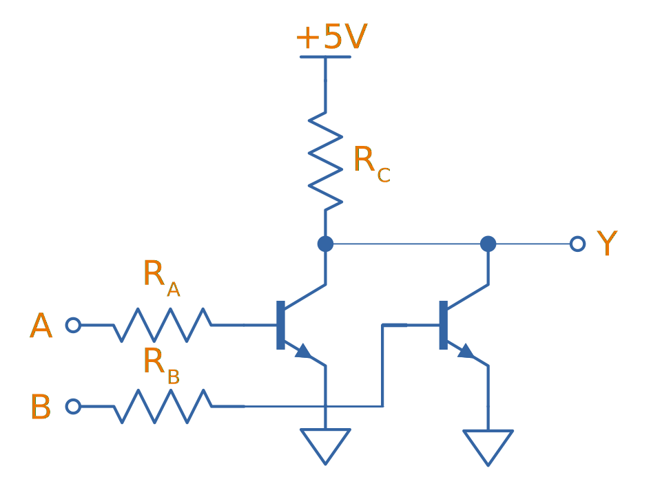

== Overview

Digital logic is the study and application of the fundamentals in digital (binary) electronics, e.g. gates, flip-flops, state machines.

== Logic Gates

Logic gate inputs are normally labelled as a single letter, starting with `A` (e.g. a three input AND gate would have inputs `A`, `B` and `C`). The output is normally labelled `Y` (in other material you may see this labelled `X`), unless you are using a flip-flop or latch, and the output is labelled `Q`.

There are a few different standards used to draw logic gates on schematics:

* *MIL-STD-806B* (Graphic Symbols For Logic Diagrams): This most commonly used symbols for basic and/or/xor e.t.c gates is captured in this standard. Each gate has a unique shape and are easily distinguished on a large schematic with many gates. NOT logic is shown with a _bubble_.
* *IEC 60617* (ANSI/IEEE Std 91-1984): All the gates are IC-like rectangles with symbols inside to denote the function. NOT logic is shown with a _flag_ on the pin rather than a _bubble_. Not as easy too quickly identify the gate as MIL-STD-806B, and not as widely used.
* *DIN 40700-24* (Graphical Symbols; Components For Precision Engineering Devices, Especially Clocks): Ever rarer than the MIL-STD-806B or IEC 60617 symbols, these are rarely seen. The 1976 Edition was released in June 1976. DIN symbols on this page are referenced to https://de.wikipedia.org/wiki/Logikgatter#Typen_von_Logikgattern_und_Symbolik.

This page uses the convention of `TRUE` or `1` to represent the logic state true, and `FALSE` or `0` to represent the logic state false.

=== NOT

Arguably the simplest logical gate (ignoring a buffer), a _NOT_ gate (a.k.a. inverter) always outputs the opposite (complement) of the input. If the input is `TRUE`, the output is `FALSE`. If the input is `FALSE`, the output is `TRUE`.

.The symbols for a NOT gate (inverter).

.Truth table for an NOT gate.
|===
1.+| Inputs | Output

| *A* | *Y*
| 0   | 1
| 1   | 0
|===

And this gives rise to the simple equation for NOT logic:

[stem]
++++
\begin{align}
Y = \overline{A}
\end{align}
++++

=== AND/NAND

An AND gate outputs `TRUE` only if all it's inputs are `TRUE`. AND is also called logical conjunction<<bib-wp-list-logic-sym>>.

.The symbols for an AND gate.

.Truth table for an AND gate.
[width=100%]
|===
2.+| Inputs | Output

| A | B | Y
| 0 | 0 | 0
| 0 | 1 | 0
| 1 | 0 | 0
| 1 | 1 | 1
|===

The equation for the AND logic may be written in one of the following ways:

[stem]
++++
\begin{align}
Y &= A \cdot B \ \text{(preferred)} \\
Y &= AB \\
Y &= A \& B \\
Y &= A \wedge B \\
\end{align}
++++

A NAND gate is just an AND gate but with the output inverted. This is shown in <<nand-gate-symbol>> with the bubble at the output of the AND symbol.

[[nand-gate-symbol]]
.The symbol for an NAND gate.

.Truth table for an NAND gate.
[width=100%]
|===
2.+| Inputs | Output

| *A* | *B* | *Y*
| 0 | 0 | 1
| 0 | 1 | 1
| 1 | 0 | 1
| 1 | 1 | 0
|===

=== OR/NOR

A OR gate is `TRUE` if at least one input is `TRUE`. This means it is also outputs `TRUE` if all it's inputs are `TRUE`. OR is also called logical disjunction<<bib-wp-list-logic-sym>>.

.The symbol for an OR gate.
image::or-gate-symbol.svg[width=800px]

.Truth table for an OR gate.
|===
2.+| Inputs | Output

| *A* | *B* | *Y*
| 0 | 0 | 0
| 0 | 1 | 1
| 1 | 0 | 1
| 1 | 1 | 1
|===

The OR operation can be expressed in an equation in the following ways:

[stem]
++++
\begin{align}
Y &= A + B \ \text{(preferred)} \\
Y &= A \vee B \\
Y &= A || B \\
\end{align}
++++

A NOR gate is just a OR gate but with the output inverted (i.e. what you would get if you connected the output of an OR gate to an inverter). Just like the NAND gate, the NOR is gate is shown in <<nor-gate-symbol>> and is just an OR gate symbol with a bubble on the output.

[[nor-gate-symbol]]
.The symbols for a NOR gate.

.Truth table for an NOR gate.
|===
2.+| Inputs | Output

| *A* | *B* | *Y*
| 0 | 0 | 1
| 0 | 1 | 0
| 1 | 0 | 0
| 1 | 1 | 0
|===

The equation for an NOR gate:

[stem]
++++
\begin{align}
Y = \overline{A + B}
\end{align}
++++

The OR gate be drawn using three equal diameter circles placed on a grid as shown in <<how-to-draw-the-or-gate>>. Segments of the circles perimeters are taken along with the addition of two horizontal line sections to form the classic OR gate shape<<bib-spin-num-logic-gates>>.

[[how-to-draw-the-or-gate]]
.Diagram showing how to draw an OR gate from the segments of three equal diameter circles placed on a grid<<bib-spin-num-logic-gates>>.

=== XOR

A 2-input _XOR gate_ (_exclusive OR_) only outputs `TRUE` if *one and only one* of it's inputs is also `TRUE`. 

.The symbols for a 2-input XOR (exclusive-or) gate.

.Truth table for a 2-input XOR gate.
|===
2.+| Inputs | Output

| A | B | Y
| 0 | 0 | 0
| 0 | 1 | 1
| 1 | 0 | 1
| 1 | 1 | 0
|===

NOTE: The only difference in behaviour between an OR and XOR is when both inputs are `TRUE`. An OR gate outputs a `TRUE` in this case, whilst and XOR outputs a `FALSE`.

The symbol stem:[\bigoplus] is used to represent XOR, as hence XOR can be written in the following ways:

[stem]
++++
\begin{align}
Y &= (A \cdot \bar{B}) + (\bar{A} \cdot B) \\
Y &= (A + B) \cdot (\bar{A} + \bar{B}) \\
Y &= A \bigoplus B \\
\end{align}
++++

.A XOR gate made from 1 AND, NAND and OR gate.

<<xor-gate-made-from-nands>> shows a XOR gate made exclusively from NAND gates.

[[xor-gate-made-from-nands]]
.A XOR gate made exclusively from NAND gates.

You can also make a XOR gate exclusively from NOR gates, as shown in <<xor-gate-made-from-nors>>. Note that the structure is similar to the all-NAND gate version of the XOR, but with the additional inverting gate on the output.

[[xor-gate-made-from-nors]]
.A XOR gate made exclusively from NOR gates.
image::xor-gate-made-from-nors.svg[width=600px]

Whilst it is intuitive how a AND or OR gate should work with more than 2 inputs, that same cannot be said for a XOR gate. Should the output be TRUE only if exactly one input is TRUE? Should the output be TRUE if at least 1 but not all of the inputs are TRUE? Or should the output be TRUE if one input is TRUE, FALSE for 2 inputs TRUE, TRUE again for 3 inputs TRUE, e.t.c?

. *Output TRUE only if 1 and only 1 input is TRUE*. This is called a _one-hot detector_. However, this is rarely seen in practise.
. *Output TRUE only if an odd number of inputs are TRUE*. This is called a _parity generator_ or _modulo-2 adder_. This is more commonly implemented behaviour for a XOR gate with more than 2 inputs.

XOR gates are used for:

* *Parity generators*: A sequence of XOR gates can calculate the parity of block of data, which is used for simple single-bit error detection in some communication protocols (e.g. optional setting you can enable with UART)<<bib-maxim-xor-definition>>.
* *Correlation/sequence detection*: XOR gates output `FALSE` if both inputs are the same. This behaviour can be utilized to perform correlation between two bit streams.
* Cryptographic circuits.

XNOR is an XOR gate but with the output inverted.

[[xnor-gate-symbol]]
.The symbols for a XNOR gate.

.Truth table for an XNOR gate.
|===
2.+| Inputs | Output

| *A* | *B* | *Y*
| 0 | 0 | 1
| 0 | 1 | 0
| 1 | 0 | 0
| 1 | 1 | 1
|===

== What Are Logic Gates Built From?

=== Resistor-Transistor Logic (RTL)

_Resistor-transistor logic_ (RTL) is one of the most basic families of digital logic. It uses resistors and BJTs to build the basic gates required for digital logic. Now days it is completely superseded by logic families such transistor-transistor logic (TTL) and CMOS. However, it serves as a great place to introduces readers on how logic gates are built from discrete components.

.A very basic logic "inverter" made from RTL.
image::rtl-logic-inverter.svg[width=400px]

**Advantages:**

* Very basic to create.
* Used a minimal amount of transistors (this was important in the early days of IC fabrication as transistors were expensive!)

**Disadvantages:**

* **Very limited fan-out.**
* **Significant power consumption:** When the transistors are switched on.
* **Weak drive in one direction:** Single transistor strongly drives output only in one direction, pull-up/down resistor is used in opposite direction.
* **Poor noise margins**.

.Schematic of a RTL NOR gate. When both inputs are `LOW`, neither transistor is on and the output is pulled `HIGH` by stem:[R_C]. Any `HIGH` input will turn on a transistor, which will drive the output `LOW`. 

=== Diode-Transistor Logic (DTL)

TODO: Add info here.

=== Transistor-Transistor Logic (TTL)

The inputs of TTL logic are the emitters of BJTs.

=== CMOS

Represented by `AC`/`ACT` in part numbers, or `HC`/`HCT` for high-speed equivalents. The `T` in the logic subfamily name signifies the parts have TTL-compatible inputs.

=== Comparison

|===
| Logic Subfamily | Description                                  | Comment

| AC              | CMOS.                                        |
| CVSL            | Cascode voltage switch logic.                | 
| HC              | 
| HCT             | High-speed CMOS with TTL-compatible inputs.  | Only works with a +5V power supply. Interestingly, still slower than original TTL.
| IIL             | Integrated injection logic.                  |
| LS              | Low-power Schottky.                          |
| PTL             | Pass transistor logic.                       |
|===

== Logic Gate Part Numbers

Texas Instruments introduced the `SN74xx` series of logic ICs in the 1960s, using TTL logic. These parts became very popular and many other manufactures began making pin-compatible parts. They kept the `74xx` section of the part number to aid identification, and hence the `74xx` is somewhat standardized across the industry.

The 5400 series is the military rated version of the 7400 series. The 4000 series is the newer CMOS alternative to the 7400 TTL logic. However (and which is somewhat confusing), newer 7400 parts can also be made using CMOS logic, for example, the 74HC4051 analogue multiplexer<<bib-ti-74hc4051-multi>>. These parts commonly using the logic subfamily names `HC` or `HCT`.

.Part number descriptions for the popular TTL 74xx family of ICs.
|===
| Part Number | Description                                           | Num. Units | Input           | Output

| 74x00       | Quad 2-input NAND gate                                | 4          | Normal          | Push-pull
| 74x01       | Quad 2-input NAND gate                                | 4          | Normal          | Open-collector
| 74x02       | Quad 2-input NOR gate                                 | 4          | Normal          | Push-pull
| 74x03       | Quad 2-input NAND gate                                | 4          | Normal          | Open-collector
| 74x04       | Hex inverter gate                                     | 6          | Normal          | Push-pull
| 74x05       | Hex inverter gate                                     | 6          | Normal          | Open-collector
| 74x06       | Hex inverter gate                                     | 6          | Normal          | Open-collector, 30V/40mA
| 74x07       | Hex buffer gate                                       | 6          | Normal          | Open-collector, 30V/40mA
| 74x08       | Quad 2-input AND gate                                 | 4          | Normal          | Push-pull
| 74x09       | Quad 2-input AND gate                                 | 4          | Normal          | Open-collector
| 74x10       | Triple 3-input NAND gate                              | 3          | Normal          | Push-pull
| 74x11       | Triple 3-input AND gate                               | 3          | Normal          | Push-pull
| 74x12       | Triple 3-input NAND gate                              | 3          | Normal          | Open-collector
| 74x13       | Dual 4-input NAND gate                                | 2          | Schmitt trigger | Push-pull
| 74x4051     | High-speed 8-channel analog multiplexer/demultiplexer | 1          | Analog          | Analog
| 74x4052     | Dual 4-channel analog multiplexer/demultiplexer       | 2          | Analog          | Analog
| 74x4053     | Triple 2-channel analog multiplexer/demultiplexer     | 3          | Analog          | Analog
|===

The `x` is a placeholder for the logic subfamily. For example, in `74LSxx` the `LS` represent the low-power Schottky subfamily.

A company specific prefix may be added to the above part numbers depending on the manufacturer.

|===
| Prefix | Company

| <none> | Nexperia, Phillips
| CD     | Texas Instruments
| DM     | National Semiconductor
| ID     | IDT
| M      | STMicroelectronics
| MC     | OnSemi
| MM     | National Semiconductor
| NLV    | OnSemi
| SN     | Texas Instruments
| TC     | Toshiba
|===

== Flip-Flops

A flip-flop (a.k.a. _latch_, or _bistable multivibrator_) is a digital circuit which is able to store a single "bit" of information. It has two stable states (representing a digital `1` or `0`), and they can be made to change state by manipulating digital inputs. Hence they are also called _bistable multivibrators_ (two stable states). Flip-flops form the basic storage element in sequential logic.

Flip-flops can be either level-triggered (asynchronous, transparent, opaque) or edge-triggered (synchronous, clocked). Sometimes the word _latch_is exclusively used to refer to level-triggered flip-flops whilst flip-flop is reserved for edge-triggered ones only<<bib-eforu-flipflops>>.

=== SR Latches

SR (**S**et-**R**eset) latches are the most basic form of flip-flop. It is level triggered.

.An SR latch made from NOR gates.

.Characteristic table for a SR latch built from NOR gates.
|===
| S | R | stem:[Q_{next}] | Action

| 0 | 0 | Q               | Hold
| 0 | 1 | 0               | Reset
| 1 | 0 | 1               | Set
| 1 | 1 | X               | Not allowed
|===

Driving both set and reset high is a forbidden state. A JK latch is just an extension of the SR latch where the circuit is modified to remove the forbidden state stem:[S = R = 1] and instead cause the output to toggle.

`SN74LS279` is a quad SR latch component by Texas Instruments. Two of the four latches have two set inputs, allowing for either to be active to set the latch (equivalent to an OR gate placed before a normal single set input SR latch).

SR latches can be used to make a switch debounce circuit.

==== How Does An SR Latch Work?

. **stem:[R] is `HIGH` and stem:[S] is `LOW`:** Since stem:[R] is high, the output of the top NOR gate is `LOW`. This `LOW` feeds into the bottom NOR gate, along with stem:[S] which is also `LOW`, thus the output of the bottom NOR gate is `HIGH`. This `HIGH` feeds into the top NOR gate, which will keep the circuit in this defined state, even if stem:[R] is then brought LOW. This gives the SR latch it's memory.
. **stem:[R] is `LOW` and stem:[S] is `HIGH`:** Because of the symmetry, the same things happens, but in reverse. stem:[Q] is `HIGH` and stem:[\bar{Q}] is `LOW`. Again, if stem:[S] goes low, the SR latch "remembers" and keeps it's outputs in the same state.

.(A): A SR latch in the reset state. (B): A SR latch in the set state. Red represents logical "1", black logical "0".
image::sr-latch-from-nor-gates-states-red-black.svg[width=800px]

=== D Flip-Flops

A D flip-flop (where the D either stands for **D**elay or **D**ata) is a flip-flop which does not propagate the input to the output until a specific state or change in the clock signal. <<d-flipflop-symbol>> shows the basic symbol for a D-type flip-flop with no preset or clear.

[[d-flipflop-symbol]]
.The schematic symbol for a D-type flipflop.
image::d-flipflop-symbol.svg[width=300px]

<<d-flipflop-internals>> shows the internals of a flip-flop.

[[d-flipflop-internals]]
.How a D flipflop is made from discrete NAND gates. The inverting gate can be replaced by a NAND with both inputs connected to form an all-NAND implementation.

You can actually eliminate the need the inverting/NAND gate altogether by connecting the output of the top NAND to the input of the bottom NAND as shown in <<d-flipflop-internals-no-inv-gate>>, saving one gate (lower cost/size).

[[d-flipflop-internals-no-inv-gate]]
.A D-type flip-flop with the inverting/NAND gate removed by connecting the output of the top NAND to the input of the bottom NAND.

You may have noticed that the output stage of the D-type flip-flop looks familiar -- that's because it's just an SR latch! <<d-flipflop-internals-highlighting-sr-latch>> highlights the SR latch section of a D-type flip-flop.

[[d-flipflop-internals-highlighting-sr-latch]]
.A D flip-flop is just a SR latch with some extra circuitry added on the front end to add in the delay functionality.

D-type flip-flops are used for counters, shift-registers and input synchronization.

==== Triggering

Edge-triggered D flip-flops can be either positive or negative edge triggered. Edge-triggered flip-flops are shown by a triangle at the clock input, and negative edge-triggered ones have an additional bubble. However, positive-edge triggered is much more common, and standard practice is to make a negative edge triggered flip-flop by adding your own inverting gate on the clock signal.

NOTE: Adding a inverting gate to the clock signal increasing the propagation delay for that clock input, and will have a significant impact on the operation in high-speed designs.

==== Flip-flop MTBF

[stem]
++++
{\rm MTBF}(t_r) = \frac{e^{ \frac{t_r}{\tau} } } {T_O fa}
++++

[.eq-vars]
where: +
stem:[t_r] = resolution time (time since clock edge), stem:[s] +
stem:[f] = sampling clock frequency, stem:[Hz]
stem:[a] = asynchronous event frequency, stem:[Hz]  
stem:[\tau] = flip-flop time constant (this is a function of it's transconductance), stem:[s]
stem:[T_o] = +

Typical values for a flip-flop inside an ASIC could be:

* stem:[t_r = 2.3ns]
* stem:[\tau = 0.31ns]
* stem:[T_O = 9.6as]
* stem:[f = 100MHz]
* stem:[a = 1MHz]

Which gives stem:[\rm MTBF = 20.1days].

=== JK Flip-flop

== Karnaugh Maps

Karnaugh maps are a way of simplifying combinational logic, often used before realising a combination equation into a number of gates to reduce the complexity.

== Logic Simulators

link:http://sourceforge.net/projects/cedarlogic/[CEDAR Logic Simulator] is my personal favourite. Free, easy to use, colours the wires depending on their state, and allows for named nets as well as direct connections.

== Example Logic Circuits

=== 6-State Binary Counter

Category: Counter  
Expression Style: Sum of Products  
No. of Gates: 14  
No. of Flip-flops:  3  
1-Bit Inputs: 2 + reset  
1-Bit Outputs: 3  

Tested On:

* Simulation: Yes (link:http://sourceforge.net/projects/cedarlogic/[CEDAR Logic Simulator])
* Hardware: Yes

Downloads: link:https://docs.google.com/open?id=0B9GgsT_bUc27SW5sTGZDSlhWQkU[CEDAR Logic Simulator File]

The 6-state binary counter is a counter which counts from 000 to 101 in the normal binary fashion before resetting back to 0. The output increments on every rising-edge of the count pulse, and the direction pin (upNDown) determines the count direction (when upNDown = 1, the counter goes from 000 to 101, when upNDown is 0 the counter goes from 101 to 000).

The flip-flop equations expressed as sums of products are:

[stem]
++++
Q_2 = \bar{Q_2}.\bar{Q_1}.\bar{Q_0}.\bar{y} + \bar{Q_2}.Q_1.Q_0.y + Q_2.\bar{Q_1}.Q_0.\bar{y} + Q_2.\bar{Q_1}.\bar{Q_0}.y \\ \\  
Q_1 = \bar{Q_2}.\bar{Q_1}.Q_0.y + \bar{Q_2}.Q_1.\bar{Q_0}.y + \bar{Q_2}.Q_1.Q_0.\bar{y} + Q_2.\bar{Q_1}.\bar{Q_0}.\bar{y} \\ \\  
Q_0 = \bar{Q_2}.\bar{Q_0} + Q_2.\bar{Q_1}.\bar{Q_0} \\ \\  
++++

.Schematic of a six state binary counter.
image::digital-logic-counter-six-state-binary.png[width=700px]

=== 3-Bit Grey Encoded Counter

Category: Counter  
Expression Style: Sum of Products  
No. of Gates: 14  
No. of Flip-flops: 3  
1-Bit Inputs: 2 + reset  
1-Bit Outputs: 3  

Tested On:

* Simulation: Yes (link:http://sourceforge.net/projects/cedarlogic/[CEDAR Logic Simulator])
* Hardware: Yes

Download: link:https://docs.google.com/open?id=0B9GgsT_bUc27REVITzhmQk9DMk0[CEDAR Logic Simulator File]

The 3-Bit Grey Encoded Counter is a counter that counts from 0 to 7 in binary in a grey encoded fashion. The counter increments on every rising edge of the bit 'count' and the direction bit 'upNDown' determines the direction of counting.

.Schematic of a three-bit Grey encoded binary counter.
image::digital-logic-counter-three-bit-grey-encoded-binary.png[width=700px]

=== Quadrature Detection Circuit

This quadrature detection circuit is built entirely in hardware, and only uses one flip-flop. It is useful for detecting the direction that an encoder that outputs quadrature signals is spinning in. Potential applications include link:/electronics/circuit-design/bldc-motor-control[BLDC motor control]. This circuit can be built entirely in link:/programming/microcontrollers/psoc[reconfigurable PSoC on-chip logic].

When the encoder is spinning in one direction, the output will be logic high (1), when it is spinning in the opposite direction, it will be logic low (0).

.A simple quadrature phase detection circuit using a D flip-flop.
image::quadrature-phase-detection-circuit.png[width=600px]

=== Delay Circuit

A simple delay circuit can be made just by chaining DQ flip-flops together in series (the output of one feeds the input of another). For every flip-flop, the signal will be delayed by one clock-cycle (assuming they all share the same clock source).

.A simple four clock-cycle delay element made from four DQ flip-flops. This can be used as a simple timer.
image::four-clock-cycle-delay-element-from-flipflops.png[width=800px]

This can be used to make a simple timer. Obviously, a limitation is that a flip-flop is needed for every clock cycle of delay needed (try that with a 1000 clock cycle delay!). More advanced timers use binary encoding with the flip-flops to achieve a greater number of states for a lower number of flip-flops.

[bibliography]
== References

* [[[bib-eforu-flipflops, 1]]] ElectronicsForu (2017, Aug 16). _Basics and Overview of Flip Flops_. Retrieved 2021-10-19, from https://www.electronicsforu.com/technology-trends/learn-electronics/flip-flop-rs-jk-t-d.
* [[[bib-ti-74hc4051-multi, 2]]] Texas Instruments (1997, Nov). _CDx4HC405x, CDx4HCT405x High-Speed CMOS Logic Analog Multiplexers and Demultiplexers (Datasheet)_. Retrieved 2021-10-20, from https://www.ti.com/lit/ds/symlink/cd74hc4051.pdf.
* [[[bib-maxim-xor-definition, 3]]] Maxim Integrated (2020). _Glossary Definition For XOR Gate_. Retrieved 2021-10-22, from https://www.maximintegrated.com/en/glossary/definitions.mvp/term/XOR%20Gate/gpk/1202.
* [[[bib-spin-num-logic-gates, 4]]] McAllister, Willy (2021). _Digital logic gates_. Spinning Numbers. Retrieved 2021-10-24, from https://spinningnumbers.org/a/logic-gates.html.
* [[[bib-wp-list-logic-sym, 5]]] Wikipedia (2005, Aug 20). _List of logic symbols_. Retrieved 2021-10-25, from https://en.wikipedia.org/wiki/List_of_logic_symbols.