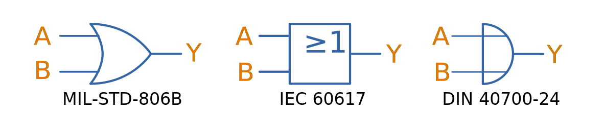

## Overview

Digital logic is the study and application of the fundamentals in digital (binary) electronics, e.g. gates, flip-flops, state machines.

== Logic Gates

When sourcing logic IC's, note that the standard prefix used by many manufactures is "74".

Logic gate inputs are normally labelled as a single letter, starting with A (e.g. a three input AND gate would have inputs A, B and C). The output is normally labelled Y, unless you are using a flip-flop or latch, and the output is labelled Q.

=== Types Of Gates

==== AND

.The symbol for an AND gate.
image::and-gate-symbol.svg[width=300px]

.Truth table for an AND gate.
|===
2.+| Inputs | Output

| A | B | Y
| 0 | 0 | 0
| 0 | 1 | 0
| 1 | 0 | 0
| 1 | 1 | 1
|===

==== OR

.The symbol for an OR gate.

.Truth table for an OR gate.
|===
2.+| Inputs | Output

| A | B | Y
| 0 | 0 | 0
| 0 | 1 | 1
| 1 | 0 | 1
| 1 | 1 | 1
|===

=== What Are Logic Gates Built From?

==== Resistor-Transistor Logic (RTL)

_Resistor-transistor logic_ (RTL) is one of the most basic families of digital logic. It uses resistors and BJTs to build the basic gates required for digital logic. Now days it is completely superseded by logic families such transistor-transistor logic (TTL) and CMOS. However, it serves as a great place to introduces readers on how logic gates are built from discrete components.

.A very basic logic "inverter" made from RTL.
image::rtl-logic-inverter.svg[width=400px]

**Advantages:**

* Very basic to create.
* Used a minimal amount of transistors (this was important in the early days of IC fabrication as transistors were expensive!)

**Disadvantages:**

* **Very limited fan-out.**
* **Significant power consumption:** When the transistors are switched on.
* **Weak drive in one direction:** Single transistor strongly drives output only in one direction, pull-up/down resistor is used in opposite direction.
* **Poor noise margins**.

.Schematic of a RTL NOR gate. When both inputs are `LOW`, neither transistor is on and the output is pulled `HIGH` by stem:[R_C]. Any `HIGH` input will turn on a transistor, which will drive the output `LOW`. 
image::rtl-logic-nor-gate.svg[width=400px]

==== Diode-Transistor Logic (DTL)

TODO: Add info here.

==== Transistor-Transistor Logic (TTL)

The inputs of TTL logic are the emitters of BJTs.

==== CMOS

TODO: Add info here.

=== Flip-Flops

==== SR Latches

SR latches are the most basic form of flip-form (memory element).

.An SR latch made from NOR gates.
image::sr-latch-from-nor-gates.svg[width=500px]

===== How Does An SR Latch Work?

. **stem:[R] is `HIGH` and stem:[S] is `LOW`:** Since stem:[R] is high, the output of the top NOR gate is `LOW`. This `LOW` feeds into the bottom NOR gate, along with stem:[S] which is also `LOW`, thus the output of the bottom NOR gate is `HIGH`. This `HIGH` feeds into the top NOR gate, which will keep the circuit in this defined state, even if stem:[R] is then brought LOW. This gives the SR latch it's memory.
. **stem:[R] is `LOW` and stem:[S] is `HIGH`:** Because of the symmetry, the same things happens, but in reverse. stem:[Q] is `HIGH` and stem:[\bar{Q}] is `LOW`. Again, if stem:[S] goes low, the SR latch "remembers" and keeps it's outputs in the same state.

.(A): A SR latch in the reset state. (B): A SR latch in the set state. Red represents logical "1", black logical "0".
image::sr-latch-from-nor-gates-states-red-black.svg[width=800px]

==== D Flip-Flops

===== Triggering

Edge-triggered D flip-flops can be either positive or negative edge triggered. Edge-triggered flip-flops are shown by a triangle at the clock input, and negative edge-triggered ones have an additional bubble. However, positive-edge triggered is much more common, and standard practice is to make a negative edge triggered flip-flop by adding your own inverting gate on the clock signal.

NOTE: Adding a inverting gate to the clock signal increasing the propagation delay for that clock input, and will have a significant impact on the operation in high-speed designs.

===== Flip-flop MTBF

[stem]
++++
{\rm MTBF}(t_r) = \frac{e^{ \frac{t_r}{\tau} } } {T_O fa}
++++

[.eq-vars]
where: +
stem:[t_r] = resolution time (time since clock edge), stem:[s] +
stem:[f] = sampling clock frequency, stem:[Hz]
stem:[a] = asynchronous event frequency, stem:[Hz]  
stem:[\tau] = flip-flop time constant (this is a function of it's transconductance), stem:[s]
stem:[T_o] = +

Typical values for a flip-flop inside an ASIC could be:

* stem:[t_r = 2.3ns]
* stem:[\tau = 0.31ns]
* stem:[T_O = 9.6as]
* stem:[f = 100MHz]
* stem:[a = 1MHz]

Which gives stem:[\rm MTBF = 20.1days].

== Karnaugh Maps

Karnaugh maps are a way of simplifying combinational logic, often used before realising a combination equation into a number of gates to reduce the complexity.

== Logic Simulators

link:http://sourceforge.net/projects/cedarlogic/[CEDAR Logic Simulator] is my personal favourite. Free, easy to use, colours the wires depending on their state, and allows for named nets as well as direct connections.

== Example Logic Circuits

=== 6-State Binary Counter

Category: Counter  
Expression Style: Sum of Products  
No. of Gates: 14  
No. of Flip-flops:  3  
1-Bit Inputs: 2 + reset  
1-Bit Outputs: 3  

Tested On:

* Simulation: Yes (link:http://sourceforge.net/projects/cedarlogic/[CEDAR Logic Simulator])
* Hardware: Yes

Downloads: link:https://docs.google.com/open?id=0B9GgsT_bUc27SW5sTGZDSlhWQkU[CEDAR Logic Simulator File]

The 6-state binary counter is a counter which counts from 000 to 101 in the normal binary fashion before resetting back to 0. The output increments on every rising-edge of the count pulse, and the direction pin (upNDown) determines the count direction (when upNDown = 1, the counter goes from 000 to 101, when upNDown is 0 the counter goes from 101 to 000).

The flip-flop equations expressed as sums of products are:

[stem]
++++
Q_2 = \bar{Q_2}.\bar{Q_1}.\bar{Q_0}.\bar{y} + \bar{Q_2}.Q_1.Q_0.y + Q_2.\bar{Q_1}.Q_0.\bar{y} + Q_2.\bar{Q_1}.\bar{Q_0}.y \\ \\  
Q_1 = \bar{Q_2}.\bar{Q_1}.Q_0.y + \bar{Q_2}.Q_1.\bar{Q_0}.y + \bar{Q_2}.Q_1.Q_0.\bar{y} + Q_2.\bar{Q_1}.\bar{Q_0}.\bar{y} \\ \\  
Q_0 = \bar{Q_2}.\bar{Q_0} + Q_2.\bar{Q_1}.\bar{Q_0} \\ \\  
++++

.Schematic of a six state binary counter.
image::digital-logic-counter-six-state-binary.png[width=700px]

=== 3-Bit Grey Encoded Counter

Category: Counter  
Expression Style: Sum of Products  
No. of Gates: 14  
No. of Flip-flops: 3  
1-Bit Inputs: 2 + reset  
1-Bit Outputs: 3  

Tested On:

* Simulation: Yes (link:http://sourceforge.net/projects/cedarlogic/[CEDAR Logic Simulator])
* Hardware: Yes

Download: link:https://docs.google.com/open?id=0B9GgsT_bUc27REVITzhmQk9DMk0[CEDAR Logic Simulator File]

The 3-Bit Grey Encoded Counter is a counter that counts from 0 to 7 in binary in a grey encoded fashion. The counter increments on every rising edge of the bit 'count' and the direction bit 'upNDown' determines the direction of counting.

.Schematic of a three-bit Grey encoded binary counter.
image::digital-logic-counter-three-bit-grey-encoded-binary.png[width=700px]

=== Quadrature Detection Circuit

This quadrature detection circuit is built entirely in hardware, and only uses one flip-flop. It is useful for detecting the direction that an encoder that outputs quadrature signals is spinning in. Potential applications include link:/electronics/circuit-design/bldc-motor-control[BLDC motor control]. This circuit can be built entirely in link:/programming/microcontrollers/psoc[reconfigurable PSoC on-chip logic].

When the encoder is spinning in one direction, the output will be logic high (1), when it is spinning in the opposite direction, it will be logic low (0).

.A simple quadrature phase detection circuit using a D flip-flop.
image::quadrature-phase-detection-circuit.png[width=600px]

=== Delay Circuit

A simple delay circuit can be made just by chaining DQ flip-flops together in series (the output of one feeds the input of another). For every flip-flop, the signal will be delayed by one clock-cycle (assuming they all share the same clock source).

.A simple four clock-cycle delay element made from four DQ flip-flops. This can be used as a simple timer.
image::four-clock-cycle-delay-element-from-flipflops.png[width=800px]

This can be used to make a simple timer. Obviously, a limitation is that a flip-flop is needed for every clock cycle of delay needed (try that with a 1000 clock cycle delay!). More advanced timers use binary encoding with the flip-flops to achieve a greater number of states for a lower number of flip-flops.
