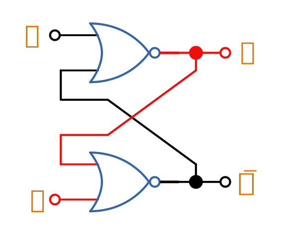
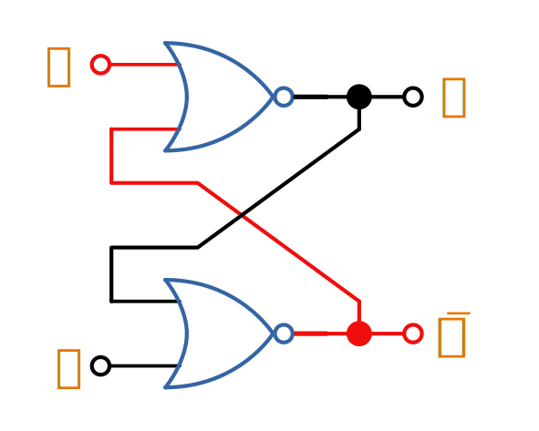

## Overview

When sourcing logic IC's, note that the standard prefix used by many manufactures is "74".

Logic gate inputs are normally labelled as a single letter, starting with A (e.g. a three input AND gate would have inputs A, B and C). The output is normally labelled Y, unless you are using a flip-flop or latch, and the output is labelled Q.

== SR Latches

SR latches are the most basic form of flip-form (memory element).

.An SR latch made from NOR gates.
image::sr-latch-from-nor-gates.svg[width=500px]

.An SR latch in the "set" state. Red represents logical "1", black logical "0".

.An SR latch in the "reset" state. Red represents logical "1", black logical "0".

## D Flip-Flops

=== Triggering

Edge-triggered D flip-flops can be either positive or negative edge triggered. Edge-triggered flip-flops are shown by a triangle at the clock input, and negative edge-triggered ones have an additional bubble. However, positive-edge triggered is much more common, and standard practice is to make a negative edge triggered flip-flop by adding your own inverting gate on the clock signal.

NOTE: Adding a inverting gate to the clock signal increasing the propagation delay for that clock input, and will have a significant impact on the operation in high-speed designs.