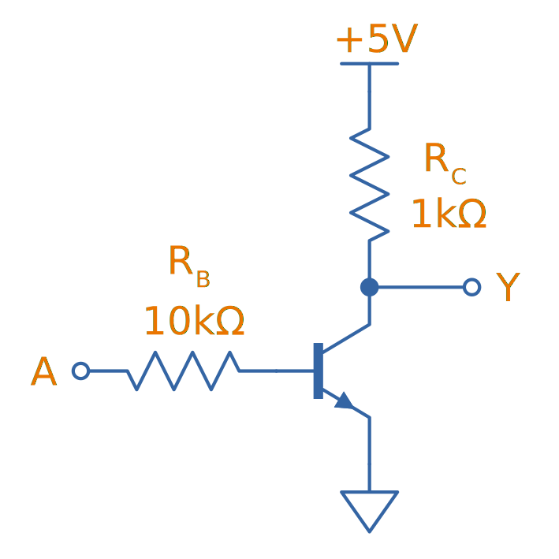

## Overview

When sourcing logic IC's, note that the standard prefix used by many manufactures is "74".

Logic gate inputs are normally labelled as a single letter, starting with A (e.g. a three input AND gate would have inputs A, B and C). The output is normally labelled Y, unless you are using a flip-flop or latch, and the output is labelled Q.

== Types Of Gates

=== AND

.The symbol for an AND gate.

.Truth table for an AND gate.
|===
2.+| Inputs | Output

| A | B | Y
| 0 | 0 | 0
| 0 | 1 | 0
| 1 | 0 | 0
| 1 | 1 | 1
|===

=== OR

.The symbol for an OR gate.

.Truth table for an OR gate.
|===
2.+| Inputs | Output

| A | B | Y
| 0 | 0 | 0
| 0 | 1 | 1
| 1 | 0 | 1
| 1 | 1 | 1
|===

== Resistor-Transistor Logic (RTL)

_Resistor-transistor logic_ (RTL) is one of the most basic families of digital logic. It uses resistors and BJTs to build the basic gates required for digital logic. Now days it is completely superseded by logic families such transistor-transistor logic (TTL) and CMOS. However, it serves as a great place to introduces readers on how logic gates are built from discrete components.

.A very basic logic "inverter" made from RTL.

**Advantages:**

* Very basic to create.
* Used a minimal amount of transistors (this was important in the early days of IC fabrication as transistors were expensive!)

**Disadvantages:**

* **Very limited fan-out.**
* **Significant power consumption:** When the transistors are switched on.
* **Weak drive in one direction:** Single transistor strongly drives output only in one direction, pull-up/down resistor is used in opposite direction.
* **Poor noise margins**.

.Schematic of a RTL NOR gate. When both inputs are `LOW`, neither transistor is on and the output is pulled `HIGH` by stem:[R_C]. Any `HIGH` input will turn on a transistor, which will drive the output `LOW`. 
image::rtl-logic-nor-gate.svg[width=400px]

== Diode-Transistor Logic (DTL)

== Transistor-Transistor Logic (TTL)

The inputs of TTL logic are the emitters of BJTs.

== CMOS

TODO: Add info here.

== SR Latches

SR latches are the most basic form of flip-form (memory element).

.An SR latch made from NOR gates.
image::sr-latch-from-nor-gates.svg[width=500px]

=== How Does An SR Latch Work?

. **stem:[R] is `HIGH` and stem:[S] is `LOW`:** Since stem:[R] is high, the output of the top NOR gate is `LOW`. This `LOW` feeds into the bottom NOR gate, along with stem:[S] which is also `LOW`, thus the output of the bottom NOR gate is `HIGH`. This `HIGH` feeds into the top NOR gate, which will keep the circuit in this defined state, even if stem:[R] is then brought LOW. This gives the SR latch it's memory.
. **stem:[R] is `LOW` and stem:[S] is `HIGH`:** Because of the symmetry, the same things happens, but in reverse. stem:[Q] is `HIGH` and stem:[\bar{Q}] is `LOW`. Again, if stem:[S] goes low, the SR latch "remembers" and keeps it's outputs in the same state.

.(A): A SR latch in the reset state. (B): A SR latch in the set state. Red represents logical "1", black logical "0".

## D Flip-Flops

=== Triggering

Edge-triggered D flip-flops can be either positive or negative edge triggered. Edge-triggered flip-flops are shown by a triangle at the clock input, and negative edge-triggered ones have an additional bubble. However, positive-edge triggered is much more common, and standard practice is to make a negative edge triggered flip-flop by adding your own inverting gate on the clock signal.

NOTE: Adding a inverting gate to the clock signal increasing the propagation delay for that clock input, and will have a significant impact on the operation in high-speed designs.