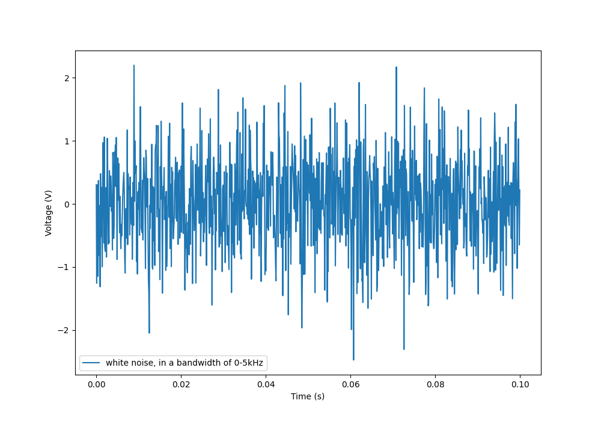
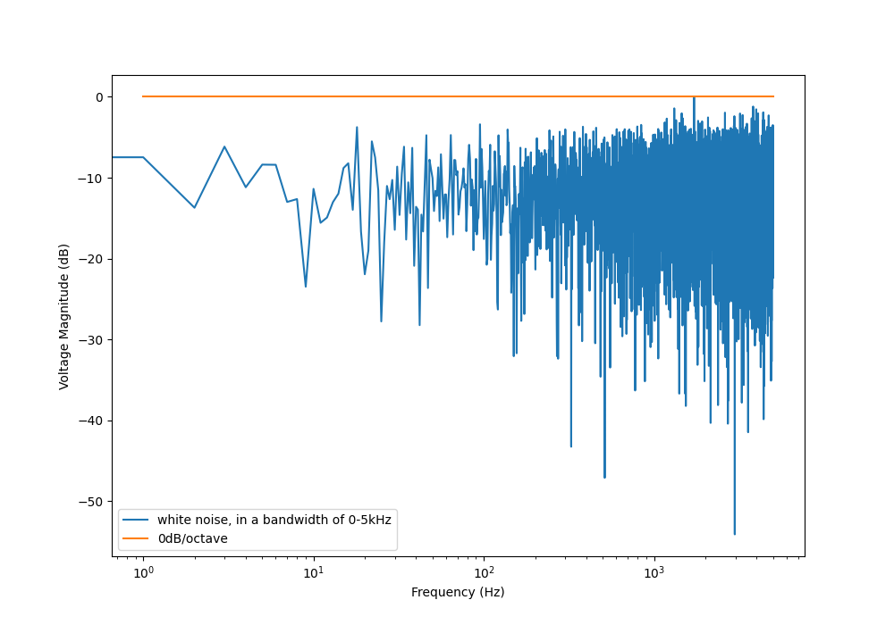
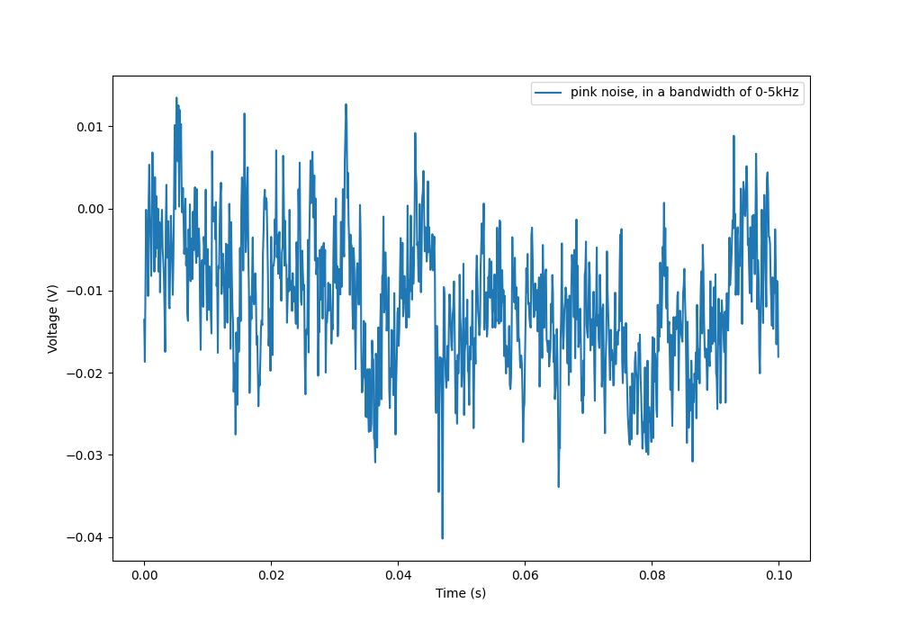
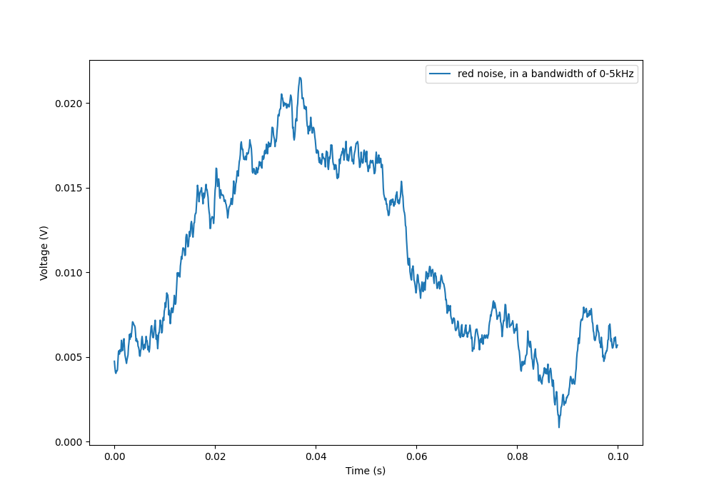
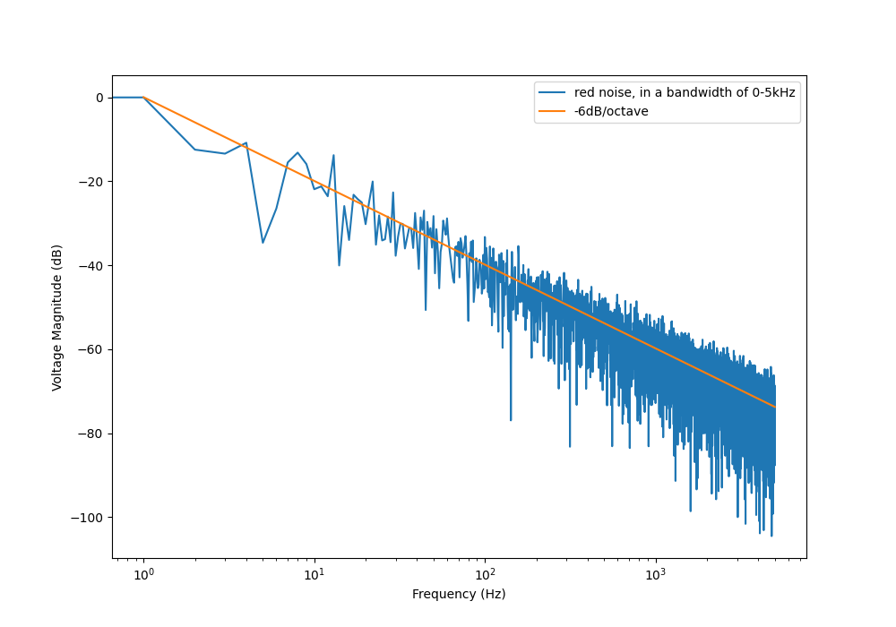

## Overview

_Electrical noise_ is the *unintentional (most of the time, but not in the case of <<_stochastic_resonance, stochastic resonance>>, dither, or random number generation) introduction of voltage/current disturbance in an electrical signal*. Noise is added to a signal as it flows through a circuit/cable by the circuit components themselves, as well as being picked up by electromagnetic means from the surrounding environment. Noise is also emitted by a signal via electromagnetic means to the surrounding environment.

.Noise on a power rail that was feeding 3 SMPS that hadn't been compensated correctly. Kept this image because I thought the waveform was interesting!

* *Electromagnetic interference (EMI)*: The presence of electromagnetic radiation that could disrupt nearby systems. Sources of EMI include electrical storms (lightning), mains power line disruptions, solar radiation and nearby circuitry (power supplies, variable-speed motor drives, arc welders, e.t.c).
* *Electromagnetic compatibility (EMC)*: The measure of ability for a system to both:
    ** Function correctly in the presence of electromagnetic radiation (EMI).
    ** Not emit EMI that exceeds the regulations defined by the type of system and the environment it will be used in.

## Noise Related Variables And Units 

### Noise Power Spectral Density (PSD)

**The _noise power spectral density_ (PSD) is a measure of the noise power per Hertz of bandwidth in a signal**. It also called the _noise spectral density_, _noise power density_, or just _noise density_. Typically denoted with stem:[N_0] and has units stem:[W / Hz]. The stem:[0] in the symbol stem:[N_0] is used to distinguish a density (i.e., per stem:[Hz]). Without the stem:[0], stem:[N] represents a noise power over a specified bandwidth.

In the case that the noise power spectral density is constant (white noise), the noise power stem:[N] can be calculated from the noise power density stem:[N_0] with the following equation:

[stem]
++++
\begin{align}
N = BN_0
\end{align}
++++

[.text-center]
where: +
\(N\) is the noise power, in Watts \(W\) +
\(B\) is the bandwidth of the signal, in Hertz \(Hz\) +
\(N_0\) is the white noise power spectral density, in \(W / Hz\)

Noise power spectral density can be either one-sided or double-sided. TODO: Add more info on this.

### Noise Amplitude Spectral Density (ASD)

_Noise amplitude spectral density_ (ASD) is an alternative to specifying a _noise power spectral density_. Instead of the noise power (in Watts), the noise "amplitude" is used. The amplitude is almost always either voltage or current (with voltage being the more common of the two). The symbol and units depend on whether voltage or current is used:

- Noise voltage spectral density: Typical symbol stem:[v_n] and has units stem:[V / \sqrt{HZ}]
- Noise current spectral density: Typical symbol stem:[i_n] and has units stem:[A / \sqrt{HZ}]

The noise voltage spectral density stem:[v_n] can be calculated from the noise power spectral density stem:[N] if you assume the load is a resistance of stem:[1\Omega]:

[stem]
++++
\begin{align}
v_n = \sqrt{N}
\end{align}
++++

[.text-center]
where: +
\(v_n\) is the noise voltage spectral density, in \(V / \sqrt(Hz)\)

## Colours Of Noise (Power Law Noise)

The _colour of noise_ refers to the shape of the power spectral density (PSD) with respect to the frequency. The category of noises that are assigned colours can also be called _power law noise_, as it's PSD is proportional to stem:[\frac{1}{f^n}], where stem:[n] can be a positive (most commonly) or negative integer.

* **White noise**: White noise is the simplest form of noise, and has a flat power spectral density when plotted against frequency (it has a spectral power density proportional to stem:[1]). 
* **Pink noise**: _Pink noise_ has a spectral power density proportional to stem:[\frac{1}{f}].
* **Red noise**: _Red noise_ has a spectral power density proportional to stem:[\frac{1}{f^2}]. Also called _Brownian noise_.
* **Blue noise**: _Blue noise_ has a spectral power density proportional to stem:[f].
* **Violet noise**: _Violet noise_ has a spectral power density proportional to stem:[f^2].

If you don't have access to equipment that can perform a spectrum/frequency analysis on measured voltages or currents, you can roughly identify the "colour" of the noise sources by recognizing the "shape" of the noise in the time domain on a simple oscilloscope. The following sections contain examples of what each colour of noise looks like in both the time and frequency domain.

### White Noise

White noise has a flat power spectral density when plotted against frequency. White noise got it's name from _white light_, which was assumed to have a flat power density spectrum across the visible range (the catch here is that, well, it actually doesn't). White noise can be specified by a single constant noise power spectral density value.

The following graph shows what Gaussian white noise looks like in the time domain:

.What white noise looks like in the time domain.

And this is what it looks like in the frequency domain (the discrete FFT of the above signal):

.What white noise looks like in the frequency domain.

Although it commonly is modelled as such, white noise does not have to be _Gaussian_. Gaussian noise means the probability density function has a Gaussian distribution. However other forms of white noise exist, for example, Poisson white noise.

Examples of white noise include:

* Thermal (Johnson-Nyquist) noise

#### Stochastic Resonance

_Stochastic resonance_ is the clever technique of adding white noise to a signal which is usually too weak to be detected by the measurement device. The frequencies in the white noise which are also present in the signal will resonate with each other, amplifying the original signal but not amplifying the rest of the white noise. The system has to have a non-linear response for this to work<<wikipedia-stochastic-resonance>>.

### Pink Noise

Also called stem:[\frac{1}{f}] noise. The PSD decreases at stem:[3dB] per octave.

The following graph shows what pink noise looks like in the time domain:

.What pink noise looks like in the time domain.

And this is what it looks like in the frequency domain (the discrete FFT of the above signal):

.What pink noise looks like in the frequency domain.

Examples and uses of pink noise:

* Interestingly, the frequency fluctuations of music have a stem:[\frac{1}{f}] spectral density. The reasoning behind this is that music generated by white‐noise sources sounded too random, while those generated by 1/f2 noise sounded too correlated<<voss-1-f-noise-in-music>>. The "loudness" of music and speech also has a stem:[\frac{1}{f}] PSD.
* The audio of steady rain fall or rustling leaves has a stem:[\frac{1}{f}] PSD.

The following difference equation can create pink noise[^procaccia-schuster-universal-1-f-noise]:

[stem]
++++
\begin{align}
x_t = (x_{t-1} + x_{t-1}^2)\ mod\ 1
\end{align}
++++

### Red (Brownian) Noise

Also called _Brownian_ or stem:[\frac{1}{f^2}] noise. The PSD decreases at stem:[6dB] per octave.

The following graph shows what red noise looks like in the time domain:

.What red noise looks like in the time domain.

And this is what it looks like in the frequency domain (the discrete FFT of the above signal):

.What red noise looks like in the frequency domain.

### Blue Noise

Also called _Azure_ or stem:[f] noise. It has a PSD proportional to frequency. As the frequency goes up, the noise power goes up also. The PSD increases at stem:[3dB] per octave.

The following graph shows what blue noise looks like in the time domain:

.What blue noise looks like in the time domain.
image::noise-blue-time-domain.png[width=700px

And this is what it looks like in the frequency domain (the discrete FFT of the above signal):

.What blue noise looks like in the frequency domain.

In the audio spectrum, blue noise sounds like a horrible high-pitched hiss.

Examples/uses of blue noise include:

* Cherenkov radiation: A really interesting phenomenon which involves particles travelling faster than the speed of light (in a medium)!
* Audio dithering: Blue noise can be added to audio tracks or imagery (a.k.a. spatial dithering of digital halftoning) to randomize the error in quantizing the digital signal<<georgiev-fajardo-blue-noise-dithered-sampling>>.

## Non-Frequency Noise

### Pops

### Snaps

### Crackles

## So Where Does Electrical Noise Come From?

### Thermal (Johnson-Nyquist) Noise

**Thermal noise is generated in any resistor by the random movement of charge carriers (e.g. electrons in a typical circuit) due to them having thermal energy**. It is also called _Johnson_, _Nyquist_ or _Johnson-Nyquist_ noise. Thermal noise increases with temperature, and for this reason some sensitive electronic circuitry is cooled down close to absolute zero to reduce the thermal noise in the sensor/instrument.

The noise power spectral density of thermal noise is found with the following equation:

[stem]
++++
\begin{align}
N_0 = 4 k_B T R 
\end{align}
++++

[.text-center]
where: +
\(N_0\) is the one-sided noise power spectral density, in \(WHz^{-1}\) +
\(k_B\) is Boltzmann's constant, in \(JK^{-1}\) (\(k_B = 1.380649\times10^{-23} JK^{-1}\)) +
\(T\) is the temperature of the resistor, in \(K\) +
\(R\) is the resistance of the resistor, in \(\Omega\)

This is commonly written as a voltage spectral density instead of power:

[stem]
++++
\begin{align}
v_n &= \sqrt{N_0} \nonumber \\
\label{eq:thermal-noise-vsd}
    &= \sqrt{4 k_B T R}
\end{align}
++++

[example]
.Thermal noise example
--
For example, a stem:[10k\Omega] resistor at stem:[25^{\circ}C] has a noise power spectral density stem:[N_0] of:

[stem]
++++
\begin{align}
N_0 &= 4 k_B T R \nonumber \\
    &= 4 \cdot 1.380649\times10^{-23} JK^{-1} \cdot 298.15K \cdot 10k\Omega \nonumber \\
    &= 1.647\times 10^{-16} W Hz^{-1} \nonumber
\end{align}
++++

Converting this to a noise voltage spectral density stem:[v_n]:

[stem]
++++
\begin{align}
v_n &= \sqrt{N_0} \nonumber \\
    &= \sqrt{1.647\times 10^{-16} W Hz^{-1}} \nonumber \\
    &= 12.83 nV Hz^{-0.5}
\end{align}
++++

If our system had a bandwidth stem:[B] of stem:[10kHz], then the RMS noise voltage would be:

[stem]
++++
\begin{align}
v_{rms} &= v_n \cdot \sqrt{B} \nonumber \\
        &= 12.83 nV / \sqrt{Hz} \cdot \sqrt{10kHz} \nonumber \\
        &= 1.28uV \nonumber
\end{align}
++++
--

Instead of modelling the thermal noise source as a voltage in series with a noiseless resistor, you can model it as a current source in parallel with a noiseless resistor (the Norton equivalent). To get this equation, simply divide Eq. stem:[\ref{eq:thermal-noise-vsd}] by stem:[R]. This gives a current spectral density of:

[stem]
++++
\begin{align}
i_n &= \frac{v_n}{R} \nonumber \\
    &= \sqrt{\frac{4 k_B T}{R}}
\end{align}
++++

### Shot Noise

_Shot noise_ (a.k.a. _Poisson noise_) in electronic components arises from the random statistical fluctuations that occur in an electric current, due to electrical current not being a continuous flow but rather being made up of discrete (quantized) electrons travelling through a conductor. The PSD of _Shot noise_ is independent of frequency, so it is spectrally <<_white_noise, white>> (just like Thermal noise). 

[TIP]
====
Whilst shot noise can be considered white for practically all popular use cases, this assumption breaks down at really high frequencies and really low currents in where the frequency is now similar to the individual arrival rate of each electron  (the law of large numbers no longer holds). This frequency is given by<<ee302a04>>:

[stem]
++++
\begin{align}
f_0 &= \frac{I}{q}
\end{align}
++++

[.text-center]
where: +
stem:[I] is the average DC current, in Amps stem:[A] +
stem:[q] is the charge of an electron, in Coulombs stem:[C] (stem:[q = 1.602e^{-19} C])
====

Shot noise is typically talked about being present in semiconductor components such as diodes, and not in basic passives such as resistors. However, more recent literature suggests that shot noise is also present in basic resistors<<sub-poi-shot-noise>>.

The rms value of the shot noise current stem:[i_n] is given by the equation:

[stem]
++++
\begin{align}
i_n &= \sqrt{2IqB}
\end{align}
++++

[.text-center]
where: +
stem:[B] is the bandwidth of the circuit/measurement, in Hertz stem:[Hz] +
and everything else as previously mentioned.

Current will create shot noise. When this current flows through a resistor, this will manifest itself as a noise voltage, in addition to the thermal noise of the resistor.

[example]
.Shot noise example
--
A current of stem:[1A] measured over a bandwidth of stem:[1kHz] gives a RMS shot noise current value stem:[i_n] of:

[stem]
++++
\begin{align}
i_n &= \sqrt{2IqB} \nonumber \\
    &= \sqrt{2*1A*1.602e^{-19} C*1kHz} \nonumber \\
    &= 17.9nA \nonumber \\
\end{align}
++++

If this noise current is flowing through a resistor of stem:[100\Omega], this will manifest in a noise voltage stem:[v_n] of:

[stem]
++++
\begin{align}
v_n &= i_n R \nonumber \\
    &= 17.9nA * 100\Omega \nonumber \\
    &= 1.79uV \\
\end{align}
++++
--

Shot noise also occurs in optics, such as photography, due to the discrete nature of the photons striking each pixel in the camera. 

== Addition of Noise Sources

**The RMS amplitudes of independent noise sources add like orthogonal vectors (Pythagorean addition)**. If two independent voltage noise sources stem:[v_{n1}] and stem:[v_{n2}] were connected in series, then the total voltage noise stem:[v_n] is given by:

[stem]
++++
v_n^2 = v_{n1}^2 + v_{n2}^2
++++

Noise sources like thermal noise and shot noise are independent.

## Measuring Noise

Use the oscilloscope trigger for viewing the noise caused by specific aggressor events. Use the oscilloscope's infinite persistence measurement to measure total noise. It is good practice to measure of a time span of many minutes with the device operating in as many of it's different states as possible.

With the oscilloscope in averaging mode and it set up to trigger of a specific event, you can view the amount of noise due to that event. Any noise asynchronous to the event will be removed through repeated averaging.

## RMS, dB, dBm, SD, Huh?

Noise measurements come in many different units. It can become very confusing when trying to compare different units or convert between them.

AC coupled waveforms become a little simpler...

> For a waveform that has no DC component, the RMS value is the same as the standard deviation.

Typically, when doing noise measurements with an oscilloscope, AC coupling is turned on, which removes the DC component. This means that the standard deviation and the RMS measurements are equal.

Uncorrelated noise sources add in a root-sum-of-squares manner.

[stem]
++++
\begin{align}
e_{total} = \sqrt{e_{1}^2 + e_{2}^2}
\end{align}
++++

This comes from the equation:

[stem]
++++
\begin{align}
x_{rms}^2 = \bar{x}^2 + \sigma_{x}^2
\end{align}
++++

[.text-center]
where: +
\( x_{rms} \) is the RMS value of waveform x +
\( \bar{x} \) is the average (mean) of waveform x +
\( \sigma_{x} \) is the standard deviation of waveform x

As you can see, if the average of the waveform is 0 (as in the case when the waveform is AC coupled), the RMS value is the same as the standard deviation.

## Creating Noise In Software

### Power Law Noise

The following Python code is flexible enough to generate power law noise stem:[\frac{1}{f^n}] of any power stem:[n]. The code is from link:https://github.com/felixpatzelt/colorednoise/blob/master/colorednoise.py[colorednoise.py], which uses an algorithm published by J. Timmer and M. Konig called _On Generating Power Law Noise_<<timmer-konig-generating-power-law-noise>>. Depends on the popular Numpy library. This function was used to create the power law noise example signals on this page.

TIP: You can also pass in negative exponents stem:[-1], stem:[-2] to generate blue noise and purple noise.

.A Python function to generate power law noise
[source,python]
----
from numpy import sqrt, newaxis
from numpy.fft import irfft, rfftfreq
from numpy.random import normal
from numpy import sum as npsum

def powerlaw_psd_gaussian(exponent, size, fmin=0):
    """
    Taken from https://github.com/felixpatzelt/colorednoise/blob/master/colorednoise.py
    Gaussian (1/f)**beta noise.
    Based on the algorithm in:
    Timmer, J. and Koenig, M.:
    On generating power law noise.
    Astron. Astrophys. 300, 707-710 (1995)
    Normalised to unit variance
    Parameters:
    -----------
    exponent : float
        The power-spectrum of the generated noise is proportional to
        S(f) = (1 / f)**beta
        flicker / pink noise:   exponent beta = 1
        brown noise:            exponent beta = 2
        Furthermore, the autocorrelation decays proportional to lag**-gamma
        with gamma = 1 - beta for 0 < beta < 1.
        There may be finite-size issues for beta close to one.
    shape : int or iterable
        The output has the given shape, and the desired power spectrum in
        the last coordinate. That is, the last dimension is taken as time,
        and all other components are independent.
    fmin : float, optional
        Low-frequency cutoff.
        Default: 0 corresponds to original paper. It is not actually
        zero, but 1/samples.
    Returns
    -------
    out : array
        The samples.
    Examples:
    ---------
    # generate 1/f noise == pink noise == flicker noise
    >>> import colorednoise as cn
    >>> y = cn.powerlaw_psd_gaussian(1, 5)
    """
    
    # Make sure size is a list so we can iterate it and assign to it.
    try:
        size = list(size)
    except TypeError:
        size = [size]
    
    # The number of samples in each time series
    samples = size[-1]
    
    # Calculate Frequencies (we assume a sample rate of one)
    # Use fft functions for real output (-> hermitian spectrum)
    f = rfftfreq(samples)
    
    # Build scaling factors for all frequencies
    s_scale = f
    fmin = max(fmin, 1./samples) # Low frequency cutoff
    ix   = npsum(s_scale < fmin)   # Index of the cutoff
    if ix and ix < len(s_scale):
        s_scale[:ix] = s_scale[ix]
    s_scale = s_scale**(-exponent/2.)
    
    # Calculate theoretical output standard deviation from scaling
    w      = s_scale[1:].copy()
    w[-1] *= (1 + (samples % 2)) / 2. # correct f = +-0.5
    sigma = 2 * sqrt(npsum(w**2)) / samples
    
    # Adjust size to generate one Fourier component per frequency
    size[-1] = len(f)

    # Add empty dimension(s) to broadcast s_scale along last
    # dimension of generated random power + phase (below)
    dims_to_add = len(size) - 1
    s_scale     = s_scale[(newaxis,) * dims_to_add + (Ellipsis,)]
    
    # Generate scaled random power + phase
    sr = normal(scale=s_scale, size=size)
    si = normal(scale=s_scale, size=size)
    
    # If the signal length is even, frequencies +/- 0.5 are equal
    # so the coefficient must be real.
    if not (samples % 2): si[...,-1] = 0
    
    # Regardless of signal length, the DC component must be real
    si[...,0] = 0
    
    # Combine power + corrected phase to Fourier components
    s  = sr + 1J * si
    
    # Transform to real time series & scale to unit variance
    y = irfft(s, n=samples, axis=-1) / sigma
    
    return y
----

[bibliography]
== References

* [[[procaccia-schuster-universal-1-f-noise]]]: Itamar Procaccia and Heinz Schuster: _Functional renormalization-group theory of universal 1/f noise in dynamical systems_. Phys. Rev. A 28, 1210(R). Published 1 August 1983. <https://journals.aps.org/pra/abstract/10.1103/PhysRevA.28.1210>, accessed 2021-06-07.
* [[[wikipedia-stochastic-resonance]]]: Retrieved 2021-06-07, from https://en.wikipedia.org/wiki/Stochastic_resonance
* [[[timmer-konig-generating-power-law-noise]]]: J. Timmer and M. Konig: _On Generating Power Law Noise_. Astronomy And Astrophysics 2.3.1995. Retrieved 2021-06-07, from https://citeseerx.ist.psu.edu/viewdoc/download?doi=10.1.1.29.5304&rep=rep1&type=pdf.
* [[[georgiev-fajardo-blue-noise-dithered-sampling]]]: Iliyan Georgiev and Marcos Fajardo: _Blue-noise Dithered Sampling_. <https://www.arnoldrenderer.com/research/dither_abstract.pdf>, accessed 2021-06-08.
* [[[voss-1-f-noise-in-music]]]: Voss, R F, and Clarke, J. _''1/f noise'' in music: Music from 1/f noise_. United States: N. p., 1978. Web. doi:10.1121/1.381721.
* [[[sub-poi-shot-noise]]]: Marc de Jong. (1996, August). _Sub-Poissonian shot noise_. Nanophysics. Retrieved 2021-06-29, from https://www.lorentz.leidenuniv.nl/beenakker/beenakkr/mesoscopics/topics/noise/noise.html
* [[[ee302a04]]]: Imperial College. (2008). _EE 3.02/A04 Instrumentation_. Retrieved 2021-06-29, from http://cas.ee.ic.ac.uk/people/dario/files/E302/2-noise.pdf