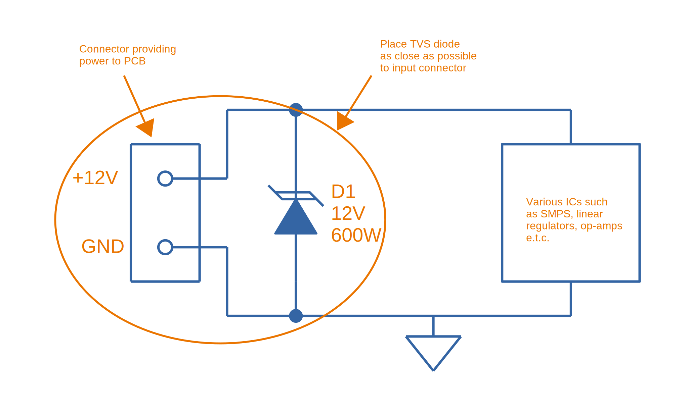
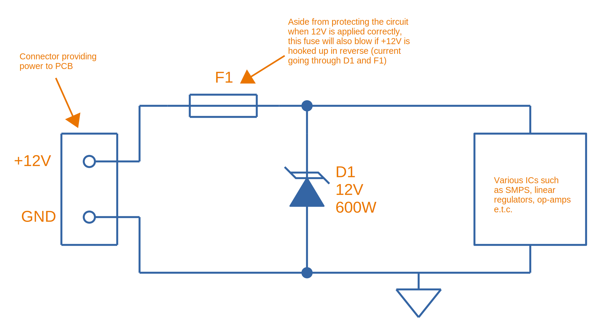
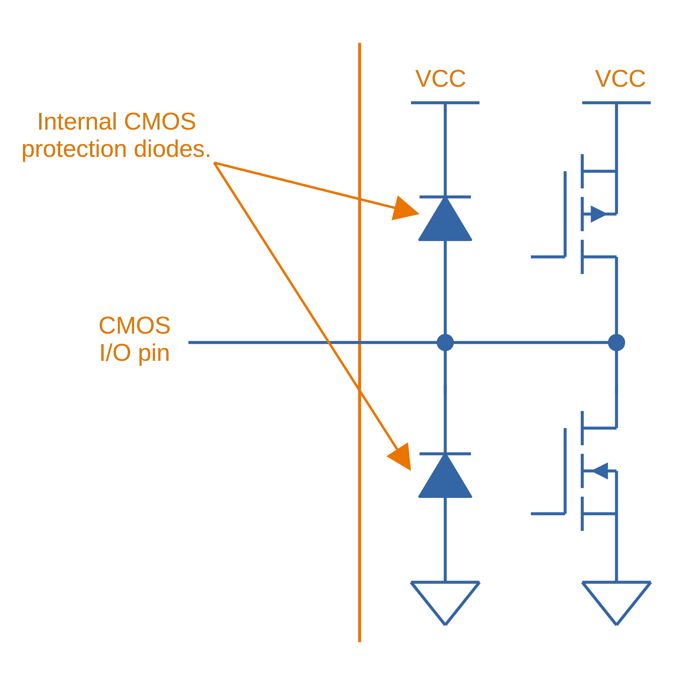
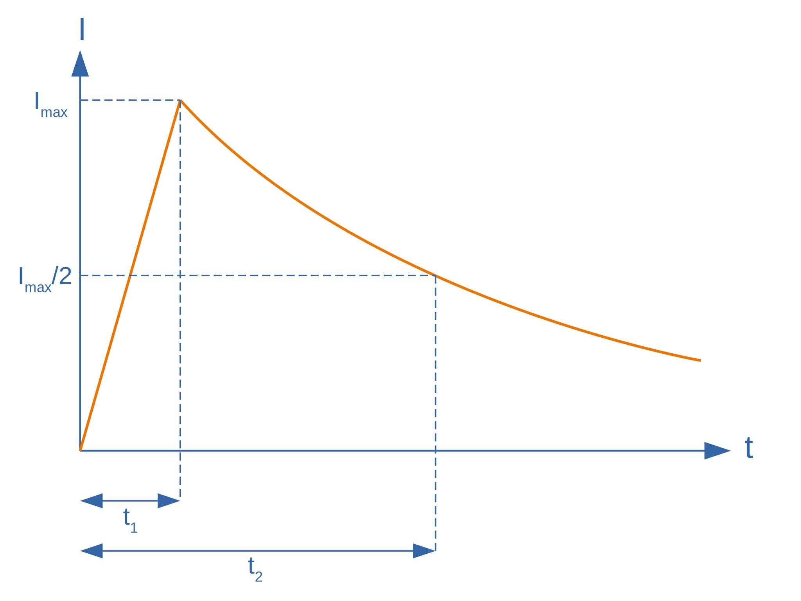

## Overview

Electrostatic discharge (ESD) is a unintended quick high-voltage transient waveform which appears on conductors within an electrical circuit. The high voltages and current peaks caused by ESD can cause devices such as static sensitive ICs to fail. Human contact is a common source of an ESD. Even if there is no direct human contact with the circuit, devices such as capacitive sense switches can allow charge to be coupled through onto electrical conductors. ESD protection is needed in cases were ESD discharges could potentially cause a circuit to fail.

* *Electromagnetic interference (EMI)*: The presence of electromagnetic radiation that could disrupt nearby systems. Sources of EMI include electrical storms (lightning), mains power line disruptions, solar radiation and nearby circuitry (power supplies, variable-speed motor drives, arc welders, e.t.c).
* *Electromagnetic compatibility (EMC)*: The measure of ability for a system to both:
    ** Function correctly in the presence of electromagnetic radiation (EMI).
    ** Not emit EMI that exceeds the regulations defined by the type of system and the environment it will be used in.

== ESD Protection Devices

The table below summarizes the different components you can use for ESD protection. Roughly sorted from lowest power to highest power component.

[%autowidth]
|===
| Component | Advantages | Disadvantages | Comments

| link:/electronics/components/capacitors/[Ceramic Capacitor]
a|
* Cheap
* Small
a|
* Not effective against high-power ESD events
* Sensitive to high voltages
| Suitable for helping lower the voltage spikes caused by small ESD events

| link:/electronics/components/diodes/zener-diodes/[Zener Diode]
a|
* Very tightly controlled "turn-on" voltage 
a|
* Not effective against high-power ESD events
| A Zener is a form of avalanche diode, just like a TVS. The main difference is that Zener's are typically designed for sharper turn-on characteristics (for voltage regulation purposes) and less so for power dissipation.

| link:/electronics/components/diodes/tvs-diodes/[TVS Diode]
a|
* Fast turn-on time (esp. uni-directional, bi-directional are slower)
* Can handle moderate power ESD events
a|
* Not suitable as a single component to be effective against high power ESD events (need to be paired with MOVs, spark-gaps or GDTs).
|

| link:/electronics/components/varistors-vdrs/[MOV (metal-oxide varistor)]
|
a|
* Cumulative degradation
* Large leakage currents
* Large capacitance (stem:[10-1000+ pF])
|

| link:/electronics/components/gas-discharge-tubes-gdts/[GDT (Gas Discharge Tube)]
a|
* Can quench extremely high-power ESD events (e.g. lightning strikes)
a| 
* Bulkier and more expensive than a TVS diode
* Do not have low and sharp turn-on voltages, so typically used in conjunction with TVS diodes.
* Cumulative degradation to high power events

| link:/electronics/components/spark-gaps/[Spark Gap]
a| 
* Very simple (just a copper shape on a layer of a PCB!).
a|
| Work in the same principle as GDTs but without a controlled atmosphere and pressure.
|===

== ESD Circuit Basics

[[tvs-on-12v-input]]
.A good habit to get into --- place TVS diodes across inputs/outputs to a PCB (and not just power rails, although that is what is shown in this schematic). Place the TVS as close as possible to the place of entry onto the PCB.

TIP: A TVS a shown in <<tvs-on-12v-input>> also protects against reverse polarity. In this situation, the TVS will forward conduct and clamp the voltage to about stem:[-0.7V]. Make sure that this will either blow a fuse or that the TVS is big enough to sustain the power dissipation indefinitely. See <<tvs-on-12v-input-and-fuse>> for an example using both a TVS diode and fuse.

[[tvs-on-12v-input-and-fuse]]
.Using both a fuse and a TVS on a +12V power supply to a PCB. In this case, the fuse is placed before the TVS diode so that it would also blow if the +12V was hooked up the wrong way around (current going through F1 and D1).

== Standards

* _IEC-61312-1: Protection Against Lightning Electromagnetic Impulse_, first introduced in 1995.
* _Telecordia GR-1089 Core: Electromagnetic Compatibility And Electrical Safety - Generic Criteria For Network Telecommunications Equipment_: Used by telecommunication service providers. It contains NEBS (Network Equipment - Building System) criteria.
* _IEC 61643-1, First Edition, 1998, Surge Protective Devices Connected to LowVoltage Power Distribution Systems_. One of the first references to the 8/20us lightning waveform.
* _IEEE C62.41.2, Recommended Practice on Charactrization of Surge Voltages in Low-Voltage (1000 V and less) AC Power Circuits._

## Internal ESD Protection On CMOS I/O

Inbuilt protection is very common on a CMOS I/O pins that may be part of a device (anything from a simple load switch, to a medium complexity microcontroller, to a high complexity FPGA). They are normally two per I/O pin. One attached between the pin and GND, and one attached between the pin and VCC. Both are reverse-biased under normal operating conditions (stem:[ GND <= V_{I/O} <= V_{CC} ]).

.Diagram of a CMOS digital I/O pin, highlighting the internal protection diodes prevalent in many designs (even if the ICs datasheet does not mention them).

They serve to protect the sensitive CMOS logic in the case of a fault condition on the pin. If the voltage on stem:[ V_{I/O} ] rises above stem:[ V_{CC} ] (e.g. positive ESD voltage spike), then the top diode conducts, clamping the voltage on the pin to no more than stem:[ V_{CC} + V_f ]. Similarly, if the voltage on stem:[ V_{I/O} ] drops below stem:[V_{GND}] (e.g. negative ESD voltage spike), then the bottom diode conducts, clamping the voltage on the pin to no more than stem:[ -V_f ].

Be careful, as these diodes usually have quite a low maximum current. Exceeding this maximum current will blow the ESD diode, usually causing it to go open-circuit, removing the protection from the sensitive CMOS circuitry, which then gets fried almost instantaneously. Your I/O pin then stops working. If your lucky, it will only be a single pin that is effected. If your not, the whole port (if applicable), or even the whole device is fried.

However useful they may be, they also generate design challenges in specific scenario's, and therefore require careful consideration when doing any schematic design involving CMOS I/O with the ESD protection diodes present. The two scenario's which cause problems are:

. When powering up a circuit with multiple voltage rails
. When the voltage on stem:[V_{I/O}] could at some points be higher than stem:[V_{CC}] because of the nature of the incoming signal.
. When you are selectively powering down the voltage rails powering these ICs in low-power designs.

Out of all these scenarios, 3. has to be the one that catches a schematic designer out the most often.

## Backpowering

Backpowering is a phenomenon which occurs in circuits that selectively turn of voltage rails as part of it's normal operation (e.g. low-power circuitry). Even though you have turned the linear regulator/SMPS/load switch off, the circuit still remains powered! What?!?

If the leakage current through any CMOS I/O ESD diodes onto the "unpowered" rail is large enough, the circuit may begin back powering itself. This means that although you have turned off the voltage source supplying that rail, the rail still remains powered and all the ICs connected to it still work normally.

You can normally diagnose this by noting the the "unpowered" rail will be one diode forward voltage drop (stem:[V_f], which is usually around 0.5-0.7V) less than the voltage on the I/O pin(s) powering the rail (which are normally at stem:[V_{CC}]).

## Disabling The ESD Diodes

Extra diodes, external to the IC, can be added to prevent leakage currents through CMOS IO pins on devices which have ESD protection diodes to VCC and GND. The following image shows how they would be connected to the IC of interest.

.Adding external diodes to disable the internal ESD diodes in an IC. Image from http://www.intersil.com/content/dam/Intersil/documents/isl4/isl43l410.pdf.
image::protection-diodes-to-disable-esd-diodes-on-cmos-io.png[width=489px]

However, this approach has it's disadvantages. The actual supply voltage seen by the IC is reduced by twice the voltage drop (stem:[V_f]) across the diodes (normally 2x 0.5-0.7V = 1.0-1.4V). Also, the IC ground is now significantly different from the system ground. This can upset single-ended ADC measurements and other analogue functions.

## Series Resistance Into CMOS I/O

I would explain this, but I found an application note by Silicon Labs to explain this much better than I could. So here is a direct copy-and-paste from link:http://www.silabs.com/Support%20Documents/TechnicalDocs/AN376.pdf[AN376].

[quote]
____
The most common method of external ESD protection is adding a small series resistance in-line between the source of ESD energy and the integrated circuit pin to be protected. Somewhat counter-intuitively, a resistance as small as 50Ω can double the ESD immunity of a CMOS IC. Higher immunity is possible; a higher level of protection is somewhat proportional to increased series resistance.

This method works for two reasons. First, the series resistance works with the ICs parasitic pin capacitance (typically 5 to 10 pF) to create a single-pole low pass filter with a cut-off frequency below 1 GHz. This causes the series resistor to attenuate a majority of an ESD event's high-frequency energy (as much as 90% of the rising-edge power in an HBM discharge). Second, when the ICs protection circuits are operating normally, their impedance is very low (on the order of tens of ohms or less). This low resistance works with the series resistance to create a voltage divider, so that the high voltage from an ESD event can only bias the ICs built-in protection circuits with a portion of the total ESD voltage. This attenuation is in addition to rising-edge filtering. The sum of these effects from a simple external series resistor dramatically improves ESD performance in a demanding application.
____

## Optimal Placement

If you are adding both a TVS diode and a series resistor as ESD protection to a CMOS I/O pin (e.g. a GPIO pin on a microcontroller), it is best to put the series resistor first (closer to the source of the ESD event), and then the TVS diode second (closer to the microcontroller).

This is allowable because the resistor is not damaged by ESD, and can dissipate most of the power, leaving only fraction for the TVS diode, meaning the voltage on the CMOS I/O pin will not change by as much as it would otherwise.

## Issues With Pull-ups/Pull-downs

One problem with series resistors is that they can cause problems when used in conjunction with pull-up or pull-down resistors. Pull-up/pull-down resistors are common on CMOS I/O outputs which have either an open-collector (the more common choice) or open-emitter configuration. The problem is that the ESD/current-limiting series resistor and pull-up/pull-down will form a voltage divider in particular scenarios.

Check the inputs maximum digital low and minimum digital high voltage levels. If they are still met, then you don't have to worry.

## ESD Protection Of Capacitive Sensing I/O Lines

See the link:/electronics/circuit-design/capacitive-touch-sensing[Capacitive Touch Sensing] page.

== Lighting Surge Characterization And Test Transient Pulses

.Transient ESD events are typically specified with two numbers, stem:[t_1] and stem:[t_2]. stem:[t_1] is the time for the current to reach the peak value. stem:[t_2] is the time from the start to when the current decays to half of the peak value (as shown).

|===
| Name | stem:[t_1] | stem:[t_2] | Comment

| 8/20us | 8us | 20us |
| 10/350us | 10us | 350us | Typically used to simulate a lightning strike.
| 10/1000us | 10us | 1000us |
|===