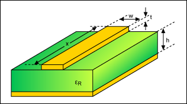
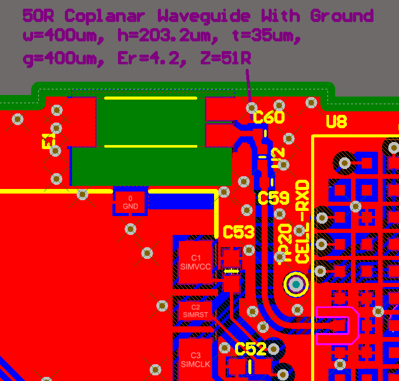

:imagesdir: 

## Overview

A _transmission line_ is a wire/cable/track on the PCB, that, because of the frequency of the electrical signals going through have reached a certain point (typically RF), you can no longer just treat the wire as a short circuit. Instead, the connection must be treated as a _transmission line_, and must be _impedance matched_ all the way from the driver to the receiver. Impedance matching is done to maximise power transfer and minimise reflections from the load. The typical way to impedance match is to make sure the transmission line is _terminated_ correctly.

.Schematic symbol for a transmission line, which represents a piece of coax cable. Because this usually isn't a component to appear on the BOM (if it's a PCB track), it's not normally given a designator.

_Termination_ is the process of adding components (usually resistors, but sometimes capacitors and inductors) to the ends of transmission lines (the start, the end, or both) to prevent things like reflections due to impedance mis-matches. See the link:[Termination page] for more info.

.An isometric diagram of a microstrip. Image from www.maximintegrated.com.

## Dielectric Constant

This is related to the capacitive ability of the medium between two copper layers to store charge. In a typical PCB stack-up, it is either the dielectric of the prepreg or the dielectric of the core.

## Characteristic Impedance

The _characteristic impedance_ of a conductor is the impedance a signal "sees" when travelling down a conductor that has to be treated as a transmission line (more on at what length a conductor becomes a transmission line below). Note that the main difference between standard resistance and the characteristic impedance is that the **characteristic impedance does not depend on the length of the conductor**. It has the same value no matter the length of the transmission line!

**The characteristic impedance of a transmission line is usually called stem:[Z_C].** It is dependant on the per unit length inductance stem:[L] and capacitance stem:[C] of the transmission line. The equation is: 

[stem]
++++
\begin{align}
Z_C = \sqrt{ \frac{L}{C} }
\end{align}
++++

However, you rarely calculate stem:[Z_C] from the per-unit inductance and capacitance. Instead, you either use transmission lines with well controlled parameters that specify their impedance (e.g. stem:[50\Omega] link:/electronics/components/cables/#_coaxial_cable[RG-58 coax cable]), or you design PCB traces using well know formulas for the impedance determined by the track width, PCB di-electric, geometry and proximity to ground.

Typical impedances and their associated uses are:

|===
| Characteristic Impedance | Uses

| 50Ω
| GPS antennas, GPRS antennas, BNC cables (for things like oscilloscopes)

| 75Ω
| Video.

| 100Ω
| Differential ethernet signals. Differential PCIe signals.

| 120Ω
| RS-485 bus. CAN bus.

|===

## When Is A Transmission Line A Transmission Line?

**Wires, cables, PCB tracks e.t.c. have to be treated as transmission lines when the signal passing through it changes rapidly compared to the time the signal takes to travel through the transmission line.**

So how rapid is "rapid"? Most guidelines state that a conductive path has to be treated as a transmission line once the cable becomes longer than about 1/10 of the wavelength of the operating frequency. Remember that the wavelength of a signal stem:[\lambda] is calculated with the simple equation:

[stem]
++++
\begin{align}
\lambda = \frac{c}{f}
\end{align}
++++

[.text-center]
where: +
stem:[\lambda] is the wavelength, in stem:[m] +
stem:[c] is the speed of light, in which stem:[3{\times}10^8 ms^{-1}] is a good enough approximation +
stem:[f] is the frequency of the signal, in stem:[Hz] +

For example, electronicdesign.com states<<bib-elec-design-imp-matching-p1>>:

> A cable becomes a transmission line when it has a length greater than λ/8 at the operating frequency.

[example]
.Finding the "transmission line length" for a 780MHz signal.
--
You have a signal at 780MHz. At what length does a cable carrying this signal have to be treated as a transmission line?

The wavelength of a 780MHz signal is:

[stem]
++++
\begin{align}
\lambda &= \frac{3{\times}10^8ms^{-1}}{780MHz} \nonumber \\
        &= 385mm \\
\end{align}
++++

The length of cable at which it "becomes" a transmission line is just 1/10th of this wavelength:

[stem]
++++
\begin{align}
l &= \frac{\lambda}{10} \nonumber \\
  &= 38.5mm \\
\end{align}
++++
--

### What About Digital Waveforms?

The first problem with digital waveforms is finding out the maximum frequency you need to support for it. It is not the clocking/data speed! If you assumed that, the edges of the clock would be rounded off and you'd end up with a sine-wave like waveform. The highest frequency components you need to support are the edges of the data. There is a well-known rule-of-thumb for applies to digital waveforms:

[stem]
++++
\begin{align}
BW \approx \frac{0.35}{t_r}
\end{align}
++++

[.text-center]
where: +
stem:[ t_r ] is the maximum rise time from 10 to 90%, in seconds (s). +
stem:[ BW ] is the resulting maximum bandwidth the track has to support, in Hertz (Hz). You can also think of this as a maximum frequency, since the bandwidth starts at 0Hz. +

[example]
.Finding the track length at which you have to treat it as a transmission line for USB2.0. 
--
For example, the USB 2.0 specification states a maximum rise time of 4ns. Using the equation above, this gives us a bandwidth of approximately 87.5MHz. 

From this, we can calculate the wavelength of an 87.5MHz signal travelling down a track on standard FR-4 PCB.

[stem]
++++
\lambda = \frac{c}{f\sqrt{\epsilon_r}}
++++

[.text-center]
where: +
stem:[ c ] is the speed of light, in meters per second +
stem:[  f ] is the frequency that you worked out above (which we called bandwidth) +
stem:[ \epsilon_r ] is the di-electric of the material the electro-magnetic wave is travelling through, and is unitless. In our case this will be the di-electric of the PCB. For standard FR4, this is about 4.35. +

TIP: The impedance of a PCB track is not important if it is at least 10 times smaller than the wavelength of the signal.

Thus, the minimum wavelength of the USB full-speed signal is 1.65m, and the characteristic impedance of the track is only important if the total track length is greater than 165mm.
--

## Reflections

**Whenever the signal passes from one medium to another with different characteristic impedance, a reflection occurs at the boundary.** The reflection appears at the boundary at propagates in both directions (both forwards with the signal, and backwards towards the signal source). The magnitude (in terms of voltage) of the reflection is determined by the voltage reflection coefficient.

Voltage reflection coefficients are usually represented with the Greek uppercase "Gamma" (stem:[\Gamma]), with subscripts representing the direction of signal as it crosses the boundaries between two "mediums" (cables, circuit traces, e.t.c.) of different impedance. The voltage reflection coefficient is defined as the ratio of the reflected wave to the incident wave:

[stem]
++++
\begin{align}
\Gamma \equiv \frac{B}{A}
\end{align}
++++

[.text-center]
where: +
stem:[ A ] is the voltage of the incident wave, in stem:[V] +
stem:[ B ] is the voltage of the reflection (going back to the source), in stem:[V] +

The voltage reflection coefficient stem:[\Gamma_{12}], of a signal moving from medium 1 to medium 2 is:

[stem]
++++
\begin{align}
\Gamma_{12} = \frac{Z_2 - Z_1}{Z_2 + Z_1}
\end{align}
++++

[.text-center]
where: +
stem:[Z_1] is the characteristic impedance of medium 1, in stem:[\Omega] +
stem:[Z_2] is the characteristic impedance of medium 2, in stem:[\Omega] +

Similarly, the voltage reflection coefficient for a wave going the other way is:

[stem]
++++
\begin{align}
\Gamma_{21} = \frac{Z_1 - Z_2}{Z_1 + Z_2}
\end{align}
++++

Thus the coefficients have the same magnitude, but differ in sign:

[stem]
++++
\begin{align}
\Gamma_{21} = -\Gamma_{12}
\end{align}
++++

Let's consider a transmission line connected to a receiver in three different scenarios:

**Receiver Is Terminated With Characteristic Impedance**

You can see from the above equation that for perfectly matched mediums the reflection coefficient is stem:[0]. No energy is reflected back to the source. This is also the condition in which maximum power is transferred to the load.

**Receiver Is Shorted To Ground**

When the receiver is shorted to ground, then stem:[Z_2 = 0]. The voltage reflection coefficient is then:

[stem]
++++
\begin{align}
\Gamma_{12} &= \frac{0 - Z_1}{0 + Z_1} \nonumber \\
            &= -1 \\
\end{align}
++++

As you can see, stem:[Z_0] is gone, stem:[Z_1] cancels out and you are left with a stem:[\Gamma = -1]. Thus the reflected wave is equal in magnitude but 180° out of phase with the incident wave. This means they cancel each over out, giving stem:[0V] at the receiver. This makes sense! There cannot be any voltage across a short (by definition)!

**Receiver Is Open Circuit**

When the receiver is open circuit, then stem:[Z_2 \to \infty]. Using L'Hospital's rule:

[stem]
++++
\begin{align}
\Gamma_{12} &= lim_{Z_2 \to \infty} \frac{Z_2 - Z_1}{Z_2 + Z_1} \nonumber \\
            &= lim_{Z_2 \to \infty} \frac{\frac{d}{d(Z_2)}(Z_2 - Z_1)}{\frac{d}{d(Z_2)}(Z_2 + Z_1)} \nonumber \\
            &= \frac{1}{1} \nonumber \\
            &= 1
\end{align}
++++

All of the energy is reflected back to the source. The reflected wave is equal in magnitude and in phase with the incident wave.

## Co-planar Waveguides (CPW)

Co-planaer waveguides (CPW) are a third alternative to microstrips and striplines for controlling the impedance of a circuitboard trace. There are two variants, the basic _co-planar waveguide_ and the _co-planar waveguide with ground_. The main advantage of a co-planar waveguide is that it **does not require a solid power plane** above or below it, making it a more flexible choice for layer and space constrained PCBs.

.A co-planer waveguide for a GSM antenna feed-line. The co-planar waveguide is the curved track that starts at E1. The three 0402 components are for a impedance matching circuit.

Although you can't see it in the image above, there is a ground plane underneath the CPW (there are two internal layers between the visible top layer (red) and bottom layer (blue)).

## The Effects Of Vias

Vias are a bit of a nuisance when it comes to impedance controlled traces.

## External Links

A good impedance calculator for a number of different transmission lines is found at link:http://www.eeweb.com/toolbox/wire-microstrip-impedance/[http://www.eeweb.com/toolbox/wire-microstrip-impedance/].

[bibliography]
## References

* [[[bib-elec-design-imp-matching-p1, 1]]] Lou Frenzel (2011, Oct 25). _Back to Basics: Impedance Matching (Part 1)_. ElectronicDesign. Retrieved 2022-02-01, from https://www.electronicdesign.com/technologies/communications/article/21796367/back-to-basics-impedance-matching-part-1.
