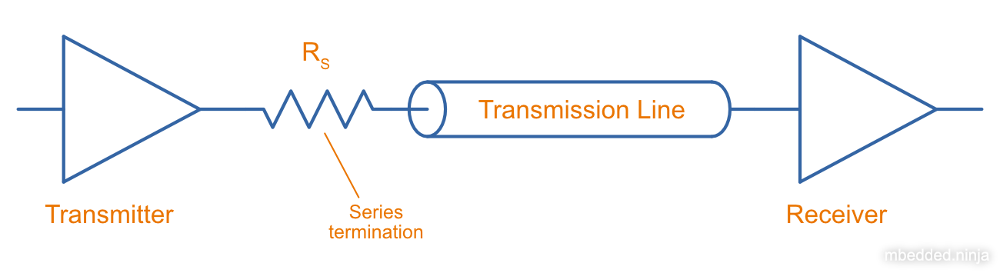
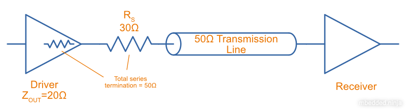
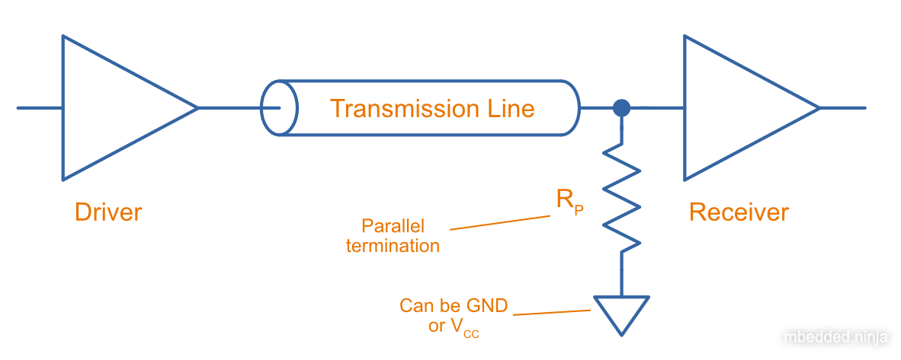
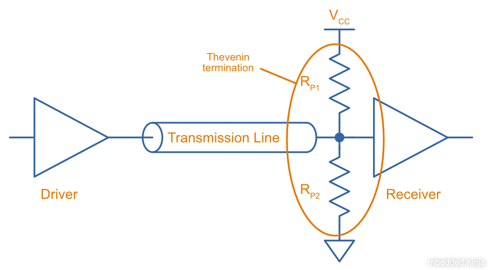
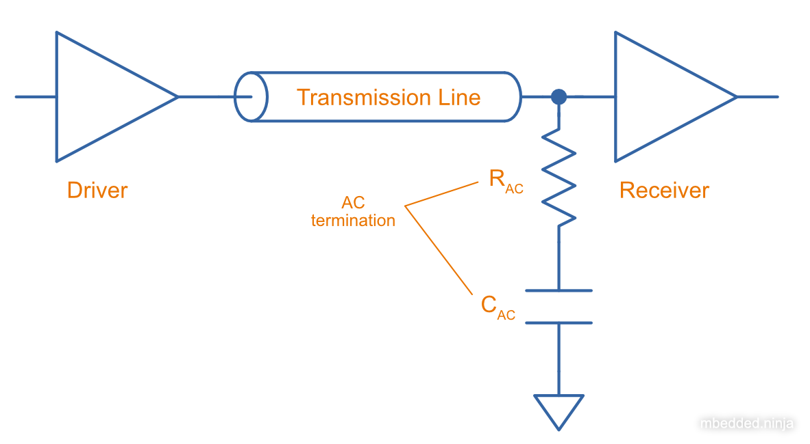

:imagesdir: 

WARNING: This page is in notes format, and may not be of the same quality as other pages on this site.

## Overview

_Termination_ is the process of adding components (usually resistors, but sometimes capacitors and inductors) to the ends of transmission lines (the start, the end, or both) to prevent things like reflections due to impedance mis-matches. A high-speed signal should ideally see the same impedance all the way from driver to receiver. The impedance of the transmission line stem:[Z_C] is usually stem:[50-150\Omega], but drivers are usually low impedance (stem:[<20\Omega]), and receivers high-impedance (stem:[>1k\Omega]). For this reason, termination resistors are added at the driver and/or receiver to keep the apparent impedance  

Types of termination:

* Series termination
* Parallel termination
* AC termination
* Thevenin termination

Most of these termination methods are discussed in the context of digital signals -- i.e. fast transitions at the driver between two discrete voltage levels. Analogue signals can also be terminated.

## Series Termination

_Series termination_ (a.k.a. _back termination_ or _source termination_) is a termination method in where a resistor is added in series at the start of the transmission line, and no termination is added at the end of the termination line. Even though the start of the transmission line receives half the voltage from the driver, **the receiver sees a perfect transition to the full voltage due to a purposeful reflection back to the driver**. 

.How to do series termination. Resistor stem:[R_S] is placed at the output of the driver before the transmission line. stem:[R_S] is equal to the characteristic impedance of the transmission line. 

Advantages:

* No DC loading on the transmission line.
* Receiver sees full driver voltage swing.
* Simple (only one resistor).

[example]
.How a stem:[0-5V] waveform propagates on a stem:[50\Omega] series terminated transmission line.
--
. Driver drives line from stem:[0V] (low) to stem:[+5.0V] (high). Waveform looks like a step (fast rise time).
. Waveform sees stem:[50\Omega] series termination resistor, and then the stem:[50\Omega] characteristic impedance of the transmission line to ground. Thus half the voltage is dropped across the series termination, and stem:[+2.5V] is applied to the start of the transmission line.
. This waveform travels down the transmission line, still looking like a stem:[+2.5V] step.
. Waveform reaches the end of the transmission line. This is open circuit, and so a reflected wave of stem:[+2.5V] is generated. These two add together to cause the end to jump straight from stem:[0V] to stem:[+5.0V].
. The reflected wave travels back down the transmission line, which looks like a step jump from stem:[+2.5V] to stem:[+5.0V].
. The reflected wave reaches the start and performs the same step jump from stem:[+2.5V] to stem:[+5.0V]. Because this is properly terminated, no further reflections occur, and the voltage stays steady at stem:[+5.0V].
. The line has now reached steady state, and to the driver looks like an open-circuit (high-impedance), requiring no further drive current (this can be a big bonus for series termination).
--

### Taking The Driver Output Impedance Into Account

So far we have been assuming a perfect driver, i.e. one with no output resistance. Obviously in reality this is not the case, with the output impedance of most drive circuits being somewhere between stem:[1-30\Omega]. **Luckily, as long as the output resistance of driver is less than the characteristic impedance of the transmission line, you can still use series termination**. The idea is simple, just use the output impedance of the driver as part of the total series termination resistance.

[stem]
++++
\begin{align}
Z_S = Z_{C} - Z_{driver}
\end{align}
++++

[.text-center]
where: +
stem:[Z_S] is the impedance, in stem:[\Omega] +
stem:[Z_{C}] is the characteristic impedance of the transmission line, in stem:[\Omega] +
stem:[Z_{driver}] is the output impedance of the driver, in stem:[\Omega] +

TIP: The above impedances should have no imaginary component, so they are just resistances.

<<series-termination-with-non-zero-driver-output-impedance.png>> shows a real-world example where the driver has an output impedance of stem:[20\Omega], driving a stem:[50\Omega] transmission line. A stem:[30\Omega] series termination resistor is added to make the total series resistance equal to the transmission line's characteristic impedance.

[[series-termination-with-non-zero-driver-output-impedance.png]]
.Real-world series termination, in where the driver has non-zero output impedance. Reduce the series termination resistance so that the total resistance is still equal to the characteristic impedance of the transmission line.

**Series Termination Summary**

* Consumes no power at steady-state, only during transitions.
* Uses only one resistor.

## Parallel Termination

_Parallel termination_ is a termination method in where a resistor stem:[R_P] is added to the receiver end of the transmission line, and is connected across the line and either GND or stem:[V_{CC}] (hence in parallel).

.Schematic showing basic parallel termination. A resistor stem:[R_P] is added at the receiver end to either GND or stem:[V_{CC}].

The waveform exiting the transmission line needs to see the same impedance as the transmission line itself.

[stem]
++++
\begin{align}
Z_{IN} || Z_P = Z_{C}
\end{align}
++++

Typically, the input impedance of the receiver will be relatively high (stem:[>1k\Omega]) in comparison to the impedance you're aiming for:

[stem]
++++
\begin{align}
Z_{IN} >> Z_{C}
\end{align}
++++

And in which case the equation simplifies to:

[stem]
++++
\begin{align}
Z_P = Z_{C}
\end{align}
++++

**Parallel Termination Summery**

* No reflections (as opposed to series termination, which has one reflection back to the driver).
* Driver needs to provide continuous current for one of the logic levels.

## Thevenin Termination

_Thevenin termination_ is a form of termination in where two resistors (usually identical) are connected to the receiving end of the transmission line, one to stem:[V_{CC}] and the other to stem:[GND]. 

.Schematic showing Thevenin termination. Two usually identical resistors stem:[R_{P1}] and stem:[R_{P2}] are connected to the receiver.

Assuming the receiver is relatively high impedance, the parallel combination of stem:[R_{P1}] and stem:[R_{P2}] must equal the impedance of the transmission line.

[stem]
++++
\begin{align}
R_{P1} || R_{P2} &= Z_{C} \nonumber \\
\nonumber \\
\frac{R_{P1} \cdot R_{P2}}{R_{P1} + R_{P2}} &= Z_{C} \\
\end{align}
++++

**Thevenin Termination Summary**

* Consumes half as much power as parallel termination, but still more than series termination.
* Uses two resistors, instead of the one each for series and parallel termination.

## AC Termination

_AC termination_ is similar to parallel termination, except a capacitor is added in series with the termination resistor at the receiver, as shown in <<ac-termination-schematic>>. AC termination addresses the DC current consumption of parallel termination. The idea is that the resistor is still present to provide termination for the high-speed signals (which are fast enough to see the capacitance as low impedance), whilst the capacitor blocks DC current consumption<<bib-avx-ac-term>>.

[[ac-termination-schematic]]
.Schematic showing AC termination.

[bibliography]
## References

* [[[bib-avx-ac-term, 1]]] Ben Smith. _Technical Information: AC Termination for Signal Buses_. AVX. Retrieved 2022-01-31, from https://citeseerx.ist.psu.edu/viewdoc/download?doi=10.1.1.83.298&rep=rep1&type=pdf.
