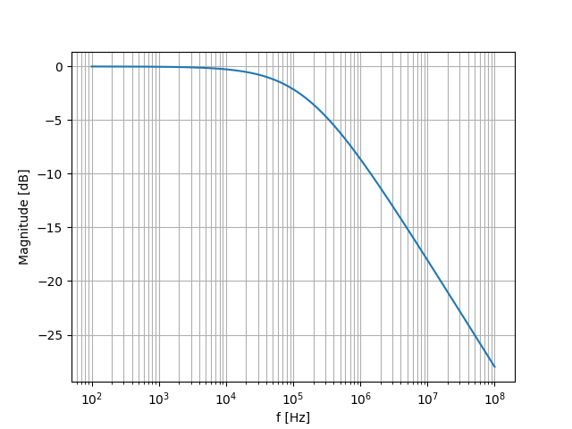
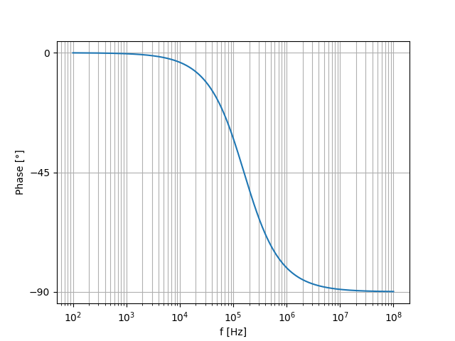
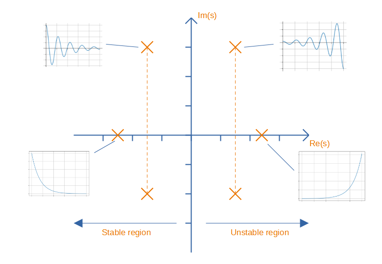

WARNING: This page is in notes format, and may not be of the same quality as other pages on this site.

== Overview

_Transfer functions_ are a way of describing the frequency response of a system. The system can be anything with a measurable input and output, e.g. mechanical spring/mass/dampers, electronic RLC circuits, e.t.c. This page will put an emphasis on electrical transfer functions.

Transfer functions are usually written in the Laplace domain using the variable stem:[s], where stem:[s] is the complex angular frequency, as shown in stem:[Eq.\ \ref{eq:s-eq-j-w}].

[stem]
++++
\begin{align}
\label{eq:s-eq-j-w}
s = j\omega
\end{align}
++++

[.text-center]
where: +
stem:[j] is the imaginary number (stem:[j = \sqrt{-1}]), also seen as stem:[i] in maths (stem:[j] is used in electronics as to not get stem:[i] confused with current) +
stem:[\omega = 2\pi f] +

NOTE: Angular frequency stem:[\omega] is used here rather than Hertz stem:[f] just to keep the equations tidier, but it is trivial to convert from one to the other!

Transfer functions describe the relationship between output and input (typically of voltage, but it doesn't have to be). stem:[Eq.\ \ref{eq:xfer-fn-vout-vin}] shows this relationship. We will use the symbol stem:[H(s)] is represent the transfer function.

[stem]
++++
\begin{align}
\label{eq:xfer-fn-vout-vin}
H(s) = \frac{v_{out}(s)}{v_{in}(s)}
\end{align}
++++

Note that because we are using stem:[s], stem:[Eq.\ \ref{eq:xfer-fn-vout-vin}] encodes both magnitude and phase relationships between the output and input. On it's own, it's complex in nature and not really useful for deducing anything. But, using two clever tricks, you can separately extract the magnitude and phase response equations from stem:[H(s)]. The magnitude response is found by taking the magnitude of stem:[H(s)], which is stem:[|H(s)|] as shown in stem:[Eq.\ \ref{eq:xfer-fn-magnitude}].

[stem]
++++
\begin{align}
\label{eq:xfer-fn-magnitude}
| H(s) | = \left| \frac{v_{out}(s)}{v_{in}(s)} \right|
\end{align}
++++

The phase response stem:[\angle H(s)] is found by finding the angle of the complex number from the positive x-axis, as shown in stem:[Eq.\ \ref{eq:xfer-fn-phase}].

[stem]
++++
\begin{align}
\label{eq:xfer-fn-phase}
\angle H(s) = Arg{\left(\frac{\Im \{H(s)\}}{\Re \{H(s)\}}\right)} 
\end{align}
++++

[.text-center]
where +
stem:[Arg] is the argument (implemented with stem:[atan2(y, x)] in many software packages)
stem:[\Im\{H(s)\}] is the imaginary part of stem:[H(s)] +
stem:[\Re\{H(s)\}] is the real part of stem:[H(s)] +1

WARNING: This rule of finding the phase response can sometimes be wrong, as the stem:[\arctan] function throws away information about sign. You have to be aware of what quadrant of the Argand diagram you are in and compensate appropriately.

== Zeroes And Poles

**A value of stem:[s] that causes the a transfer function to be 0 is called a _zero_, and a value of stem:[s] that causes the transfer function to be infinite is called a _pole_**. Zeroes generally occur when a factor in the numerator is 0 (one notable exception is that a zero can also occur if the denominator tends towards infinity, usually as stem:[s \rightarrow \infty]), poles generally occur when a factor in the denominator is 0. Poles that have an imaginary component always come in pairs (conjugate pairs).

Intuitively, you can think of zeroes as places in where the system completely blocks a certain frequency. A poles is a place where the system has infinite response (at least mathematically).

The zeroes are the roots of the numerator polynomial, and the poles are the roots of the denominator polynomial. For this reason they are also referred to generally as _roots_.

The poles and zeros of a system can tell you much about how the system performs -- it can tell you if the system is stable, how fast it responds.

For example, the transfer function in stem:[Eq. \ref{eq:xfer-fn-1-over-s}] has a pole at the origin and a zero at infinity. This simple transfer function represents an integrator. A constant voltage applied to it will result in an output climbs without any limit. However, at high frequencies, the output is essentially zero as the positive and negative parts of the waveform are averaged out over time.

[stem]
++++
\begin{align}
\label{eq:xfer-fn-1-over-s}
H(s) = \frac{1}{s}
\end{align}
++++

== The Transfer Function Of A Low-Pass RC Filter

A first-order low-pass RC filter has the transfer function shown in stem:[Eq.\ \ref{eq:rc-xfer-fn}].

[stem]
++++
\begin{align}
\label{eq:rc-xfer-fn}
H(s) &= \frac{1}{1 + \b{s}RC}
\end{align}
++++

Using stem:[Eq.\ \ref{eq:s-eq-j-w}], we can replace stem:[s] with stem:[j\omega] to get stem:[Eq.\ \ref{eq:rc-xfer-fn-jw}].

[stem]
++++
\begin{align}
\label{eq:rc-xfer-fn-jw}
H(\omega) &= \frac{1}{1 + j\omega RC}
\end{align}
++++

This system has a pole at stem:[f = \frac{1}{2\pi R C}] and a zero at stem:[f = \infty].

We can find the magnitude response of this low-pass RC filter by taking the magnitude of stem:[H(f)], remembering that the magnitude of a complex number is defined as in stem:[Eq. \ref{eq:magnitude-of-complex-num}]. 

[stem]
++++
\begin{align}
\label{eq:magnitude-of-complex-num}
|a + jb| = \sqrt{(a + jb)(a - jb)}
\end{align}
++++

[stem]
++++
\begin{align}
\label{eq:abc}
| H(\omega) | &= \left| \frac{1}{1 + j\omega RC} \right| \nonumber \\
         &= \frac{1}{\sqrt{(1 + j\omega RC)(1 - j\omega RC)}} \nonumber \\
         &= \frac{1}{\sqrt{1 - (j\omega RC)^2}} \nonumber \\
         &= \frac{1}{\sqrt{1 - (-1)(\omega RC)^2}} \nonumber \\
\label{eq:mag-response-lp-rc-filter}
         &= \frac{1}{\sqrt{1 + (\omega RC)^2}} \\
\end{align}
++++

stem:[Eq. \ref{eq:mag-response-lp-rc-filter}] shows the final result. Notice that by finding the magnitude, the imaginary components are gone! We can plot this on a graph.

.The magnitude response of the the low-pass RC filter, found by plotting stem:[Eq.\ \ref{eq:mag-response-lp-rc-filter}]. Note that the magnitude has been converted into decibels with stem:[dB = 20log10(mag)].

We can find the phase response of the low-pass RC filter by using rule in stem:[Eq.\ \ref{eq:xfer-fn-phase}].

[stem]
++++
\begin{align}
\angle H(j\omega) &= Arg\left(H(j\omega)\right) \nonumber \\
                  &= Arg\left(\frac{1}{1 + j\omega RC}\right) \nonumber \\
                  &= Arg(1) - Arg(1 + j\omega RC) \nonumber \\
                  &= 0 - arctan\left(\frac{j\omega RC}{1}\right) \nonumber \\
\label{eq:phase-response-lp-rc-filter}
                  &= -arctan\left(j\omega RC\right) \\
\end{align}
++++

TIP: We can safely reduce stem:[Arg] to stem:[arctan] because we know that stem:[1 + j\omega RC] will be in the 1st quadrant of the Argand diagram for all positive real values of stem:[\omega].

.The phase response of the the low-pass RC filter, found by plotting stem:[Eq.\ \ref{eq:phase-response-lp-rc-filter}]

== Pole Zero Plots

Poles and zeroes are plotted in a _Argand diagram_ in what is called a _pole-zero plot_ to give the reader an understanding on how the circuit responds.

* Zeroes contribute +90 of phase and increase the magnitude, above the zero frequency.
* Poles contribute -90 of phase and decrease the magnitude, above the pole frequency.

Poles are normally drawn as X's on the graph, and zeroes as O's. Unless you are building an oscillator, poles in the right-hand half of the plane (having a positive real component) are a bad thing, as they represent an instability.

.Argand diagram showing how the location of poles (no zeroes shown) on a pole zero plots shows how components of the system respond to transients (i.e. impulses).

