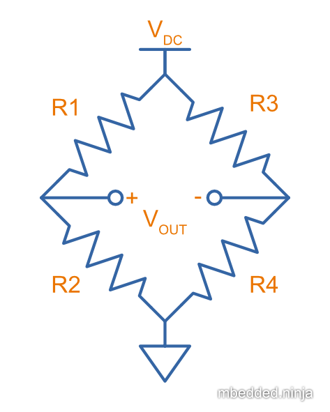
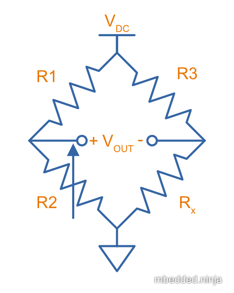

WARNING: This page is in notes format, and may not be of the same quality as other pages on this site.

## Overview

The _Wheatstone bridge_ (a.k.a. _resistance bridge_) is a circuit consisting of four resistive components. It has the benefit of being able to perform accurate measurements of resistance. <<basic-schematic-of-wheatstone-bridge>> shows the basic schematic.

[[basic-schematic-of-wheatstone-bridge]]
.The basic schematic of a Wheatstone bridge (resistance bridge).

stem:[Eq.\ \ref{eq-wheatstone-general}] is the general equation for the Wheatstone bridge.

[stem]
++++
\begin{align}
\label{eq-wheatstone-general}
V_{OUT} = V_{DC} \left( \frac{R2}{R1 + R2} - \frac{R4}{R3 + R4} \right)
\end{align}
++++

The output voltage (and consequentially, output current) is 0 when both of the "legs" of the bridge are balanced. That is:

[stem]
++++
\begin{align}
V_{OUT} = 0 \quad \text{if} \quad \frac{R2}{R1} = \frac{R4}{R3}
\end{align}
++++

The traditional use is to replace the bottom resistors on both legs of the Wheatstone bridge -- one leg with a variable resistor (rheostat or potentiometer) and the other with an unknown resistance which you want to measure. The variable resistor is adjusted until the output voltage (or current) is stem:[0]. Assuming you know the resistance of the rheostat, you can calculate the resistance of stem:[R_x].

.Traditional use of the Wheatstone bridge. The bottom resistor on one leg is replaced with a rheostat (stem:[R2]), and the other bottom resistor with the unknown resistance stem:[R_x]. Adjusting the rheostat until the output voltage (or current) is 0 "balances" the bridge, and the unknown resistance can be found knowing the other three.

## Benefits Over A Simple Resistor Divider

You might be wondering why use a complicated 4-resistor Wheatstone bridge when you could just use a simple 2-resistor link:/electronics/components/resistors/#_resistor_dividers[resistor divider], and measure the output voltage. By knowing the output voltage, the supply voltage, and at least one of the resistances, you can then calculate the other resistance in a resistor divider. The benefit of a Wheatstone bridge is that it is inherently a _differential_ measurement, rather than a _single-ended_ one (which a resistor divider is). This means:

* You don't need a precise auxiliary voltage reference if you just plan on balancing the bridge (i.e. making stem:[V_{OUT} = 0V]).
* Even if you are measuring the output voltage (and hence need an auxiliary voltage reference):
** Environmental effects that effect both legs of the bridge cancel each other out (e.g. temperature-related drift in the resistances)
** The common-mode voltage that a single-ended resistor divider gives you has been removed, hence it is much easier to apply a large gain to a differential Wheatstone output to measure small voltages.

## History

The Wheatstone bridge was invented by Samuel Hunter Christie in 1833, but got it's name from Sir Charles Wheatstone, who improved and popularized the circuit in 1843<<bib-maglab-wheatstone-history>>.

## Applications

* **Strain gauge measurement:** Metal foil strain gauges change their resistance depending on the strain they are subject to. Measuring the small change in resistance precisely is normally done with a Wheatstone bridge circuit. In this application the bridge is not balanced, but rather the output voltage is then fed into an amplifier and then measured (usually with an link:/electronics/components/analogue-to-digital-converters-adcs/[ADC]).

[bibliography]
## References

* [[[bib-maglab-wheatstone-history, 1]]] National MagLab (2014, Dec 10). _Wheatstone Bridge – 1843_. Retrieved 2022-01-17, from https://nationalmaglab.org/education/magnet-academy/history-of-electricity-magnetism/museum/wheatstone-bridge-1843.
