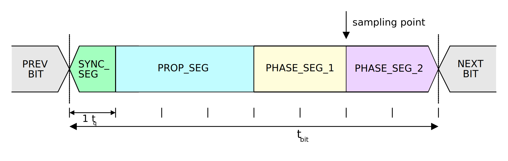

## Overview

**The CAN (Controller Area Network) protocol is a serial-based, multi-master digital communication protocol originally developed by BOSCH**. It was initially developed for use in the automotive industry. It makes use of priority-based message arbitration. The voltage is not part of the standard, and operating voltages of 5V or 12V are common.

.The CAN bus logo. Image from www.bosch.com.
image::can-bus-logo-bosch.png[width=270px]

If you are looking for help interfacing with SocketCAN from the Linux command-line, see the link:/programming/operating-systems/linux/how-to-use-socketcan-with-the-command-line-in-linux/[How To Use SocketCAN With The Command-Line In Linux page].

If you are looking for help controlling a SocketCAN interface from C software, see the link:/programming/operating-systems/linux/how-to-use-socketcan-with-c-in-linux/[How To Use SocketCAN With C In Linux page].

A alternative communications protocol used in similar applications is the LIN protocol.

== CAN Bus Voltages

The CAN bus transmits 1 and 0's across a differential pair of wires. A recessive logic 1 is when the driver is not "driving" the bus, and therefore there should be almost no voltage differential across `CAN_H` and `CAN_L`. A dominant logic 0 bit is when the transmitting node drives `CAN_H` high and `CAN_L` low.

== Bit Rate And Transmission Distances

The following equation can be used as a rule-of-thumb to calculate the maximum transmission speed for distances larger than 50m.

[stem]
++++
\begin{align}
BR\times L\leq 60
\end{align}
++++

[.text-center]
where: +
stem:[BR] = bit rate (in MBit/s) +
stem:[L] = length (in m) +

.Graph showing the relationship between the CAN bus transmission rate and maximum bus length.
image::can-bus-bit-rate-vs-bus-length.png[width=500px]

A value stem:[5ns/m] is typically used for the propagation time of the CAN bus signal down the twisted-pair cable when calculating maximum baud rates and/or cable lengths. A table of common distances/transmission rates is shown below. These cable lengths are for the cable _trunk_, and not for _stubs_.

|===
| Speed | Distance | Comment

| 10kb/s  | 5000m | Used by the SAE J1850 standard.
| 20kb/s  | 2500m |
| 50kb/s  | 1000m | 
| 125kb/s | 500m  | Default speed for CANopen.
| 250kb/s | 250m  | Used by the J1939 standard.
| 500kb/s | 100m  |
| 800kb/s | 50m   |
| 1Mb/s   | 25m   |
|===

CAN bus lengths are restricted because all nodes need to be able to sample the bus (and read back a correct result) during the same bit time. They need to do this for two reasons:

* **Bus arbitration**: Nodes need to know if they have lost arbitration of the bus (another node has sent a dominant value whilst they have sent a recessive value).
* **Acknowledge bit**: The transmitter needs to read the acknowledge value back from the receiver within the period for the acknowledge bit in every frame.

Propagation delays due to long buses will eventually result in nodes sampling the wrong bit, hence limiting the maximum bus length.

=== Stubs

There is a significant amount of contradictory information online on what CAN stub lengths are permissible. The various opinions are:

* TI's SLLA270 states to minimize reflections, lengths of stubs should not exceed 1/3 of the critical length of a bus<<bib-ti-slla270-can-phy-layer-req>>. The critical length is determined by the transition time of bits on the bus (which is determined by the driver), and the speed at which signals propagate down the bus.
* Bueno Electric's _Maximum Cable Length For a CAN Bus_ page<<bib-bueno-electric-max-cable-len>> gives a maximum cable stub length of 0.3mm for all speeds from 50kb/s to 1Mb/s.
* and OnSemi<<bib-on-semi-topo-high-speed-can>> give the following rule:
+
[stem]
++++
L_{STUB_MAX} = \frac{T_{PROP_SEG}}{50 \cdot T_{PROP(BUS)}}
++++

Some CAN bus drivers provide pins so that you can adjust their slew rate.

== Termination Resistors

For high-speed transmission on the CAN bus, **_termination resistors_ are required between the `CAN_H` and `CAN_L` wires at both ends of the cable**. However, make sure to only add them at the ends of the cable, **any CAN devices connected partway along the bus should not have termination resistors**. For a CAN bus in which devices may be arbitrarily connected and disconnected, it is common practise to add _switchable termination_, which can be connected manually with a typical mechanical switch or automatically controlled by firmware/software using an MOSFET-based switch or similar. Although required by the standard, termination resistors are not typically required for the CAN bus to function at slow speeds over small distances.

Adding a single termination resistor of `120R` at each end of the bus is called _standard termination_. Sometimes a decoupling capacitor is also added in conjunction with the termination resistors. This is called _split termination_<<bib-ti-importance-of-termination-resistors>>, as you have to use two termination resistors instead of one, with the capacitor "splitting" them in two. Using this combination of resistors and capacitor makes a _low-pass filter_ for the common-mode noise on the bus, which has a corner frequency given by the equation<<bib-ti-importance-of-termination-resistors>>:

[stem]
++++
\begin{align}
f_{corner} = \frac{1}{2\pi \cdot R_{term/2} \cdot C_{split}}
\end{align}
++++

== Isolation

When CAN bus receivers are incorporated onto PCBs with microcontrollers and other digital/analogue circuitry, it is common practise to isolate the CAN circuitry so that noise and voltage spikes from the CAN bus do not damage the circuitry.

== Connectors

The CiA DS-102 standard defines CAN bus pin assignments for the ubiquitous serial DE-9 connector:

.CAN bus pin assignments for the DE-9 serial connector from the CiA DS-102 standard.
image::can-bus-cia-ds-102-9-pin-sub-d-connector-pin-assignment.png[width=500px]

This pin layout is also used for other CAN standards such as CANopen.

== Arbitration

**The CAN network uses priority-based message arbitration**. Message arbitration is required because the CAN networks supports a multi-master bus configuration (i.e. no one master node controls all communication, any node is freely able to attempt to transmit at any time). Arbitration works like such:

The drivers to the CAN line(s) are open-drain. This means that if a node writes a 0 (dominant), it will over-write a 1 (recessive). This is also called a _wired AND_ configuration.

TIP: _Wired AND_ is a good way to allow physical arbitration to take place when multiple nodes to attempt to communicate at the same time. The link:/electronics/communication-protocols/i2c-communication-protocol/[I2C bus] is another protocol that uses this technique.

* Both nodes starts to transmit, but each message has a different message ID. Both nodes also monitor the state of the bus.
* At some point in time, because of the different message IDs, one node will try to transmit a 0 (dominant) while the other will try to transmit a 1 (recessive).
* The node transmitting the 0 will detect the bus as 0, and will continue transmitting.
* The node transmitting the 1 will detect the bus as 0, indicating that it has lost control (remember a 1 is recessive, and get's "overwritten" by a 1 due to the open-drain drive). This node will back-off, stop transmitting, and try again later.

After understanding the arbitration process explained above, it's clear that **CAN messages with lower numbered identifiers will therefore take priority over those with higher identifiers**.

== CAN Bit Timing

<<can-bit-timing>> shows the timing of a single CAN bit.

[[can-bit-timing]]
.Timing diagram of a single CAN bit.

The main limiting factor on the total bus length at a specific baud rate is the stabilization time for a dominant to recessive bit transmission on the bus. Because it is not driven, the termination resistors play the role of bringing the differential voltage back to the recessive state. The time it takes for the resistors to do this is **primarily dependent on the amount of capacitance on the bus**. This in term determines the maximum length of the bus, as adding additional twisted pair cable increases the capacitance.

Most receivers sample the bit between 75% and 87.5% of the time between the start of one bit and the beginning of the next bit<<bib-elektromotus-can-bus-topology-recommendations>>. Earlier sampling points decreases the sensitivity to oscillator tolerances between the different nodes of the CAN bus, whilst a later sampling point allows for a longer signal propagation time and hence longer bus length.

== Synchronization

=== Hard Synchronization

_Hard synchronization_ occurs on the first recessive-to-dominant transition (the _start-of-frame_, or SOF) when the bus is idle<<bib-microchip-can-mod-bit-timing>>.

=== Resynchronization

_Resynchronization_ is done throughout a CAN frame to maintain the initial synchronization that was done with the hard synchronization. Local oscillator drift (frequency differences between the oscillators driving each node) will cause the bit timing between each node to drift. Resynchronization aims to periodically correct for this.

Resynchronization is done on the recessive-to-dominant transitions that occur during a frame. The actual measured transition compared to where it is expected to occur, which is during the `SYNC_SEG` (see <<can-bit-timing>> for a diagram illustrating these segments). Depending on whether the actual transitions occurs before, during or after the `SYNC_SEG`, time is either added to the `PHASE_SEG_1` segment or subtracted from the `PHASE_SEG_2` segment. The following rules are used:

* Transition occurs before `SYNC_SEG`: `TQ` is subtracted from `PHASE_SEG_2`.
* Transition occurs during `SYNC_SEG`: No adjustment.
* Transition occurs after `SYNC_SEG`: `TQ` is added to `PHASE_SEG_1`.

The amount of `TQ` added or subtracted depends on the _synchronization jump width_ (SJW).

TIP: Remember that the dominant state is driven, hence the recessive-to-dominant transition is always going to be sharper then the dominant-to-recessive transition, hence why the former edges are used for resynchronization.

A transmitting node will not resynchronize on a positive phase error. This means that a transmitting node will not resynchronize due to propagation delays of it's own message. Instead, it is left up to the receivers to resynchronize.

== Encoding

The CAN bus uses _bit-stuffed NRZ encoding_.

Any sequential sequence of 5 bits of the same type requires the transmitter to insert (_stuff_) a bit of the opposite polarity. Consequentially, the receiver has to remove this bit from the incoming data stream, as it is not part of the original data.

This bit stuffing prevents serious clock drift when there a long sequences of either 0's or 1's transmitted on the bus. There is no separate clock signal (which is why the CAN bus can be called an _asynchronous protocol_), so the clock is recovered from the data.

## Frame Types

* **Data Frames**: Used to transmit a data payload of up to 8 bytes. Very similar frame structure to a remote frame.
* **Remote Frames**: Used to request data. Contains no data payload itself. Very similar frame structure to a data frame.
* **Error Frames**: Transmitted when a node encounters an error during communication. An error frame contains only an error flag and an error delimiter.

## Frame Structure

Dominant bits are logic level 0, while recessive bits are logic level 1.

**Standard Data/Remote Frame (11-bit Identifier)**

.The standard (base) CAN frame format for both data and remote frames.
image::can-standard-base-frame-format-data-remote.png[width=883px]

_**SOF bit:**_ A dominant start of frame bit marks the start of a message. It is used to synchronize all the nodes on a bus after being idle. Transmitted by the sender.

_**11-bit Identifier:**_ This 11-bit value is used to identify the contents packet. It is also used to prioritize packets, and identifiers with lower values will have higher priorities. It is important to note that the identifier is NOT a destination node address. It is purely used to identify the type of message, and multiple CAN nodes may be listening/receiving this type of message.

_**RTR bit**_: The _Remote Transit Request_ bit differentiates between data and remote frames (a remote frame is a request for data). In data frames, this bit is dominant and in remote frames this bit is recessive. Thus, data being returned from a request always has a higher priority than a packet requesting the data (with the same identifier).

_**IDE bit**_: The Identifier Extension bit distinguishes between standard and extended frames. In standard frames this bit is dominant, in extended frames this bit is recessive.

_**r0 bit:**_ This bit is reserved for future CAN bus standards user. Always recessive.

_**4-bit DLC:**_ The 4-bit Data Length Code (DLC) contains the number of bytes that will be transmitted. Since the range of data bytes can vary between 0-8, we need 4 bits to specify this value. DLC values from 9-15 are not allowed.

_**0-8 bytes Data:**_ This is the data payload. Up to 8 bytes can be sent in a single packet, as long as it is a data frame. For a remote frame, there must be no data bytes.

_**16-bit CRC:**_ The Cyclic Redundancy Check (CRC) is used to detect errors in the packet. It consists of a 15-bit CRC value followed by a delimiter.

_**2-bit ACK:**_ The sender sends a recessive value for the first acknowledge bit of the acknowledge field (called the _ACK slot_). The receiver(s) drives the first acknowledge bit to to the dominant state if it wants to acknowledge the bit. The 2nd bit of the acknowledge field is the ACK delimiter and is driven recessive by the transmitter.

TIP: In the situation when there are multiple receivers, the acknowledge bit will be driven to the dominant by state by 1 or more of the receivers if they acknowledge. 

_**7-bit EOF:**_ The End Of Frame is marked with 7 recessive bits.

.Don't always believe what you see in datasheets. There is definitely no 'Integrated Development Environment' bit in a CAN frame. Image from https://www.st.com/resource/en/application_note/dm00625700-fdcan-peripheral-on-stm32-devices-stmicroelectronics.pdf, accessed 2021-04-19.
image::st-can-frame-incorrect-acronym-ide.png[width=500px]

**Extended Data/Remote Frame (29-bit Identifier)**

.The extended CAN frame format for both data and remote frames.
image::can-extended-frame-format-data-remote.png[width=800px]

The extended frame is the same as the above standard frame, except for the differences described below:

_**SRR bit**_: The Substitute Remote Request bit is transmitted in extended frames at the position of the RTR bit in standard frames. It is always recessive.

_**IDE bit**_: The Identifier Extension bit distinguishes between standard and extended frames. In standard frames this bit is dominant, in extended frames this bit is recessive.

_**r1:**_ An additional reserve bit for extended frames only. Must be recessive.

_**18-bit Identifier:**_ Another 18-bits that can be used as part of the identifier, giving a total of 29-bits for the identifier in an extended frame. 11-bit identifiers have a higher priority than 29-bit identifiers.

## Message Lengths

There are two different message lengths supported by the CAN protocol.

* CAM Base Frame (CAN2.0A)
* CAM Extended Frame (CAN2.0B)

## Errors

There are 5 different types of errors:

* **Bit Error**: The transmitter monitors the bus level as it sends bits. If the level is not the same as what it is transmitting, a bit error occurs. Physical layer error.
* **Stuff Error**: If 6 or more consecutive bits of the same type are found. Physical layer error.
* **Format Error**: Data-link layer error.
* **CRC Error**: When the computed CRC does not match the one received in the message packet. Data-link layer error.
* **Acknowledge (ACK) Error**: Data-link layer error.

## CAN Controller IP

Most popular FPGA vendors provide pre-licensed (you don't have to pay anything to use it!) CAN controller IP cores for use within their FPGAs.

Xilinx provides the link:https://www.xilinx.com/products/intellectual-property/1-8dyf-2862.html[CAN 2.0B and CAN-FD Controller IP core] which is compatible with the Ultrascale, Zynq-7000, 7-series, 6-series and other Xilinx FPGAs.

## Standards

### CANopen

CANopen was developed for embedded devices in automation systems . It defines the OSI network layers that the basic CAN standards leaves unspecified, which includes the network layer and above.

.The CANopen logo.
image::can-open-logo.jpg[width=500px]

The CANopen standard is defined by the CiA (CAN in Automation) group. The documents for these standards can be found at link:https://www.can-cia.org/groups/specifications/[https://www.can-cia.org/groups/specifications/]. The most important document is [CiA 301](), which defines the CANopen application layer. If the above link is down, you can view the link:cia-301-canopen-specification-document.pdf[local cached copy, v4.2.0, accessed June 2020].

All CANopen nodes must have a object dictionary.

### FlexRay

FlexRay is a newer protocol that has been designed to overcome some of the limitations of the CAN bus. It supports much longer message data lengths and has improved CRC/error detection. However it is more expensive to implement than CAN as as of June 2020 is still not as popular worldwide as CAN.

### ISO 11783

ISO 11783 is title "Tractors and machinery for agriculture and forestry—Serial control and communications data network" and is commonly called _ISOBUS_. It is based of the SAE J1939 protocol (which includes the CAN bus).

### ISO 11898

**ISO 11898 is a widely followed basic CAN standard, defining parts of the physical and data link layers**. There are many different versions of this standard:

* ISO 11898-1:2015 - Specifies data-link layer and physical signalling
* ISO 11898-2:2003 - Specifies the high-speed transmission (up to 1MBit/s) medium access unit (MAU). **This has been revised by ISO 11898-2:2016.**
* ISO 11898-2:2016 - Specifies the high-speed physical media attachment (HS-PMA) component for the CAN bus.
* ISO 11898-3:2006 - Specifies low-speed, fault tolerant CAN bus information transfer between road vehicles.

ISO 11898 specifies a maximum bus length of 1km, but does allow the use of bridge-devices or repeaters to extend the bus beyond this<<bib-cia-can-physical-layer>>.

**Related to ISO 11898 is ISO 16845, which details test suites and test requirements** for checking CAN bus/controller conformance to the specs.

### NEMA 2000

A communication protocol for ships which is based on the CAN standard.

### PeliCAN

**PeliCAN is a CAN controller "mode" named by NXP with the arrival of their SJA1000 stand-alone CAN controller ICs**, which were a successor to the PCA82C200 CAN controller ICs (BasicCAN). PeliCAN supports all of the frame types defined by CAN 2.0B.

PeliCAN mode extensions include:

* Error counters
* Error interrupt
* Single-shot transmission (no re-transmission)
* Listen only mode
* Hot plug-in support
* Acceptance filter extension
* Self reception support (can receive messages sent by self)

### SAE J1939-11

Uses a shielded twisted pair. Used in trucks, agricultural and industrial equipment.

## Licensing

**The CAN protocol and CAN FD protocol are protected with IP rights by Bosch**. Any CAN IP modules for a FPGA or ASIC (including self-developed ones!!!), or fixed hardware CAN IP peripherals for microcontrollers **must be licensed**.

.A screenshot of the CAN bus licensing fee details from Bosch. Image from http://www.bosch-semiconductors.de/media/automotive_electronics/pdf_2/ipmodules_3/can_protocol_license_1/Bosch_CAN_Protocol_License_Conditions.pdf.
image::can-bus-licensing-fee-highlighted-bosch.png[width=506px]

### TVS Diodes

There are link:/electronics/components/diodes[TVS diode components] specifically designed for CAN bus ESD suppression. Single diode 2-pin packages or double (termed a _diode array_) TVS diode 3-pin packages are common. Common standoff voltages are stem:[12V] and stem:[24V] and common power dissipations are stem:[200-500W].

.Block diagram and application example for the CAN bus AQ24CANFD TVS diode from LittelFuse. Image from <https://www.littelfuse.com/~/media/electronics/datasheets/tvs_diode_arrays/littelfuse_tvs_diode_array_aq24canfd_datasheet.pdf.pdf>, acquired 2021-04-27.

## CAN Controller Mailboxes

Many microcontroller CAN peripherals contain CAN _mailboxes_. A mailbox is a storage place in hardware for a CAN frame (message) which is either being sent or received. Microcontrollers typically have 4-16 mailboxes, with them being a mixture of fixed transmit or receive mailboxes, or having the ability of configure each mailbox as either for transmit or receive.. The concept of a _mailbox_ significantly reduces the CPU load on the microcontroller when transmitting and receiving CAN frames of interest. To send CAN frames, you will need to use at least one mailbox, but you can have multiple if needed. Multiple transmit mailboxes can be useful if you want to schedule multiple frames for transmission on the bus, and also provide a  priority (higher priority frames will be sent first).

Receive mailboxes are configured with a receive mask that filter incoming frames. Only incoming frames which pass the filter are stored in the mailbox. The typical process is as follows:

. The frame ID is ANDed with the mask from the first receive mailbox.
. The masked frame ID is then compared with the filter value for the first receive mailbox.
. If the filter matches, the frame is accepted and the logic terminates here.
. If the filter does not match, steps 1-3 are tried with the next receive mailbox.
. If no matches occur, the frame is discarded.

### Real Mailbox Examples

* CANmodule-III is a HDL CAN controller module which has 16 receive mailboxes and 8 transmit mailboxes<<bib-design-reuse-embedded-can-bus-controller>>.
* STM32F microcontrollers with CAN peripherals have a number and transmit/receive mailboxes.

## NoCAN

NoCAN is a communications protocol that is **built on-top of the CAN bus**. It provides a layer of abstraction on-top of a 125kHz CAN bus which adds _publish-subscribe based messaging_ and _automated address assignment_. With many wireless options available for IoT devices, NoCAN was borne out the idea that there is a need for an easy-to-use wired communications solution for IoT devices. The protocol was created by Omzlo and was link:https://www.kickstarter.com/projects/1242572682/nocan-the-wired-iot-platform-for-makers[funded in part by a KickStarter campaign] in 2019.

.The Omzlo logo.
image::omzlo-white.png[width=200px]

NoCAN only uses the _CAN Extended Mode_, which supports a 29-bit ID, and up to 8 bytes of message data. However NoCAN provides the ability to send up to 64 bytes of data per message by chaining together up to 8 CAN messages (also called frames). For every NoCAN bus, there must be one (and only one) "special" node called a _Network Manager_, and one or more "standard" nodes. NoCAN also offers defines message formats for firmware update and bootloader control over the CAN bus.

NoCAN supports up to 128 nodes on a CAN bus. 

## DeviceNet (IEC 62026-3)

_DeviceNet_ is a network/messaging layer on top of the CAN bus protocol. It is commonly used in the automation industry. 

DeviceNet supports the following baud rates:

* 125Kbits/s
* 250Kbits/s
* 500Kbits/s

DeviceNet cable typically consists of two shielded, twisted pairs. One pair has a larger wire diameter for carrying power, and the other pair with a smaller wire diameter is for the data. 

== CAN Bus Repeaters

**CAN bus repeaters are devices that allow you to extend the length of a CAN bus or make a fixed-length bus more resilient to external noise**. They do this by _regenerating_ (a.k.a. _buffering_) the CAN bus signal. They typically pass-through signals from one side to the other very quickly (a low _propagation delay_) and therefore are typically invisible to the other nodes on the CAN bus.

.A CAN bus repeater topology from the CiA ISO 118989-2 standard.
image::iso-11898-2-can-bus-repeater.png[width=600px]

Ideally, the CAN bus repeater would go into a sensible passive state when powered down and present high-impedance inputs to the connected CAN bus segments. It should also provide _glitch free_ power up and power down such that spurious signals are not emitted on the bus at start-up or shut-down.

On Semiconductor manufactures the link:https://docs.rs-online.com/c9be/0900766b816f7ada.pdf[AMIS-42770 IC] which can be configured to act as a CAN bus repeater with little external circuitry.

.Application diagram from the AMIS-42770 IC's datasheet which shows how it can be configured to act as a CAN bus repeater.
image::amis-42770-on-semiconductor-can-bus-repeater-ic.png[width=600px]

=== Examples

**CAN Bus Repeater CRep S4 by EMS Wuensche**

This device has 4 separate channels and is transparent to the other nodes on the CAN bus.

.The CRep S4 CAN Bus repeater by EMD Wuensche.
image::ems-crep-s4-can-bus-repeater.png[width=500px]

**CAN FD Repeater Reference Design**

A in-depth reference design by Texas Instruments which explains the inner-workings of a CAN bus repeater.

Link: link:http://www.ti.com/lit/ug/tidudb5a/tidudb5a.pdf?ts=1591658758534[http://www.ti.com/lit/ug/tidudb5a/tidudb5a.pdf?ts=1591658758534] link:/electronics/communication-protocols/can-protocol/ti-can-fd-repeater-reference-design-tida-01487.pdf[local cached copy]

One informative diagram in this document is the block-level architecture of the repeater:

.The block-level architecture of the CAN bus repeater design by Texas Instruments. Image from http://www.ti.com/lit/ug/tidudb5a/tidudb5a.pdf?ts=1591658758534.
image::reference-ti-can-repeater-design-tida-01487.png[width=700px]

[bibliography]
== References

* [[[bib-ti-importance-of-termination-resistors, 1]]]: Griffith, John (2016, Jul 14). _Why are termination networks in CAN transceivers so important?_. Texas Instruments. Retrieved 2020-06-10, from https://e2e.ti.com/blogs_/b/industrial_strength/archive/2016/07/14/the-importance-of-termination-networks-in-can-transceivers.
* [[[bib-elektromotus-can-bus-topology-recommendations, 2]]]: Elektromotus. _Elektromotus CAN bus topology recommendations
v0.2 rc2_. Retrieved 2020-06-03, from https://emusbms.com/files/bms/docs/Elektromotus_CAN_bus_recommendations_v0.2_rc3.pdf.
* [[[bib-cia-can-physical-layer, 3]]]: CiA. _CAN Physical Layer_. Retrieved 2021-05-06, from http://www.inp.nsk.su/~kozak/canbus/canphy.pdf.
* [[[bib-design-reuse-embedded-can-bus-controller, 4]]]: Design & Reuse. _CAN Bus Controller with Message Filter (Mailbox concept)_. Retrieved 2021-05-06, from https://www.design-reuse-embedded.com/product/auto_canmodule-iii_01.
* [[[bib-ti-slla270-can-phy-layer-req, 5]]] Corrigan, Steve (2008). _Application Report SLLA270: Controller Area Network Physical Layer Requirements_. Texas Instruments. Retrieved 2021-10-11 from https://www.ti.com/lit/an/slla270/slla270.pdf.
* [[[bib-bueno-electric-max-cable-len, 6]]] Bueno Electric. _Maximum Cable Length For a CAN Bus_. Retrieved 20221-10-11, from https://www.buenoptic.net/encyclopedia/item/537-maximum-cable-length-for-a-can-bus.html.
* [[[bib-on-semi-topo-high-speed-can, 7]]] OnSemi (2009, Jan). _AND8376/D:  AMIS-30660/42000 - Topology Aspects of a High-Speed CAN Bus_. Retrieved 2021-10-11, from https://www.onsemi.com/pub/collateral/and8376-d.pdf.
* [[[bib-microchip-can-mod-bit-timing, 8]]]. Richards, Pat (2001). _AN754: Understanding Microchip’s CAN Module Bit Timing_. Microchip. Retrieved 2021-10-11, from http://ww1.microchip.com/downloads/en/appnotes/00754.pdf.
