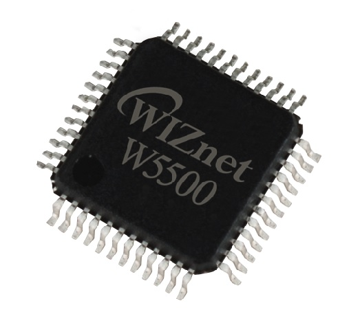

WARNING: This page is in notes format, and may not be of the same quality as other pages on this site.

== Overview

== History

Originally, ethernet used a single coax cable (10base2).

== Components

=== Connector

RJ45 jack. Connectors which integrate the magnetics are called _integrated connector modules_ (ICMs).

=== Magnetics

Magnetics are part of the Ethernet specification for all xBASE-T networks (which includes pretty much every Ethernet PHY standard except for the first StarLAN-1, StarLAN-10 and LattisNet).

There are two options for magnetics, either:

. Buy a ethernet magnetics component for your PCB.
. Buy a jack (connector) which already has the magnetics integrated into it. Connectors which integrate the magnetics are called _integrated connector modules_ (ICMs).

=== Physical Layer (PHY)

The _PHY_ is the circuitry which drives the magnetics.

=== MAC

== Standards

=== 10BASE-T

Used Cat 3 cable.

=== 10BASE-T1L

Designed for automotive and IoT applications.

=== 10BASE-T1S

Designed for automotive and IoT applications. Allows for a multidrop architecture.

== Ethernet Jacks

Some ethernet jacks come with the magnetics already in-built, saving you the trouble of including them yourself on the mounted-to PCB

== Popular Chips

=== WIZnet W5xxx Family

The WIZnet W5xxx family of serial-to-ethernet ICs is very popular in the maker community. This family of ICs is used by the Arduino Ethernet board are Arduino Ethernet Shield.

* W5200: This chip implements the PHY, the TCP/IP stack (fully hardwired), and the 10/100 MAC Ethernet MAC, in a QFN-48 package. It uses the link:/electronics/communication-protocols/spi-communication-protocol/[SPI Protocol] to talk to a microcontroller. It's power save features include power-down mode and WOL (wake on LAN). It runs of 3.3V but has 5V I/O tolerance.

* link:https://www.wiznet.io/product-item/w5500/[W5500]: Supports up to 8 independent sockets (i.e. 8 different connections to different ports). Contains a 10BaseT/100BaseTX PHY. Like the W5200 is runs of 3.3V but has 5V I/O tolerance.
+
.Image of the WIZnet W5500 serial-to-ethernet IC. Image from https://www.wiznet.io/product-item/w5500/.

=== Microchip LAN867x Family

Microchip's LAN8670, LAN8671 and LAN8672 are ethernet PHY ICs that use <<10BASE-T1S, 10BASE-T1S>>, allowing a multidrop architecture of "at least 8 nodes and a minimum 25m of length".
