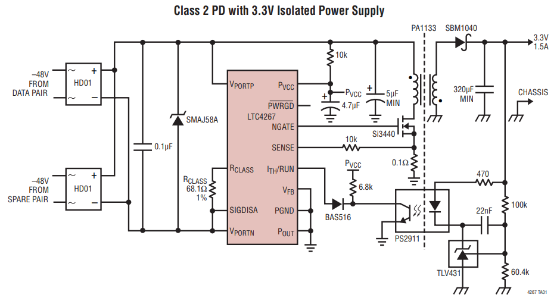

WARNING: This page is in notes format, and may not be of the same quality as other pages on this site.

== Overview

== History

Originally, ethernet used a single coax cable (10base2).

== Components

=== Connector

RJ45 jack. Connectors which integrate the magnetics are called _integrated connector modules_ (ICMs).

=== Magnetics

Magnetics are part of the Ethernet specification for all xBASE-T networks (which includes pretty much every Ethernet PHY standard except for the first StarLAN-1, StarLAN-10 and LattisNet).

There are two options for magnetics, either:

. Buy a ethernet magnetics component for your PCB.
. Buy a jack (connector) which already has the magnetics integrated into it. Connectors which integrate the magnetics are called _integrated connector modules_ (ICMs).

=== Physical Layer (PHY)

The _PHY_ is the circuitry which drives the magnetics.

=== MAC

== Standards

=== 10BASE-T

Used Cat 3 cable.

=== 10BASE-T1L

Designed for automotive and IoT applications.

=== 10BASE-T1S

Designed for automotive and IoT applications. Allows for a multidrop architecture.

== Ethernet Jacks

Some ethernet jacks come with the magnetics already in-built, saving you the trouble of including them yourself on the mounted-to PCB

== Power Over Ethernet (PoE)

_Power over Ethernet_ (PoE) is the term used to describe ethernet cables/systems that also provide a power source over the same cable as the data.

_Power sourcing equipment_ (PSE) is the devices that provide power onto the ethernet bus. The _powered device_ (PD) is the device on the other end of the cable which is consuming the power.

A _PoE injector_ is a stand-alone device used to add ("inject") DC power into an existing Ethernet cable.

The _assured power_ is the amount of power available to the powered device at the end of cable. This is less than the power outputted by the PSE due to the energy lost in the impedance of the cabling.

|===
| Name  | IEEE standard         | Power to PD | Max. power per port | Energized pairs| Supported devices

| PoE   | IEEE 802.3af (Type 1) | 12.95 W     | 15.4 W              | 2-pair	     | VoIP phones, WAP
| PoE+  | IEEE 802.3at (Type 2) | 25.5 W      | 30 W                | 2-pair	     | 
| PoE++	| IEEE 802.3bt (Type 3)	| 51 W        | 60 W                | 4-pair	     | 
| PoE++	| IEEE 802.3bt (Type 4)	| 71.3 W      | 100 W               | 4-pair	     |
|===

PoE++ is also known as 4PPoE.

.Typical application schematic for the Analog Devices LTC4267 PoE regulator IC. Image retrieved 2021-08-26 from https://www.analog.com/media/en/technical-documentation/data-sheets/4267fc.pdf.

Signature resistance of 25kR.

== Popular Chips

=== WIZnet W5xxx Family

The WIZnet W5xxx family of serial-to-ethernet ICs is very popular in the maker community. This family of ICs is used by the Arduino Ethernet board are Arduino Ethernet Shield.

* W5200: This chip implements the PHY, the TCP/IP stack (fully hardwired), and the 10/100 MAC Ethernet MAC, in a QFN-48 package. It uses the link:/electronics/communication-protocols/spi-communication-protocol/[SPI Protocol] to talk to a microcontroller. It's power save features include power-down mode and WOL (wake on LAN). It runs of 3.3V but has 5V I/O tolerance.

* link:https://www.wiznet.io/product-item/w5500/[W5500]: Supports up to 8 independent sockets (i.e. 8 different connections to different ports). Contains a 10BaseT/100BaseTX PHY. Like the W5200 is runs of 3.3V but has 5V I/O tolerance.
+
.Image of the WIZnet W5500 serial-to-ethernet IC. Image from https://www.wiznet.io/product-item/w5500/.

=== Microchip LAN867x Family

Microchip's LAN8670, LAN8671 and LAN8672 are ethernet PHY ICs that use <<10BASE-T1S, 10BASE-T1S>>, allowing a multidrop architecture of "at least 8 nodes and a minimum 25m of length".
