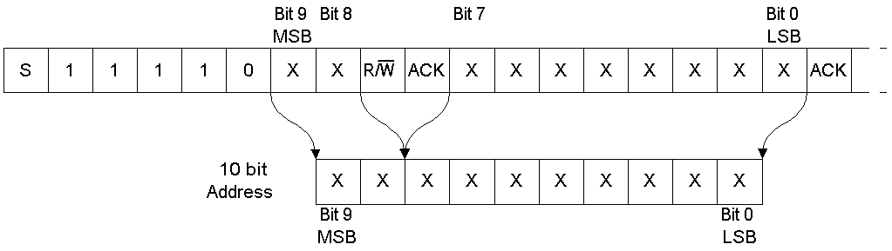
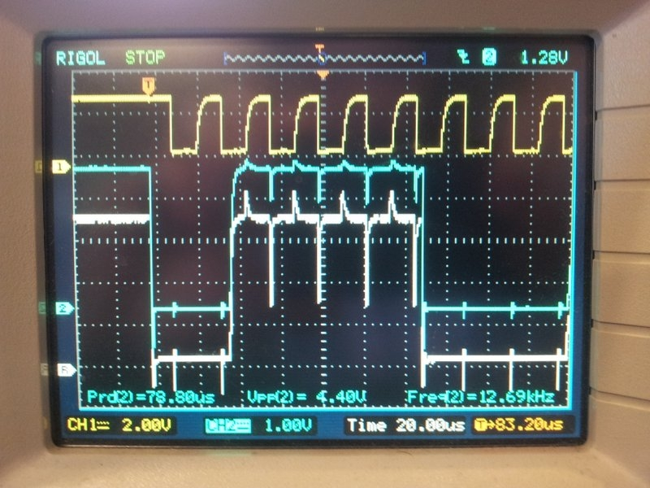
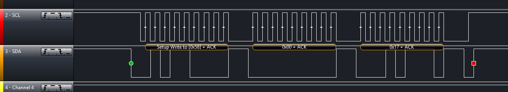

:imagesdir: 

== Overview

The I²C (_Inter-Integrated Circuit_, but pronounced _I-2-C_, and also spelt I2C) bus is a communication protocol commonly used for PCB level transmissions between ICs and microcontrollers. It is a half-duplex, synchronous protocol which requires 2 wires (4 if you include power and ground). It uses device addressing (typically 7-bit) to indicate the recipient of the data. Arbitration is achieved via use of open-drain or open-collector outputs for the SCL and SDA lines (except for uncommon Ultra-fast mode, which uses push-pull drivers). It is commonly used for sending small packets of information to ICs (such as configuration settings, or a sensor value), while link:/electronics/communication-protocols/spi-communication-protocol/[SPI] is used for more data intensive communication (due to its full-duplex and push-pull driver operation). The I2C protocol does not define the semantics (the meaning of the data). I2C can support multiple masters through software protocols.

.The I2C logo.
image::i2c-logo.gif[width=200px]

== History

The patent "Two-wire bus-system comprising a clock wire and a data wire for interconnecting a number of stations" for I2C was filed by Philips in 1981<<bib-patent-i2c>>. The first 100kHz system was developed in 1982. 400kbit/s fast mode was introduced in 1992, and 3.4Mbit/s high-speed mode in 1998.

== Typical Electrical Specs

|===
| Specification | Value

| Bus Capacitive Load
| 400pF max (this limits cable length and fan-out)

| Signal Rise Times
| 1000ns max (standard mode), 300ns max (fast-mode)

| Maximum Pull-down Current
| 3mA (this limits the minimum pull-up resistance)

| Signal Naming Conventions
| SCK (clock), SDA (data)
|===

== Signal Names

|===
| Name | Flow | Description

| SCL (sometimes called SCK)
| Master drives, slaves listen
| Clock

| SDA
| Bi-directional
| Data
|===

== Pull-Up Resistors

The I2C bus uses open-drain (or open-collector if BJTs are used rather than MOSFETs) drivers to allow for **compatibility** between chips that run of different voltages, bus arbitration, and hot-swapping. Thus pull-up resistors are essential to return the bus to the passive voltage state. 0V is considered low and either +3.3V or +5.0V are common "high" voltages.

.I2C pull-up resistors.
image::i2c-pull-up-resistors.png[width=488px]

**The value of the resistor determines the maximum speed of the bus (the lower the resistance, the faster the bus can operate).** The resistance is limited at the lower end by the maximum bus current that the I²C chips can supply, and maximum power consumption if relevant. The I2C specification states that an I2C compliant device must be able to sink at least 3mA from the I2C bus lines and have a logic low voltage of no higher than stem:[V_{OL} = 0.4V] while doing this. Using this information, it is easy to come up with the equation for the minimum allowed resistance:

[stem]
++++
\begin{align} R_{min} = \frac{V_{CC} - V_{OL}}{I_{OL}} \end{align}
++++

[.text-center]
where: +
stem:[ V_{CC} ] is the supply voltage that one side of the pull-up resistor is connected to, in Volts +
stem:[ V_{OL} ] is the maximum voltage allowed on the bus while the device is sinking \) I_{OL} \), in Volts +
stem:[ I_{OL} ] is the maximum current the I2C device pulling the bus line low is required to sink (typ. 3mA), in Amps +

Given the fixed known values, this can be simplified to:

[stem]
++++
\begin{align} R_{P, min} = \frac{V_{CC} - 0.4V}{3mA} \end{align}
++++

Because of I2C's open-collector topology, it is **solely the pull-up resistors duty to pull the line high** when a device releases it (i.e. stops pulling it to ground). The pull-up resistor, along with the bus capacitance stem:[ C_{BUS} ], creates a time constant which slows the rise time of the bus voltage. The I2C specification states that a voltage above stem:[ V_{IH} = 0.7V_{CC} ] must be considered logic high by all devices.

[stem]
++++
\begin{align} R_{P, max} = \frac{T_R}{0.847298C_{BUS}} \end{align}
++++

[.text-center]
where: +
stem:[ T_R ] is the maximum allowed rise time as specified by the I2C specification for a particular mode, in seconds +
stem:[ C_{BUS} ] is the total bus capacitance, in Farads

The maximum rise time stem:[ T_R ] is specified by the I2C standard for each I2C mode as shown in the table below:

|===
| I2C Mode | Maximum Rise Time stem:[T_R]

| Standard | 1000ns
| Fast Mode | 300ns
|===

Note that this is not the only thing which limits the maximum pull-up resistance, the **high-level input current**, stem:[ I_{IH} ] also puts a restriction on the maximum resistance (it is usually higher than that imposed by the maximum rise time, and therefore rarely considered). The high-level input current is due to leakage current through the digital input pins connected to the bus, which creates a constant voltage drop over the pull-up resistors (remember, it's the resistors which are pulling the bus line high).

Typical pull-up resistor values are 10kΩ for up to a 100kHz bud rate, and 1kΩ for up to a 400kHz baud rate. External pull-up resistors should be used as normally, the internal pull-up of microcontroller ports and other I2C compliant devices have too high a resistance (100kΩ-1MΩ).

A **gotcha** during PCB design is to unintentionally **add multiple pull-up resistors to each bus line**. Maybe you added pull-up resistors to every I2C slave device, and then connected them to the same bus? Maybe you designed a plug-in board which had an I2C slave on it, and added resistors to that too? In any case, **try and make sure there is only one set of pull-up resistors**, associated with the I2C bus master. If you do need to have multiple resistors, make sure their **combined equivalent resistance does not violate** the I2C specifications.

== Transmission Speeds

=== Overview

The data on an I2C bus can be transmitted at different rates, depending on what modes both the transmitter and receiver support. The following table outline the modes and the maximum speeds at which data can be transmitted on them. 

NOTE: Because the data is clocked, there is almost no minimum speed (unless the device implements some sort of time-out feature).

|===
| I2C Mode               | Maximum Speed | Maximum Bus Capacitance | Drive

| Standard               | 100kbit/s     | 400pF                   | Open drain
| Fast-mode (Fm)         | 400kbit/s     | 400pF                   | Open drain
| Fast-mode Plus (Fm+)   | 1Mbit/s       | 550pF                   | Open drain
| High-speed mode (Hs)   | 1.7Mbit/s     | 400pF                   | Open drain
| High-speed (Hs)        | 3.4Mbit/s     | 100pF                   | Open drain
| Ultra-fast mode (UFm)  | 5Mbit/s       | n/a                     | Push-pull<<bib-i2c-bus-ufm>>
|===

=== Standard

The standard communication rate (a.k.a. original speed) allows communication speeds of up to 100kHz. This is typically the maximum speed if a special speed mode is not mentioned.

=== Fast Mode (Fm)

Fast mode is a mode of operation for the I2C bus that allows devices to communicate at speeds of up to 400kHz. It is supported by a great number of I2C devices.

=== Fast Mode Plus (Fm+)

Fast mode plus (Fm+) is an extension of I2C Fast mode which allows devices to communicate at speeds of up to 1MHz. It was introduced by Phillips Semiconductors (which is now NXP) in April 2006. It is occasionally used for I2C devices which require high data throughput.

=== High-Speed (Hs)

The high-speed mode allows for communication rates of up to 3.4MHz, which makes it the fastest I2C mode available. It is an **officially supported** mode of operation, however, not many I2C devices support this mode of operation (the competing link:/electronics/communication-protocols/spi-communication-protocol[SPI communication protocol]) seems to be the preferred way of doing things at >1Mbps). One of the key differences between all other speed modes and high-speed mode is the **current sourcing** capabilities of the master device in Hs mode. This allows the **master to inject current onto the I2C lines to drive them high** faster than what pull-up resistors on their own would allow.

Also, the clock signal has a high to low ratio of 1:2, which is different the the ratio of 1:1 for all other modes.

=== Ultra-fast Mode (UFm)

_Ultra-fast Mode_ (UFm) is currently the fastest mode of I2C available, with a speed of 5Mbit/s. It is drastically different from all other modes because it uses push-pull drivers rather than open-drain drivers. This means that the bus is no longer bi-directional, and data is sent from master to slaves only. Slaves do not send an acknowledge bit<<bib-i2c-bus-ufm>>.

Ultra-fast mode is almost primarily used for LED drivers, for example the link:https://www.nxp.com/products/power-management/lighting-driver-and-controller-ics/ic-led-controllers/24-bit-ufm-5-mhz-ic-bus-100-ma-40-v-led-driver:PCU9656B[PCU9656B 24-Bit UFm 5MHz I²C-Bus 100mA 40V LED Driver from NXP].

## I²C Bus Protocols And Variants

There are variants on the I2C bus, defined and implemented by various manufactures. These include:

* SMBus - The System Management Bus. Only works with a single slave. Uses less current, but operates at a lower speed.
* PMBus - Extends the SMBus functionality
* IPMB - The Intelligent Platform Management Bus
* TWI - The Two-Wire Interface. A name used by some vendors (including ATMEL), to describe a I2C bus (exactly identical).
* ACCESS.bus
* DDC, E-DDC - (Enhanced) Display Data Channel, used by the HDMI protocol send data from the sink to the source about what resolutions and frame rates it supports. The HDMI specification says it must support standard rate I2C (100kbit/s), with optional support for fast mode (400kbit/s).

== I2C Applications And Uses In Industry

* Automotive (although the CAN/LIN bus is more popular in automotive environments due to the higher noise resistance)
* Consumer
* Industrial (ethernet is also popular for industrial control)
* Mobile
* Telecom/networking
* Radio/T.V.

.A typical application schematic for an I2C I/O expander.
image::typical-application-schematic-for-i2c-io-expander.png[width=400px]

=== Display Protocols (VGA, DVI and HDMI)

I2C is used within the VGA, DVI and HDMI protocols<<bib-ken-shirriff-vga-i2c>> to share additional information between the connected devices (it is not used for the visual signal). They call this signal which uses I2C the DDC (_Display Data Channel_) signal. The protocol is implemented in such a way that on the monitor side, all you need to do is hook up a standard I2C EEPROM memory chip<<bib-elec-se-hdmi-and-i2c>>.

== Addressing

All I2C slave devices must have an address. This address is used by the master to select which device to talk with. Standard addresses are 7 bits long, with a 10-bit extension being rather uncommon. In the case of a 7-bit address, it is left shifted by one and packed into the first byte which is sent across the I2C bus by the master (the final bit, bit 0, of the first byte, is used to signal whether a read or write operation is about to take place).

=== Multiple ICs, Same Address?

Connecting two identical devices (e.g. lets say you have two temperature sensors) onto the same I2C bus, both with the same pre-programmed I2C address means that that the master cannot address them individually and functionality is severely reduced. To overcome this, many I2C slave ICs also come with a few address pins. These address pins are digital inputs and control what I2C address the slave will respond to. A typical device with two address pins allows the designer to connect up to four identical ICs to the same I2C bus by connecting the address pins to different combinations of stem:[V_{CC}] and GND.

Newer pin-constrained I2C slave devices allow you to connect the address pins up to SCL and SDA to further increase the number of assignable addresses. With two address pins, and the possibility of connecting each up to either stem:[V_{CC}], GND, SCL or SDA, gives a total of 16 different I2C addresses (stem:[n = 4^2]).

.The logic table (truth table) of the I2C address pins on the TI INA226 IC. Notice how you can connect the address pins up to SCL or SDA as well as the standard VS and GND, to give a total of 16 possible I2C addresses<<bib-ti-ina226-power-mon>>.
image::i2c-slave-address-pins-logic-table-with-scl-sda-ability-ti-ina226.png[width=800px,link="/i2c-slave-address-pins-logic-table-with-scl-sda-ability-ti-ina226.png"]

Another way the address issue is addressed (that could be worded better) is by the manufacturer providing a range of orderable part number for the same chip, but with different I2C addresses. One such example is the ADS1100 ADC by TI in a tiny SOT-23-6 package. There are no spare pins for address configuration on this 6-pin package -- instead, you can order 8 different parts which have a different I2C address in the range `0b1001000-0b1001111` (as shown in <<ads1100-adc-packaging-information>>)<<bib-ti-ads1100-adc>>.

[[ads1100-adc-packaging-information]]
.The different part numbers for the ADS1100 ADC. Each part number comes with a different I2C address<<bib-ti-ads1100-adc>>.
image::ads1100-adc-packaging-information.png[width=600px,link="/ads1100-adc-packaging-information.png"]

### Reserved I2C Addresses

The I2C specification reserves some addresses for special purposes. Because of these reserved addresses, only 112 addresses are available to I2C devices using the 7-bit address scheme. Do not set your device to use these addresses listed below.

|===
| Reserved Address | Description

| stem:[0000000 0] | General call.
| stem:[0000000 1] | Start byte.
| stem:[0000001 x] | CBUS addresses.
| stem:[0000010 x] | Reserved for different bus formats.
| stem:[0000011 x] | Reserved for future purposes.
| stem:[00001xx x] | High-speed master code.
| stem:[11110xx x] | 10-bit slave addressing.
| stem:[11111xx x] | Reserved for future purposes.
|===

=== General Call

stem:[0000000(0)] is the I2C address for a general call. It is used by the **master to address all the slaves on an I2C bus at once**. The second byte contains the command the master wishes to send all the slaves. These commands, as they are generic, are also specified as part of the I2C protocol.

=== Start Byte

stem:[000000(1)] is the I2C address for a **start byte**. The start byte was added to the I2C specification to allow microcontrollers without dedicated I2C peripherals to use the I2C bus without consuming too much power when having to poll the I2C lines at a high speed to detect the start of a transmission (a technique referred to as bit banging). Instead, the microcontroller only has to detect one of the seven 0's in the start byte at a slower polling speed, and then switch to a high rate for the rest of the transmission. The master transmits a start condition, the start byte, a **dummy acknowledge pulse**, a repeated start condition, and then the actual transmission.

### CBUS

stem:[0000001(x)] is the I2C address reserved for CBUS addresses. CBUS is a three-wire bus with a different transmission format to I2C, and is used in home automation products. This reserved address allows CBUS receivers to be connected to I2C buses. I2C devices should ignore any messages sent to this address.

CBUS addressing over I2C is very uncommon.

### 10-bit Addressing

Due to the rise in popularity of the I2C protocol and the limited amount of addresses available with the original 7-bit addressing scheme (leading to address clashes), a 10-bit addressing scheme was introduced. 10-bit addressing gives an additional 1024 unique addresses.

The 10-bit addressing scheme involves two address bytes (instead of just one). The first byte includes the bits `11110` (in bit positions `7:3`) which is a _reserved code_ to indicate that a 10-bit address follows. The actual 10-bit address is sent in bits `2:1` of the first address byte (the MSB) and bits `7:0` of the second address byte (LSB).

.The bit pattern of the two address bytes in the I2C 10-bit addressing scheme. Image from http://www.i2c-bus.org/.

Bit `0` of the first address byte is the read/not-write (RnW) bit. **Note that when using the 10-bit addressing scheme, this must be set to 0.** Thus, to perform a read operation, a _combined transfer_ must be used. In a _combined transfer_, the above two bytes are sent with the RnW bit set to `0`, then a repeated start, then the first address byte again, but with the RnW bit set to `1`. A read operation then may be performed as usual.

The 10-bit addressing scheme has been to designed so that it can work on a bus alongside the 7-bit addressing scheme.

## Transmission Distances And Buffer's

.An example from a NXP application note showing how their P82B96 I2C-bus buffering IC can utilise buffering and twisted pairs to increase the I2C communication distance.
image::i2c-buffer-ic-example.jpg[width=800px]

If you are following the I2C spec, the transmission distance is usually limited to a few metres due the max line capacitance rated at 400pF. Speaking from personal experience, when trying to get I2C to work through long cables, cross-talk is usually the problem which stops the communications from working. The cross-capacitance between the SCL and SDA lines results in the signals mixing together, and often your start condition won't work because the SDA line being pulled low will couple into the SCL and pull that low too, invalidating the transmission. Slowing down the transition speeds could help this (aka drive strength), but the rise /fall times is typically limited to a maximum of 300ns.

The picture below shows how cross-coupling can introduce noise onto the SDA and SCL lines when using long cables. This shows SCL (yellow) and SDA (blue) over an 8m ethernet cable.

.The cross-talk noise that occurs on long I2C transmission lines. This shows SCL (yellow) and SDA (blue) over a 20m ethernet cable.
image::i2c-noise-from-long-cable.jpg[width=387px]

### Using Twisted Pair Cabling And A Buffer IC

I have had very good results with using twisted-pair cabling along with the P82B96 buffer IC to extend the length of the I2C bus. With the SDA and SCL lines connected to wires in different pairs, and then either power or ground connected to the other wire in each pair, I have managed to transmit I2C at 50kHz through a 30m cable. Make sure power and ground are decoupled well at each end with 100nF ceramic capacitors. Using a data/clock line and either power or ground in a twisted pair couples them tightly together, and reduces the amount of emissions that couple onto other wires in the cable. Cat5e ethernet cable can be used (although you only use 2 of the 4 pairs if following the above example).

The picture below shows the difference grounding the other wire in a pair makes when transmitting I2C over twisted pair cables. The yellow trace is SCK (for reference), the white trace is SDA with the second wire floating, and the blue trace is SDA when the second wire is either grounded or connected to VCC. Notice a great reduction in cross-coupling on the blue trace.

.The difference grounding the other wire in a pair makes when transmitting I2C over twisted pair cables. The yellow trace is SCK (for reference), the white trace is SDA with the second wire floating, and the blue trace is SDA when the second wire is either grounded or connected to VCC. Notice a great reduction in cross-coupling on the blue trace. This was over a 20m ethernet cable.

The I2C transmission distance can also be extended by using I2C buffer IC's. These chips buffer the inputs and provide high output drive signals useful for sending down long cables. Some also support RX/TX splitting (sending the RX and TX signals from the SDA down separate lines to increase transmission times), as well as differential line driving). Buffering the I2C lines introduces a 'lock-up' problem, in which if the bus is driven low, the receiver will keep it low even after the sender has released it. To stop this from happening, manufacturers cleverly introduced two 'logic-low' levels, which both conform to the logic-low of the I2C standard. Typically anything 0.5V is counted as a true 'low' (which is propagated through the buffer), while anything between 0.5V and 0.9V is a buffer-generated low which is not propagated.

The transmission distance could also be extended by using I2C controllers or bridges that convert the comm protocol into another (e.g. UART) before sending. But this is kinda cheating, isn't it?

If you follow by example, Nintendo's Wii hand controller is a good example of a device that uses I2C over a longer-than-designed-for distance. Their controller cables can be up to 2m in length with the extension.

## Rise-time Accelerators

Rise-time accelerators, such as those used on the link:http://www.nxp.com/documents/data_sheet/PCA9507.pdf[NXP PCA9507 2-wire Serial Bus Extender], can be used to extend the length of an I2C bus. They work by intelligently detecting when the bus voltage is rising (being pulled up by the pull-up resistors), and then injecting current to shorten the time it takes for the bus to reach a logic high voltage level. The current injector is then quickly turned off, allowing the I2C line to be pulled low again.

## Hot-Swapping

### Precharging

A clever I2C trick for hot-swapping capability is to pre-charge the bus lines, as used on the link:http://www.marutsu.co.jp/contents/shop/marutsu/datasheet/PCA9511.pdf[NXP PCA9511 Hot-swappable I2C Bus Buffer] (this also features rise-time accelerators). During insertion (assuming this chip is on a hot-swappable device which uses I2C), the bus lines are pre-charged to about 1V, which limits the worst-case capacitive disturbances on insertion due the I2C lines being a different voltage levels.

## Clock Stretching

A slave device can indicate that it is not ready to receive new data by holding the clock line (SCL) low. This tells the master to wait until the clock line is high before sending more data.

## Complimentary/Useful I2C Devices

* I/O Expanders - Used for trace reduction and routing simplification. Basically an IC with digital ports that can be turned on or off through I2C communication. Used to compliment processors with limited I/O, and drive port-hungry peripherals such as keypads (you can also get dedicated I2C keypad controllers)
* I2C Multiplexers/Switches - Performs voltage translation/isolation and multiplexing of I2C traces. Useful when dealing with mixed-voltage I2C systems and for resolving address conflicts 
* USB-to-I2c Bridges - These provide a interface between your computer and an external I2C communication line. Certain FTDI chips/cables with an in-built MPSSE (multi-purpose synchronous serial engine) support USB-to-I2C communication. See this application note here (link:http://www.ftdichip.com/Support/Documents/AppNotes/AN_190_C232HM_MPSSE_Cable_in_USB_to_I2C_Interface.pdf[Application Note AN-190: C232HM MPSSE Cable in USB to I2C/SMBus interface]).  
  
.The C232HM-DDHSL-0 FTDI USB-to-MPSSE cable. Creates a bridge between your computer and a number of serial comm protocols such as SPI, I2C and UART.
image::c232hm-ddhsl-0-ftdi-usb-to-mpsse-cable.jpg[width=265px]

## Typical I2C Operation

I2C is typically used to configure and talk to digital sensor IC's in an embedded environment. IC's such as accelerometers, capacitive sensors, digital thermometers usually have an I2c protocol for configuration and/or data transfer.

.A typical I2C waveform. The top waveform is the clock (SCK), and the bottom waveform is the data (SDA). This shows a master trying to communicate with the slave, but the slave does not acknowledge (the ninth bit is high).
image::typical-i2c-waveform.jpg[width=483px]

Typically, the IC has a 7-bit address which if right-shifted with the read/write bit being the LSB. If the IC detects its address, it issues an acknowledge. The second word (which may or may not be a byte, this depends on the size of the registers on the chip, typically 1 or 2bytes) sent by the master over I2C writes to an address pointer, this determines what register is going to be read to/written from. This is always a write operation.

At this point, if the master is performing a write, the master's third word will write to the register pointed to by the address pointer (which was sent as the second word). The address pointer is automatically incremented by one a this point, allowing the master to write consecutive registers all at once without having to do separate I2C transmissions.

.i2c-waveform-example-saleae-logic-analyser

But if instead the master is performing a read, a repeated start is normally issued after writing to the address pointer. Then the master issues a read command (the IC's 7-bit address and the read/write bit set correctly). The master then provides clock pulses while the slave 'reads' out register contents beginning at the register set in the address pointer in the previous write cycle. Just as with a write, the address pointer is incremented automatically, allowing multiple registers to be read at once.

The following image shows an I2C slave that is not responding. Notice the absence of an "ACK" on the SDA line on the 9th clock pulse. The slave should of pulled this low.

.An I2C slave that doesn't respond, no ACK on the 9th clock pulse.
image::i2c-waveform-with-nak-saleae-logic-analyser.png[width=800px]

## Prototyping

I try to use SPI or UART over I2C (if the option exists, and there are no other clear advantages/dis-advantages of choosing one over another) when prototyping because they tend to be easier protocols to debug. I2C is difficult because the data line is shared between master and slave (making it harder to work out what is sending what), and the transmission lines are pulled-up (hence it's hard/impossible to differentiate between a device driving the line or it being tri-stated).

## Microcontroller/SBC Support

**I2C is a very popular protocol and is supported by most microcontrollers**. Some examples of microcontroller I2C support include the TI MSP430 Enhanced Universal Serial Communication Interface (eUSCI),link:/programming/microcontrollers/psoc/components#i2c[ PSoC 3, 4, and 5LP I2C drag'n'drop modules] (both integrated and hardware fabric versions), and the Atmel Atmega TWI peripheral.

Many SBC (single board computers) also have I2C support. The popular RaspberryPi SBC has one I2C peripheral which is brought out to the header on the PCB<<bib-pinout-rpi>>.

### I2C Programmable Analog And Digital Noise Filters

Some microcontrollers provide programmable analog and/or digital noise filters for their I2C peripherals.

An example of a microcontroller that provides both analog and digital filters is the STM32F0 range by STmicroelectronics.

### SCL Spike Filters

The I2C specification requires that I2C devices ignore any high signal on the SCL wire that lasts less than 50ns. This specification is not universally implemented, typically because in most cases it does not effect operation. However, the link:i3c-communication-protocol[I3C communication protocol] uses this feature for some of it's _high data rate_ (HDR) modes which allow I2C slaves with spike filters to co-exist on the bus while the HDR transmission takes places between two I3C devices.

## Alternatives To I2C

A popular alternative to I2C which is also used for intra-board communication is the link:spi-communication-protocol[SPI bus]. link:i3c-communication-protocol[I3C] is less widely used but "improvement" on I2C in terms of baud rate, features and power usage.

[bibliography]
== References

* [[[bib-pinout-rpi, 1]]] Philip Howard. _I2C - Inter Integrated Circuit_. pinout.xyz. Retrieved 2021-11-23, from https://pinout.xyz/pinout/i2c.
* [[[bib-elec-se-hdmi-and-i2c, 2]]]. "Turbo J" (2014, Aug 4). _HDMI and I2C_. StackExchange: Electrical Engineering. Retrieved 2021-11-24, from https://electronics.stackexchange.com/questions/123957/hdmi-and-i-2-c.
* [[[bib-ken-shirriff-vga-i2c, 3]]] Ken Shirriff. _Reading a VGA monitor's configuration data with I2C and a PocketBeagle_. Retrieved 2011-11-24, from http://www.righto.com/2018/03/reading-vga-monitors-configuration-data.html.
* [[[bib-patent-i2c, 4]]] US Philips Corp (1981, Nov 2). _Two-wire bus-system comprising a clock wire and a data wire for interconnecting a number of stations_. Retrieved 2011-11-24, from https://patents.google.com/patent/US4689740A/en.
* [[[bib-i2c-bus-ufm, 5]]] I2C BUS. _Ultra Fast Mode UFm_. Retrieved 2021-11-24, from https://www.i2c-bus.org/ultra-fast-mode-ufm/.
* [[[bib-ti-ads1100-adc, 6]]] Texas Instruments (formally Burr-Brown) (2003). _ADS1100: Self-Calibrating, 16-Bit Analog-to-Digital Converter (datasheet)_. Retrieved 2022-01-07, from https://www.ti.com/lit/ds/symlink/ads1100.pdf.
* [[[bib-ti-ina226-power-mon, 7]]] Texas Instruments (2011, Jun). _INA226 High-Side or Low-Side Measurement, Bi-Directional Current and Power Monitor with I2C Compatible Interface (datasheet)_. Retrieved 2022-01-07, from https://www.ti.com/lit/ds/symlink/ina226.pdf. 