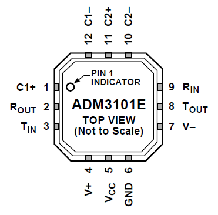

## Overview

RS-232 is a digital data transmission protocol with origins dating back to the 1960's. It was designed as a communication protocol to talk between _DTE_ (data terminal equipment) and _DCE_ (data communication equipment).

|===
| Drive Type | Single-ended
| Num. Wires (excl. GND) | 2 (TX/RX) or 4 (TX/RX and RTS/CTS)
| Duplexity | Full
| Connection Topology | Point-to-point
| OSI Layers | Layers 1 (physical) and 2 (data link)
|===

RS-232 is commonly used today for a variety of different purposes in embedded systems, incl industrial equipment, test and measurement equipment. RS-232 ports are no longer available on most desktop computers (and certainly not on laptops), but USB-to-RS232 adapters are cheap, popular and easy to use with almost any operating system.

## Pinout

.The pinout of a male RS-232 DE-9 connector. Image from http://www.ethernut.de/.
image::rs232-comm-protocol-male-connector-large-pinout.png[width=315px]

## Revisions

* RS-232C (or just shortened to RS-232)
* EIA-232-D (1987)
* EIA/TIA-232-E (1991)

## Transmission Distances

15m or less

## Higher-Level Protocols

Do you need a higher-level communication protocol that works over a UART connection? See the link:https://github.com/gbmhunter/SerialFiller[SerialFiller] library on GitHub (written in C++). SerialFiller uses a publish/subscribe mechanism and works well on point-to-point serial connections such as UART.

## Interfaces

The pinout of a typical Analog Devices RS-232 to UART transceiver is shown below.

.Pinout of a RS-232 transceiver by Analog Devices.

Another example of a RS-232 to CMOS UART converter is the MAX3221IDBE4. It supports an auto-shutdown feature based on the voltage-level of the receiving RS-232 line.

## Driver ICs

### MAX3227

The Maxim MAX3227 is a popular RS-232 line transceiver. It contains 1 driver and 1 receiver as is designed to be driven from CMOS signals (e.g. connected to a microcontroller UART)<<bib-maxim-max32xx-ds>>. Texas Instruments produces a drop-in replacement part for the MAX3227, the MAX3227CDBR (the CDBR standing for commercial temp. range, tape and reeled)<<bib-ti-max3227cdbr-ds>>.

## Cheap Discrete-Part RS-232 To TTL Converter

A RS-232 to TTL logic-level converter can be made out of a few discrete components. The schematic shown below uses some clever circuitry, including a charge-pump like circuit, to generate the negative voltage required for RS-232 transmission back to the computer.

.The schematic of a cheap, discrete-part RS-232 to TTL logic-level converter. Image from Atmel AVR910 (http://www.atmel.com/).
image::low-cost-discrete-part-rs-232-to-ttl-converter-schematic-atmel-avr910.png[width=600px]

[bibliography]
## References

* [[[bib-ti-max3227cdbr-ds, 1]]] Texas Instruments (2006, Feb). _AX3227: 3V to 5.5V Single-channel RS-232 Line Driver/Receiver With ±15kV ESD Protection (datasheet)_. Retrieved 2022-03-02, from https://www.ti.com/lit/ds/symlink/max3227.pdf.
* [[[bib-maxim-max32xx-ds, 2]]] Maxim (2011, Feb). _MAX3224–MAX3227/MAX3244/MAX3245: 1µA Supply Current, 1Mbps, 3.0V to 5.5V, RS-232 Transceivers with AutoShutdown Plus (datasheet)_. Retrieved 2022-03-02, from https://datasheets.maximintegrated.com/en/ds/MAX3224-MAX3245.pdf.  
