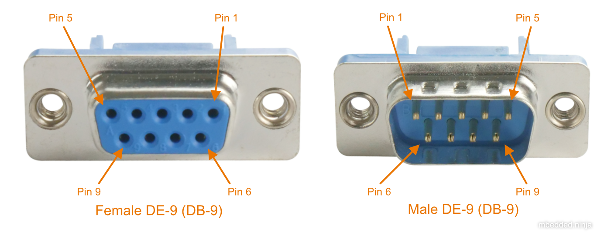
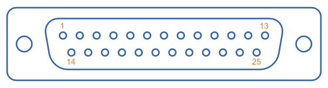

:imagesdir: 

WARNING: This page is in notes format, and may not be of the same quality as other pages on this site.

## Overview

_RS-422_ (a.k.a. TIA/EIA-422) is a serial, differential communication protocol used for transmitting data. RS-422 uses 2 wires for transmitting and 2 wires for receiving for full-duplex communication. 1 driver and up to 10 receivers can be connected per twisted pair, which is called _simplex multidrop_<<bib-ti-rs-422-rs-485>> (unlike RS-485, which is differential and allows for multiple drivers). It is closely related to the less popular RS-423 protocol. It is also related to the link:/electronics/communication-protocols/rs-232-protocol/[RS-232] (single-ended) and link:/electronics/communication-protocols/rs-485-protocol/[RS-485] (differential) communication protocols.

|===
| Speed  | Max. Distance

| 10kbps | 1200m<<bib-wp-rs-422>>
| 10Mbps | 10m
|===

The maximum allowed differential voltage is stem:[\pm 6.0V]<<bib-wp-rs-422>>.

A _mark_ (binary 1) is transmitted with a negative differential voltage, a _space_ (binary 0) is transmitted with a positive differential voltage. This is the same terminology and "inverse" polarity as RS-232 and RS-485.

## Connectors

The link:/electronics/components/connectors/d-subminiature-d-sub-connectors/[DE-9] is the de facto industry standard connector for RS-422.

### DE-9 (DB-9)

.Pin numbering for the D-sub DE-9 (a.k.a. DB-9) female and male connectors.

The industry standard pinout for RS-422 in a DE-9 connector is shown in the table below.

[cols="1,1,3"]
.Industry standard pinout for RS-422 on a DE-9 connector<<bib-active-experts-rs422-pinout>>.
|===
| Pin Num. | Name | Description

| 1        | TXD- | Transmitted data -
| 2        | TXD+ | Transmitted data pass:[+]
| 3        | RTS- | Request to send -
| 4        | RTS+ | Request to send pass:[+]
| 5        | GND  | Ground
| 6        | RXD- | Received data -
| 7        | RXD+ | Received data pass:[+]
| 8        | CTS- | Clear to send -
| 9        | CTS+ | Clear to send pass:[+]

|===

### DB-25

The link:/electronics/components/connectors/d-subminiature-d-sub-connectors/[D-Subminiature DB-25 connector] is another popular choice for carrying RS-422 signals.

.Pin numbers for the male DB-25 connector, looking at the "front" of the connector which mates with the female part.

[cols="1,1,3,1,1,3"]
.Industry standard pinout for RS-422 on a DB-25 connector<<bib-sweet-serial-posix>>.
|===
| Pin Num. | Name | Description            | Pin Num. | Name | Description

| 1        | EGND | Earth ground           | 14       | TXD+ | Transmitted data pass:[+]
| 2        | TXD- | Transmitted data -     | 15       | CLK- | Transmit clock -
| 3        | RXD- | Received data -        | 16       | RXD+ | Received data pass:[+]
| 4        | RTS- | Request to send -      | 17       | CLK+ | Receiver clock -
| 5        | CTS- | Clear to send -        | 18       | -    | Unassigned
| 6        | DSR  | Data set ready         | 19       | RTS+ | Request to send pass:[+]
| 7        | GND  | Logic ground           | 20       | DTR- | Data terminal ready -
| 8        | DCD- | Data carrier detect -  | 21       |      | Signal quality detect
| 9        |      | Reserved               | 22       | -    | Unassigned
| 10       |      | Reserved               | 23       | DTR+ | Data terminal ready pass:[+]
| 11       | -    | Unassigned             | 24       | CLK+ | Transmit clock pass:[+]
| 12       | DCD+ | Data carrier detect +  | 25       | CLK+ | Receiver clock pass:[+]
| 13       | CTS+ | Clear to send +        |          |      |

|===

## Parts

Many RS-422 transceivers also support RS-485.

[.overflow]
--
[.table-800,cols="1,1,1,1,1,1,1,2"]
|===
| Manf. Part Num. | Manf. | Protocols | stem:[V_S] | Data Rate | Package | USD, 100 | Comments

| link:https://www.renesas.com/us/en/document/dst/isl3179e-isl3180e-datasheet[ISL3179EIRZ]
| Renesas
| RS-422, RS-485
| 3-3.6V
| 40Mbps
| DFN-10
| link:https://www.digikey.com/en/products/detail/renesas-electronics-america-inc/ISL3179EIRZ/1879479[$2.48]
| Also supports RS-485.

|===
--

[bibliography]
## References

* [[[bib-wp-rs-422, 1]]] Wikipedia (2022, Jan 25). _RS-422_. Retrieved 2022-02-05, from https://en.wikipedia.org/wiki/RS-422.
* [[[bib-active-experts-rs422-pinout, 2]]] ActiveXperts. _RS422 Serial Port Connector Pin Layout_. Retrieved 2022-02-06, from https://www.activexperts.com/serial-port-component/tutorials/pinout422/.
* [[[bib-ti-rs-422-rs-485, 3]]] Manny Soltero, Jing Zhang, Chris Cockril (2002, Jun). _SLLA070D: RS-422 and RS-485 Standards Overview and System Configurations (Application Report)_. Retrieved 2022-02-06, from https://www.ti.com/lit/an/slla070d/slla070d.pdf.
* [[[bib-sweet-serial-posix, 4]]] Michael R. Sweet (1999). _Serial Programming Guide for POSIX Operating Systems_. Retrieved 2022-02-12, from https://www.cmrr.umn.edu/~strupp/serial.html.
