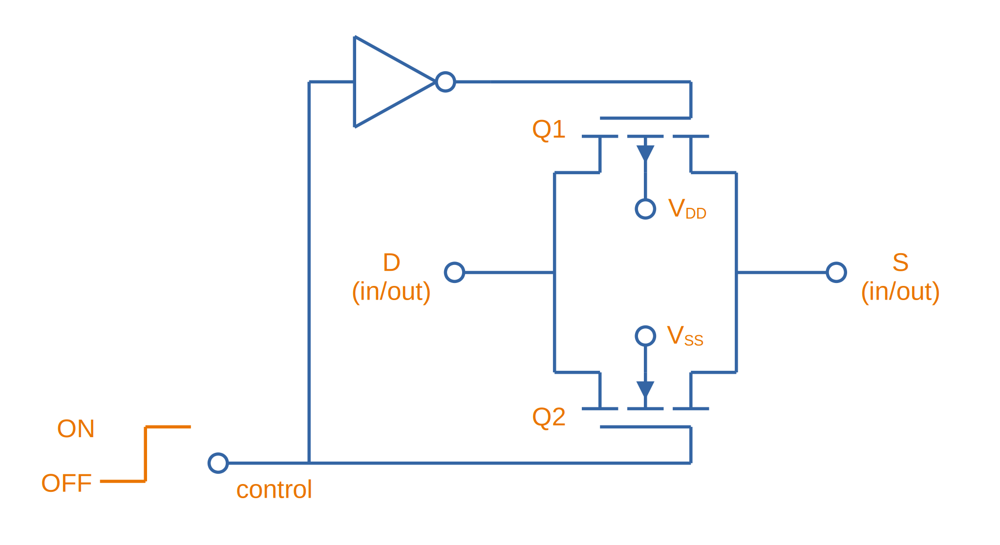
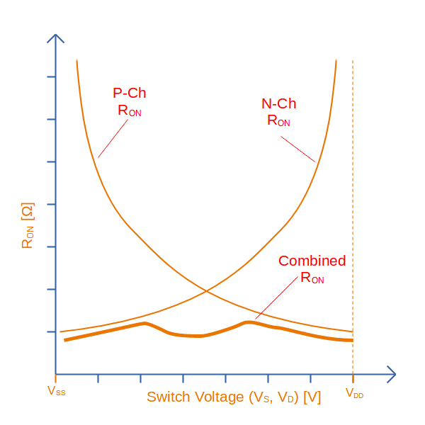

## Overview

Analogue switches are electrical circuits which connect and disconnect analogue signals.

They are also useful for certain digital signals which have analogue characteristics. An example would be the link:/electronics/communication-protocols/i2c-communication-protocol/[I2C bus]. Although driven low (with sharp edges), the I2C bus lines are pulled high, causing the voltage to rise in a exponential fashion. Digital switches would turn this into a sharp rise, once the voltage reached a certain threshold. Analogue switches will let the waveform through unchanged, resulting in proper I2C operation.

When one analogue signal can be routed to many different locations, it is called an analogue multiplexor. These are discussed on the link:/electronics/components/multiplexers-and-demultiplexers/[Multiplexers And Demultiplexers page].

== How Do Analogue Switches Work?

CMOS is the most popular IC process to make analogue switches from, however JFETs are used for special applications such as video switching due to the high bandwidth and signal quality requirements of the signal<<bib-ad-analog-switch-multiplexers-basics>>.

[[analog-switch-circuit-two-mosfets]]
.Circuit diagram of a basic CMOS analogue switch, using one P-channel MOSFET (stem:[Q1]) and one N-channel MOSFET (stem:[Q2]).

IMPORTANT: The substrates of the two MOSFETS in <<analog-switch-circuit-two-mosfets>> are not connected to the source pin, as they typically are for all discrete MOSFETs. Instead they are connected to stem:[V_{SS}] (e.g. stem:[GND]) and stem:[V_{DD}] respectively. They have to be for this circuit to work correctly, otherwise the inherent body diode would forward conduct and the switch would never be able to turn off. For this reason, you cannot make an analogue switch as shown from typical discrete MOSFETs. See the link:/electronics/components/transistors/mosfets/#_the_substrate_body_connection[MOSFETs page] for more info.

When the analogue switch is turned on, the resistance of each MOSFET depends on the analogue switch voltage. At low voltages, the N-channel MOSFETs resistance is very low and conducts most of the current. As the voltage rises, the P-channel MOSFETs resistance decreases whilst the N-channel increases, at the P-channel conducts most of the current. The graph in <<analogue-switch-resistance-graph>> shows the resistance of each individual MOSFET, as well as the combined resistance seen by an external circuit. The combined resistance is the parallel resistance of both the N-channel and P-channel MOSFET.

[[analogue-switch-resistance-graph]]
.Graph of the individual MOSFETs on resistance versus the switch voltage, and the combined on resistance seen by the external circuit (which is both resistances in parallel).

Notice how the resistance is not relatively constant, but not perfectly linear! This non-linearity can cause signal degradation depending on the input and output impedances of the circuity connected to it. Generally speaking, the on resistance of the analogue switch is not an issue if driven from a suitable "stiff" source, and passed through to a high-impedance input such as an ADC (assuming you allow for enough settling time, the input capacitance of the ADC will form a low-pass RC circuit with the switch resistance). 

## Crosstalk

For ICs with more than one switch, the amount of channel-to-channel crosstalk becomes an important metric.

## Switching Speeds

For switches with more than one pole, the IC manufacturers usually make sure there is a specified "break-before-make" period.

## Power Consumption

The following values are considered a low-power switch:

Iq = 25nA (typ), 40nA (max)
Ileakage = 5nA (typ), 90nA (max)

## Examples

### Intersil ISL43L410

The Intersil ISL43L410 is a low on-resistance, low-voltage single-supply, DPDT analogue switch. One of its main selling points is it's low power consumption with an stem:[I_q = 25nA] (typ) and stem:[40nA] (max). Leakage current is stem:[I_{leakage} = 5nA] (typ), stem:[90nA] (max).

.Functional diagram of the Intersil ISL43L410 analogue switch. Image from http://www.intersil.com/content/dam/Intersil/documents/isl4/isl43l410.pdf.
image::intersil-isl43l410-analogue-switch-functional-diagram.png[width=250px]

This IC has the nice feature that the common net can be disconnected from both NC and NO at the same time. However, both switches cannot be switched from NC to NO independently, which might be a deal-breaker for some designs.

[bibliography]
== References

* [[[bib-ad-analog-switch-multiplexers-basics, 1]]] Analog Devices (2008, Oct.). _MT-088: Analog Switches and Multiplexers Basics_. Retrieved 2021-09-01, from https://www.analog.com/media/en/training-seminars/tutorials/MT-088.pdf.
