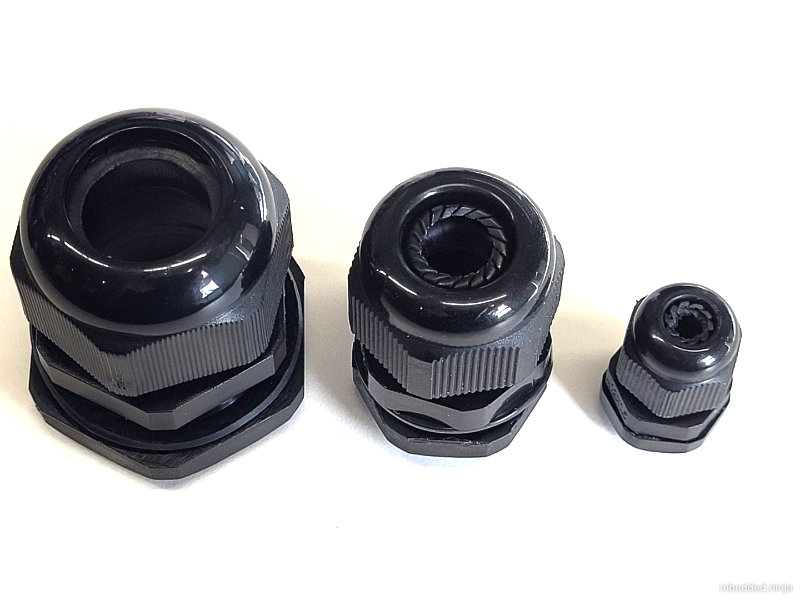
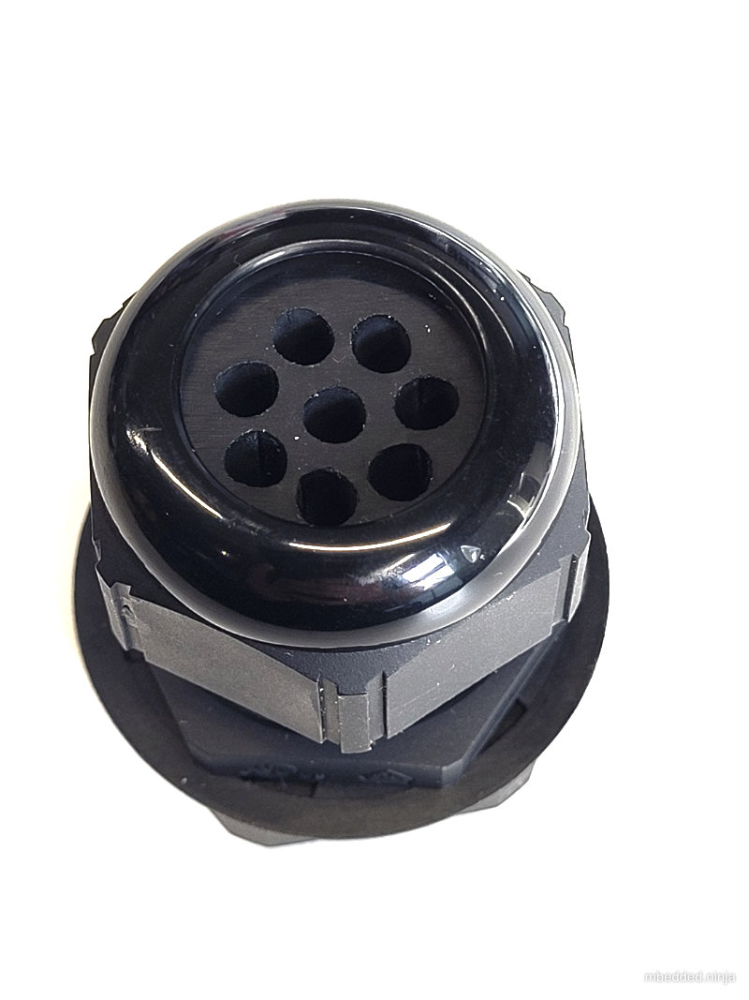
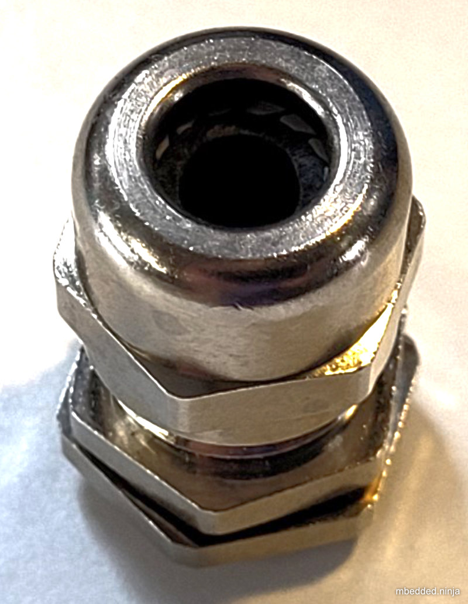

## Overview

Cables are an important design consideration for most electrical designs and installations. They typically provide power and data (although wireless transmission is becoming more common for data transmission) to and between electronic

## Insulation Materials And Their Properties

|===
| Common Name | Material | Temperature Range | Features

| ETFE
| Ethylene tetraflouroethylene
| -70 to +150°C
a|
* Used in wire-wrap applications.

| MG
| Mica glass
| 450°C
a|
* Used in high-temperature applications
* Excellent thermal stability

| mPPE
| Modified polyphenylene ether\
| -40 to +105°C
a|
* Excellent recyclability
* Excellent abrasion and cut-through resistance
* Superior dielectric properties to PVC, allows wires to be 45% smaller in diameter and 40% lighter in weight

| PDVF
| Polyvinylidene fluoride
| -40 to +125°C
| Used in wire-wrap applications.

| PTFE
| Polytetrafluoroethylene
| -55 to +200°C
a|
* High temperature range
* Excellent chemical and solvent resistance
* Excellent electrical properties

| PVC
| Polyvinyl chloride
| -40 to +90°C
a|
* Very common, price competitive insulating material for cables.
* Does not have a large temperature range.
* See XL-PVC (cross-linked PVC) for PVC with a higher temperature resistance.

| Silicone
| Silicone
| -40 to +150°C
a|
* High-voltage capability.
* Excellent flexibility.
* Excellent dielectric strength.
* Chemical resistance to radiation, corona and ozone.

|TGGT
| Teflon-glass-glass-Teflon
| +250°C
a|
* Suitable for high-temperature applications
* Excellent chemical and solvent resistance
* Moisture resistant
* Handles repeated flexing

| XL-PVC
| Cross-linked PVC
| -55 to 105°C
a|
* Better abrasion and cut-through resistance than standard PVC
* Improved temperature resistance over standard PVC
* Used in high-density wiring

| XLPE
| Cross-linked polyethylene
| -55 to 125°C
a|
* Higher temperature rating than PVC
|===

## Standards

### NEC

The _National Electrical Code_ (NEC) is an American standards body which defines a set of standards for certain types of cabling and how they should be installed and used.

NEC _types_ are acronyms consisting of a prefix describing **cable type** (e.g. coax, CATV, fibre optic) and a suffix indicating the type of flame test it has passed and where it can be installed.

.A summary of the cable types and flame tests from NEC. Image from http://www.associatedtelephone.com/.
image::nec-2005-cable-standards-reference-cable-type-and-fire-resistance-summary.png[width=790px]

## Computer Cable

Computer cable can also be called "Security" or "Alarm" cable.

### AWM

Underwriters Laboratories categorises some computer cable as _appliance wiring material_ (AWM). It has become an industry standard. There are 5 different style numbers.

AWM cable is designed for the internal wiring of factory-assembled, "listed" appliances such as computers, white-wear, and industrial equipment.

### UL2464

UL2464 is a loose standard defining some of the properties of computer cable, maintained by Underwriters Laboratories.

Reference standard: UL Subject 758, UL 1581 & CSA C22.2 No.210.2.

* Stranded, bare or tinned copper conductor
* Colour-coded SR-PVC insulation
* Cores cabled under aluminum mylar shield
* Tinned or bare copper stranded drain wire
* Tinned or bare copper wire braid shield up to 95% coverage
* Lead free PVC jacket
* Passes UL VW-1SC & CSA FT1 vertical flame test

Features Specifications: UL2464 Double Shielded Computer Cables

* Rated temperature: 80°C
* Rated voltage: 300V

Reference standard: UL Subject 758, UL 1581 & CSA C22.2 No.210.2

* Stranded, bare or tinned copper conductor
* Colour-coded SR-PVC insulation
* Cores cabled under aluminum mylar shield
* Tinned or bare copper stranded drain wire
* Tinned or bare copper wire braid shield up to 95% coverage
* Lead free PVC jacket
* Passes UL VW-1SC & CSA FT1 vertical flame test

Common Colours In UL2464 Cable:

* Black
* Brown
* Red
* Orange
* Yellow
* Green
* Blue
* Purple
* Gray
* White
* Pink
* Light Green
* Black-White

Common Colours For 12 Core Cable:

* Black
* Yellow
* Red
* Blue
* Green
* Yellow
* White
* Brown
* Violet
* Orange
* Pink
* Light Green
* Grey

## Combined Power/Data Cable

Combined power/data cable refers to cable which makes special provision for carrying both moderate/large amounts of power and data through the same cable. All cables can carry "power" and data, but this category refers to two specific cases:

* The cable contains cores of different gauges, with the large gauge for carrying moderate to large amounts of power, and the smaller gauge for data.
* The cable contains both shielded, twisted pairs and non-shielded, non-twisted power cores.

Some examples of combined power/data cables include:

* Lapp UNITRONIC BUS PB COMBI 7-W cable. It contains 3x 1.0mm2 power cores and 1x2x0.64mm2 twisted pair core for data. The twisted pair is individually shielded (to protect it from noise on the power cores), and the whole cable is also shielded.

## Mutual Capacitance

For cables with screening, typically a conductor-to-conductor and conductor-to-screen capacitance is given. The conductor-to-conductor capacitance is typically 80-140nF and the conductor-to-screen capacitance is typically 100-180nF (slightly higher than the conductor-to-conductor capacitance). 

## Screens

Cables (or specific cores within a cable) may be _screened_ (a.k.a. _shielded_) to prevent electromagnetic radiation from both entering and exiting the cores within the cable. There are two primary ways to screen a cable:

* **Copper braid**: Braided strands of copper (or other conductive material, such as Aluminium) form the Faraday cage.
* **Copper foil**: A continuous flexible, thin sheet of copper of other conductive material is wrapped around the cables to form the Faraday cage.

The shield must be grounded (with respect to the signals/EMI) to be effective.

## Cable Glands

Cable glands are strain-relief and weather-proofing glands which allow cables to be passed through enclosure walls.

.Three sizes of cable gland.

.A single large cable gland which contains a grommet which allows 8 cables to pass through.

.Metal cable glands are available if you need stronger support. Note however metal is not strictly better...plastic is better for chemical/corrosion resistance!

[bibliography]
## References

* n/a