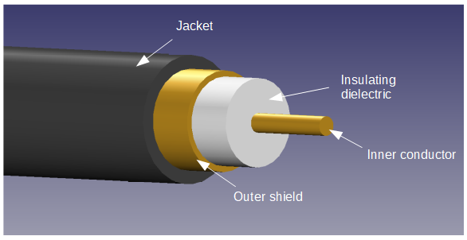

## Coaxial Cable

_Coaxial cable_ (or just _coax cable_) is a type of cable consisting of single core surrounded by a circular outer shield, with a insulating dielectric sandwiched between the two. The term _coaxial_ comes from the inner conductor and outer shield sharing the same axis (they are concentric with one another). Coax is most commonly used to transmit high frequency signals over small (oscilloscope probes) and large distances (transatlantic phone cables).

.The make-up of a standard coaxial cable. Relative dimensions accurate for RG-6 (dimensions taken from http://www.farnell.com/datasheets/1697593.pdf).

RG-6 is one of the most common types of coaxial cable in residual homes due to it's use with TVs.

Properties of popular coaxial cable types:

|===
| Name                          | stem:[Z_C]                | Conductor Diameter | Insulator Diameter | Shield Outer Diameter | Jacket Outer Diameter | Capacitance

| RG-6
| stem:[75\Omega]<<wp-rg-6>>
| 1.0mm
| 4.57mm
| 5.2mm
| 6.6mm
| 68pF/m<<wp-rg-6>>

| RG-58
| stem:[50\Omega]
|
|
|
| 5.0mm
| 82pF/m<<wp-rg-58>>

| RG-59
| stem:[75\Omega]<<wp-rg-58>>
|
|
|
|
|

|===

Properties of popular coaxial cable dielectrics<<rf-cafe-coax-chart>>:

|===
| Name                         | Propagation Velocity

| Solid Polyethylene (PE)      | 0.659c
| Foam Polyethylene (FE)       | 0.800c
| Foam Polystyrene (FS)        | 0.910c
| Air Space Polyethylene (ASP) | 0.840-0.880c
| Solid Teflon (ST)            | 0.694c
| Air Space Teflon (AST)       | 0.850-0.900c
|===

[.text-center]
where stem:[c=3e8ms^{-1}] is the speed of light in a vacuum.

### Precision Capacitors From Coaxial Cable

Coax cable has a capacitance of approx. 1pF/10mm, as measured between the central conductor and the outer shield. Precision capacitors for prototype/lab use can be from trimmed lengths of coax. cable.

[bibliography]
## References

* [[[pro-power-coaxial-rg6, 1]]]: Pro-Power. _Cable Coaxial RG6 (datasheet)_. Retrieved 2021-05-04, from http://www.farnell.com/datasheets/1697593.pdf.
* [[[rf-cafe-coax-chart, 2]]]: RF Cafe. _Coaxial Cable Specifications_. Retrieved 2021-05-05, from https://www.rfcafe.com/references/electrical/coax-chart.htm.
* [[[wp-rg-58, 3]]] Wikipedia (2020, Dec 19). _RG-58_. Retrieved 2022-01-31, from https://en.wikipedia.org/wiki/RG-58.
* [[[wp-rg-6, 4]]] Wikipedia (2021, Sep 7). _RG-6_. Retrieved 2022-01-31, from https://en.wikipedia.org/wiki/RG-6.
