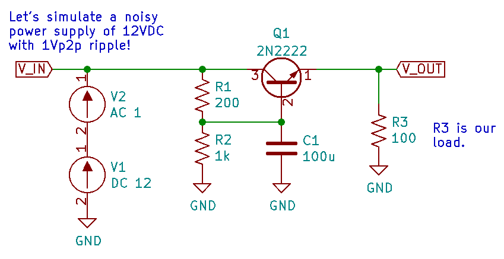
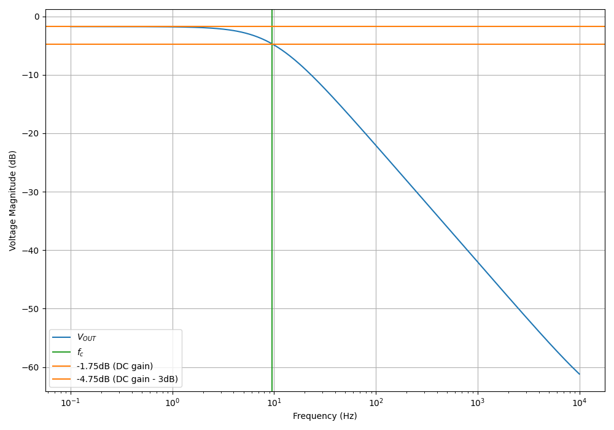

:toc:
:xrefstyle: short
:stem: latexmath
:sectnums:

== Overview

Capacitors are a passive electronic component that stores charge between two conductive surfaces. The conductive surfaces (plates) are usually very close together, with a dielectric in-between, to maximize the capacitance for a given size. They are a popular component, that along with resistors, make up the two most commonly used components on a circuit board. They come in a large range of sizes, from water tank sized caps to small SMD capacitors and capacitors formed from tracks on PCBs.

**The mechanical equivalent of a capacitor is a spring**. The larger the capacitance, the stronger the spring. This is using the link:http://lpsa.swarthmore.edu/Analogs/ElectricalMechanicalAnalogs.html[force-voltage] mechanical equivalent.

== Schematic Symbols

[#img-capacitor-schematic-symbol-unpolarized] 
.Schematic symbol for a basic unpolarized capacitor.
image::capacitor-schematic-symbol-unpolarized.svg[width=200]

[#img-capacitor-schematic-symbol-polarized] 
.Schematic symbol for a basic polarized capacitor.
image::capacitor-schematic-symbol-polarized.svg[width=200]

[#img-capacitor-schematic-symbol-variable] 
.Schematic symbol for a variable capacitor.
image::capacitor-schematic-symbol-variable.svg[width=200]

These symbols only cover the main types you will see in schematics. There are other symbols for speciality capacitors such as link:#_feedthrough_capacitors[feedthrough capacitors] and trimming capacitors.

== Uses

Some of the well-known uses for capacitors are:

* Analog filtering
* Energy storage (supercapacitors)
* Charge pumps (voltage boosting, or a bootstrap capacitor)
* High power energy supplies (e.g. for powering coil and rail guns)
* Oscillators (along with resistors and/or inductors)
* Touch/proximity sensors and screens
* Distance measurement (e.g. the technique used in digital callipers)

A **feedforward capacitor** is the name given to capacitor between the VOUT and ADJ pins of a linear regulator to improve stability.

== Types

=== Ceramic

* Range: 1pF - 100uF
* Polarized: No
* Typical Markings: For large ceramics, the value in pF with multiplier (similar to resistors). No markings on small ceramic chip capacitors.
* Uses:
** General purpose (they are cheap)
** RF circuits
** Filter circuits

Ceramic capacitors are named after the tiny disc of ceramic material they use for their dielectric. Values above 1nF are usually made from stacked ceramic plates and are called 'multilayer monolithics'.

Ceramic capacitors can generate audible noise when operated at certain frequencies. This is due to the electrostrictive (not piezo-electric, as many people suggest) effect of the internal dielectric materials in a monolithic ceramic capacitor. This causes the capacitor to mechanically vibrate (the movement is in the order of 1pm-1nm), which creates acoustic noise. This noise can commonly be heard in switch-mode power supplies and other high-frequency switching devices. Tantalum and electrolytic capacitors do not exhibit this effect, and can be used as a replacement when this noise is undesirable.

[#img-murata-deformation-of-pcb-by-electrostrictive-phenomenon] 
.The deformation of a PCB due to the electrostrictive phenomenon in ceramic chip capacitors. Image from http://www.murata.com/products/capacitor/solution/naki.html.
image::murata-deformation-of-pcb-by-electrostrictive-phenomenon.jpg[width=450]

**Ceramic Di-electrics**

Ceramic capacitors are made from two broad categories of dielectric, _Class 1_ ceramic capacitors have high stability and low losses, suitable for resonant circuit applications. _Class 2_ ceramic capacitors have high volumetric efficiency (more capacitance for the same size!) and are suitable for buffer, by-pass and coupling applications in where the exact capacitance value is usually not so critical.

When talking about the high stability of _Class 1_ ceramic capacitors, we are usually referring to the stability of the capacitance over:

* The operating temperature
* DC operating voltage range (remember, the capacitance changes as the DC voltage across the capacitor changes!)
* The life of the capacitor

The following table lists the common ceramic dielectric codes. 

Class 1:

Class 1 capacitors are specified by the following EIA dielectric codes<<ceramic-dielectric-types>>:

++++
<table class="small">
  <thead>
    <tr>
      <th colspan=2>1ST CHARACTER</th>
      <th colspan=2>2ND CHARACTER</th>
      <th colspan=2>3RD CHARACTER</th>
    </tr>
    <tr>
      <th>Letter</th>
      <th>Significant Figures</th>
      <th>Digit</th>
      <th>Multiplier (10^X)</th>
      <th>Letter</th>
      <th>Tolerance (ppm/°C)</th>
    </tr>
  </thead>
  <tbody>
    <tr>  <td>C</td>  <td>0.0</td>    <td>0</td>  <td>-1</td>     <td>G</td>  <td>±30</td>    </tr>
    <tr>  <td>B</td>  <td>0.3</td>    <td>1</td>  <td>-10</td>    <td>H</td>  <td>±60</td>    </tr>
    <tr>  <td>L</td>  <td>0.8</td>    <td>2</td>  <td>-100</td>   <td>J</td>  <td>±120</td>   </tr>
    <tr>  <td>A</td>  <td>0.9</td>    <td>3</td>  <td>-1000</td>  <td>K</td>  <td>±250</td>   </tr>
    <tr>  <td>M</td>  <td>1.0</td>    <td>4</td>  <td>+1</td>     <td>L</td>  <td>±500</td>   </tr>
    <tr>  <td>P</td>  <td>1.5</td>    <td>6</td>  <td>+10</td>    <td>M</td>  <td>±1000</td>  </tr>
    <tr>  <td>R</td>  <td>2.2</td>    <td>7</td>  <td>+100</td>   <td>N</td>  <td>±2500</td>  </tr>
    <tr>  <td>S</td>  <td>3.3</td>    <td>8</td>  <td>+1000</td>  <td></td>   <td></td>       </tr>
    <tr>  <td>T</td>  <td>4.7</td>    <td></td>   <td></td>       <td></td>   <td></td>       </tr>
    <tr>  <td>V</td>  <td>5.6</td>    <td></td>   <td></td>       <td></td>   <td></td>       </tr>
    <tr>  <td>U</td>  <td>7.5</td>    <td></td>   <td></td>       <td></td>   <td></td>       </tr>
  </tbody>
</table>
++++

_Significant Figures_ refers to the significant figure of the change in capacitance with temperature, in `ppm/°C`. The multiplier digit `5` is intentionally excluded (although I don't know why!).

`NP0` is used to refer to the same material as `C0G`, and so they are the same thing. Some manufacturers use them interchangeably to refer to them together as `C0G/NP0`. `NP0` stands for "negative positive 0" and refers to the capacitance not have a positive or negative change with respect to temperature.

[#img-c0g-np0-capacitor-temp-coeff-grouping-digikey] 
.DigiKey, like many other suppliers, groups together C0G and NP0 as one temperature coefficient. Screenshot from https://www.digikey.com/product-detail/en/tdk-corporation/CGA4C2C0G1H392J060AA/445-6942-1-ND/2672960.
image::c0g-np0-capacitor-temp-coeff-grouping-digikey.png[width=500]

Class 2:

The following are based on the EIA RS-198 standard.

++++
<table class="small">
  <thead>
    <tr>
      <th>First Character (lower temperature letter)</th>
      <th>Second Character (upper temperature letter)</th>
      <th>Third Character (change in capacitance over temperature)</th>
    </tr>
  </thead>
  <tbody>
    <tr>
      <td>X = -55°C (-67°F)</td>
      <td>4 = +65°C (+149°F)</td>
      <td>P = ±10%</td>
    </tr>
    <tr>
      <td>Y = -30°C (-22°F)</td>
      <td>5 = +85°C (185°F)</td>
      <td>R = ±15%</td>
    </tr>
    <tr>
      <td>Z = +10°C (+50°F)</td>
      <td>6 = +105°C (221°F)</td>
      <td>S = ±22%</td>
    </tr>
    <tr>
      <td></td>
      <td>7 = +125°C (257°F)</td>
      <td>T = +22/-33%</td>
    </tr>
    <tr>
      <td></td>
      <td>8 = +150°C (302°F)</td>
      <td>U = +22/-56%</td>
    </tr>
    <tr>
      <td></td>
      <td>9 = +200°C (392°F)</td>
      <td>V = +22/-82%</td>
    </tr>
  </tbody>
</table>
++++

The most common codes from the above table are `X5R`, `X7R`, `Y5V` and `Z5U`.

The following table lists the class 2 codes defined by the JIS standard.

++++
<table>
  <thead>
    <tr>
      <th>Standard</th>
      <th>Symbol</th>
      <th>Temperature Range</th>
      <th>Capacitance Tolerance</th>
    </tr>
    </thead>
  <tbody>
    <tr>
      <td>JIS</td>
      <td>JB</td>
      <td>-25°C to +85°C</td>
      <td>±10%</td>
    </tr>
  </tbody>
</table>
++++

There is also the two codes JB (which is similar to `X5R`) and CH (which is similar to `C0G`) produced by TDK. They are similar to the codes mentioned except optimised for a smaller temperature range.

==== Insulation Resistance

The link:#_leakage_currents[insulation resistance] limits for military MLCCs are:

* IR > stem:[ 10^{11}\Omega ] or stem:[ 10^3 M\Omega \cdot uF ], whichever is less, at stem:[ +25^{\circ}C ].
* IR > stem:[ 10^{10}\Omega ] or stem:[ 10^2 M\Omega \cdot uF ], whichever is less, at stem:[ +125^{\circ}C ].

IR requirements for commercial MLCCs are about two times less.

#### Singing Capacitors (Audible Noise)

Sometimes you will hear ceramic capacitors make audible noise! This audible noise is caused due the piezoelectric effect which physically vibrates the capacitor, and can occur in ceramic capacitors which are ferroelectric. Both _Class II_ and _Class III_ ceramic capacitors are ferroelectric, and are susceptible to this problem. However, _Class I_ (e.g. `C0G/NP0`) capacitors are immune<<tdk-singing-capacitors>>.

_Class II_ and _Class III_ capacitors are most likely to "sing" when the capacitor is subject to large current/voltage ripple.

#### Flexibility

Ceramic capacitors are sometimes tested and rated to be able to withstand a minimum _bending flex_. One example is the link:https://content.kemet.com/datasheets/KEM_X7R_FT_VW_AUDI.pdf[Kemet VW80808 (FT-CAP)] range of ceramic capacitors which can withstand 5mm bending flex. These are aimed towards automotive use (but not exclusive to). The large bending flex specification is achieved by designing flexible termination caps at each end of the capacitor, which stops the transfer of stress from the PCB to the fragile ceramic capacitor body.

### Electrolytic

++++
<table>
  <tbody>
    <tr>
      <td>Range</td>
      <td>100nF - 5000uF</td>
    </tr>
    <tr>
      <td>Polarized</td>
      <td>Yes (but some special ones aren't)</td>
    </tr>
    <tr>
      <td>Typical Marking</td>
      <td>Because of their large size, the capacitance is usually printed in it's absolute form on the cylinder.</td>
    </tr>
    <tr>
      <td>Uses</td>
      <td>
        <ul>
          <li>Power supply bulk decoupling</li>
          <li>Filtering</li>
          <li>Audio bypass capacitors</li>
        </ul>
      </td>
    </tr>
  </tbody>
</table>
++++

Electrolytic capacitors uses a very thin electrically deposited metal oxide film (stem:[Al_2 O_3]) as their dielectric. They have a high capacitance density (well, that was before super-caps came along). They are usually cylindrical in shape, and come in through-hole (axial and radial) and surface-mount types.

In over-voltage conditions, holes can be punched through the dielectric layer and the capacitor will begin to conduct. The good news is that if the over-voltage disappears quickly enough (e.g. just a surge or spike), the capacitor can self-heal. The bad news is that a if the capacitor heats up enough, the dielectric can boil, create vapours, and the cap explodes. Most electrolytics have a specific "weak spot" on the case which is designed to break in an over-pressure situation. This can make quite a bang, and can be dangerous if you happen to be peering closely at the circuit while this happened.

The common size codes and sizes of SMD Electrolytic capacitors, see the link:/pcb-design/component-packages/smd-electrolytic-capacitor-packages[SMD Electrolytic Capacitor Packages page].

### Tantalum

++++
<table>
  <tbody>
    <tr>
      <td>Range</td>
      <td>100nF-2mF (from 47nF to 10mF on DigiKey as of Jan 2014)</td>
    </tr>
    <tr>
      <td>Polarized</td>
      <td>Yes (mark indicates POSITIVE side)</td>
    </tr>
    <tr>
      <td>Typical Marking</td>
      <td>Capacitance is usually printed directly onto capacitor</td>
    </tr>
    <tr>
      <td>Uses</td>
      <td>
        <ul>
          <li>Power supply filtering on small PCBs</li>
          <li>Medical and space equipment</li>
        </ul>
      </td>
    </tr>
  </tbody>
</table>
++++

Tantalum capacitors are actually special type of electrolytic capacitor. But they deserve their own category because of their special properties and wide-spread use. The have lower ESR, lower leakage and higher temperature ranges (up to 125°C) than their electrolytic counterparts.

[#img-container-of-th-tantalum-caps] 
.Through-hole tantalum capacitors.
image::container-of-th-tantalum-caps.jpg[width=700]

Most tantalum capacitors are made with a solid electrolyte, and therefore are not prone to the electrolyte evaporation/drying up problems normal electrolytics have. This makes them able to retain their rated capacitance for years, if not decades.

==== Construction

At the heart of a tantalum capacitor is a pellet of tantalum (stem:[Ta_2 O_5]).

[#img-cross-section-of-tantalum-capacitor] 
.Cross-section of a SMD tantalum capacitor.
image::cross-section-of-tantalum-capacitor.png[width=500]

==== Packaging

Tantalum capacitors come in both through-hole and SMD packages.

==== Price

Tantalum capacitors tend to be more expensive than any other commonly used capacitor (electrolytic, ceramic), and so are usually reserved for applications when a large amount of capacitance with low ESR is needed in a tight space.

==== Issues

The SILLIEST THING about tantalum capacitors is that the polarity indicator is a stripe, next to the POSITIVE end. It goes against pretty much all other stripy-polarity-mark thingies, which all indicate which end is the negative end (think electrolytics, diodes, e.t.c). So, be very careful and vigilant when using these, for it is so easy for forget this rule!

Tantalum capacitors are more susceptible to reverse and over-voltage than their electrolytic counterparts. At a high enough voltage, the dielectric breaks down and the capacitor begins to conduct. The current can generate plenty of heat, and here's the best part, it can start of a **mini-thermite** reaction between tantalum and manganese dioxide. Some slightly better news to offset this is that at low-energy breakdowns, tantalum capacitors can actually **self-heal** and stop the leakage current.

Because of their large operating temperature range, stability, and high price, they are often found in medical and space equipment.

### Film Capacitors

|===
| Parameter | Value

| Synonyms/Subfamilies
a| 
* MKT
* MFCs (metallized film capacitors)
* MPFCs (metallized polyester film capacitors)
* Power (film) capacitor
  
| Range
| 1nF - 10uF

| Polarized
| No

| Dielectric
| Polyester, Polycarbonate

| Typical Marking
| Because of their large size, the capacitance is usually either in `<number><number><multiplier><tolerance>` picofarad form (e.g. `105K` equals `10e^5pF` equals `1uF`), or because of their large size printed in it's absolute form (e.g. `0.1uF`) on the block somewhere.

| Uses
a|
* Power supplies
* Audio circuits
|===

Film capacitors are a family of capacitors which use thin insulating plastic film as the dielectric<<wikipedia-film-capacitor>>. They are not polarity sensitive. The film can either be **left as is** or **metallized**, which makes it a metallized film capacitor<<capacitorguide.com>>.

How do you identify film capacitors? Film capacitors usually come in the following forms:

. A potted rectangular block with the two leads typically coming out of the same side (radial). Typical colors are yellow, blue, or white.
+
[cols="1,1"]
|===
a|
.A yellow potted film capacitor. Image from alibaba.com.
image::yellow-potted-film-capacitor-alibaba.png[width=200]
a|
.A blue potted film capacitor from Hitano.
image::blue-potted-film-capacitor-hitano.png[width=200]
|===

. A rounded, red case that has been coasted in a epoxy lacquer, with the leads typically coming out of the same side.
+
.A red radial film capacitor (Panasonic ECQ-P1H822GZ3). Image from digikey.com.
image::red-radial-film-capacitor-photo-ecq-p1h822gz3-digikey.png[width=300]

**Metallized Polyester Film Capacitors**

_Metallized polyester film capacitors_ (MFCs) are used when long-term stability is required at a relatively low cost. They are usually recognized by their appearance of a bright yellow, rectangular block.

Metallized film capacitors have a self-healing effect when an over-voltage even occurs, while others such as ceramic capacitors do not. This makes them safer to use in high-power applications.

.A broken 1uF (marking 105K) 250VAC metallized film capacitor (red bulge with cracks in it) I found inside my mum's paper shredder.

=== Polyester (Green Cap)

++++
<table>
<tbody >
<tr>
<td>Range</td>
<td>1nF - 10uF</td>
</tr>
<tr>
<td>Polarized</td>
<td>No</td>
</tr>
<tr>
<td>Dielectric</td>
<td>Polyester, Polycarbonate</td>
</tr>
<tr>
<td>Typical Marking</td>
<td>Value in pF with multiplier (similar to resistors)</td>
</tr>
<tr>
<td>Uses</td>
<td>General circuits</td>
</tr>
</tbody>
</table>
++++

Polyester capacitors use polyester plastic film for their dielectric. They have similar properties to disc ceramic capacitors. They are sometimes called green caps because they have a green outer plastic coating to protect them. The problem with that is that not all polyesters are green! Quite a few are brown, among other colours.

=== Supercapacitors

++++
<table>
<tbody>
<tr>
<td>Range</td>
<td>10mF-1000F
</td>
</tr>
<tr>
<td>Polarized</td>
<td>Yes (mark indicates negative side)</td>
</tr>
<tr>
<td>Typical Marking</td>
<td>Capacitance is usually printed directly onto capacitor</td>
</tr>
<tr>
<td>Uses</td>
<td>
<ul>
    <li>Filtering of low frequency voltage ripple, usually due to large and low-frequency pulse currents.</li>
    <li>As an energy storage alternative to a battery</li>
    <li>To be hooked up in parallel with batteries to provide good pulse-current capabilities to battery chemistries which typically lack in that regard (i.e. those which have a large internal resistance,). This is a common practice with lithium thionyl chloride batteries.</li>
    <li>To provide extra support for bass in audio systems (essentially providing a low-source impedance energy source for when the bass goes boom)</li>
</ul>
</td>
</tr>
</tbody>
</table>
++++

Supercapacitors are actually a special type of electrolytic capacitor.

They typically range from 10mF up to 1000F (in a single capacitor). Stacks of these capacitors can produce capacitances as high as your imagination.

You have to be careful, the leakage current of large supercapacitors (10F and greater) can be quite high (100's uA or mA's!). Even worse, some datasheets don't even mention the leakage current! The ESR of a supercapacitor usually decreases with increasing capacitance.

Through-hole and SMD super capacitor packages exist.

### Door Knob Capacitors

Door knob (or barrel) capacitors are a form of ceramic capacitor named after their look-alike appearance to a door knob. They are usually rated for high voltages (kV's), and used in RF applications. They hav a low dielectric loss and linear temperature co-efficient of capacitance. They are typically used in the frequency range from 50kHz-100MHz.

.Ceramic, high-voltage 'door-knob' capacitors. Image from www.trademe.co.nz.
image::door-knob-capacitors.jpg[width=600]

## Dielectric Constants Of Common Materials

Sorted by alphabetic order.

++++
<table>
    <thead>
        <tr>
            <th>Material</th>
            <th>Dielectic Constant (value or range, no unit)</th>
            <th>Notes</th>
        </tr>
    </thead>
<tbody >
<tr >
<td >Air</td>
<td >1</td>
<td >See below for data on how temperature, humidity, and pressure influences the dielectric of air.</td>
</tr>
<tr >
<td >Bakelite</td>
<td >4.4-5.4</td>
<td ></td>
</tr>
<tr >
<td >Ethanol</td>
<td >24</td>
<td ></td>
</tr>
<tr >
<td >Formica</td>
<td >4.6-4.9</td>
<td > </td>
</tr>
<tr >
<td >Glass</td>
<td >7.6-8.0</td>
<td >This is common window glass</td>
</tr>
<tr >
<td >Mica</td>
<td >5.4</td>
<td ></td>
</tr>
<tr >
<td >Mylar</td>
<td >3.2</td>
<td></td>
</tr>
<tr >
<td >Paper</td>
<td >3.0</td>
<td></td>
</tr>
<tr >
<td >Paraffin</td>
<td >2.1</td>
<td ></td>
</tr>
<tr >
<td >Plexiglass</td>
<td >2.8</td>
<td ></td>
</tr>
<tr >
<td >Polyethylene</td>
<td >2.3</td>
<td ></td>
</tr>
<tr >
<td >Polystyrene</td>
<td >2.6</td>
<td ></td>
</tr>
<tr >
<td >Porcelain</td>
<td >5.1-5.9</td>
<td ></td>
</tr>
<tr >
<td >Quartz</td>
<td >3.8</td>
<td ></td>
</tr>
<tr >
<td >Rubber</td>
<td >2.8</td>
<td >Hard rubber</td>
</tr>
<tr >
<td >Teflon</td>
<td >2.1</td>
<td ></td>
</tr>
<tr >
<td >Vacuum</td>
<td >1.0</td>
<td ></td>
</tr>
<tr >
<td >Vinyl</td>
<td >2.8-4.5</td>
<td ></td>
</tr>
<tr >
<td >Water</td>
<td >76.5-80</td>
<td >Distilled water</td>
</tr>
</tbody>
</table>
++++

== The Dielectric Of Air

The dielectric of air changes with humidity, pressure and temperature.

++++
<table><tbody ><tr >
<td >Temperature
</td>
<td >5ppm/C
</td></tr><tr >
<td >Relative Humidity
</td>
<td >1.4ppm/%RH
</td></tr><tr >
<td >Pressure
</td>
<td >100ppm/atm
</td></tr></tbody></table>
++++

== Capacitors In Series And In Parallel

The behaviour of capacitors when connected together in series and in parallel is exactly the opposite behaviour of what resistors and inductors exhibit.

=== Capacitors In Parallel

Capacitors in parallel can be treated as one capacitor with the equivalent capacitance of:

[stem]
++++
C_{total} = C1 + C2
++++

That is, in parallel, *the total equivalent capacitance is the sum of the individual capacitances*. This is shown in the below diagram.

.Diagram showing the resulting capacitance from two capacitors in parallel.
image::capacitor-equivalence-in-parallel-with-equation.png[width=600]

*Connecting capacitors in parallel increases the capacitance.* Parallel-connected capacitors occurs everywhere in circuit design. A classic example is bulk decoupling for a switch-mode power supply, which will typically have more than one large capacitor connected in parallel on the input.

One of the benefits of connecting many capacitors in parallel rather than using one large capacitor is that you will usually get a lower ESR (equivalent series resistance).

=== Capacitors In Series

Capacitors in series with each other can be treated as one capacitor with a capacitance:

[stem]
++++
C_{total} = \frac{1}{\frac{1}{C1} + \frac{1}{C2}}
++++

It is usually easier to remember this equation as:

[stem]
++++
\frac{1}{C_{total}} = \frac{1}{C1} + \frac{1}{C2}
++++

This is shown in the following diagram.

.Diagram showing the equivalent capacitance from two capacitors connected in series.
image::capacitor-equivalence-in-series-with-equation.png[width=600]

Notice how the total equivalent capacitance is less than any one capacitor in the series string. *Connecting capacitors in series reduces the capacitance*.

One of the benefits of connecting capacitors in series is that each capacitor only sees a portion of the total applied voltage, hence you can apply a higher voltage than the max rated voltage for any single capacitor. However, care must be taken to make sure the capacitors don't build up a *charge imbalance*, which could cause a single capacitor to take more than it's fair share of voltage, and blow up! A balancing circuit can be made by connecting a high-value resistor(e.g. stem:[1M\Omega]) across each capacitor. This causes any unbalanced build-up of charge to dissipate through the resistors, at the expense of increasing the leakage current of the circuit (remember, capacitors have an internal leakage current also). This is similar to how a battery cell charge balancing circuit works.

== Formulas

=== Charge

The charge stored on the plates of a capacitor is related to the voltage and capacitance by:

[stem]
++++
Q = CV
++++

[.text-center]
where: +
stem:[Q] = charge stored in plates (Coulombs) +
stem:[C] = capacitance (Farads) +
stem:[V] = voltage (Volts)

If using this formula, see the Capacitor Charge Calculator.

=== Energy

The energy stored in a capacitor is:

[stem]
++++
E = \frac{1}{2}CV^2
++++

[.text-center]
where: +
stem:[E] = energy stored in the capacitor (Joules) +
stem:[C] = capacitance (Farads) +
stem:[V] = voltage across the capacitor (Volts)

As shown by the equation, the energy stored in a capacitor is related to both the capacitance and voltage of the capacitor. A typical 100nF, 6.5V capacitor can store 2.11uJ. Not much huh! If you are really considering capacitors for their energy storage capabilities, you must look at supercapacitors, which have typical values of 100F and 2.5V (as of 2011). This gives 313J of energy, which is useful amount for powering something.

If using this formula, see the Capacitor Energy Calculator.

=== Force

The force exerted on the two parallel plates of a capacitor is:

[stem]
++++
F = \frac{\epsilon_0 AV^2}{2d^2}
++++

[.text-center]
where: +
stem:[F] = outwards force exerted on each parallel plate of the capacitor, in Newtons +
stem:[\epsilon_0] = the permittivity of free space +
stem:[A] = overlapping area of the two plates, in meters squared +
stem:[V] = voltage across the capacitor, in Volts +
stem:[d] = separation distance between the two plates, in meters

=== Single Disc Capacitance

.Diagram for the disc-to-infinity capacitance equation. Image from http://www.capsense.com/capsense-wp.pdf.
image::diagram-for-disc-capacitance-equation.png[width=320]

The capacitance of a single thin plate, with  a ground at 'infinity' (or more practically, just very far away) is:

[stem]
++++
C = 35.4 \times 10^{-12} \epsilon_r d
++++

[.text-center]
where: +
stem:[C] = capacitance (Farads) +
stem:[\epsilon_r] = relative dielectric constant (1 for a vacuum) +
stem:[d] = diameter of the thin plate (meters)

=== Sphere Capacitance

.Diagram for the sphere-to-infinity capacitance equation. Image from http://www.capsense.com/capsense-wp.pdf.
image::diagram-for-sphere-capacitance-equation.png[width=320]

The capacitance of a single sphere, again, with a ground at infinity is:

[stem]
++++
C = 55.6 \times 10^{-12} \epsilon_r d
++++

[.text-center]
where: +
stem:[C] = capacitance (Farads) +
stem:[\epsilon_r] = relative dielectric constant (1 for a vacuum) +
stem:[r] = radius of sphere (meters)

=== Parallel Plate Capacitance

The capacitance of two parallel plates is approximately

[stem]
++++
C = \epsilon_r \epsilon_o\frac{A}{d}
++++

[.text-center]
where: +
stem:[\epsilon_o] = electric constant (stem:[8.854 \times 10^{-12}Fm^{-1}]) +
stem:[\epsilon_r] = dielectric constant of the material between the plates (no unit) +
stem:[A] = overlapping surface area of the parallel plates (meters squared) +
stem:[d] = distance between the plates (meters)

=== Concentric Cylinder Capacitance

.Diagram for the coaxial cylinder capacitance equation. Image from http://www.capsense.com/capsense-wp.pdf.
image::diagram-for-coaxial-cylinders-capacitance-equation.png[width=320]

The capacitance of two concentric cylinders as shown in the diagram above is:

[stem]
++++
\frac{2 \pi \epsilon_o \epsilon_r}{\ln (\frac{b}{a})} L
++++

[.text-center]
where: +
stem:[a] = radius of inner cylinder (meters) +
stem:[b] = radius of outer cylinder (meters) +
stem:[L] = length of both cylinders (meters) +
and all other variables as previously mentioned

== Equivalent Series Resistance (ESR)

Ceramic SMD capacitors have very low ESRs. In fact, in certain applications, this can be a bad thing (such as the input/output stabilization capacitors for linear regulators and DC/DC converters), and either tantalums are used or resistance has to be added in series with the capacitor. Since usually only milli-Ohms is required, this can be done with an appropriately sized PCB track which is usually snaked to the capacitor terminal.

Electrolytic capacitors typically have a large ESR (there are special low-ESR types, but they still don't compare to ceramic caps).

++++
<table>
    <thead>
        <tr>
            <th>Capacitor Type</th>
            <th>Typical ESR (at 1kHz)</th>
        </tr>
    </thead>
<tbody >
<tr >
<td >Super-cap (1-100F)</td>
<td >4-0.1Ω</td>
</tr>
</tbody>
</table>
++++

Since the ESR is proportional to the capacitor's plate area, for a similar capacitor designs, the ESR decreases with increasing capacitance.

== Leakage Currents

Leakage currents are present in all types of capacitor. Leakage current is the sum of electrical losses from energy required to build up the oxide layers, weaknesses in the dielectric, tunnel effects, and cross currents. They are typically increase proportionally to the capacitance of the capacitor. We can reduce the leakage current down to two main factors, the absorption current stem:[I_{abs}], and the intrinsic leakage current stem:[I_{il}].

[stem]
++++
I_{leakage} = I_{abs} + I_{il}
++++

Absorption currents are due to quantum tunnelling of electrons at the metal/ceramic barrier! Absorption currents, stem:[I_{abs}] reduce with time and have weak temperature dependence, while intrinsic leakage currents stem:[I_{il}] remain constant with time but exponentially increase with temperature.

Desorption currents (depolarization) flow when the voltage on a capacitor is decreased (e.g. when it is shorted). These currents can actually recharge a previously discharged capacitor, sometimes up to dangerous voltages (people experimenting with coil/rail guns can have this problem)!

Capacitors that have had a relatively constant voltage across them for a decent amount of time typically exhibit far less absorption current than one which has not been charged in the short-term past. This is due to a phenomenon called ‘self-healing’, in where a charged capacitor will heal defects in the electrolyte. Uncharged electrolytic capacitors may have weakened electrolyte due to ‘dissolution’, the destruction of the dielectric when no charge is present.

The leakage current through a capacitor can be modelled with a resistor in parallel with the actual capacitance, as shown in the image below:

.A capacitor showing the parasitic series resistance present in all real capacitors, which creates a leakage current.
image::capacitor-with-parasitic-series-resistance-leakage-current.png[width=300]

=== How Leakage Current Is Specified

For electrolytics, the maximum leakage current is usually specified in terms of the capacitance.

[stem]
++++
I_{leakage} = xC
++++

[.text-center]
where: +
stem:[ I_{leakage} ] = the leakage current, usually specified in units of mA (this is up to the manufacturer and their choice of constant) +
stem:[ x ] = a fixed constant (e.g. 0.5) +
stem:[ C ] = the capacitance of the capacitor, and again, choice of units is up to the manufacturer

TIP: When specified this way, the current is *completely independent on voltage*. The leakage current for electrolytic super-caps in the range of 1 to 100F is typically 0.5C (mA), where C is the rated capacitance in Farads.

The leakage current for MLCC capacitors is specified by an **insulation resistance**. To work out the leakage current, you just use Ohm's law as follows:

[stem]
++++
I_{leakage} = \frac{V}{R_{insulation}}
++++

[.text-center]
where: +
stem:[ V ] = the voltage across the capacitor +
stem:[ R_{insulation} ] = the insulation resistance as specified on the capacitors datasheet

TIP: When leakage current is specified this way, *it is dependent on the voltage*.

Ceramic capacitors are rated with an initial minimum insulation resistance (e.g. stem:[500M\Omega]) and then a lower minimum resistance rated over its entire life time (e.g. stem:[50M\Omega]).

=== Why Leakage Currents Are Important

Leakage current becomes an important parameter to consider when designing long-life battery powered circuits. This is especially true for circuits powered of primary batteries with high internal resistance, such as lithium thionyl chloride batteries (LiSOCl2), because large (>100uF) capacitors can be required to help provide energy during high pulse current situations. These capacitors can have significant leakage current.

=== Measuring The Leakage Current Of A Capacitor

Because of the small currents/total energy involved, you can't really measure the leakage current of a capacitor with standard multimeter. One way is to use a dedicated high-resistance meter, commonly called a megaohm meter or insulation resistance tester.

== Capacitor Voltage Dependence

Some types of capacitors have a capacitance which changes depending on the applied voltage (well, technically, all do, but I'm talking about a significant/useful change).

The good news is this can be manipulated to make things such as voltage-controlled oscillators (VCOs), in where the capacitance is part of a resonant circuit, and the resonant frequency is changed by modifying the voltage on the capacitor, hence changing the capacitance. [Diodes](/electronics/components/diodes) also offer this feature and can be used to make FM radio signals by modulating a high-frequency waveform.

The bad news is that this also adversely affects the capacitance in situations where you want it to stay constant. This can actually be a very significant problems, especially with small link:/pcb-design/component-packages/[package] size ceramic capacitors (such as 0603 and 0805 SMD chip capacitors). An excellent explanation on this effects if Maxim Integrated's link:http://www.maximintegrated.com/app-notes/index.mvp/id/5527[Temperature and Voltage Variation of Ceramic Capacitors, or Why Your 4.7uF Capacitor Becomes a 0.33uF Capacitor]. The following graph is from Maxim's page, and just serves as an example to show by how much the capacitance can vary in normal operation conditions!

.Graph of the capacitance variation (w.r.t. voltage) of a select group of 4.7uF ceramic chip capacitors, Image from http://www.maximintegrated.com/app-notes/index.mvp/id/5527.
image::graph-of-temperature-variation-of-ceramic-chip-4-7uf-capacitors.png[width=800]

This can upset op-amp gains, frequency cut-off points of filters, and the time constant of RC oscillators.

== Decoupling

Capacitors are commonly used for decoupling, as this following schematic shows (taken from the Raspberry-Pi PCB design).

.Example usage of decoupling capacitors for ICs. Schematic is from the Raspberry-Pi PCB. Image from http://www.raspberrypi.org/wp-content/uploads/2012/04/Raspberry-Pi-Schematics-R1.0.pdf.
image::decoupling-caps-schematic-example-on-r-pi-pcb.png[width=400]

== Mains Line Filters

Capacitors used on mains lines for filtering are usually rated with the "XY" scheme.

Capacitors rated with an X are deemed suitable for connecting between two main voltage AC lines (line-to-line). They pose no risk if they either fail open or closed circuit. Capacitors with a Y are deemed suitable for connecting between line and neutral. These capacitors do pose a risk if they fail closed circuit, as this would make the ground (and hence chassis) "hot".

They are also given a number to represent there impulse test rating, as shown in the table below.

++++
<table>
    <thead>
        <tr>
            <th>Classification</th>
            <th>Impulse Voltage (V)</th>
        </tr>
    </thead>
<tbody >
<tr >
<td >X1</td>
<td >4,000</td>
</tr>
<tr >
<td >X2</td>
<td >2,500</td>
</tr>
<tr >
<td >Y1</td>
<td >8,000</td>
</tr>
<tr >
<td >Y2</td>
<td >5,000</td>
</tr>
</tbody>
</table>
++++

== Dielectric Soakage

A weird and little known about property of capacitors is their ability to seemingly 'create' energy and charge themselves up when left in certain conditions. This can be particularly dangerous with high voltage capacitors such as the old oil-filled paper capacitors, which would charge themselves up and then give anyone a shock who was unfortunate enough to get too close.

It's called dielectric soakage because it's essentially a property of the dielectric which retains some of the charge if a capacitor is discharged quickly and then left open circuit. The voltage climb can be up to 10% of the original voltage on the capacitor.

== Charge Pumps (Bootstrapping)

A charge pump (also commonly called **bootstrapping**), is a way of using capacitors to generate a voltage higher than the supply. A typical charge-pump circuit has two capacitors and two diodes, and requires an oscillating input.

It is commonly used as a simple way of driving the gate of a n-doped silicon switch (such as a N-Channel MOSFET or IGBT) when being used as a high side driver. Although using a P-Channel as the high-side driver would not require this voltage step-up, N-Channel MOSFETs are preferred in most cases because of their lower on-resistance and price. When using a capacitor to charge the gate of a N-Channel MOSFET, you must make sure the capacitor stores enough charge to transfer to the MOSFET gate while raising the voltage enough drive the on-resistance as low as you need. A general rule of thumb is that the capacitor should store 100x more charge than the gate charge as stated on the MOSFETs datasheet. The charge stored in a capacitor can be calculated using the following equation:

[stem] 
++++
\begin{align}
Q = CV
\end{align}
++++

[.text-center]
where: +
stem:[Q] is the charge (Coulombs) +
stem:[C] the capacitance (Farads) +
stem:[V] the voltage (Volts)

However, if you really want to optimise the charge pump capacitor, this rule does not suffice. The Fairchild Semiconductor Application Note, link:http://www.fairchildsemi.com/an/AN/AN-6076.pdf[Design And Application Guide Of Bootstrap Circuit For High-Voltage Gate-Drive IC] has an in-depth analysis of the bootstrap capacitor and surrounding circuit.

The following circuit shows a charge pump circuit used to generate -5V from a +5V PWM signal.

.This schematic shows a charge pump circuit used to generate -5V from a +5V PWM signal.
image::charge-pump-based-negative-voltage-gen-schematic.png[width=800]

== Capacitor Packages

Through-hole capacitors can usually be used in a surface mount fashion by lying the caps down on the board, bending the legs 90 degrees, and soldering them onto pads on the PCB.

Ceramic chip capacitors usually have a three letter code which describes the max cap temp, min cap temp, and change over temperature. The following table shows what the three letter code means for "Class II" and "Class III" ceramics. This basically covers all ceramic caps except the NP0/COG capacitors which belong to Class I.

++++
<table>
    <thead>
        <tr>
            <th>1st Character</th>
            <th>Low Temp</th>
            <th>2nd Character</th>
            <th>High Temp</th>
            <th>3rd Character</th>
            <th>Change Over Temp (max)</th>
        </tr>
        <tr >CharTemp (°C)NumTemp (°C)CharChange (%)</tr>
<tbody >
<tr>
<td>Z
</td>
<td>+10
</td>
<td>2
</td>
<td>+45
</td>
<td>A
</td>
<td>±1.0
</td></tr><tr >
<td>Y
</td>
<td>-30
</td>
<td>4
</td>
<td>+65
</td>
<td>B
</td>
<td>±1.5
</td></tr><tr >
<td>X
</td>
<td>-55
</td>
<td>5
</td>
<td>+85
</td>
<td>C
</td>
<td>±2.2
</td></tr><tr >
<td>-
</td>
<td>-
</td>
<td>6
</td>
<td>+105
</td>
<td>D
</td>
<td>±3.3
</td></tr><tr >
<td>-
</td>
<td>-
</td>
<td>7
</td>
<td>+125
</td>
<td>E
</td>
<td>±4.7
</td></tr><tr >
<td>-
</td>
<td>-
</td>
<td>8
</td>
<td>+150
</td>
<td>F
</td>
<td>±7.5
</td></tr><tr >
<td>-
</td>
<td>-
</td>
<td>9
</td>
<td>+200
</td>
<td>P
</td>
<td>±10
</td></tr><tr >
<td>-
</td>
<td>-
</td>
<td>-
</td>
<td>-
</td>
<td>R
</td>
<td>±15
</td></tr><tr >
<td>-
</td>
<td>-
</td>
<td>-
</td>
<td>-
</td>
<td>S
</td>
<td>±22
</td></tr><tr >
<td>-
</td>
<td>-
</td>
<td>-
</td>
<td>-
</td>
<td>T
</td>
<td>+22, -33
</td></tr><tr >
<td>-
</td>
<td>-
</td>
<td>-
</td>
<td>-
</td>
<td>U
</td>
<td>+22, -56
</td></tr><tr >
<td>-
</td>
<td>-
</td>
<td>-
</td>
<td>-
</td>
<td>V
</td>
<td>+22, -82
</td></tr></tbody></table>
++++

== Feedthrough Capacitors

Feedthrough (or feedthru) capacitors are special three-terminal capacitors (sometimes with four connections) used for **suppression** of **RF noise**. They are also known under the more general name of an _EMI suppression filter_ or _three-terminal capacitor._



Their advantage over a standard decoupling capacitor to ground is **lower parasitic series inductance**, which offers a lower impedance path for RF noise to ground.

=== Schematic Symbol



=== Component Package

Many smaller, PCB suitable feedthrough capacitors come in {}, such as the 0603 or 0402 size. They can be distinguished from normal capacitors by the fact that the package will have three or four terminals rather than the standard two.

=== Uses

Feedthrough capacitors are commonly used in {}) when good RF performance is required.

== Capacitance Multipliers

_Capacitance multipliers_ are circuits which use an active element such as a BJT transistor to "multiply" a capacitor to create an effective capacitance which is much larger. They are useful for:

* Transformer/rectifier style DC PSU voltage rail filtering.
* Providing low-pass filtering into heavy loads, in where just a standard RC filter would suffer from too much voltage drop (or power dissipation) across the resistor.
* Power supply filtering for Class-A audio amplifiers.

What they are not good for is propping up the voltage rail when the load itself experiences a high di/dt (change in current over time). Loads that draw high peak currents include solenoids switching and H-bridges. They are not any better than a regular capacitor in this regard, as they store no more energy.

The below schematic shows a simple capacitance multiplier made from 1 resistor, 1 capacitor and 1 NPN BJT transistor:

[#img-capacitance-multiplier-single] 
.A simple capacitance multiplier consisting of a single resistor, capacitor and NPN BJT transistor. The effective capacitance is approximately the capacitance of C1 multiplied by the current gain B of the transistor.

The BJT is configured as a emitter-follower (common collector). The output voltage will always be stem:[0.7V] less than the voltage across the capacitor. When the load draws current at stem:[V_{OUT}], rather than all of that current loading the RC filter, only the proportion stem:[\frac{1}{\beta + 1}] gets drawn through the base from the RC filter, the rest of it gets delivered directly from stem:[V_{IN}] via the collector. The effective capacitance seen by the circuit is the capacitance of C1 multiplied by the current gain stem:[\beta + 1] of the transistor:

[stem]
++++
\begin{align}
\label{eq:eff-cap}
C_{eff} = (\beta + 1)\ C1
\end{align}
++++

Normally stem:[\beta >> 1] such that it's simplified to:

[stem]
++++
\begin{align}
C_{eff} = \beta\ C1
\end{align}
++++

The cut-off frequency for the capacitance multiplier is:

[stem]
++++
\begin{align}
\label{eq:cap-mult-rc-cutoff}
f_c = \frac{1}{2\pi R1 C1}
\end{align}
++++

WARNING: Even though this circuit is called a capacitance multiplier, when calculating the cutoff frequency, you must use the real capacitance value, not the effective capacitance! For this I consider this circuit's name somewhat misleading, as the corner frequency is just the same as a regular old RC low-pass filter. What does change is the current capability of the filter, as now most of the current is going through stem:[Q1], rather than stem:[R1]. Perhaps the name _buffered RC filter_ would be better than _capacitance multiplier_?

The steady-state output voltage at no load is:

[stem]
++++
\begin{align}
V_{OUT} = V_{IN} - 0.7V
\end{align}
++++

We can improve on <> by changing the resistor into a resistor divider.

[#img-capacitance-multiplier-resistor-divider] 
.An capacitance multiplier which has improved filtering performance compared to the <>.

Adding in stem:[R2] lowers the base voltage applied to the transistor, which then lowers the output voltage. Because more voltage is now dropped across the transistor, the circuit is able to provide better filtering than in <> when the input voltage droops.

The steady-state output voltage (at no load) is:

[stem]
++++
\begin{align}
V_{OUT} = \frac{R2}{R1 + R2} V_{IN} - 0.7V
\end{align}
++++

The cut-off frequency for the 2 resistor capacitance multiplier is the same equation as Eq. \ref{eq:cap-mult-rc-cutoff} but with the equivalent resistance being stem:[R1] and stem:[R2] in parallel:

[stem]
++++
\begin{align}
f_c &= \frac{1}{2\pi (R1 || R2) C1} \nonumber \\
\label{eq:cm-resistor-divider-cutoff}
    &= \frac{R1 + R2}{2\pi R1 R2 C1}
\end{align}
++++

The "effective capacitance" is exactly the same as in the single-resistor version in Eq. \ref{eq:eff-cap} (but remember, you don't use this for the cutoff frequency calculations).

=== Worked Example

Let's go through the design process for a capacitance multiplier circuit, and then simulate it using KiCad/ngspice to see what it's frequency response is.

Design criteria:

* 12VDC in
* Assume power supply is very noisy, with the voltage fluctuating at most 1Vp2p with frequency components from 50Hz (mains ripple) to 100kHz.
* Cut-off frequency of 10Hz (which is quite low)
* A relatively low load resistance of stem:[100\Omega] (you can go even lower, but smaller resistors/bigger caps are needed)

Given the noise fluctuations can be up to stem:[1V_{p2p}], we want the *BJT transistor to be dropping more than stem:[1V_{p2p}] so that in input voltage is always larger than our output voltage*, even with the ripple present on the input. Let's aim for nominal stem:[10V] output at no load.

[stem]
++++
\begin{align}
V_{OUT} = 10V
\end{align}
++++

This constrains the ratio of stem:[R1] and stem:[R2] as (basic resistor divider equation):

[stem]
++++
\begin{align}
\label{eq:cm-r1-r2-vin-vout}
\frac{R1}{R2} = \frac{V_{IN} - V_{OUT}}{V_{OUT}}
\end{align}
++++

We'll use the time-honoured 2N2222 NPN transistor, just because, well, I had a simulation model for it (power consumption shouldn't be to high that we'd need something beefier, but more on that below). The forward current gain (stem:[\beta]) of the 2N2222 is simulated at stem:[200].

Our load resistance is stem:[100\Omega]. At stem:[10V], this will be a current of stem:[100mA]. We need to make sure this current will not cause a significant extra voltage drop across stem:[R1], which would cause the output voltage to droop. Let's allow for stem:[100mV] of drop (i.e. stem:[V_{OUT} = 9.9V]) at stem:[100mA].

stem:[100mA] through the load will cause a current to be drawn through stem:[R1] that will be stem:[\beta + 1] times smaller:

[stem]
++++
\begin{align}
I_{R1} &= \frac{1}{\beta + 1} I_{load} \nonumber \\
       &= \frac{1}{200 + 1} * 100mA \nonumber \\
       &= 498uA
\end{align}
++++

TIP: stem:[I_{R1}] will actually be larger than this due to the current through it drawn down to ground via stem:[R2]. But this number is fine for calculation purposes.

We can now find what value of stem:[R1] will produce no more than stem:[100mV] drop:

[stem]
++++
\begin{align}
R1 &= \frac{V_{R1}}{I_{R1}} \nonumber \\
   &= \frac{100mV}{498uA} \nonumber \\
   &= 200\Omega
\end{align}
++++

Then using Eq. \ref{eq:cm-r1-r2-vin-vout}, that means stem:[R2] must be:

[stem]
++++
\begin{align}
R2 &= R1 \frac{V_{OUT}}{V_{IN} - V_{OUT}} \nonumber \\
   &= 200\Omega \frac{10V}{12V - 10V} \nonumber \\
   &= 1k\Omega
\end{align}
++++

Now we have found stem:[R1] and stem:[R2], stem:[C1] is determined for us by the cut-off equation (Eq. \ref{eq:cm-resistor-divider-cutoff}):

[stem]
++++
\begin{align}
C1 &= \frac{R1 + R2}{2\pi R1 R2 f_c} \nonumber \\
   &= \frac{200\Omega + 1k\Omega}{2\pi*200\Omega*1k\Omega*10Hz} \nonumber  \\
   &= 95uF \nonumber \\
   &= 100uF\ \text{(E12 series)}
\end{align}
++++

We can now draw the finished schematic:

[#img-capacitance-multiplier-sim-schematic] 
.Simulation-ready schematic of the capacitance multiplier we are designing. 

Running AC analysis using ngspice gives us the following frequency response (bode plot):

[#img-capacitance-multiplier-magnitude] 
.The simulated frequency response of the capacitance multiplier circuit above. 

Looking at the "DC" gain, it is a value of stem:[-1.75dB]. At an input voltage of stem:[12V] this corresponds to an output voltage of stem:[12V \cdot 10^{\frac{-1.75}{20}} = 9.8V], close to the stem:[9.9V] we were aiming for.

Our cut-off frequency should then be stem:[-3dB] ontop of that, i.e. at stem:[-1.75dB - 3dB = -4.75dB]. Plotting across and then down does indeed give us a cut-off frequency of approx. stem:[10Hz]. The roll-off in the stop band is the same as a standard RC low-pass filter at stem:[-20dB/decade].

WARNING: Watch out for the transistors power dissipation! In our example, stem:[100mA] was going through the 2N2222 which was dropping stem:[2.1V]. This gives stem:[210mW], which should be o.k. for the 2N2222 (when in the old style TO-18 can package). But capacitance multipliers are typically used in high-current situations (many amps and more), in where careful attention has to be given to the power dissipation in the transistor. Large transistors and/or heat-sinking may be required. The voltage drop can also be reduced, but this also gives to a poorer filtering capability (i.e. less headroom).

Capacitance multipliers don't have to built from BJT transistors, they can also use MOSFETs or op-amps as their active component. BJTs are used in a majority of cases though because of their cost, power dissipation capability, and simplicity.

== Repairing Electrolytic Capacitors

When electrolytic capacitors get old, they can dry out and stop working properly (for example, their capacitance can reduce and/or maximum dielectric voltage drop). There are many sources quoting that electrolytic capacitors can be repaired by ramping the voltage slowly up to its full rated voltage. It is meant to repair the aluminium oxide dielectric layer.



This can be done with power supply set the rated voltage and a high-power (e.g. 5W) 30kΩ resistor in series with the capacitor, as shown in the image above. Connect the circuit and measure the voltage across the capacitor. It should start at 0V and increase as an inverse exponential as the current through the capacitor decreases. Wait until the voltage across the capacitor gets above 90% of the rated voltage before disconnecting the circuit, as shown in the image below. If the voltage stabilises below 90% of the full-rated voltage, the capacitor is stuffed and can be thrown out.



== Energy Loss While Charging A Capacitor

An interesting phenomenon occurs when charging a capacitor from a fixed voltage source (e.g. battery or power supply). Assuming a real-world world situation, there is always going to be some resistance between the voltage source and capacitor. **Exactly the same amount of energy** is dissipated through this resistance as is stored in the capacitor when charging it up to the voltage source voltage stem:[V_{cc}]. It **doesn't matter how large or small** this resistance is! The resistance could just be the ESR of the capacitor, or it could be a dedicated resistor placed in series to limit the inrush current.

Here is an example schematic:



This quite significant and fixed energy loss has implications when it comes to charging caps in low-power circuits (e.g. running of a battery), and sizing resistors (including NTC thermistors) for limiting the inrush current to capacitors, normally as part of the front end to a power supply or motor driver.

=== The Proof

Let's start from the basics.

We know total energy in the circuit is the integral of power over time:

[stem] 
++++
\begin{align}
E_{in} = \int{P_{in} \cdot dt}
\end{align}
++++

Using the basic equation for electrical power stem:[P = VI] we can write:

[stem] 
++++
\begin{align}
P_{in} = V_{in} \cdot I_{in}
\end{align}
++++

Substituting the power equation into integral equation, we get an equation for the energy in terms of the voltage and current:

[stem] 
++++
\begin{align}
E_{in} = \int{  V_{in} I_{in} \cdot dt }
\end{align}
++++

If we assume a fixed DC voltage source, stem:[V_{in}], that does not vary over time, we can bring it outside the integral:

[stem] 
++++
\begin{align}
E_{in} = V_{in} \int{  I_{in} \cdot dt }
\end{align}
++++

Now using the equation for charge in it's integral form stem:[Q = \int{I \cdot dt}] we can write:

[stem] 
++++
\begin{align}
Q_{in} = \int{I_{in} \cdot dt}
\end{align}
++++

We can substitute the charge equation into for energy equation:

[stem] 
++++
\begin{align}
E_{in} = V_{in} Q_{in}
\end{align}
++++

Assuming the cap was fully charged to stem:[V_{in}] (o.k., this would take an infinite amount of time, but lets just be realistic and say 99.9% is fully charged), and using the basic formula for the energy in a capacitor (stem:[E = \frac{1}{2}CV^2]), we can write:

[stem] 
++++
\begin{align}
E_{cap} = \frac{1}{2}CV_{in}^2
\end{align}
++++

Now, all of the input charge stem:[Q_{in}] referred to in charge equation got to the capacitor since the resistor and capacitor share the same current. The equation for the energy in the capacitor can be re-written in terms of charge (using stem:[Q=CV]):

[stem] 
++++
\begin{align}
E_{cap} = \frac{1}{2} V_{in} Q_{in}
\end{align}
++++

We now have an equation for the energy given out by the voltage source, and an equation for the amount of energy given to the capacitor. Subtracting the two will give the amount of energy lost to the resistance during charging:

[stem] 
++++
\begin{align} 
E_{res} &= E_{in} - E_{cap} \nonumber \\
        &= V_{in} Q_{in} - \frac{1}{2} V_{in} Q_{in} \nonumber \\
        &= \frac{1}{2} V_{in} Q_{in}
\end{align}
++++

Woah, hang on a moment, this is the same as the energy in the capacitor!

This implies that when charging a capacitor from a fixed DC source, you dissipate just as much energy as heat as you store in the capacitor. It does not matter what the resistance is (it could just be the resistance of the wires and the ESR (equivalent series resistance) in the capacitor).

[bibliography]
== References

* [[[capacitorguide.com, cg]]] http://www.capacitorguide.com/film-capacitor/.
* [[[wikipedia-film-capacitor, wp-fc]]] https://en.wikipedia.org/wiki/Film_capacitor
* [[[ceramic-dielectric-types, cdt]]] https://www.electronics-notes.com/articles/electronic_components/capacitors/ceramic-dielectric-types-c0g-x7r-z5u-y5v.php
* [[[tdk-singing-capacitors]]] https://product.tdk.com/en/contact/faq/31_singing_capacitors_piezoelectric_effect.pdf