## Overview

Electrical _connectors_ are physical devices to electrically connect things together. Not only are they used in the traditional sense to connect a <<_wire_to_board_wtb_connectors, wire to a board>> (board usually means PCB), but there is a huge number of types to connect wires to wires, boards to boards, wires to panels (panel mount), breakouts, and more. There are specialty connectors for <<_rf_connectors, RF (radio frequency)>>, high current and high voltage. Connectors can also be characterized by their shape, for example the popular <<_circular_connectors, M8/M12 circular connectors>>.

.Photo of the W2B (wire-to-board) PH 2.0mm pitch connector from JST<<bib-jst-ph-conn>>. Image (C) 2021, JST.
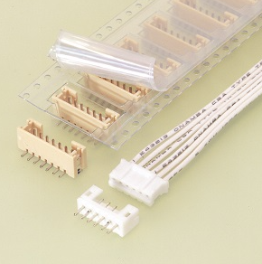

This page will hopefully explain the various types of connectors you can purchase and when they should be used in electronic/embedded projects. 

## Connector Manufacturers

[cols="1,2,2,2,1,1"]
|===
| Name | Website | Range | Provide 3D Models | Affordability (1 expensive, 10 cheap) | Site Usability (1 bad, 10 good)

| 3M
| link:http://www.3m.com/[http://www.3m.com/]
| Card edge (inc. latching)
| Yes, but not always for all parts in a connector family. (Step, IGES, Parasolid)
| 3
| 

| Harting
| link:http://www.harting.com/[http://www.harting.com]
| Card edge
| Yes (Step)
| 5
|

| Hirose
| link:http://www.hirose.com/[http://www.hirose.com/]
| High-end circular
| Yes, after providing your paid-for email address. (Step)
| 5
| 

| Molex
| link:http://www.molex.com/[http://www.molex.com]
a|
* Headers
* Wire-to-Board
* Card edge
| Yes (Step)
| 3
| 6

| Samtec
| link:http://www.samtec.com/[http://www.samtec.com]
a|
* Backplane
* Headers (various pitches, and both square-post and machined)
* Rugged circular.
| Yes (Step)
| 7
| 8

| TE Connectivity
| link:http://www.te.com/[http://www.te.com]
| Backplane
| ?
| 6
| 

|===

== Tin vs. Gold Plating

Many connectors come to at least two plating options, either tin or gold. Gold is a more expensive option, but offers a lower initial contact resistance, lower corrosion over time, and lower mating force (which may or may not be a good thing).

There is the 50:50:50 rule (taken from www.connector.com, as of **Dec 2017, link no longer alive**) when it comes to deciding which plating to choose. The rule says that tin is the best choice if:

* You have less than 50 contacts (due to the mating force getting too large)
* The connector will experience 50 or less mating cycles
* You can live with 50mOhms of contact resistance over time

Selecting gold tinned contacts can add a good US$0.50 or more to the price of the connector.

Mixing the two plating metals is not recommended! The corrosion rate is greatly increased when two dissimilar metals come into contact with each other (this is due to the difference in the metal's electrode potentials, which is +1.5V for gold, and only +0.15V for tin).

.You can see the difference between the gold and tin plated header connectors. Image from http://www.fischerelektronik.de/en/latest-news/press-releases/releases/smd-high-precision-male-header-with-2point54mm-grid-spacing-horizontal-design/.
image::gold-and-tin-plated-contacts.jpg[width=500px]

== Headers

A _Header_ connector normally refers to a basic row of pins or sockets, with little or no additional features such as shrouds, locking ability, or keyed parts. The most common pitch for headers is 2.54mm (100mil). Headers are versatile, as they not vendor-specific, can be connected to by soldering, hooks/probes, or the opposite gender header (either a plug or jack), normally have a standardised pitch, can handle a decent amount of current (at least 1A for normal 2.54mm headers), and are cheap!

Headers are used frequently on electronic development kits. For example, the link:/programming/microcontrollers/arduino[Arduino], link:/programming/microcontrollers/raspberry-pi[RaspberryPi], and link:/programming/microcontrollers/psoc[PSoC] development kits all use headers for various things such as programming the microcontroller to providing a way to connect expansion boards.

=== Schematic Symbol

<<header-schematic-symbol>> shows the commonly used schematic symbol for a header-style connector. This example shows a male header (because of the `P` in the designator) with 1 row of 2 pins (usually abbreviated to `1x2`).

[[header-schematic-symbol]]
.The commonly-used schematic symbol for a header. This shows a 1x2 (1 row of 2 pins) male header.
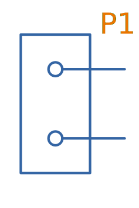

WARNING: This schematic symbol is very generic and also commonly used for a range of over connector styles, so don't just assume it represents a header!

=== Types

Headers can have two different pin types, square post of machined post. Square-post headers have square pins, while machined post header have circular pins. The machined post headers are more expensive, but can take more current as there is more contact area between the male and female parts.

You can also get headers which are polarised, usually by both the male missing one pin, and the female part missing the associated hole. This prevents the common mistake of plugging in a header offset by 1 pin or completely the wrong way around. Note that careful choice of the missing pin is required to minimise the chance of an incorrect mating.

=== Typical Pin Numbering

Male headers (plugs) are normally numbered from left-to-right, when the connectors solder terminals (tail end) are facing south on the PCB, and the bits that do the connecting are facing north (all of this while looking down on the PCB). For female headers (jacks) to match, they are numbered from right-to-left. This is all better explained in the following image.

.This image show the typical way in which headers are numbered, with males headers (plugs) being numbered left-to-right and female headers (jacks) being numbered from right-to-left.
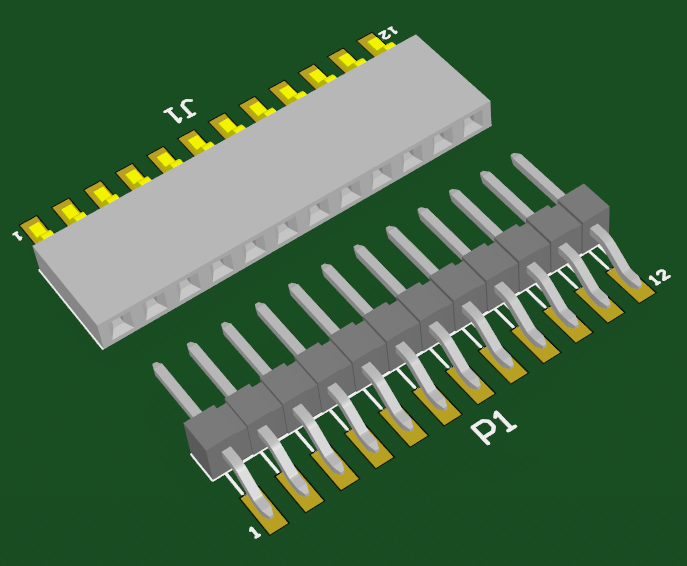

=== Using Headers For Board-to-Board Connections

They are also a great, cheap way of connecting two or more PCBs together, as shown in the following image. A disadvantage is that this method is not as mechanically strong as some more expensive custom board-to-board connection methods.

.Header plugs and jacks (male and female parts) are a good way of connecting PCBs together.
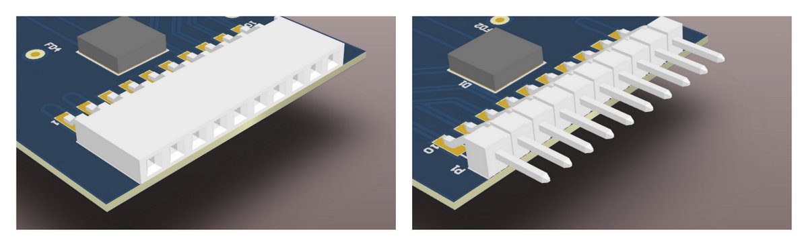

=== Part Links

Samtec make some good priced, link:http://www.samtec.com/connectors/standard-board-to-board/100-inch-square-post.aspx[2.54mm pitch square-post connectors].

== Circular Connectors

=== DIN Connectors

The DIN connector was originally developed by the German National Standards Organisation. The known standards are:

* DIN 41524
* DIN 41612
* DIN 43356
* DIN 41652

DIN connectors with different numbers of pins can sometimes mate with each other. For example, 3-pin DIN connectors used for mono audio can mate with the left-channel of larger 5-pin DIN stereo connections. DIN connectors were used for the PS/2 keyboard and mouse connectors (know succeeded by the USB connector).

=== Mini-DIN Connectors

Mini-DIN connectors are smaller versions of the DIN connectors and are 9.5mm in diameter. A major difference between DIN and Mini-DIN connectors is that Mini-DIN connectors cannot be mated with any of different-number-of-pins Mini-DIN connectors.

Mini-DIN connectors have been used for the S-video interface.

=== M8/M12 Circular Connectors

**M8 and M12 connectors are circular connectors with a 8mm or 12mm mating thread** (note the thread in question is the thread joining the two mating connectors together, not the other threads which may be present on the M12 connector, such as panel-mount variants which typically have a 16mm thread for mounting to the panel). They are used for a variety of purposes across a large number of industries. A large number of these connectors are rated IP67 and prevent the ingress of water and dust.

M8/M12 connectors have different _codings_. Each coding is a particular pin arrangement and key which prevents the same diameter and pin connector being mated with connectors with different codings.

* A: Sensors, DC power (deprecated use), 1Gbit Ethernet. This is a very common/popular encoding.
* B: PROFIBUS
* C: AC power (deprecated)
* D: 100Mbit ethernet
* K: AC power
* L: PROFINET DC power
* N: 
* S: AC power (replacement for `C`)
* T: DC power (replacement for `A` DC power)
* X: 10Gbit Ethernet

.Common codings for M8/M12 circular connectors. Image from https://www.te.com/content/dam/te-com/documents/industrial-automation-and-control/global/m8m12_product_presentation.pdf.
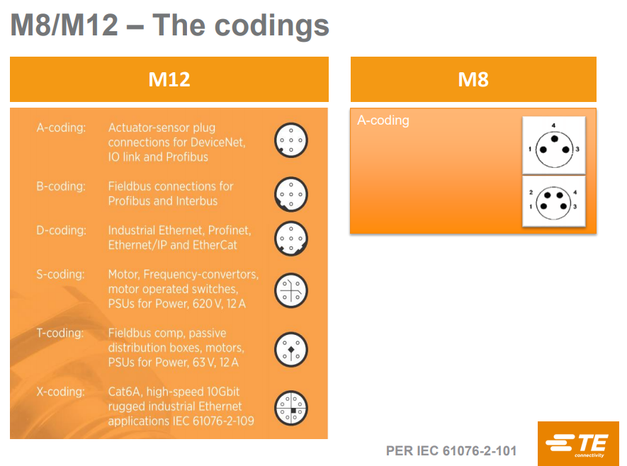

Common pin counts (larger pin counts are only available in the larger diameter connector):

* 4 (M8, M12)
* 5 (M12, sometimes M8)
* 8 (M12)
* 12 (M12)

Some of the panel mount M12 connectors have a M16 (16mm) panel mount thead, others have a PG9 (see link:https://en.wikipedia.org/wiki/Panzergewinde[https://en.wikipedia.org/wiki/Panzergewinde]) thread.

==== Inline Connectors

They typically have a PG7 or PG9 thread. The PG9 thread seems to be more common/widely available. The inline connectors may have screw termination (terminal block style).

==== Splitters

The M8/M12 connector family also come with splitters --- Y and T shaped units which allow 3 cables to be connected together.

.A Y-style M12 splitter from Phoenix Contact. Image from https://nz.element14.com/phoenix-contact/1054338/sensor-splitter-8p-m12-plug-plug/dp/3223043.
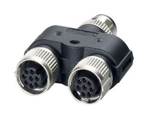

==== Field Installable Connectors

Some M8/M12 connectors are _field installable_. This is when the connection to the wire is done via terminal block style screw cages (or similar) on the backside of the connector. No crimping tool or soldering is required, hence they are able to be made on the fly in the "field".

== IDC Connectors

IDC (_insulation displacement connector_) connectors are very common style of connector used to carry low speed communications and low current power between multiple circuit boards and between circuit boards and other devices. They are distinguishable by the typically black, square and sharp edged connectors, with a ribbon cable coming out the side.

.A photo of a IDC plug and socket. The top piece of black plastic squashes the ribbon cable into the sharp blades and keeps the cable clamped.
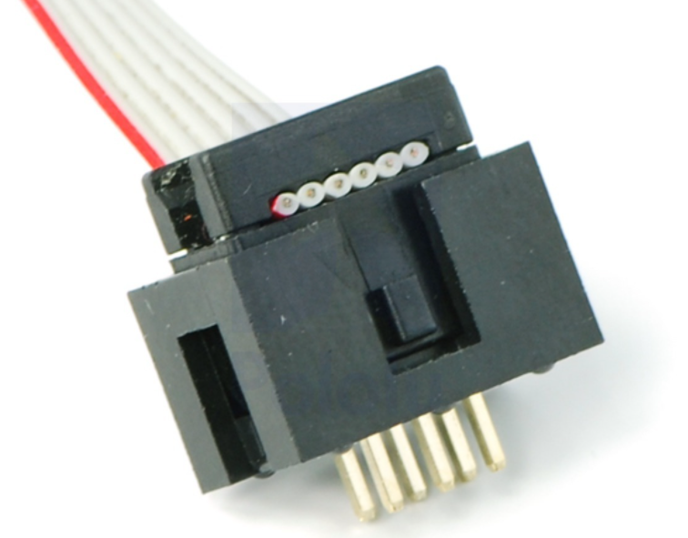

The namesake comes from the way the connector attaches to the ribbon cable --- the connector has sharp "razor" style blades with a notch cut through the center of each one. The ribbon cable is pushed onto the end of the blades, and the blades pierce the ribbon cable and make contact with the blades (hence "displacing the insulation"). This removes the need to strip the end of the ribbon cable and connect via crimps/soldering/screw terminals and thus makes them extremely easy to construct.

Sometimes jokingly referred to as "**I**t **D**id not **C**onnect" connectors, they can make for unreliable connections when hand assembled or not constructed in the correct manner. Unlike terminal blocks or crimped connectors, it is hard to visually confirm that the connections were made correctly given the clamp obscures the connection points.

The socket (least-moving piece, the side that gets soldered onto a PCB) is shrouded and keyed to make sure the parts mate in the correct way.

The pitch of the PCB pins on an IDC connector is almost always 2.54mm (0.1"). Because IDC connectors always have two rows of pins, this requires that the cable has a conductor pitch of 1.27mm (0.05").

== Telecom Connectors

### BT Connector

The connector called the "BT" connector (which is an acronym for the British Telecom connector) is commonly used through out houses in many countries (including the U.K. and New Zealand) to plug into a  Telecom jack that is mounted on the wall. It's proper name is the BS6312 431A plug. You can get cheap BT to RJ-11 adapters.

## Contactless Connectors

Contactless connectors is the name given to connectors which don't require a physical electrical contact between the two mating pieces (they still may require physical mechanical contact). They can transmit both signals and power from one side to the other. This is normally done through magnetic/capacitive coupling.

This is still a relatively new field compared to other forms of connectors, and unit prices are still very high.

TE Connectivity make a range under the family name link:http://www.digikey.co.nz/en/product-highlight/t/te-connectivity-amp/ariso-contactless-connectivity[ARISO]. They are capable to transmitting up to 12W of power at 24VDC.

.A photo of TE Connectivity's ARISO M30 contactless connectors. Image from www.te.com.
image::te-connectivity-ariso-m30-contactless-connector-pair-photo.png[width=640px]

== Terminal Blocks

Terminal blocks are a great easy-to-use connection method for signal from mA right up to 10A+. They make it **easy to connect (and re-arrange)** wires, accept one of the largest ranges of wire sizes, and the standard screw type requires no crimp on the end of the wire. They are also great because they** allow the cable itself to be fed through glands and other small orifices**, as there is no mating connector permanently mounted onto the end of the cable.

There are different types of terminal blocks:

|===
| Type | Description

| One piece
| These are your standard terminal blocks that are soldered onto PCBs.</td>

| Feed-through
| Rather than connecting to a PCB, these provide mechanical contacts on both sides of the terminal block, allowing wires to be connected together. Popular with mains (household) wiring.

| Pluggable
| These are like on-piece, except that the PCB part and the wire part are plugged into each other, so that they can be separated.

| Barrier
| These provide electrical isolation.
|===

You can see the push-in terminal blocks I used to connect up all the solenoids for the link:/electronics/projects/luxcity-uv-tonic-control-system[Luxcity Tonic project] in the image below (the green things with numbered stickers and wires coming out of them).

.Many push-in terminal blocks (items in green) I used as part of the link:/electronics/projects/luxcity-uv-tonic-control-system[Luxcity Tonic project].
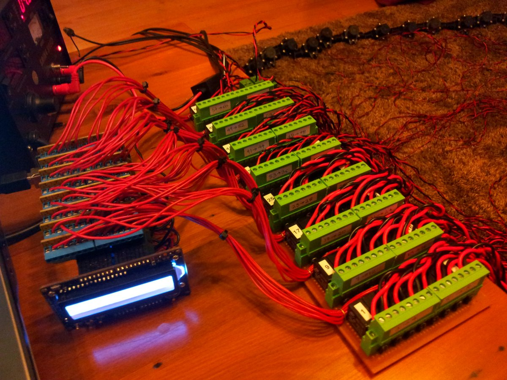

However, because they do not enforce a specific wiring configuration, they are prone to wiring errors, especially if someone else than that who designed the circuit is wiring it up.

Common pitches for terminal blocks are:

[cols="1,3"]
|===
| Pitch | Use

| 2.54mm (100mill)
| Imperial pitch used for small wires (16-30AWG). While this is a very common pitch for other connectors, the design of terminal blocks actually makes this result in very small connections, hence larger pitches are more popular.

| 3.5mm
| Common metric pitch.

| 3.84mm (150mill)
| This is a common terminal block imperial pitch.

| 5.08mm (200mill)
| This is a very common imperial pitch.
|===

WARNING: **DO NOT** completely tin the ends of wires that go in the terminal block. Under the pressure of the screw, solder will creep over time, and the connection will become loose, either falling out, or making a high resistance connection. It is acceptable to lightly tin **the very ends** of the wires to keep the individual strands from fraying, but nothing more.

A better way to fix this problem is to use wire ferrules. These are small hollow metal cylinder which just fit over the wire and then crimped onto it, before being inserted into the terminal block. It stops the wires from fraying, and gets rid of the solder creep problem.

.Wire ferrule are crimped onto wires before they are inserted into a terminal block, preventing fraying and solder creep.
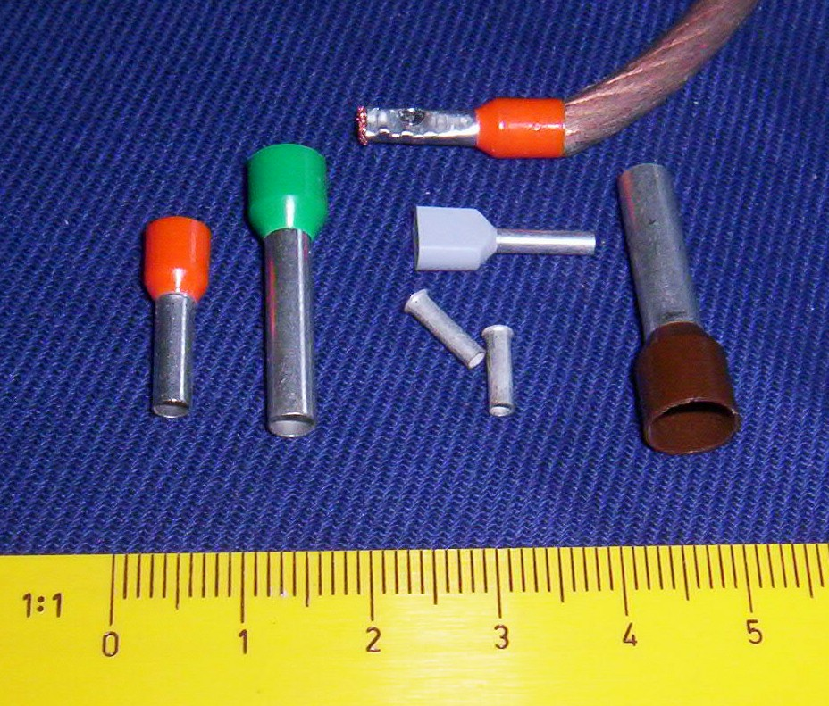

=== Connection Type

Terminal blocks have many different connection types:

|===
| Connection Type | Image | Description

| Screw
a|
.A terminal block with a screw-style connection method.
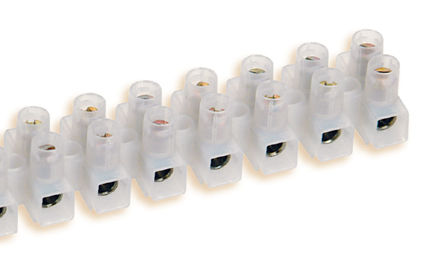
| The most basic terminal block connection type. I don't particularly like this connection style, especially when clamping bare wires (i.e. no wire ferrule), as the screw can pinch and break the individual wire strands, as well as the screw completely missing some/all of the wire strands if they ride up the sides of the metal enclosure. This problem is exasperated when the gauge of the wire is small compared to the size of the terminal block.

| Rising Cage
a|
.A terminal block with a rising-cage style connection method.
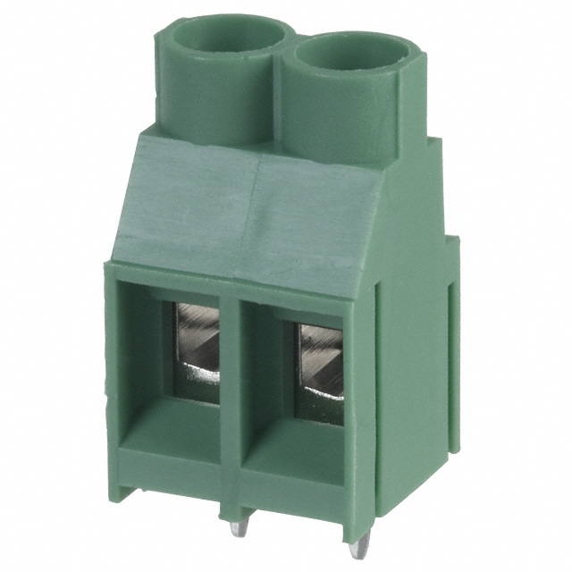
| Screw with rising cage clamp is my preferred connection type. This is where the bottom side of a square cage rises up and clamps the wire when you tighten the screw. This does not pinch and break the wire as often as the basic screw connection type terminal block does.

| Spring
|
|
|===

=== Terminal Block Covers

You can purchase terminal block covers, which give further protection to the wires after they have been fixed into the contacts.

Commonly, they clip onto the top of the terminal block and shield the terminal block from objects approaching from overhead.

.A terminal block cover beside the terminal block.
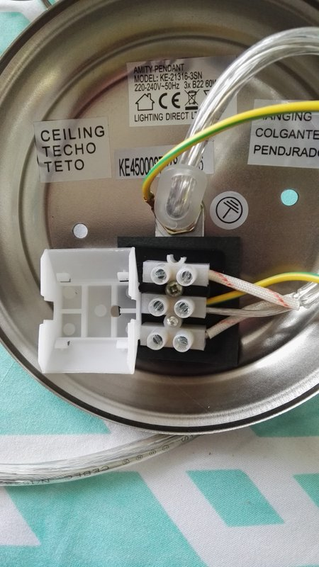

.A terminal block cover mounted onto a terminal block.
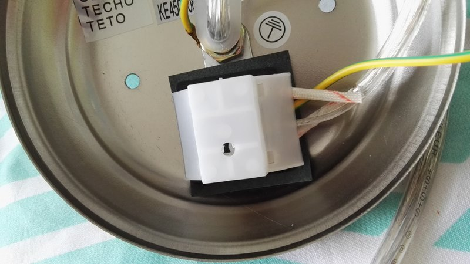

=== Ceramic (Porcelain) Terminal Blocks

Ceramic (also called _porcelain_) terminal blocks were used before plastic ones became widely available. They still find a niche in applications where they would be subjected to very high temperatures that would melt plastic. They can typically operate in temperatures of -40° to 650°C. This includes things such as heaters, thermocouple connections, machinery, and many other industrial uses. Steatite is a popular ceramic material used for construction of these types of terminal blocks.

.A ceramic terminal block.
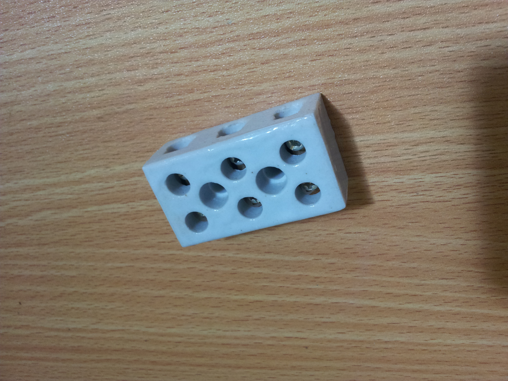

== Barrier Strips

_Barrier strips_ (a.k.a. _barrier blocks_) are rows of screw-based electrical clamps designed to connect wires together. They are very similar to <<_terminal_blocks, terminal blocks>>, however they generally provide better protection than terminal blocks against loose of frayed wire ends shorting out against adjacent positions. They are also generally rated for higher current/voltage applications than terminal blocks (300-600V, 10-30A ratings are common), and consequentially usually larger (pitches of 8-12mm).

.Photo of a 4 circuit 9.53mm (0.375") pitch barrier strip by Molex (part number: 0387700104). Image retrieved 2021-10-07, from https://www.digikey.com/en/products/detail/molex/0387700104/362488.
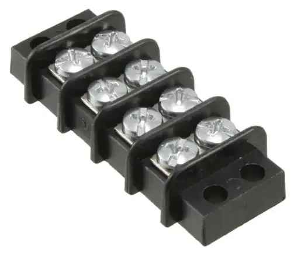

Whilst terminal blocks don't usually have an exposed metal that can easily short out against neighbouring parts, barrier strips are open on the top face (to allow for the connection of lugs). If the exposed conductors are a problem, you can purchase some barrier strips that come with insulating covers. The covers are usually see-through and made of plastic.

.Photo of covered barrier strips, combs and wire forks. Image retrieved 2021-10-07, from https://www.amazon.com/Glarks-Positions-Terminals-Pre-Insulated-Insulated/dp/B07Y217129/.
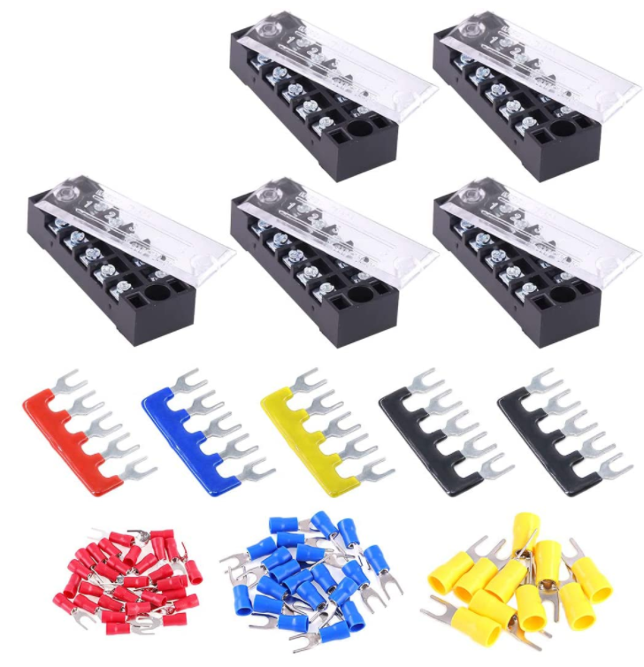

Barrier strips can be found on DigiKey at https://www.digikey.com/en/products/filter/terminal-blocks-barrier-blocks/368.

== D-Subminiature (D-Sub) Connectors

_D-Subminiature connectors_ (abbreviated to _D-Sub connectors_) were designed by ITT Canon in 1952. Large by today's standards, at the time, these connectors where one of the smallest connectors available for a computer, hence the name "subminiature". They are characterised by two or more rows of connections inside a **"D" shape** metal shell.

.One of the most commonly used D-sub connectors of this era, the 9-pin female PCB-mount DE-9 connector.
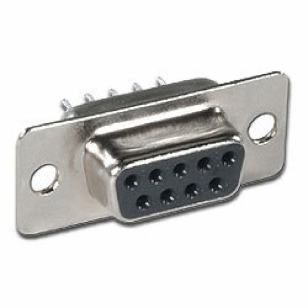

The **DE-9** is a very **popular** 9-pin computer serial cable. It is also commonly (and **incorrectly**) called a DB-9 connector, presumably because of the name of larger DB-25 connector that it replaced.

The DE-15 connector is commonly used for VGA connections between computers and screens.

=== Schematic Symbol

I recommend using the unique schematic symbol style below for the range of D-sub-miniature connectors. It immediately identifies the connector to the viewer.

.An easy-to-identify schematic symbol style for representing D sub-miniature connectors.
image::connector-db25-schematic-symbol.png[width=185px]

=== Sizes

The available sizes are:

[cols="1,1,1,1,1,1"]
|===
2+h| Normal Density
2+h| High Density
2+h| Double Density

h| Name
h| Num. Pins (layout)
h| Name
h| Num. Pins (layout)
h| Name
h| Num. Pins (layout)

| DE-09
| 9 (8-7)
| DE-15
| 15 (5-5-5)
| DE-19
| 19 (6-7-6)

| DA-15
| 15
| DA-26
| 26 (9-9-8)
| DA-31
| 31 (10-10-11)

| DB-25
| 25
| DB-44
| 44 (15-15-14)
| DB-52
| 52 (17-18-17)

| DC-37
| 37 (19-18) 
| DC-62
| 62 (21-21-20)
| DC-79
| 79 (26-27-26)

| DD-50
| 50 (17-16-17) 
| DD-78
| 78 (20-19-20-19)
| DD-100
| 100 (26-25-24-25)

|
|
| DF-104
| 104 (21-21-21-21-20)
|
|
|===

=== Backshells

D-subminiature connectors which are **attached to cables** (i.e. are not PCB mounted or panel mounted) are designed to be fitted with a _backshell_. The backshell **protects/encloses** the wire connections from from the cable, as well providing **mechanical support and strain relief** for the cable.

=== Termination Styles

PCB Mount: The connectors has protruding pins (in either straight or right-angle orientation) so that the connector can be soldered to a PCB.

Solder Lug: Designed so that wires can be soldered onto the pins. This style of connector is designed to be panel mounted (**not PCB mounted**). Also called _solder bucket_.

=== Uses

Many older consumer products and prototype circuits of all ages use the DE-9 connector for link:/electronics/communication-protocols/rs-232-protocol[RS-232 communications]. However, it is becoming less common, with USB-to-UART cables becoming more popular, which get connected directly to a microcontrollers pins through flying leads, standard header, or USB connector (in this case the USB-to-UART converter is usually on the board itself, i.e. link:/programming/microcontrollers/arduino[Arduino boards]).

=== Filtered D-sub Connectors

Filtered D-sub connectors have purposeful capacitance-to-ground (or more complicated filters) built into each one of the connectors pins.

.A graph of insertion loss vs. frequency for a Conec D-sub connector with integrated capacitance for filtering (a 'C' filter).
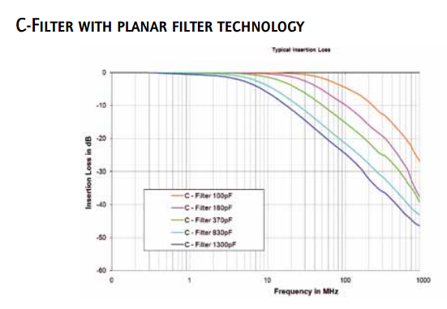

Compared to implementing the filtering on say, the PCB, filtering at the connector offers the advantage of increased EMI protection due to the filtering occurring at the point that the signal enters the enclosure (so the wires to the PCB don't radiate noise). It also saves PCB space and simplifies PCB routing/layout.

=== Screw Kits

You can buy pre-made screw kits, such as the link:http://www.digikey.co.nz/product-search/en?vendor=0&keywords=5205817-1&stock=1[TE Connectivity 5205817-1], which comes with all the necessary screws and associated hardware to secure two D-sub connectors together (I might point out here that screws **are not required** to make a connection, but help to make it more secure).

.The TE Connectivity 5205817-1 D-Sub screw kit.
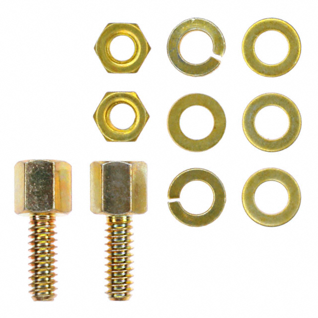

=== Waterproof Variants

Waterproof variants of D-sub connectors exist, the two most common being a DE-9 or a DB-25.

.A waterproof DE-9 receptacle by Amphenol LTW.
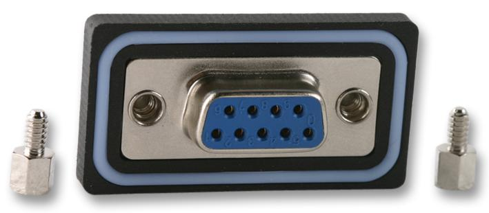

== Wire-to-Board (WTB) Connectors

Wire-to-board (WTB) connectors are a very common type of electrical connector. WTB connectors are used to attach free wires and cables to a PCB, to provide both electrical connections and mechanical support.

=== Naming

The name can be abbreviated to _WTB connectors_ or _W-T-B connectors_. They can also be referred to as _board-to-wire connectors_.

WTB connectors get rid of all the problems with soldering wires directly onto a PCB, which include fatigue/breaking issues, short-circuit woes, and the ease of disconnecting/re-connecting the wires.

Trying the find a good, reasonably-priced WTB connector on a electronic supplier's website can be near-impossible. There are so many varieties, shapes, lead pitches, bad datasheets, and different manufacturer's making nearly identical products. Also, to top it all of, you need to usually find more than one item to make a connector work (e.g. if you buy a connector you must also find the matching receptacle and crimp pins). And most suppliers don't do a good job and making the related parts obvious.

=== Examples

==== JST PH/SH Family

The JST PH 2.0mm pitch W2B connector family is used for the link:https://learn.adafruit.com/introducing-adafruit-stemma-qt[Adafruit STEMMA devices], and the JST SH 1.0mm pitch W2B connector used for Adafruit STEMMA QT (QT representing _cutie_, referring to the smaller pitch) and SparkFun QwiiC devices<<bib-adafruit-jst-sh-conn>>.

.A photo of a Adafruit "STEMMA QT" or SparkFun "Qwiic" connector + cable. Both use the JST SH 1.0mm pitch W2B connector family<<bib-adafruit-jst-sh-conn>>. Image (C) 2021, Adafruit. 
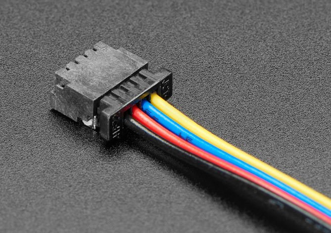

==== TE Connectivity HPI

TE Connectivity's 2.0mm HPI connectors are a good choice if you want a smallish connector with 2 to 12 wires. There are SMD and TH variants of the PCB mounted half. I like these because they are relatively cheap, have good documentation, and best of all, come with 3D step models for creating a 3D mock-up of the PCB.

Manufacturing codes include _1775469-x_ for the right-angle SMD variants, and _1775470-x_ for the vertical SMD variants. _x_ is the number of pins in all cases.

==== Molex PicoBlade

Molex's PicoBlade connector families are quite popular. They have a 1.25mm pitch and a 1A capacity per contact. There are a variety of wire-to-board and wire-to-wire options.

.A photo showing a few of the connectors from the Molex PicoBlade families. Image from www.molex.com.
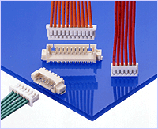

==== MTA/CST-100 Connectors

_MTA-100 connectors_ are a family of wire-to-board and wire-to-wire connectors. They use the insulation displacement contact (IDC) technique to make electrical contact between the housing and the wires without having to use crimps<<bib-te-mta-100-conns>>. MTA-100 connectors are colour coded according the wire size they accept.

[cols="1,1", options="header"]
|===
| Connector Colour
| Wire Size

| Red
| 22AWG

| White
| 24AWG

| Blue
| 26AWG

| Green
| 28AWG
|===

== RF Connectors

RF connectors are connectors specifically designed to carry high-frequency signals, typically in the 100MHz-30GHz range.

=== BNC Connectors

BNC (_Bayonet Neill-Concelman_) connectors are quick connect connectors designed for RF signals. It is named after it's **B**ayonet locking mechanism and it's inventors, Paul **N**eill and Carl **C**oncelman. It is "standardized" in MIL-STD-348A<<bib-everyspec-mil-std-348a>>.

=== Specifications

* **Passband:** 0-4GHz
* **Impedance:** stem:[50\Omega] or stem:[75\Omega] (video).

==== Uses 

They were originally designed for military use, but are now commonly used for a variety of RF applications including:

* **Oscilloscope probes:** Although the top-end modern oscilloscopes tend to have proprietary connections to the probes, with added pins for extra functionality.
* **Analog video signals**
* **Radio antennas**

.Photo of a BNC adapter, showing the male BNC connector.
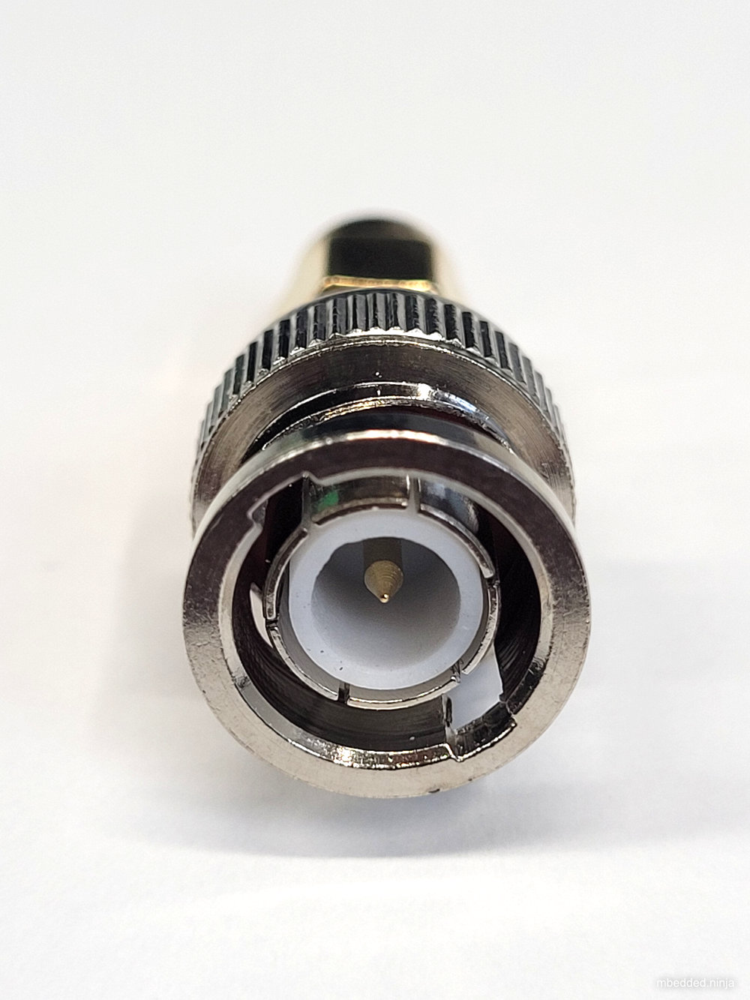

The USSR version of the BNC connector is called the SR connector. However, the connector dimensions are slightly different due to the conversion from imperial to metric. The SR connectors can be mated with BNC connectors, although sometimes it requires a decent amount of force.

=== U.FL

Also known as UMC or XFL connectors.

.A photo of a male, SMD mount UFL connector. Image from www.digikey.com.
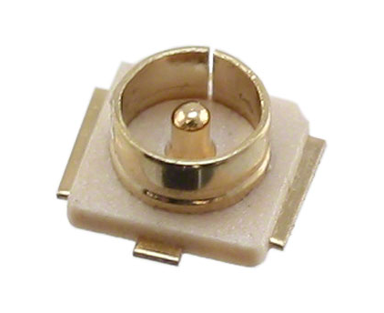

==== Schematic Symbol

There is no "standard" schematic symbol for the male, SMD mount UFL connector, so I normally decide to go with some that is visually resembles the actual connector part, as shown below:

.A schematic symbol for the male, SMD, UFL (a.k.a. UMC, UMCC) style RF connector.
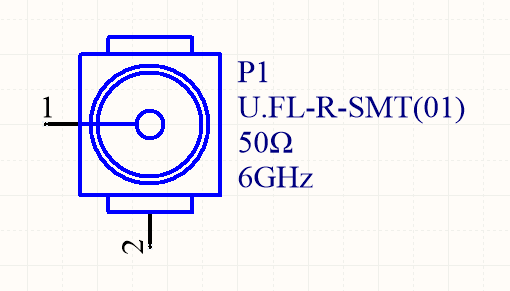

The height of the male SMD connector can vary, but something around 1.2mm is common.

=== SMA Connectors

SMA (SubMiniature version A) connectors are small (although probably medium-sized by today's standards) stem:[50\Omega] RF coaxial connectors with a screw-style connection mechanism. The gender name refers to the innermost electrical component (e.g. a male SMA connector has the pin in the middle, whilst the female has the socket to accept the pin). They typically have a passband between stem:[0-16GHz], although some specialized versions extends in the 30+ GHz territory<<bib-amphenolrf-sma>>.

.One male and one female inline (connector to cable) SMA connector next to each other.
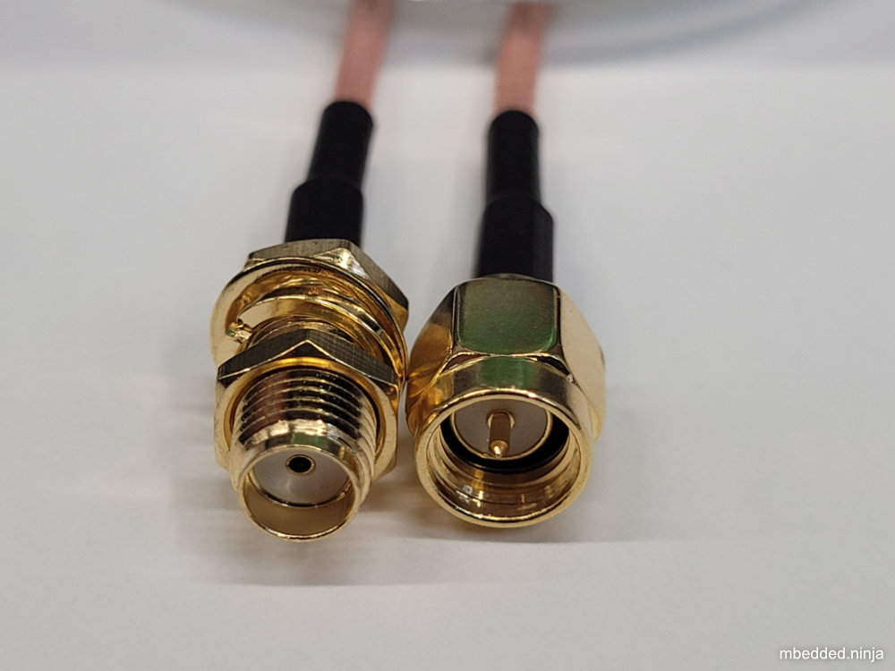

The original SMA connectors were developed in the 1960s<<bib-reichelt-sma-rpsma>>.

* Standard Male SMA connector: Central **0.9mm diameter pin** surrounded by a barrel with **inside** threads.
* Standard Female SMA connector: Central **sleeve** (made from the di-electric) surrounded by a barrel with **outside** threads.

.Female through-hole standard SMA connector, designed to be mounted on a PCB<<bib-amphenolrf-sma>>. Image © 2020 Amphenol.
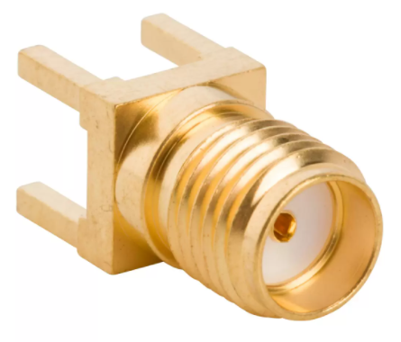

.A coaxial cable with SMA connectors at both ends.
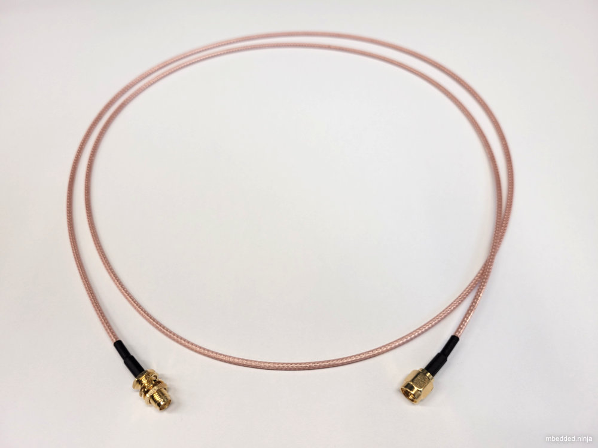

_Reverse-polarity_ (RP) SMA connectors have the pin and sleeve swapped between the male and female parts. Also known as _RP-SMA_ or _R-SMA_. _Reverse-polarity_ was designed  to prevent the unauthorized connection of a antenna with a larger gain to WiFi equipment<<bib-reichelt-sma-rpsma>>, to distinguish them from cellular equipment involving LTE/GSM/UMTS which was utilizing the standard SMA connector. These days, RP-SMA connectors are now commonplace, somewhat defeating the protection through obscurity. However in general, standard SMA connectors are still used for cellular applications whilst RP-SMA for WiFi/WLAN.

=== N Connectors

_N connectors_ (a.k.a. N-type or Type N connectors) are large RF connectors.

.Close-up of a N Connector.
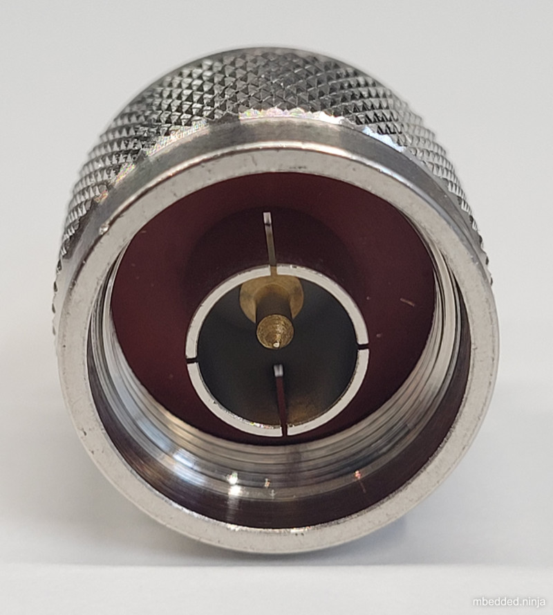

== Board-to-Board Connectors

Board-to-board connectors which connect to PCBs side-by-side are called _coplanar_ connectors.

Board-to-board-connectors which connect PCBs ontop of one another are called _mezzanine_ or _stacked_ connectors.

.An example of a 'mezzanine' or 'stacked' style of board-to-board connector.
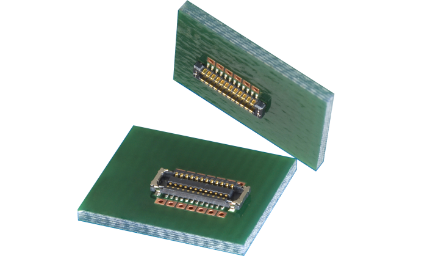

=== Wire-to-Board (WTB) Support

Some board-to-board connector families are have wire-to-board support, with a special wire-crimped inline receptacle which mates with the PCB-mounted connector that works with both the board-to-board and wire-to-board connectors.

The Hirose DF-59 family is a set of board-to-board/board-to-wire connectors. The special feature about this family is the "floating" contact which allows up to 0.5mm of mis-alignment between the boards.

.Diagram of the Hirose DF-59 family of board-to-board connectors, showing their special 'floating' feature.
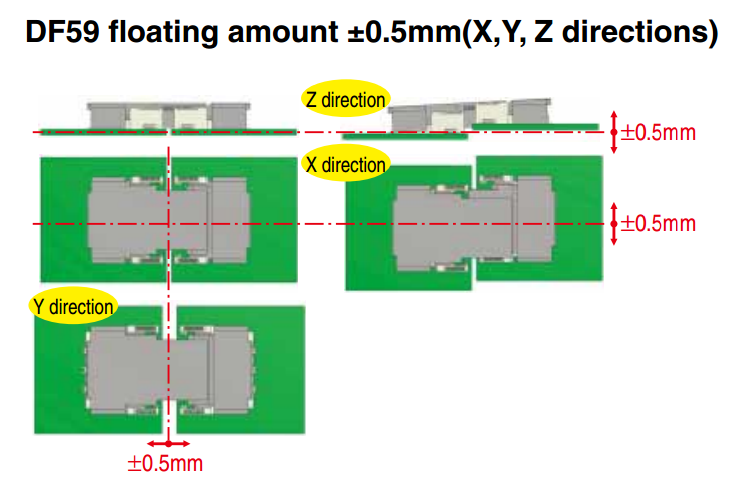

== Mains Power Connectors

=== IEC 60320

The C13/C14 coupler is very common for powering computers, computer screens and other tech equipment from mains power. In New Zealand, they are commonly called "jug plugs".

.A photo of both the male and female C13/C14 style connectors from the IEC 60320 standard. Also known as 'kettle' or 'jug' plugs. Image from www.amazon.com.
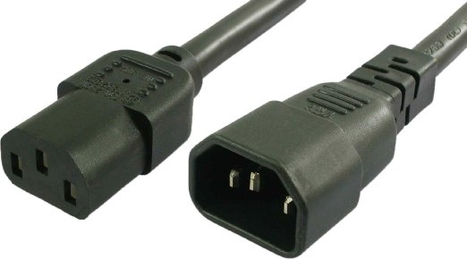

== PCB Card Edge Connectors

This is a cheap and many-pin capable solution when you want to connect two PCBs together. PCB card edge connector involve using the edge of one of the mating PCBs as the connector, by etching/routing "fingers" on the PCB. The other mating part of the connector is designed to accept these fingers. Most card edge connectors are used when the PCBs are at right-angles to each other, although you can get connectors designed for parallel and co-planar connections.

The fingers that are etched on the PCB are usually gold plated to make the contacts more reliable (the normal lead/tin coating oxidises too quickly). This is a special process that most PCB manufacturers will support, and does not add much to the cost of the PCB. The supported PCB thickness of most of these connectors is around 1.60mm (which is pretty standard). Also, it is recommended to add a small bevel to the inserted end of the PCB to facilitate mating. Again, most quality PCB manufacturers will support this.

Card-edge connectors are very susceptible to board warping and board thickness errors, so takes these into consideration when adding card-edge connectors to your PCB design.

.Edge connector fingers which have been gold plated and the PCB bevelled. Image from http://www.eurocircuits.com/index.php/eurocircuits-printed-circuits-blog/gold-plating-for-edge-connectors.
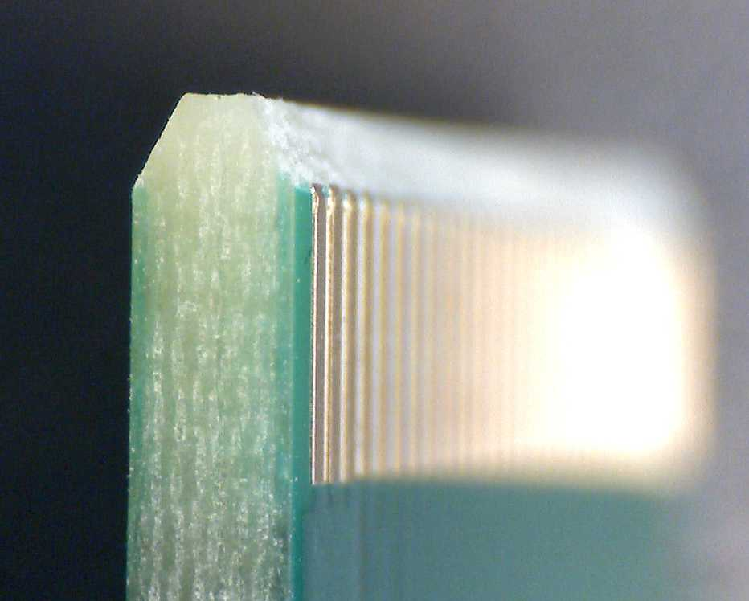

The following image is of PCB card edge connectors on the link:/electronics/teardowns/cavro-xl3000-8-port-syringe-pump-teardown[Cavro XL-3000 syringe pump].

.An example of a PCB card edge connector. This is a photo of the Cavro XL-3000 syringe pump.
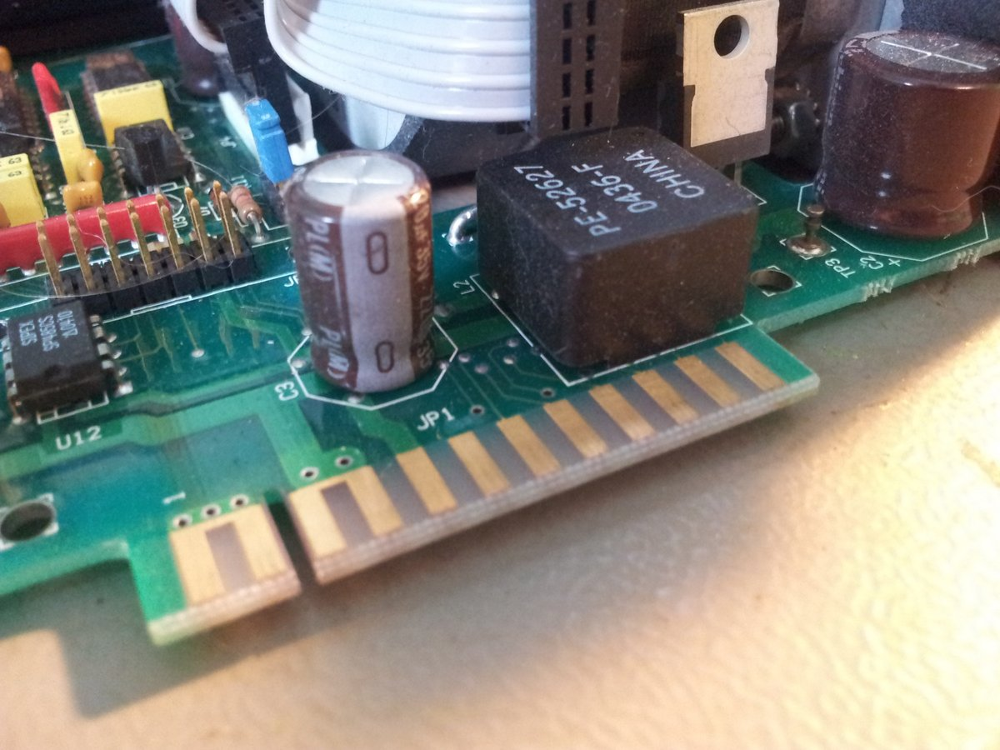

You can get PCB card edge connectors which have latches, which lock in the daughter board which has special "hockey stick" pieces routed on the sides.

.Male pcb-card edge connectors can have 'hockey-stick' latches as indicated (the female connector also has to support this).
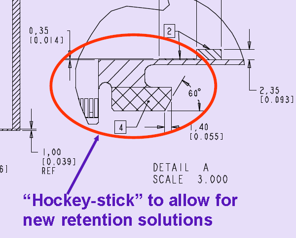

This is a screenshot from a PCB design for the male part of a card-edge connector in Altium.

.An Altium PCB design of a male card-edge connector. This is for the 20-pin connector in the Molex SPD08 series.
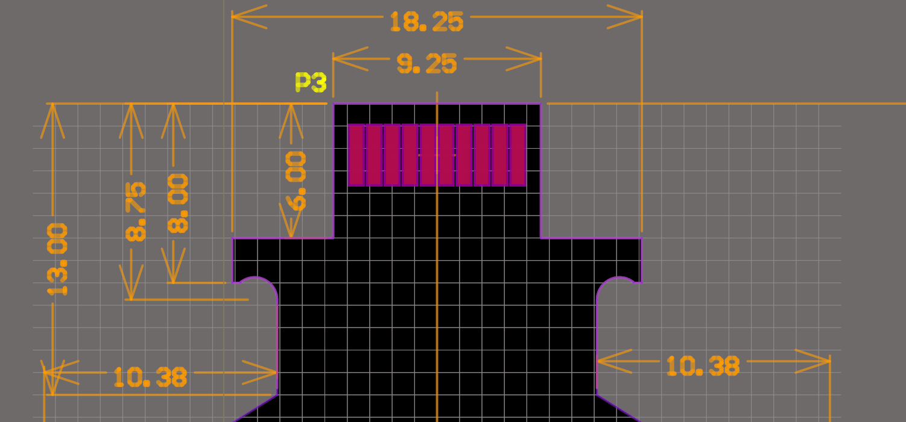

This is a female latching card-edge connector.

.A 20-pin card-edge female connector from the Molex SPD08 series.
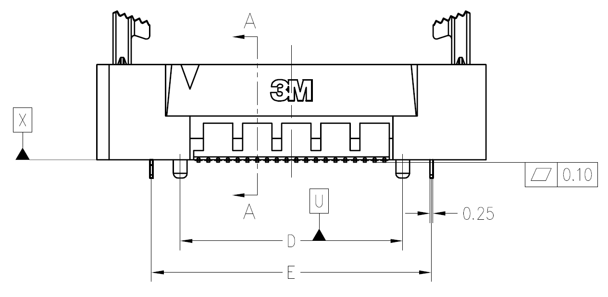

In some rare cases (e.g. the Sullins EBC Card-Edge connector series), aside from the socket, the connector manufacturer will also manufacture a plug which replicates PCB fingers, instead of you using the PCB for this purpose.

== Identifying Connectors

Unlike most other electrical components, most connector manufacturers do not append any letter codes in the part numbers for connectors, rather they are just a long sequence of numbers. This can make part recognition very confusing (e.g. when you see an IC with "74" in it's part name, you instantly think of digital logic). A standard way to indicate pin 1 on a connector PCB footprint is to make the copper pad surrounding the pin 1 hole to be a different shape than the rest (e.g. square, while all the others are round).

The website https://connectorbook.com/identification.html is a great tool to help you identify unknown connectors. If guides you through a series of questions which narrows down the connector you are looking at.

.Identifying a W2B (wire-to-board) connector with the help connectorbook.com<<bib-connector-book>>.
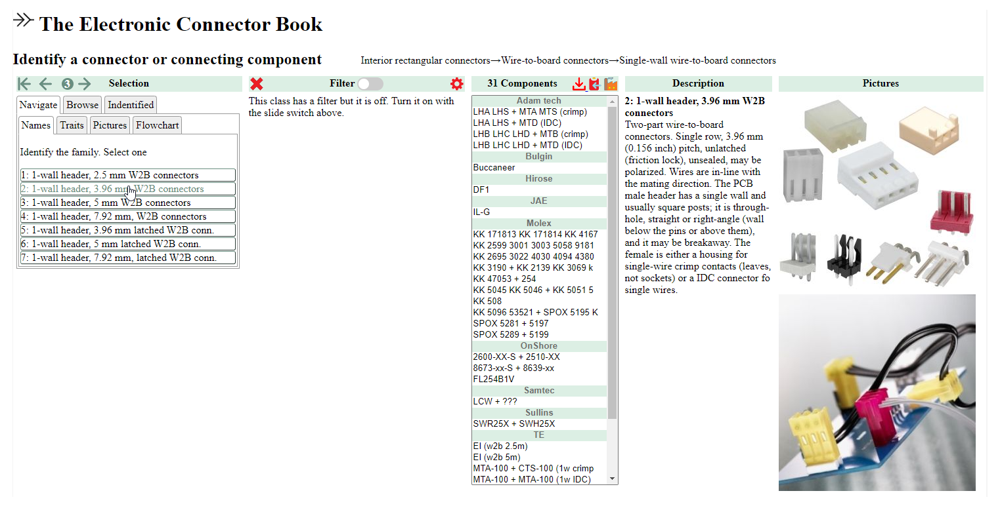

[bibliography]
== References

* [[[bib-te-mta-100-conns, 1]]] TE Connectivity. _MTA 100 & MTA 156 Connectors_. Retrieved 2021-10-07, from https://www.te.com/usa-en/products/connectors/pcb-connectors/intersection/mta-100-mta-156-connectors.html.
* [[[bib-reichelt-sma-rpsma, 2]]] Reichelt Elektronik. _SMA and RP-SMA – What You Need to Know About Coaxial Connectors_. Retrieved 2021-11-22, from https://www.reichelt.com/magazin/en/sma-and-rp-sma-what-you-need-to-know-about-coaxial-connectors/.
* [[[bib-amphenolrf-sma, 3]]] Amphenol RF. _SMA Connectors_. Retrieved 2021-11-22, from https://www.amphenolrf.com/connectors/sma-connectors.html.
* [[[bib-connector-book, 4]]] The Electronic Connector Book. _Identify a connector or connecting component_. Retrieved 2021-12-03, from https://connectorbook.com/identification.html.
* [[[bib-jst-ph-conn, 5]]] JST. _PH connector_. Retrieved 2021-12-03, from https://www.jst-mfg.com/product/detail_e.php?series=199.
* [[[bib-adafruit-jst-sh-conn, 6]]] Adafruit. _JST SH 4-pin Right Angle Connector (10-pack) - Qwiic Compatible_. Retrieved 2021-12-03, from https://www.adafruit.com/product/4208.
* [[[bib-everyspec-mil-std-348a, 7]]] Department of Defence. _Interface Standard: Radio Frequency Connector Interfaces for MIL-C-3643, MIL-C-3650, MIL-C-3655, MIL-C-25516, MIL-C-26637, MIL-C-39012, MIL-C-49142, MIL-A-55339, MIL-C-83517_. Retrieved 2021-12-10, from http://everyspec.com/MIL-STD/MIL-STD-0300-0499/MIL-STD-348A_420/.
