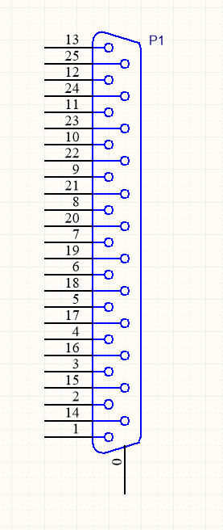

## Overview

Unlike most other electrical components, most connector manufacturers do not append any letter codes in the part numbers for connectors, rather they are just a long sequence of numbers. This can make part recognition very confusing (e.g. when you see an IC with "74" in it's part name, you instantly think of digital logic). A standard way to indicate pin 1 on a connector PCB footprint is to make the copper pad surrounding the pin 1 hole to be a different shape than the rest (e.g. square, while all the others are round).

## Terminology

++++
<table>
	<thead>
		<tr>
			<th>Term</th>
			<th>Description</th>
		</tr>
	</thead>
  <tbody>
    <tr>
      <td>Female</td>
      <td>See socket.</td>
    </tr>
    <tr>
      <td>Genderless</td>
      <td>A connector that can be mated with it's self (i.e. there is no separate male/female or plug/receptacle parts).</td>
    </tr>
    <tr>
      <td>Header</td>
      <td>Can either stand for a particular style of connector (see the Header section), or it can stand for a male gender connector.</td>
    </tr>
    <tr>
      <td>Hermaphroditic</td>
      <td>See genderless.</td>
    </tr>
    <tr>
      <td>Loaded</td>
      <td>On connectors with a large number of pins, this indicated how many of the pins come shipped with contacts. The contact pattern can also vary.</td>
    </tr>
    <tr>
      <td>Male</td>
      <td>See plug.</td>
    </tr>
    <tr>
      <td>Plug</td>
      <td>A connector which has rod-shaped part for plugging into socket. Also called a male connector, or header.</td>
    </tr>
    <tr>
      <td>Receptacle</td>
      <td>See socket.</td>
    </tr>
    <tr>
      <td>Socket</td>
      <td>A connector which has holes that accepts plug pins. Also called a female connector or receptacle.</td>
    </tr>
  </tbody>
</table>
++++

## Connector Manufacturers

++++
<table >
	<thead>
		<tr>
			<th>Name</th>
			<th>Website</th>
			<th>Range</th>
			<th>Provide 3D Models</th>
			<th>Affordability (1 expensive, 10 cheap)</th>
			<th>Site Usability (1 bad, 10 good)</th>
		</tr>
	</thead>
  <tbody>
    <tr>
      <td>3M</td>
      <td>link:http://www.3m.com/[http://www.3m.com/]</td>
      <td>Card edge (inc. latching)</td>
      <td>Yes, but not always for all parts in a connector family. (Step, IGES, Parasolid)</td>
      <td>3</td>
      <td></td>
    </tr>
    <tr>
      <td>Harting</td>
      <td>link:http://www.harting.com/[http://www.harting.com]</td>
      <td>Card edge</td>
      <td>Yes (Step)</td>
      <td>5</td>
      <td></td>
    </tr>
    <tr>
      <td>Hirose</td>
      <td>link:http://www.hirose.com/[http://www.hirose.com/]</td>
      <td>High-end circular</td>
      <td>Yes, after providing your paid-for email address. (Step)</td>
      <td>5</td>
      <td></td>
    </tr>
    <tr>
      <td>Molex</td>
      <td>link:http://www.molex.com/[http://www.molex.com]</td>
      <td>Card edge</td>
      <td>Yes (Step)</td>
      <td>3</td>
      <td>6</td>
    </tr>
    <tr>
      <td>Samtec</td>
      <td>link:http://www.samtec.com/[http://www.samtec.com]</td>
      <td>Backplane, headers (various pitches, and both square-post and machined), rugged circular.</td>
      <td>Yes (Step).</td>
      <td>7</td>
      <td>8</td>
    </tr>
    <tr>
      <td>TE Connectivity</td>
      <td>link:http://www.te.com/[http://www.te.com]</td>
      <td>Backplane</td>
      <td>?</td>
      <td>6</td>
      <td></td>
    </tr>
  </tbody>
</table>
++++

== Tin vs. Gold Plating

Many connectors come to at least two plating options, either tin or gold. Gold is a more expensive option, but offers a lower initial contact resistance, lower corrosion over time, and lower mating force (which may or may not be a good thing).

There is the 50:50:50 rule (taken from www.connector.com, as of **Dec 2017, link no longer alive**) when it comes to deciding which plating to choose. The rule says that tin is the best choice if:

* You have less than 50 contacts (due to the mating force getting too large)
* The connector will experience 50 or less mating cycles
* You can live with 50mOhms of contact resistance over time

Selecting gold tinned contacts can add a good US$0.50 or more to the price of the connector.

Mixing the two plating metals is not recommended! The corrosion rate is greatly increased when two dissimilar metals come into contact with each other (this is due to the difference in the metal's electrode potentials, which is +1.5V for gold, and only +0.15V for tin).

.You can see the difference between the gold and tin plated header connectors. Image from http://www.fischerelektronik.de/en/latest-news/press-releases/releases/smd-high-precision-male-header-with-2point54mm-grid-spacing-horizontal-design/.
image::gold-and-tin-plated-contacts.jpg[width=900px]

## Circular Connectors

### DIN Connectors

The DIN connector was originally developed by the German National Standards Organisation. The known standards are:

* DIN 41524
* DIN 41612
* DIN 43356
* DIN 41652

DIN connectors with different numbers of pins can sometimes mate with each other. For example, 3-pin DIN connectors used for mono audio can mate with the left-channel of larger 5-pin DIN stereo connections. DIN connectors were used for the PS/2 keyboard and mouse connectors (know succeeded by the USB connector).

### Mini-DIN Connectors

Mini-DIN connectors are smaller versions of the DIN connectors and are 9.5mm in diameter. A major difference between DIN and Mini-DIN connectors is that Mini-DIN connectors cannot be mated with any of different-number-of-pins Mini-DIN connectors.

Mini-DIN connectors have been used for the S-video interface.

## IDC Connectors

IDC (_insulation displacement connector_) connectors are very common style of connector used to carry low speed communications and low current power between multiple circuit boards and between circuit boards and other devices. They are distinguishable by the typically black, square and sharp edged connectors, with a ribbon cable coming out the side.

.A photo of a IDC plug and socket. The top piece of black plastic squashes the ribbon cable into the sharp blades and keeps the cable clamped.

The namesake comes from the way the connector attaches to the ribbon cable --- the connector has sharp "razor" style blades with a notch cut through the center of each one. The ribbon cable is pushed onto the end of the blades, and the blades pierce the ribbon cable and make contact with the blades (hence "displacing the insulation"). This removes the need to strip the end of the ribbon cable and connect via crimps/soldering/screw terminals and thus makes them extremely easy to construct.

Sometimes jokingly referred to as "**I**t **D**id not **C**onnect" connectors, they can make for unreliable connections when hand assembled or not constructed in the correct manner. Unlike terminal blocks or crimped connectors, it is hard to visually confirm that the connections were made correctly given the clamp obscures the connection points.

The socket (least-moving piece, the side that gets soldered onto a PCB) is shrouded and keyed to make sure the parts mate in the correct way.

The pitch of the PCB pins on an IDC connector is almost always 2.54mm (0.1"). Because IDC connectors always have two rows of pins, this requires that the cable has a conductor pitch of 1.27mm (0.05").

## Telecom Connectors

### BT Connector

The connector called the "BT" connector (which is an acronym for the British Telecom connector) is commonly used through out houses in many countries (including the U.K. and New Zealand) to plug into a  Telecom jack that is mounted on the wall. It's proper name is the BS6312 431A plug. You can get cheap BT to RJ-11 adapters.

## Contactless Connectors

Contactless connectors is the name given to connectors which don't require a physical electrical contact between the two mating pieces (they still may require physical mechanical contact). They can transmit both signals and power from one side to the other. This is normally done through magnetic/capacitive coupling.

This is still a relatively new field compared to other forms of connectors, and unit prices are still very high.

TE Connectivity make a range under the family name link:http://www.digikey.co.nz/en/product-highlight/t/te-connectivity-amp/ariso-contactless-connectivity[ARISO]. They are capable to transmitting up to 12W of power at 24VDC.

.A photo of TE Connectivity's ARISO M30 contactless connectors. Image from www.te.com.
image::te-connectivity-ariso-m30-contactless-connector-pair-photo.png[width=640px]

== Terminal Blocks

Terminal blocks are a great easy-to-use connection method for signal from mA right up to 10A+. They make it **easy to connect (and re-arrange)** wires, accept one of the largest ranges of wire sizes, and the standard screw type requires no crimp on the end of the wire. They are also great because they** allow the cable itself to be fed through glands and other small orifices**, as there is no mating connector permanently mounted onto the end of the cable.

There are different types of terminal blocks:

|===
| Type | Description

| One piece
| These are your standard terminal blocks that are soldered onto PCBs.</td>

| Feed-through
| Rather than connecting to a PCB, these provide mechanical contacts on both sides of the terminal block, allowing wires to be connected together. Popular with mains (household) wiring.

| Pluggable
| These are like on-piece, except that the PCB part and the wire part are plugged into each other, so that they can be separated.

| Barrier
| These provide electrical isolation.
|===

You can see the push-in terminal blocks I used to connect up all the solenoids for the link:/electronics/projects/luxcity-uv-tonic-control-system[Luxcity Tonic project] in the image below (the green things with numbered stickers and wires coming out of them).

.Many push-in terminal blocks (items in green) I used as part of the link:/electronics/projects/luxcity-uv-tonic-control-system[Luxcity Tonic project].

However, because they do not enforce a specific wiring configuration, they are prone to wiring errors, especially if someone else than that who designed the circuit is wiring it up.

Common pitches for terminal blocks are:

[cols="1,3"]
|===
| Pitch | Use

| 2.54mm (100mill)
| Imperial pitch used for small wires (16-30AWG). While this is a very common pitch for other connectors, the design of terminal blocks actually makes this result in very small connections, hence larger pitches are more popular.

| 3.5mm
| Common metric pitch.

| 3.84mm (150mill)
| This is a common terminal block imperial pitch.

| 5.08mm (200mill)
| This is a very common imperial pitch.
|===

WARNING: **DO NOT** completely tin the ends of wires that go in the terminal block. Under the pressure of the screw, solder will creep over time, and the connection will become loose, either falling out, or making a high resistance connection. It is acceptable to lightly tin **the very ends** of the wires to keep the individual strands from fraying, but nothing more.

A better way to fix this problem is to use wire ferrules. These are small hollow metal cylinder which just fit over the wire and then crimped onto it, before being inserted into the terminal block. It stops the wires from fraying, and gets rid of the solder creep problem.

.Wire ferrule are crimped onto wires before they are inserted into a terminal block, preventing fraying and solder creep.
image::wire-ferrules-used-in-terminal-block.jpg[width=500px]

=== Connection Type

Terminal blocks have many different connection types:

|===
| Connection Type | Image | Description

| Screw
a|
.A terminal block with a screw-style connection method.
image::terminal-block-screw-style.jpg[width=181px]
| The most basic terminal block connection type. I don't particularly like this connection style, especially when clamping bare wires (i.e. no wire ferrule), as the screw can pinch and break the individual wire strands, as well as the screw completely missing some/all of the wire strands if they ride up the sides of the metal enclosure. This problem is exasperated when the gauge of the wire is small compared to the size of the terminal block.

| Rising Cage
a|
.A terminal block with a rising-cage style connection method.
image::terminal-block-rising-cage-close-up.jpg[width=148px]
| Screw with rising cage clamp is my preferred connection type. This is where the bottom side of a square cage rises up and clamps the wire when you tighten the screw. This does not pinch and break the wire as often as the basic screw connection type terminal block does.

| Spring
|
|
|===

=== Terminal Block Covers

You can purchase terminal block covers, which give further protection to the wires after they have been fixed into the contacts.

Commonly, they clip onto the top of the terminal block and shield the terminal block from objects approaching from overhead.

.A terminal block cover beside the terminal block.
image::terminal-block-cover-beside-block1.jpg[width=400px]

.A terminal block cover mounted onto a terminal block.

=== Ceramic (Porcelain) Terminal Blocks

Ceramic (also called _porcelain_) terminal blocks were used before plastic ones became widely available. They still find a niche in applications where they would be subjected to very high temperatures that would melt plastic. They can typically operate in temperatures of -40° to 650°C. This includes things such as heaters, thermocouple connections, machinery, and many other industrial uses. Steatite is a popular ceramic material used for construction of these types of terminal blocks.

.A ceramic terminal block.

== Barrier Strips

_Barrier strips_ (a.k.a. _barrier blocks_) are rows of screw-based electrical clamps designed to connect wires together. They are very similar to <<_terminal_blocks, terminal blocks>>, however they generally provide better protection than terminal blocks against loose of frayed wire ends shorting out against adjacent positions. They are also generally rated for higher current/voltage applications than terminal blocks (300-600V, 10-30A ratings are common), and consequentially usually larger (pitches of 8-12mm).

.Photo of a 4 circuit 9.53mm (0.375") pitch barrier strip by Molex (part number: 0387700104). Image retrieved 2021-10-07, from https://www.digikey.com/en/products/detail/molex/0387700104/362488.

Whilst terminal blocks don't usually have an exposed metal that can easily short out against neighbouring parts, barrier strips are open on the top face (to allow for the connection of lugs). If the exposed conductors are a problem, you can purchase some barrier strips that come with insulating covers. The covers are usually see-through and made of plastic.

.Photo of covered barrier strips, combs and wire forks. Image retrieved 2021-10-07, from https://www.amazon.com/Glarks-Positions-Terminals-Pre-Insulated-Insulated/dp/B07Y217129/.

Barrier strips can be found on DigiKey at https://www.digikey.com/en/products/filter/terminal-blocks-barrier-blocks/368.

== D-Subminiature (D-Sub) Connectors

_D-Subminiature connectors_ (abbreviated to _D-Sub connectors_) were designed by ITT Canon in 1952. Large by today's standards, at the time, these connectors where one of the smallest connectors available for a computer, hence the name "subminiature". They are characterised by two or more rows of connections inside a **"D" shape** metal shell.

.One of the most commonly used D-sub connectors of this era, the 9-pin female PCB-mount DE-9 connector.
image::de-9-female-pcb-mount-d-sub-connector-photo.jpg[width=272px]

The **DE-9** is a very **popular** 9-pin computer serial cable. It is also commonly (and **incorrectly**) called a DB-9 connector, presumably because of the name of larger DB-25 connector that it replaced.

The DE-15 connector is commonly used for VGA connections between computers and screens.

=== Schematic Symbol

I recommend using the unique schematic symbol style below for the range of D-sub-miniature connectors. It immediately identifies the connector to the viewer.

.An easy-to-identify schematic symbol style for representing D sub-miniature connectors.

=== Sizes

The available sizes are:

[cols="1,1,1,1,1,1"]
|===
2+h| Normal Density
2+h| High Density
2+h| Double Density

h| Name
h| Num. Pins (layout)
h| Name
h| Num. Pins (layout)
h| Name
h| Num. Pins (layout)

| DE-09
| 9 (8-7)
| DE-15
| 15 (5-5-5)
| DE-19
| 19 (6-7-6)

| DA-15
| 15
| DA-26
| 26 (9-9-8)
| DA-31
| 31 (10-10-11)

| DB-25
| 25
| DB-44
| 44 (15-15-14)
| DB-52
| 52 (17-18-17)

| DC-37
| 37 (19-18) 
| DC-62
| 62 (21-21-20)
| DC-79
| 79 (26-27-26)

| DD-50
| 50 (17-16-17) 
| DD-78
| 78 (20-19-20-19)
| DD-100
| 100 (26-25-24-25)

|
|
| DF-104
| 104 (21-21-21-21-20)
|
|
|===

=== Backshells

D-subminiature connectors which are **attached to cables** (i.e. are not PCB mounted or panel mounted) are designed to be fitted with a _backshell_. The backshell **protects/encloses** the wire connections from from the cable, as well providing **mechanical support and strain relief** for the cable.

=== Termination Styles

PCB Mount: The connectors has protruding pins (in either straight or right-angle orientation) so that the connector can be soldered to a PCB.

Solder Lug: Designed so that wires can be soldered onto the pins. This style of connector is designed to be panel mounted (**not PCB mounted**). Also called _solder bucket_.

=== Uses

Many older consumer products and prototype circuits of all ages use the DE-9 connector for link:/electronics/communication-protocols/rs-232-protocol[RS-232 communications]. However, it is becoming less common, with USB-to-UART cables becoming more popular, which get connected directly to a microcontrollers pins through flying leads, standard header, or USB connector (in this case the USB-to-UART converter is usually on the board itself, i.e. link:/programming/microcontrollers/arduino[Arduino boards]).

=== Filtered D-sub Connectors

Filtered D-sub connectors have purposeful capacitance-to-ground (or more complicated filters) built into each one of the connectors pins.

.A graph of insertion loss vs. frequency for a Conec D-sub connector with integrated capacitance for filtering (a 'C' filter).
image::d-sub-connector-with-c-filter-conec-graph-of-insertion-loss-vs-freq.pdf.png[width=551px]

Compared to implementing the filtering on say, the PCB, filtering at the connector offers the advantage of increased EMI protection due to the filtering occurring at the point that the signal enters the enclosure (so the wires to the PCB don't radiate noise). It also saves PCB space and simplifies PCB routing/layout.

=== Screw Kits

You can buy pre-made screw kits, such as the link:http://www.digikey.co.nz/product-search/en?vendor=0&keywords=5205817-1&stock=1[TE Connectivity 5205817-1], which comes with all the necessary screws and associated hardware to secure two D-sub connectors together (I might point out here that screws **are not required** to make a connection, but help to make it more secure).

.The TE Connectivity 5205817-1 D-Sub screw kit.
image::te-connectivity-5205817-1-d-sub-screw-kit.jpg[width=254px]

=== Waterproof Variants

Waterproof variants of D-sub connectors exist, the two most common being a DE-9 or a DB-25.

.A waterproof DE-9 receptacle by Amphenol LTW.
image::amphenol-ltw-waterproof-serial-de-9-receptacle-connector.jpg[width=450px]

== Wire-to-Board (WTB) Connectors

Wire-to-board (WTB) connectors are a very common type of electrical connector. WTB connectors are used to attach free wires and cables to a PCB, to provide both electrical connections and mechanical support.

=== Naming

The name can be abbreviated to _WTB connectors_ or _W-T-B connectors_. They can also be referred to as _board-to-wire connectors_.

WTB connectors get rid of all the problems with soldering wires directly onto a PCB, which include fatigue/breaking issues, short-circuit woes, and the ease of disconnecting/re-connecting the wires.

Trying the find a good, reasonably-priced WTB connector on a electronic supplier's website can be near-impossible. There are so many varieties, shapes, lead pitches, bad datasheets, and different manufacturer's making nearly identical products. Also, to top it all of, you need to usually find more than one item to make a connector work (e.g. if you buy a connector you must also find the matching receptacle and crimp pins). And most suppliers don't do a good job and making the related parts obvious.

=== Examples

==== TE Connectivity HPI

TE Connectivity's 2.0mm HPI connectors are a good choice if you want a smallish connector with 2 to 12 wires. There are SMD and TH variants of the PCB mounted half. I like these because they are relatively cheap, have good documentation, and best of all, come with 3D step models for creating a 3D mock-up of the PCB.

Manufacturing codes include _1775469-x_ for the right-angle SMD variants, and _1775470-x_ for the vertical SMD variants. _x_ is the number of pins in all cases.

==== Molex PicoBlade

Molex's PicoBlade connector families are quite popular. They have a 1.25mm pitch and a 1A capacity per contact. There are a variety of wire-to-board and wire-to-wire options.

.A photo showing a few of the connectors from the Molex PicoBlade families. Image from www.molex.com.
image::molex-picoblade-connector-photo.gif[width=300px]

==== MTA/CST-100 Connectors

_MTA-100 connectors_ are a family of wire-to-board and wire-to-wire connectors. They use the insulation displacement contact (IDC) technique to make electrical contact between the housing and the wires without having to use crimps<<bib-te-mta-100-conns>>. MTA-100 connectors are colour coded according the wire size they accept.

[cols="1,1", options="header"]
|===
| Connector Colour
| Wire Size

| Red
| 22AWG

| White
| 24AWG

| Blue
| 26AWG

| Green
| 28AWG
|===

[bibliography]
== References

* [[[bib-te-mta-100-conns, 1]]] TE Connectivity. _MTA 100 & MTA 156 Connectors_. Retrieved 2021-10-07, from https://www.te.com/usa-en/products/connectors/pcb-connectors/intersection/mta-100-mta-156-connectors.html.
