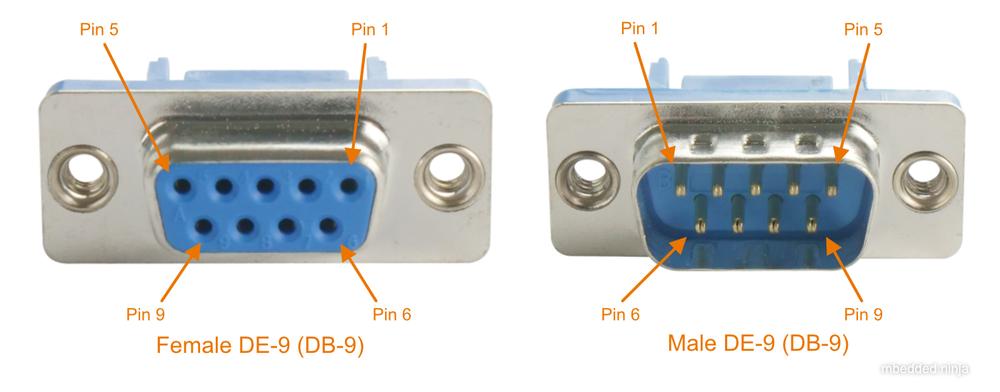
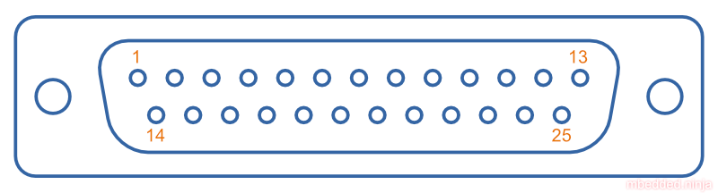

:imagesdir: 

## Overview

_D-Subminiature connectors_ (abbreviated to _D-Sub connectors_) were designed by ITT Canon in 1952. Large by today's standards, at the time, these connectors where one of the smallest connectors available for a computer, hence the name "subminiature". They are characterised by two or more rows of connections inside a **"D" shape** metal shell.

.One of the most commonly used D-sub connectors of this era, the 9-pin female PCB-mount DE-9 connector.
image::de-9-female-pcb-mount-d-sub-connector-photo.jpg[width=300px,link="/de-9-female-pcb-mount-d-sub-connector-photo.jpg"]

TIP: The **DE-9 is a very popular 9-pin computer serial cable**. It is also commonly (and **incorrectly**) called a DB-9 connector, presumably because of the name of larger DB-25 connector that it replaced.

Older serial communication protocols such as link:/electronics/communication-protocols/rs-232-protocol/[RS-232] and link:/electronics/communication-protocols/rs-485-protocol/[RS-485] are commonly transmitted across D-Sub connectors. The DE-15 connector is commonly used for VGA connections between computers and screens.

## Schematic Symbol

I recommend using the unique schematic symbol style below for the range of D-sub-miniature connectors. It immediately identifies the connector to the viewer.

.An easy-to-identify schematic symbol style for representing D sub-miniature connectors.
image::connector-db25-schematic-symbol.png[width=200px,link="/connector-db25-schematic-symbol.png"]

## Sizes

The available sizes are shown in the table below.

[cols="1,1,1,1,1,1"]
.The range of D-Subminiature connectors.
|===
2+h| Normal Density
2+h| High Density
2+h| Double Density

h| Name
h| Num. Pins (layout)
h| Name
h| Num. Pins (layout)
h| Name
h| Num. Pins (layout)

| DE-09
| 9 (8-7)
| DE-15
| 15 (5-5-5)
| DE-19
| 19 (6-7-6)

| DA-15
| 15
| DA-26
| 26 (9-9-8)
| DA-31
| 31 (10-10-11)

| DB-25
| 25
| DB-44
| 44 (15-15-14)
| DB-52
| 52 (17-18-17)

| DC-37
| 37 (19-18) 
| DC-62
| 62 (21-21-20)
| DC-79
| 79 (26-27-26)

| DD-50
| 50 (17-16-17) 
| DD-78
| 78 (20-19-20-19)
| DD-100
| 100 (26-25-24-25)

|
|
| DF-104
| 104 (21-21-21-21-20)
|
|
|===

## Backshells

D-subminiature connectors which are **attached to cables** (i.e. are not PCB mounted or panel mounted) are designed to be fitted with a _backshell_. The backshell **protects/encloses** the wire connections from from the cable, as well providing **mechanical support and strain relief** for the cable.

## Termination Styles

PCB Mount: The connectors has protruding pins (in either straight or right-angle orientation) so that the connector can be soldered to a PCB.

Solder Lug: Designed so that wires can be soldered onto the pins. This style of connector is designed to be panel mounted (**not PCB mounted**). Also called _solder bucket_.

## Pin Numbering

.Pin numbering for the D-sub DE-9 (a.k.a. DB-9) female and male connectors.

.Pin numbers for the male DB-25 connector, looking at the "front" of the connector which mates with the female part.

## Uses

Many older consumer products and prototype circuits of all ages use the DE-9 connector for link:/electronics/communication-protocols/rs-232-protocol[RS-232 communications]. However, it is becoming less common, with USB-to-UART cables becoming more popular, which get connected directly to a microcontrollers pins through flying leads, standard header, or USB connector (in this case the USB-to-UART converter is usually on the board itself, i.e. link:/programming/microcontrollers/arduino[Arduino boards]).

## Filtered D-sub Connectors

Filtered D-sub connectors have purposeful capacitance-to-ground (or more complicated filters) built into each one of the connectors pins.

.A graph of insertion loss vs. frequency for a Conec D-sub connector with integrated capacitance for filtering (a 'C' filter).

Compared to implementing the filtering on say, the PCB, filtering at the connector offers the advantage of increased EMI protection due to the filtering occurring at the point that the signal enters the enclosure (so the wires to the PCB don't radiate noise). It also saves PCB space and simplifies PCB routing/layout.

## Screw Kits

You can buy pre-made screw kits, such as the link:http://www.digikey.co.nz/product-search/en?vendor=0&keywords=5205817-1&stock=1[TE Connectivity 5205817-1], which comes with all the necessary screws and associated hardware to secure two D-sub connectors together (I might point out here that screws **are not required** to make a connection, but help to make it more secure).

.The TE Connectivity 5205817-1 D-Sub screw kit.

## Waterproof Variants

Waterproof variants of D-sub connectors exist, the two most common being a DE-9 or a DB-25.

.A waterproof DE-9 receptacle by Amphenol LTW.
image::amphenol-ltw-waterproof-serial-de-9-receptacle-connector.jpg[width=450px]