## Overview

The page also includes discrete oscillator elements such are crystals.

## Crystals

**_Crystals_ are piezoelectric components which can be used to build an oscillator**. Combined with driving circuitry, they form an oscillator which can be made to output a periodic waveform to be used as a clock source for digital logic (e.g. flipflops, microcontrollers, FPGAs, e.t.c.). They can also be called _piezoelectric resonators_.

.A schematic of a crystal, usually connected to a microcontroller or other digital device that uses a clock. The load capacitance usually varies from 6-25pF per leg (see the crystals datasheet for the correct value).
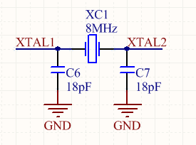

### Equivalent Circuit

A piezoelectric crystal resonator can be modelled as a series LCR circuit in parallel with a capacitor:

.The equivalent circuit for a two-lead piezoelectric crystal resonator.
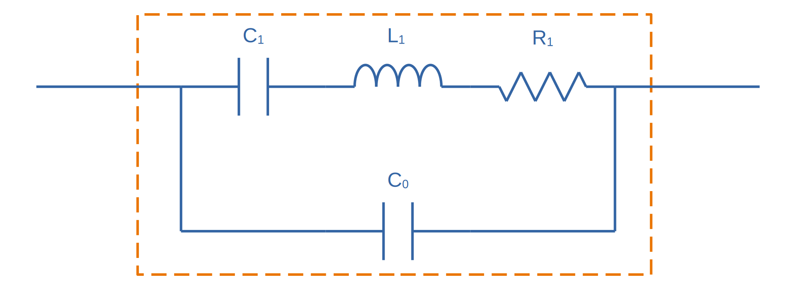

The series components stem:[C_1], stem:[L_1], and stem:[R_1] model the physical properties of the piezoelectric crystal. They are not real physical electronic components inside the crystal. The parallel component stem:[C_0] is the lead capacitance<<bib-cts-app-note-crystal-basics>>.

stem:[L_1]: This models the mechanical mass of the quartz in motion. Lower frequency crystals have a value of stem:[1-2H] (yes, that's whole Henries, much larger than micro/milli Henries of most real inductors!). This value can drop down to stem:[1-100mH] for the higher frequency crystals, which are smaller and therefore less mass.

stem:[C_1]: This models a number of mechnical properties of the quartz crystal: the stiffness, the area of the electrodes, and the thickness/shape of the wafer. The value for fundamental mode crystals ranges between stem:[0.005pF] and stem:[0.030pF].

stem:[R_1]: This models the impedance of the crystal when it is oscillating at it's series resonant frequency. When a series LC circuit is at resonant frequency, it's impedance is stem:[0\Omega], therefore the impedance (and therefore current) is purely determined by this stem:[R_1]. stem:[R_1] is inversely proportional to the active area of the crystal, therefore smaller crystals have a larger stem:[R_1].

stem:[C_0]: This models the parallel capacitance (a.k.a. _shunt capacitance_) between the two leads of a crystal. It is the measured capacitance between the two leads when the crystal is not excited (i.e. not vibrating). stem:[C_0] typically ranges from stem:[1-7pF].

### Quality Factor

The quality factor for crystal oscillators is extremely large, typically 10,000 or greater. This is due to the very low series resistance (typically around stem:[5\Omega].

The quality factor is determined by the following equation:

[stem]
++++
\begin{align}
Q &= \frac{X_L}{R} \\
  &= \frac{2\pi f L}{R} \\
\end{align}
++++

[.text-center]
where: +
stem:[X_L] is the impedance of the inductor. +

### Oven-Controlled Crystal Oscillators (OCXOs)

High-performance crystal oscillators are kept with temperature-controlled environments to increase the stability of the oscillator. They are called oven-controlled crystal oscillators (OCXOs).

.A photo of an N4A series OCXO. Image from http://www.bliley.com/.
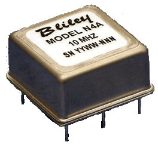

The crystals are designed to have a _turning-point_, a point of greatest stability, close to the oven temperature. OCXOs, rather than having a temperature stability in the ppm (parts-per-million) range like normal crystals, have a stability in the ppb (parts-per-billion) range (20ppb would be a viable stability).

Peltier devices can be used as the "oven" to keep the crystal's temperature constant.

### Popular Crystal Packages

The HC-49/U package is a popular choice for older through-hole crystals.

Newer crystals come in small, custom SMD packages, with typically either 2 or 4 pins (with the 4-pin packages usually have two GND pins).

### Simulation

Crystal oscillators can be difficult to simulate accurately in most SPICE-based programs<<bib-fast-crystal-oscillator-simulation-methodology>>. Most SPICE programs use the Newton-Raphson algorithm for converging to a solution. Unfortunately, the Newton-Raphson algorithm is not suitable for very high Q circuits, of which a crystal resonantor is definitely one (Q values of stem:[10,000] or more!). The time step has to be set so small for accurate simulation of crystal resonantor circuits that it can take days of simulation to "start-up" the ceramic resonantor (i.e. reach steady-state oscillation from power-on).

## Oscillators

This site uses the word _oscillator_ to represent a component with an **self-contained** oscillating feature that has power, ground, and signal out pins. This site uses the word _crystal_ to represent an component which contains a oscillating element (in the form of a crystal), which requires an **external oscillation circuit** before it useful.

### Designators

A common designator prefix to use for oscillators is stem:[Y] (e.g. stem:[Y1]). I do not recommend using the prefix stem:[XC] as this should be reserved for crystal oscillators.

### Important Parameters

#### Phase Noise

Phase noise is a way of describing the stability of the crystal in the frequency domain.

#### Start-Up Time

Symbol: stem:[T_{SU}]

The start-up time for most oscillators is within the range 2-20ms. This start-up time can be important in low-power designs when the start/stop time of the crystal results in wasted energy.

## MEMS Oscillators

MEMS oscillators are built using small mechanical structures (less than 0.1mm in any dimension) that vibrate at set frequencies when electrostatic forces are applied. This mechanical vibratory part of a MEMS oscillator is called the MEMS resonator. This is etched into a silicon die, and surrounding electronics contain both the driving, measuring, and compensation circuitry.

They use less power than a crystal-based oscillator, making them suitable for battery-powered devices. They are manufactured using standard IC manufacturing processes, so they are also more durable. They typically have better frequency stability over their operating temperature range, with common values being 10ppm at room temperature and 100pm over their entire operating temperature range.

**MEMS oscillators do not like ultrasonic cleaning baths**. Ultrasonic baths may permanently damage the oscillator or cause long term reliability issue<<bib-sit1533-mems-oscillator-datasheet>>.

### Packaging

MEMS oscillators have been made in packages which are also commonly used for crystal packages, such as the 2012 SMD package.

.A comparison between MEMS and crystal-based oscillators in CSP and larger 2012 SMD packages. Note how the MEMS oscillator sneaks in two extra pins between the standard 2012 pads for power and ground.
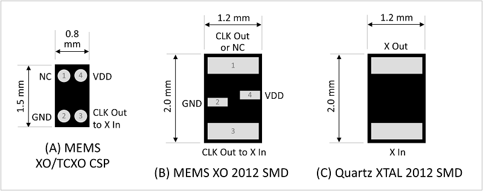

Some common industry sizes for oscillators include:

- 1612: 1.6 mm × 1.2 mm
- 2016: 2.0 mm × 1.6 mm
- 2520: 2.5 mm × 2.0 mm
- 3225: 3.2 mm × 2.5 mm
- 5032: 5.0 mm × 3.2 mm
- 7050: 7.0 mm × 5.0 mm

## Wien Bridge Oscillator

The Wien bridge oscillator is a relatively simple oscillator that can generate reasonably accurate sine waves. It is named after a bridge circuit designed by Max Wien in 1891 for the measurement of impedances. William R. Hewlett (of Hewlett-Packard fame) designed the Wein bridge oscillator using the Wein bridge circuit and the differential amplifier. 

.Schematics of a Wien bridge oscillator circuit, drawn in the traditional way with the RC and R networks shown as a bridge.
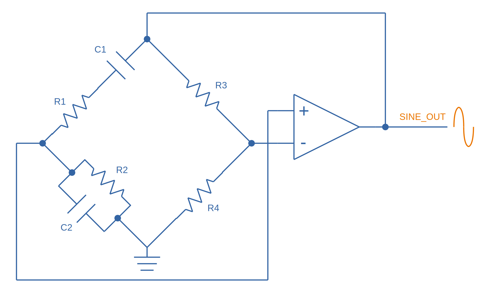

However the modern way to draw this is to split up the non-inverting and inverting feedback circuits like this:

.The modern way to draw the Wien bridge oscillator circuit, separating the non-inverting and inverting feedback sections.
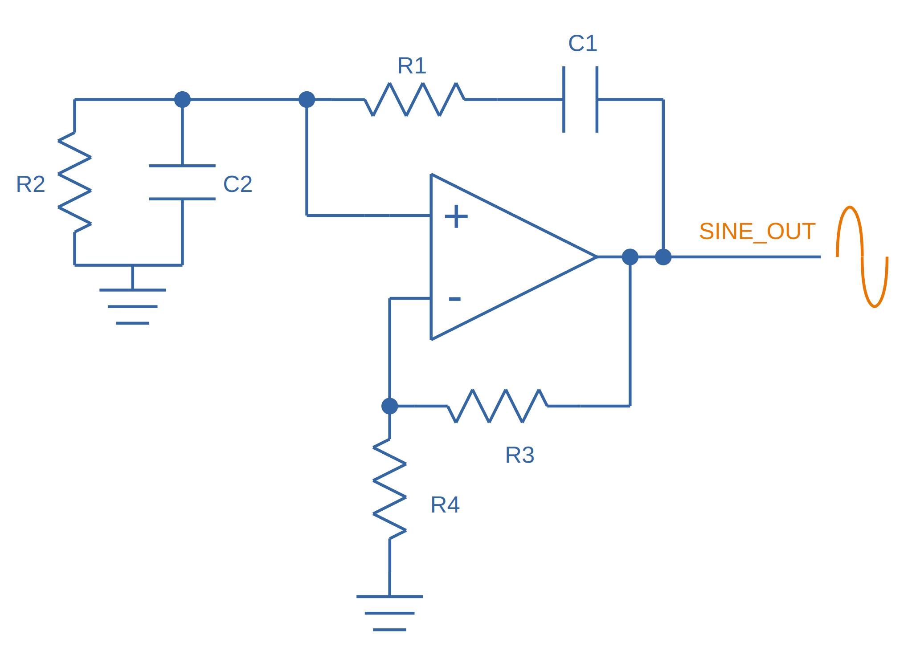

In my opinion this is a clearer way of drawing the circuit. Wien bridge oscillators are used in audio applications.

The series RC and parallel RC circuits form high-pass and low-pass circuit elements, respectively.

### Wien Bridge Equations

Let's first look at the series and parallel RC circuits that provide the positive feedback.

The impedance stem:[Z_S] of the series RC circuit is:

[stem]
++++
\begin{align}
  Z_S &= R + X_C \nonumber \\
  \label{eqn:zs}
  &= R + \frac{1}{j\omega C}
\end{align}
++++

The impedance stem:[Z_P] of the parallel RC circuit is:

[stem]
++++
\begin{align}
Z_P &= R \; || \; X_C \nonumber \\
    &= R \; || \; \frac{1}{j\omega C} \nonumber \\
    &= \frac{R \frac{1}{j\omega C}}{R + \frac{1}{j\omega C}} && \small \text{Rule for impedances in parallel.} \nonumber \\
    \label{eqn:zp}
    &= \frac{R}{j\omega RC + 1} && \small \text{Multiplying top and bottom by \(j\omega C\)}
\end{align}
++++

We can then write an equation for the voltage at the non-inverting pin of the op-amp in terms of the output voltage, and then describing it as a ratio we can get the gain of the RC network, `\(\beta\)` (the symbol `\(\beta\)` used here is consistent with the Barkhausen stability criterion):

[stem]
++++
\begin{align}
v_{\text{non-inv}} &= \frac{Z_P}{Z_P + Z_S} v_{out} && \tiny\text{Resistor divider rule} \nonumber \\
\frac{v_{\text{non-inv}}}{v_{out}} &= \beta = \frac{Z_P}{Z_P + Z_S}  \nonumber \\
    &= \frac{ \frac{R}{j\omega RC + 1} }{ \frac{R}{j\omega RC + 1} +  R + \frac{1}{j\omega C} } && \tiny\text{Subs in \(Eq. \ref{eqn:zs}\) and \(Eq. \ref{eqn:zp}\)} \nonumber \\
    &= \frac{ R }{ R + R(j\omega RC + 1) + \frac{j\omega RC + 1}{j\omega C} } && \tiny\text{Multiplying top and bottom by \(j\omega RC\)} \nonumber \\
    &= \frac{ j\omega RC }{ j\omega RC + j\omega RC(j\omega RC + 1) + j\omega RC + 1 } && \tiny\text{Multiplying top and bottom by \(j\omega C\)} \nonumber \\
    &= \frac{ j\omega RC }{ j\omega RC + (j\omega RC)^2 + j\omega RC + j\omega RC + 1 } && \tiny\text{Expanding brackets} \nonumber \\
    &= \frac{ j\omega RC }{ (j\omega RC)^2 + 3j\omega RC + 1 } && \tiny\text{Collecting terms} \nonumber \\
    \label{eqn:beta}
    &= \frac{ j\omega RC }{ -(\omega RC)^2 + 3j\omega RC + 1 } && \tiny\text{Using the identity \(j^2 = -1\)} \\
\end{align}
++++

Now if we focus on the purely resistive feedback network to the inverting pin of the op-amp, you should recognize this as the standard non-inverting gain configuration, where the gain is:

[stem]
++++
\begin{align}
\label{eqn:op-amp-gain-non-inv}
A &= 1 + \frac{R_3}{R_4} && \small \text{Gain equation for non-inverting op-amp.} \\
\end{align}
++++

In steady-state oscillation, the reduction in amplitude of stem:[v_{out}] to stem:[v_{non-inv}] as to be exactly "countered" by the gain provided from stem:[v_{non-inv}] to stem:[v_{out}]. This is also known as the Barkhausen criterion:

[stem]
++++
\begin{align}
| \beta A | &= 1 \\
\left(1 + \frac{R_3}{R_4}\right)\left(\frac{ j\omega RC }{ -(\omega RC)^2 + 3j\omega RC + 1 }\right) &= 1 && \small \text{Subs. in \(Eq. \ref{eqn:beta}\) and \(Eq. \ref{eqn:op-amp-gain-non-inv}\)}
\end{align}
++++

Now lets aim to separate the real and imaginary terms and write it as an equation which equals 0:

[stem]
++++
\begin{align}
\left(1 + \frac{R_3}{R_4}\right) j\omega RC = -(\omega RC)^2 + 3j\omega RC + 1 \nonumber \\
\left[ \left(\frac{R_3}{R_4} - 2\right) \omega RC \right] j + \left[ \omega^2 R^2 C^2 - 1 \right] =  0 \\
\end{align}
++++

For this equation to hold true, both the real and imaginary parts must be equal to 0. If we focus on the real part first we can find `\(\omega\)` in terms of stem:[R] and stem:[C]:

[stem]
++++
\begin{align}
\omega^2 R^2 C^2 - 1 &=  0 \nonumber \\
\omega  &= \frac{1}{RC} && \text{Re-arranging for \(\omega\)}
\end{align}
++++

Or in terms of natural frequency rather than angular frequency:

[stem]
++++
\begin{align}
f = \frac{1}{2\pi RC}
\end{align}
++++

We can now look at the real part of the equation, which also must be 0. This gives us criterion for the ratio of the resistors stem:[R_3] and stem:[R_4]:

[stem]
++++
\begin{align}
\left(\frac{R_3}{R_4} - 2\right) \omega RC &= 0 \nonumber \\
\frac{R_3}{R_4} - 2 &= 0 \nonumber \\
\label{eqn:r3-2-r4}
R_3 &= 2R_4 \\
\end{align}
++++

We can plug this back into the equation for the non-inverting gain of the amplifier so see what gain this results in:

[stem]
++++
\begin{align}
A_{\text{non-inv}} &= 1 + \frac{R_3}{R_4} \nonumber \\
                  &= 1 + \frac{2R_4}{R_4} && \text{Subs. in \(Eq. \ref{eqn:r3-2-r4}\)} \nonumber \\
                  &= 3
\end{align}
++++

### Realistic Wien Bridge Oscillator Circuits

**There is a problem with the above Wien Bridge oscillator circuits which limits them to the realm of theory only**. It all comes back to the requirement that the Wien Bridge oscillator must have a _loop gain_ of exactly 1 to function properly (Barkhausen stability criterion). If the gain is less than this, the oscillator will not start (or will stop if already started). If it is more than 1, the oscillator output will saturate and your sine wave output will start looking more like a square wave. Wien bridge oscillators typically need a non-linear component (a component which has a resistance which changes with applied voltage) to actively limit the loop gain and keep it at 1.

Common methods of actively limiting the gain include using:

* Incandescent bulb (resistance increases as it heats up)
* Diodes across in parallel with feedback resistors (resistance decreases as voltage increases)
* JFETs.

Wien bridge oscillators can also be made from a single supply<<bib-analog-devices-single-supply-wien-bridge>>.

### Diode Limited Example And SPICE Simulation

NOTE: I have just used the calculated capacitance and resistance values, and not picked the nearest realistic E96 value so that it's easier to keep track of where the values come from.

The first thing is to choose an oscillation frequency. Let's choose stem:[1kHz]. We will also choose an arbitrary capacitance of stem:[C = 10nF]. It's good to keep the capacitance somewhat low and use ceramic NP0/C0G type dielectrics, as they will introduce the lowest amount of distortion. This means we need a resistance of:

[stem]
++++
\begin{align}
R &= \frac{1}{2\pi fC} \\
  &= \frac{1}{2\pi 1kHz \cdot 10nF} \\
  &= 15.9k\Omega \\
\end{align}
++++

Let's use diodes as our non-linear element to make sure the loop gain stays at 1. The trick is to put the diodes in parallel with a portion of the stem:[R_3] resistance, and make the inverting feedback gain slightly larger than 3 before the diodes begin to conduct.

Ignoring the diodes for a moment, let's aim for a inverting gain of 3.2 and pick an arbitrary value for stem:[R_4] of stem:[1k\Omega].

[stem]
++++
\begin{align}
R_4 = 1k\Omega \\
\end{align}
++++

[stem]
++++
\begin{align}
A &= 1 + \frac{R_3}{R_4}          \\
3.2 &= 1 + \frac{R_3}{1k\Omega}   \\
R_3 &= 2.2k\Omega
\end{align}
++++

Now, we want the oscillations at stem:[v_{out}] to reach a decent proportion of the supply voltage before the diode kicks in. Since we are running of stem:[\pm 12V] supplies, lets make the diodes begin to conduct at stem:[5V]. Let's calculate how much current is flowing through the series leg of stem:[R_3] and stem:[R_4] when there is stem:[1V] at the output:

[stem]
++++
\begin{align}
I &= \frac{1V}{R_3 + R_4} \\
  &= \frac{1V}{1k\Omega + 2.2k\Omega} \\
  &= 0.312mA \\
\end{align}
++++

Assuming the diodes begin to conduct at stem:[0.6V], with stem:[0.312mA] of current flowing this would be across a resistance of:

[stem]
++++
\begin{align}
R_{3,diode} &= \frac{0.6V}{0.312mA} \\
          &= 1.92k\Omega             \\
\end{align}
++++

So we need to split stem:[R_3] into two resistors in series, one of stem:[1.92k\Omega] with the diodes across it stem:[R_{3,diode}] and one of:

[stem]
++++
\begin{align}
R_{3, no-diode} &= R_3 - R_{3,diode}      \\
                &= 2.2k\Omega - 1.92k\Omega \\
                &= 280\Omega            \\
\end{align}
++++

.Wien Bridge oscillator circuit.
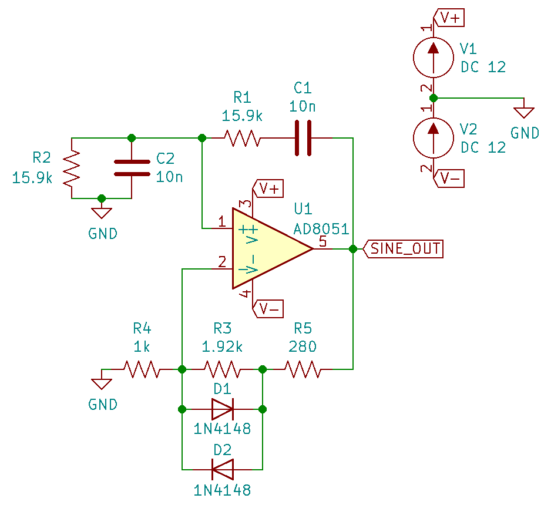

We can then simulate the circuit using ngspice (an open-source SPICE-like circuit simulator):

.SPICE simulation results for the Wien Bridge oscillator circuit shown above. Note how the circuit takes approx. 350ms to start-up, relying on noise (which SPICE does simulate) for the initial 'kick' to begin oscillating.
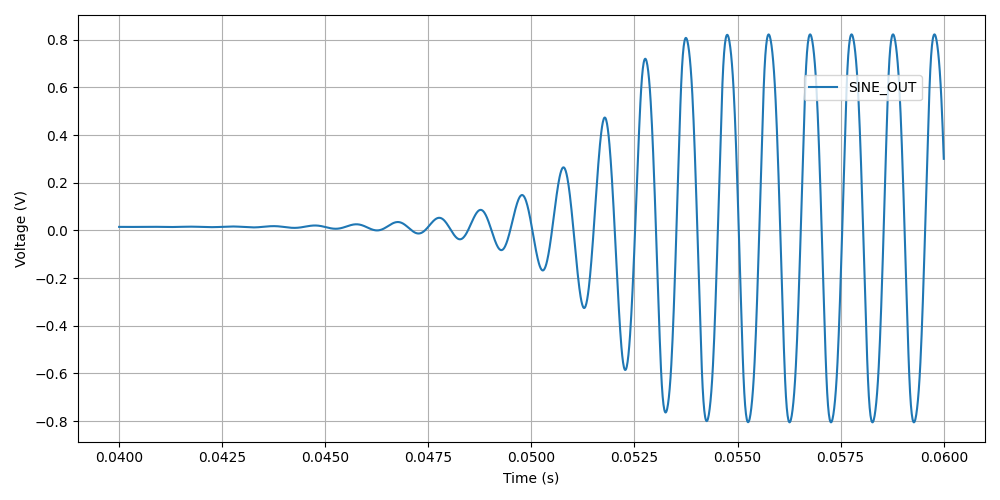

You can count 6 cycles in approx. 6ms, which puts the simulated frequency at:

[stem]
++++
\begin{align}
f &= \frac{6}{6ms} \\
  &= 1kHz
\end{align}
++++

which agrees well with what we designed for!

You can download the following assets:

* +++<a href="wien-bridge-oscillator/wien-bridge-oscillator-sim.sch" download>KiCad schematics</a>+++
* +++<a href="wien-bridge-oscillator/wien-bridge-oscillator-sim.cir" download>SPICE netlist (generated from the KiCad schematics)</a>+++

### JFET Gain-Limited Example

Using a JFET to partially switch in another resistor in parallel with the ground-connected gain resistor stem:[R_4] in the Wien bridge oscillator circuit is another method for preventing the oscillator for saturating (as opposed to the diode method shown above). **This JFET gain-limited approach is meant to introduce less distortion than the diode-limited approach above**, as the RC circuit driving the JFET's gate does not change much over a single cycle (assuming a suitable large RC time constant is picked).

Schematics of this technique are shown below, with the circuit setup to oscillate at the same frequency as the diode gain-limited variant mentioned above.

.A practical Wien bridge oscillator circuit using a JFET (Q1) as the non-element to actively limit the gain and prevent the oscillator from saturating.
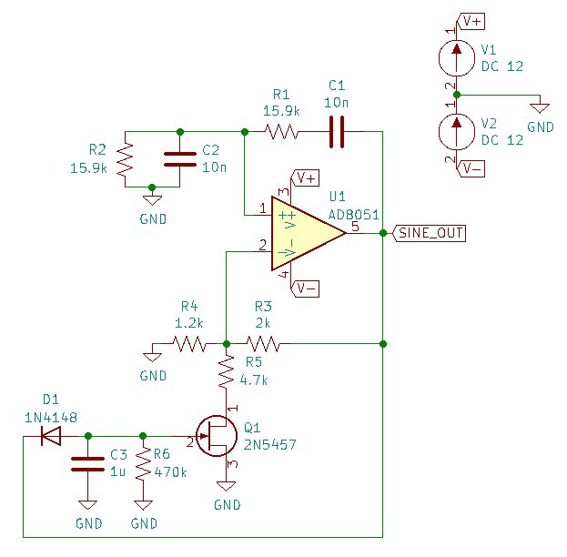

Note the diode and RC circuit controlling the JFET's gate. When the circuit is first powered up, the gate is at ground and hence the gate-source voltage stem:[V_{GS} = 0V]. Therefore the JFET is almost fully on (remember, link:/electronics/components/transistors/junction-gate-field-effect-transistor-jfets[JFETs are depletion mode devices]), and stem:[R_5] is in parallel with stem:[R_4], increasing the gain of the op-amp. As the output voltage beings to oscillate, on the negative part of the cycle, diode stem:[D_1] will conduct and charge the RC low-pass filter stem:[C_3] and stem:[R_6] with a negative voltage. This will decrease stem:[V_{GS}] below stem:[0V], which will begin to turn the JFET off. This will then increase the equivalent resistance of stem:[R_5] in parallel with stem:[R_4] and decrease the op-amp gain. This will continue until the system reaches a steady-state and oscillates forever.

And below are the simulation results for this circuit:

.SPICE simulation results for the JFET gain-limited Wien bridge oscillator circuit shown above. Notice the ringing on the gain that takes a few hundred milliseconds to stabilize.
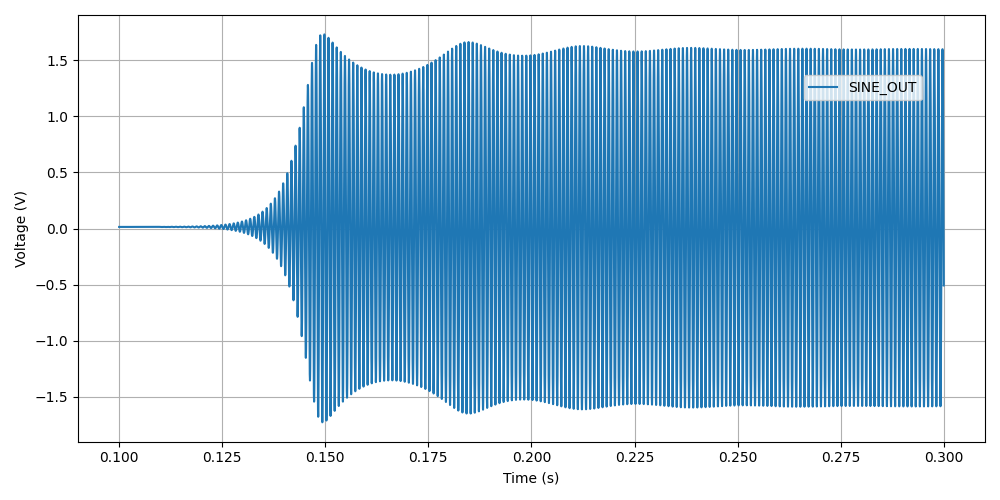

## Ring Oscillators

A _ring oscillator_ (a.k.a. _RO_) is an electronic oscillator made up of a **chain of an odd-number of digital logic NOT gates**. The output of the last NOT gate is fed into the input of the first. The oscillator relies on the _propagation delay_ from the input of the first NOT gate to the output of the last NOT gate to set the oscillation frequency.

.The world's most basic ring oscillator, using one NOT gate.
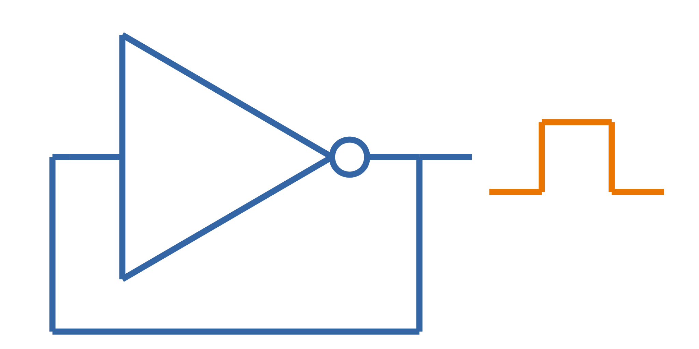

### Simulation

.KiCad schematic of a three stage ring oscillator (ready for simulation).
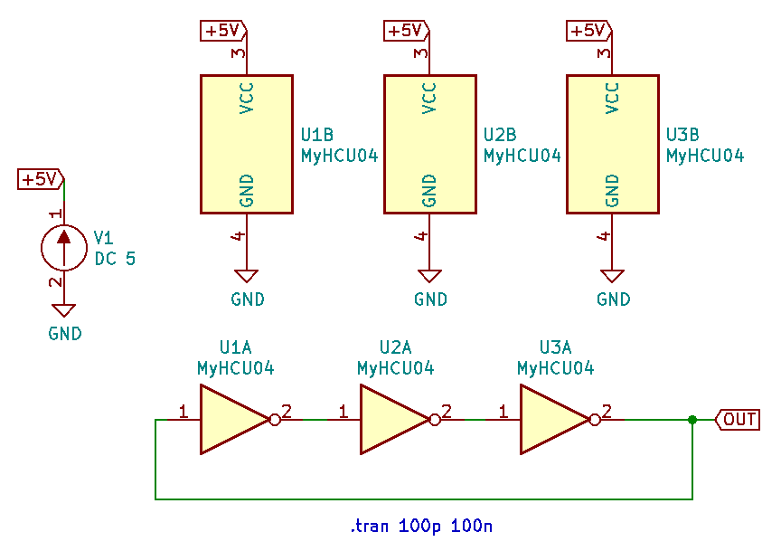

I ran into convergence issues when using the `74HCU04` SPICE model I found floating around on the internet (located in a file called [74HCng.lib](ring-oscillator-single/74HCng.lib)). Simulating one instance of the inverter worked fine, but I got the dreaded `doAnalyses: TRAN:  Timestep too small` error when connecting the second/third/e.t.c inverter in the ring. The convergence issue still occurred even when driving the first inverter instance from a slow frequency `PULSE` voltage source (rather than the driving it from the output of the last inverter), indicating it wasn't a problem with the ring structure.

I then looked harder around the internet and found the `MyHCU04` SPICE model [posted on Google Groups by the late Jim Thompson](https://groups.google.com/g/sci.electronics.basics/c/k93fFgwnw-s?pli=1):

> On popular request, 74HCU04 Spice Model rescued from 1993 archives and posted on the Device Models & Subcircuits page of my website...

This SPICE model for an inverter fixed the convergence issues I was having (if anyone else is interested in this file, I've saved it [here](ring-oscillator-triple/MyHCU04.lib)). Hurrah!

.It's working! Simulated output of the three stage ring oscillator schematic shown above.
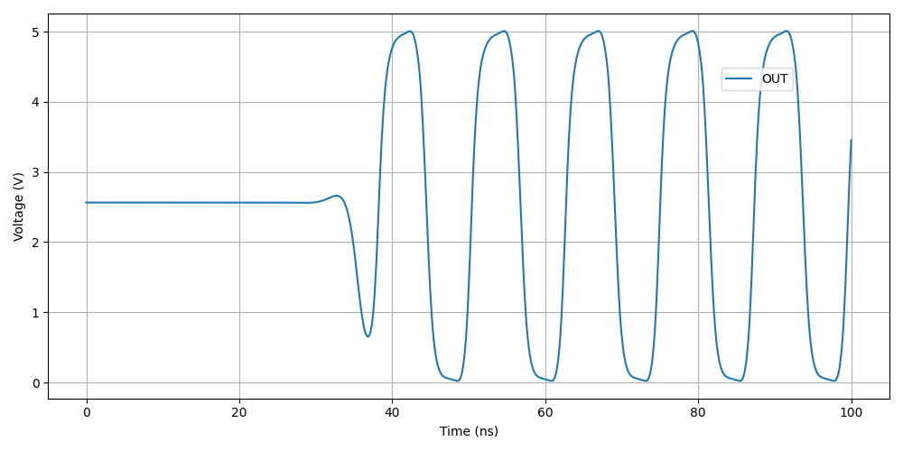

## Manufacturer Part Numbers

* **SiT1533AI**: SiTime standard clock oscillators and MEMS oscillators.
  * **SiT1533AI-H4-D14-32.768G**: MEMS clock oscillator.

[bibliography]
== References

* [[[bib-sit1533-mems-oscillator-datasheet, 1]]]: https://www.mouser.com/datasheet/2/371/SiT1533_rev1.4_03202018-1324419.pdf, retrieved 2021-01-18.
* [[[bib-cts-app-note-crystal-basics, 2]]]: https://www.ctscorp.com/wp-content/uploads/Appnote-Crystal-Basics.pdf, retrieved 2021-04-28.
* [[[bib-fast-crystal-oscillator-simulation-methodology, 3]]]: https://designers-guide.org/forum/Attachments/GEHRING_-_Fast_Crystal-Oscillator-Simulation_Methodology.pdf, retrieved 2021-04-28.
* [[[bib-elec-tutorials-crystals, 4]]]: https://www.electronics-tutorials.ws/oscillator/crystal.html, retrieved 2021-04-29.
* [[[bib-analog-devices-single-supply-wien-bridge, 5]]]: https://www.analog.com/media/en/technical-documentation/application-notes/AN-111.pdf, retrieved 2021-05-01.