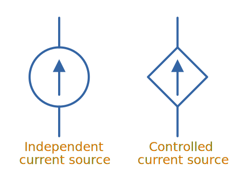
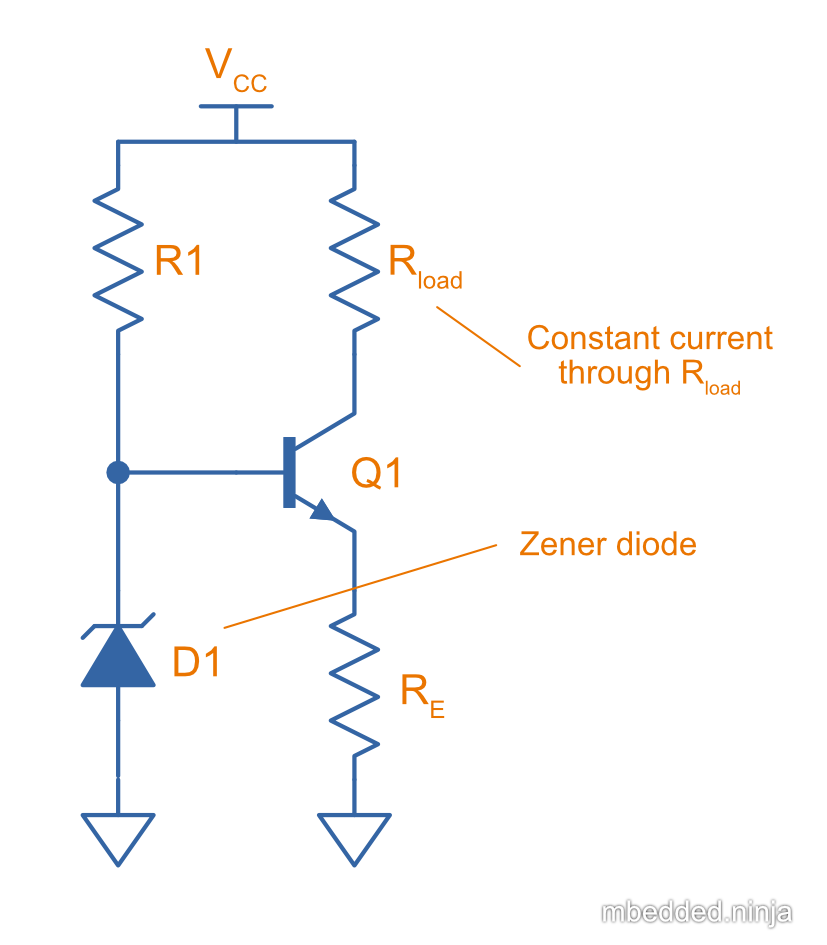
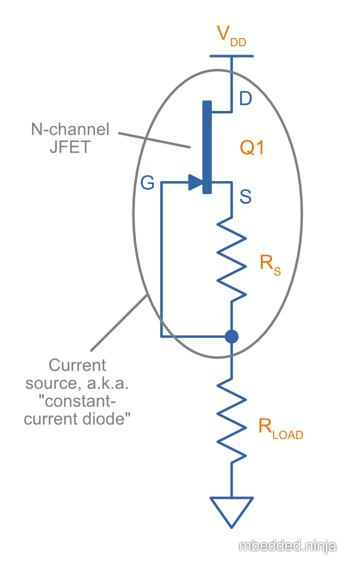

## Overview

_Current sources_ and _current sinks_ are electronic circuits which allow a fixed amount of current to flow through it, irrespective of the voltage across it. A current source (or sink) is not a single passive component, but a small circuit usually made from an active element (link:/electronics/components/transistors/[transistor], link:/electronics/components/op-amps/[op-amp]) and a few passives (such as link:/electronics/components/resistors/[resistors]). Current sources/sinks are used as a sub-circuit in many larger circuit designs.

Uses of current sources:

* Driving link:/electronics/components/diodes/#_light_emitting_diodes_leds[LEDs] (especially high power LEDs).
* Biasing link:/electronics/components/resistors/[resistors] for pull-ups/pull-downs.
* Charging link:/electronics/components/capacitors/[capacitors] to provide a linear increase in voltage across it (e.g. to make a sawtooth or triangular waveform).

Current sources are very common in circuit design, and as such are usually drawn using schematic symbols shown in <<curr-source-symbols>>. An independent current source is once which has a predetermined fixed set current. A _controlled_ (or _dependent_) current source is one which is determined by another measurable value in the circuit, usually a voltage (e.g. stem:[I_{source} = kV_{\text{somewhere else}}]). You may have seen a controlled current source symbol in the small-signal model for a BJT. Many analogue IC functional diagrams will show current sources with these symbols, hiding the discrete components they are made from.

[[curr-source-symbols]]
.Popular schematics symbols to represent current sources.

The _compliance_ of a current source is the voltage range that the current source can operate over and function correctly. Outside of this range, either components are damaged (maximum voltage ratings are exceeded) or the current falls out of regulation. 

Current sources may either provide power into a circuit (like a power supply), or require external power to operate.

## Zener Diode And BJT Current Source

<<zener-diode-bjt-current-source-schematic>> shows one of the popular methods for constructing a current source from a link:/electronics/components/diodes/#_zener_diodes[Zener diode] and link:/electronics/components/transistors/bipolar-junction-transistors-bjts/[BJT].

[[zener-diode-bjt-current-source-schematic]]
.Schematic of a Zener diode + BJT current source.

### How It Works

. The Zener diode stem:[D1], biased into it's voltage regulation range with resistor stem:[R1], maintains a steady voltage stem:[V_B] at the base of the BJT transistor.
. Using the rule that there is a stem:[0.7V] drop the base-emitter junction of a BJT, this puts a fixed voltage at the emitter also.
. Since this means there is a fixed voltage across stem:[R_E], this means by Ohm's law there is a fixed current through stem:[R_E].
. Because most of the current supplied to the emitter of a BJT comes from the collector (only about 100-800th of the current comes from the base, depending on the gain stem:[h_{FE}] of the BJT), this means there is a fixed current through stem:[R_{load}] also!

The current through the load is given by:

[stem]
++++
\begin{align}
I_{load} = \frac{V_Z - 0.7V}{R_E}
\end{align}
++++

[.text-center]
where: +
stem:[V_Z] is the voltage of the Zener diode in stem:[V] +
stem:[R_E] is the resistance of resistor stem:[R_E] in stem:[\Omega] +
stem:[I_{load}] is the resulting current through the load resistor, in stem:[A] +

## Constant-Current Diode (JFET Current Source)

The _constant-current_ diode (a.k.a _JFET current source_, _current-limiting diode_ (CLD), or _regulating diode_<<bib-centralsemi-curr-limiting-diode>>) is a very simple current source made from a link:/electronics/components/transistors/junction-gate-field-effect-transistor-jfets/[JFET] and optional resistor.

<<constant-current-diode-schematic>> shows the schematic for a constant-current diode.

[[constant-current-diode-schematic]]
.Schematic for a constant-current diode, a.k.a JFET current source. Current source is very simple, and consists of just an N-channel JFET and (optional) resistor. This two-terminal current source is not referenced to any rail and thus the load can be high-side, low-side, or anywhere in-between!

### How It Works

The constant-current diode works by using the resistor stem:[R_S] to negatively bias the N-channel JFET at a specific operating point. At this operating point the current from drain to source (and consequentially the load) will be relatively constant<<bib-elec-tut-fet-current-source>>.

TIP: Because of the typically large stem:[R_S > 100\Omega] this circuit is only suitable for making low-power current sources up to the stem:[10mA-100mA] range. 

### How To Calculate The Value Of The Resistor stem:[R_S]

. Decide on what N-channel JFET you are going to use and your desired constant current, stem:[I_D].

. You then calculate the required gate-source voltage<<bib-vishay-an103-jfet-constant-current-source>>:
+
[stem]
++++
\begin{align}
V_{GS} = V_{GS(off)} [ 1 - (\frac{I_D}{I_{DSS}})^{1/k} ]
\end{align}
++++
+
[.text-center]
where: +
stem:[V_{GS}] is the gate-source voltage required to bias the JFET at the correct current, in stem:[V] +
stem:[V_{GS(off)}] is the gate-source cutoff voltage, a parameter you can get from the JFETs datasheet, in stem:[V] +
stem:[I_D] is the current you want the current source to drive at, in stem:[A] +
stem:[I_{DSS}] is the zero gate-source drain current, a parameter you can get from the JFETs datasheet, in stem:[A] +
stem:[k] is the conduction parameter for the JFET, and depends on the device geometry. This is not normally mentioned in the datasheet, however for this equation you can generally assume it to be stem:[2]. +

. You can then find the value of stem:[R_S] with:
+
[stem]
++++
\begin{align}
R_S = \frac{V_{GS}}{I_D}
\end{align}
++++

The resistor stem:[R_S] can be replaced with a link:/electronics/components/potentiometers/[potentiometer] to create a variable current source, or for tuning/calibration of the current source to a precise value (typically a trimmer-style potentiometer would be used for this).

## Depletion-Mode MOSFET Current Source

TODO: Add info.

## Op-amp Current Sink

TODO: Add info.

[bibliography]
## References

* [[[bib-centralsemi-curr-limiting-diode, 1]]] Central Semiconductor Corp.. _What is a Current Limiting Diode?_. Retrieved 2022-01-11, from https://www.centralsemi.com/pdfs/selection/leaded/what_is_a_cld.pdf.
* [[[bib-vishay-an103-jfet-constant-current-source, 2]]] Siliconix (now Vishay) (1997, Mar 10). _AN103: The FET Constant-Current Source/Limiter_. Retrieved 2021-04-29, from https://www.vishay.com/docs/70596/70596.pdf.
* [[[bib-elec-tut-fet-current-source, 3]]] Electronics Tutorials. _FET Current Source_. Retrieved 2022-01-11, from https://www.electronics-tutorials.ws/transistor/fet-current-source.html.
