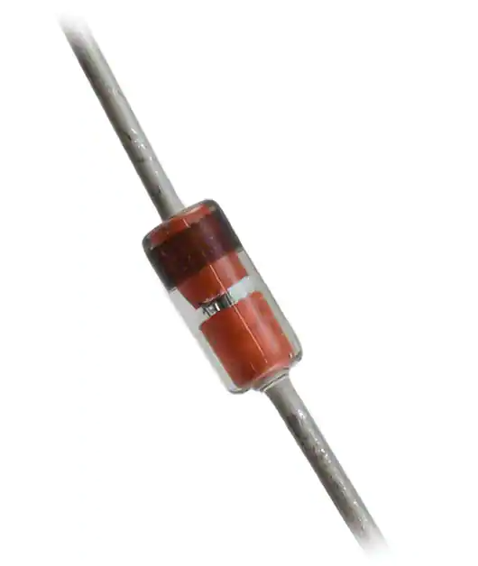
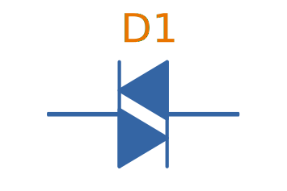
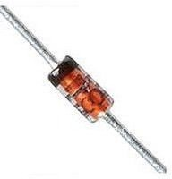
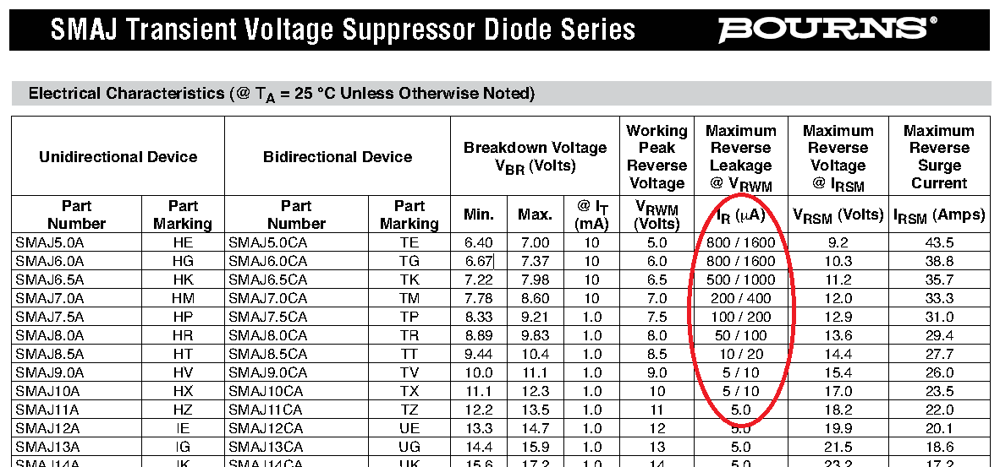
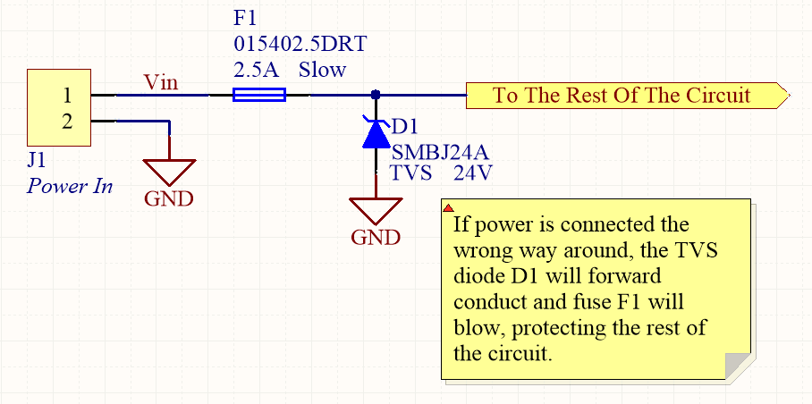
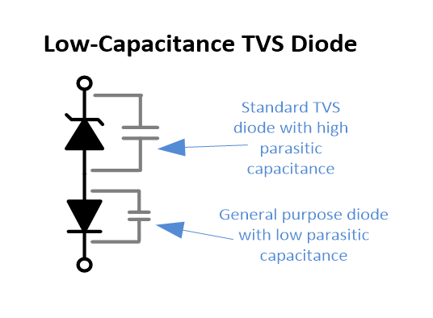
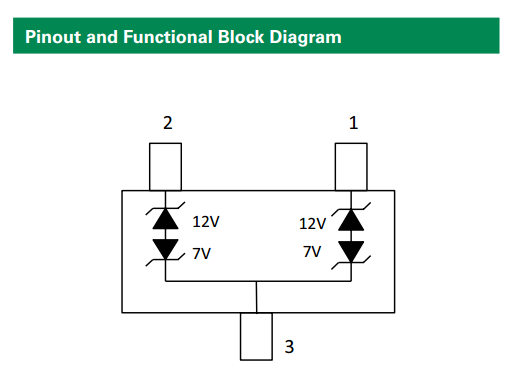
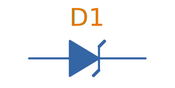
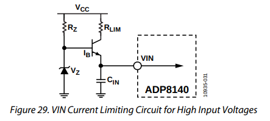

== Overview

Diodes are passive semiconductor components consisting of a single P-N junction. Their main property is that they only allow conduction of current in one direction but not in the other, which makes them a useful component in many electronic circuits.

There are many different types of diodes, including general-purpose diodes, Zener diodes to light-emitting diodes (LEDs). This page will walk you through the common types and what they are used for.

== Signal Diodes

_Signal diodes_ (a.k.a. _small signal diodes_) are designed for rectification of low power signals rather than the higher power electronics that general purpose diodes are designed to rectify. Although they can't handle high currents or high reverse voltages, they benefit from being able switch faster and therefore more suitable for higher frequency operation. Signal diodes are built in two different ways:

* Point contact diode
* Glass passivated diode

.Photo of the small signal 1N41488 diode by onsemi in the DO-35 component package. Image (C) onsemi.

SPICE model for the small signal `1N4148` diode:

[source]
----
.model 1N4148 D 
+ IS = 4.352E-9 
+ N = 1.906 
+ BV = 110 
+ IBV = 0.0001 
+ RS = 0.6458 
+ CJO = 7.048E-13 
+ VJ = 0.869 
+ M = 0.03 
+ FC = 0.5 
+ TT = 3.48E-9
----

## Photo Diodes

Note these are not be confused with photo-transistors, which are similar, but technically not photo diodes. Photo diodes have a faster response time than photo-transistors.

## Avalanche Photo-diodes (APDs)

Avalanche photo-diodes (APDs) are constructed in a similar manner to PIN diodes. The major difference is that they are operated with a much larger reverse voltage (100-200V for silicon based ones). This causes the avalanche effect (impact ionization) whenever photons strike the sensor, giving a current-gain of around 100. The current gain is roughly proportional to the applied reverse voltage, and for this reason some special avalanche diodes have been made which have a reverse breakdown voltage of over 1500V, allowing much higher gains (e.g. 1000).

Sometimes they can be operated above their maximum reverse voltage for short periods of time, giving even larger gains! When operated in this fashion, it is called **Geiger mode**.

APDs are used in range-finders and optical communications.

## Temperature Sensors

Diodes can be used as temperature sensors, as their forward voltage changes depending on the temperature. Most 3-pin active linear temperature sensors use a diode for the temperature measurement, along with additional circuitry to linearise and scale the reading. See the link:/electronics/components/sensors/temperature-sensors[Temperature Sensors page] for more information.

## Steering Diodes

Steering diodes is a name given to a configuration of two or more diodes that changes the direction of current depending on the polarity of the waveform.

They can be used to provide transient ESD protection.

.Steering diodes can be used for transient ESD protection. Image from http://www.protekdevices.com/Assets/Documents/Technical_Articles/ta1002.pdf.
image::steering-diodes-used-for-transient-esd-protection.png[width=500px]

They can be used alongside a potentiometer and 555 timer to create a PWM circuit.

.Schematic highlighting the steering diodes used to generate a variable duty-cycle PWM circuit using a 555 timer, without changing the frequency. Image from http://www.electroschematics.com/6950/555-duty-cycle-control/ (with modifications).
image::schematic-steering-diodes-used-for-555-timer-pwm-circuit.png[width=700px]

## Manufacturer Part Numbers

* **1N4148**: Common general-purpose diode family.
* **1N58xx**: Common Schottky diode family.
* **BZX384**: Series of Zeners in a SOD-323 package from Nexperia.
** **BZX384-B**: ±2% tolerance range.
** **BZX384-C**: ±5% tolerance range.
* **MM3Z**: Family of Zener diodes from Fairchild Semiconductor (now On Semiconductor). 
* **MMSZ52**: Family of Zener diodes from Diodes Incorporated.

== DIACs

The DIAC is a form of diode which conducts current only after it reaches it's breakover voltage. The diode then continues to conduct, even if the voltage reduces, until the point where current drops below it's holding current, at which point the DIAC goes back to it's initial non-conducting state.

=== Schematic Symbol

Below is the schematic symbol for the DIAC.

.The schematic symbol for a DIAC.

== PIN Diodes

A PIN diode is a semiconductor diode with a wide undoped intrinsic semiconductor region between a p-type and n-type semiconductor region (hence the name PIN).

.A photo of a small, through-hole PIN diode.

A "normal" PN diode has a very small intrinsic region, which is good when you wish to use the diode as a standard rectifier. The PIN diodes wide intrinsic region makes it an inferior rectifier, but makes it suitable for<<bib-wikip-pin-diode>>:

* Attenuators
* Fast switches
* Photodetectors (when used in a reversed-biased state)

=== Important Parameters

|===
| Parameter | Symbol | Units | Description

| Dark Current
| stem:[I_D]
| stem:[nA]
| Typically in the 0.1-5nA range.

| Extinction Ratio
| 
| none
| 

| Field of View
| FoV
|
|

| Output Rise Time
| stem:[t_r]
| s
|

| Responsivity
|
| A/W
|
|===

PIN diodes are normally operated in the reverse bias state.

Because of their good light-to-current linearity, they are commonly connected to a transimpedance amplifier (one which converts an input current into an output voltage). A typical example would be the Maxim MAX3658, which is designed for fibre-optic applications.

=== RF Applications

PIN diodes act as almost perfect resistors in the RF and microwave frequencies<<bib-wikip-pin-diode>>. The resistivity these AC waveforms see is dependent on the DC bias current flowing through the diode, and the intensity, wavelength and modulation rate of the incoming light.

Because the PIN diodes RF resistance is dependant on the DC bias current, they can be used as an RF switch or variable resistor. The RF resistance can range from about stem:[100m\Omega] to stem:[10k\Omega].

=== Reverse Recovery Time

PIN diodes have a very poor reverse recovery time.

== TVS Diodes

TVS (transient voltage suppressor) diodes are used to protect traces from high voltage spikes. They are designed to be operated in the reverse direction and work by shunting currents when the reverse voltage exceeds the **avalanche breakdown potential**. They are basically **high-power Zener diodes**, and are a specialized form of an _avalanche diode_.

They are part of a family of components used for ESD (electro-static discharge) protection, which also includes Zener diodes (however, ESD is not the only thing Zeners are used for). TVS diodes can handle large amounts of peak power (hundred's or thousands of Watts), but Zeners have a tighter voltage tolerance. TVS diodes have more capacitance than Zeners, which could be detrimental in some circumstances (e.g. when protecting the gate signal on a MOSFET).

They come in either uni-directional or bi-directional flavours. Uni-directional TVS diodes block up to the rated voltage in one direction, and behave like a normal conducting diode in the other. Bi-directional block up to the rated voltage in both directions (good for protecting AC waveforms). Use uni-directional diodes if possible, they are cheaper, and they have much faster turn-on times than their bi-directional counterparts (e.g. 4ps compared to 4ns).

=== Schematic Symbol

.My preferred schematic symbol for a uni-directional TVS diode (or any other type of avalanche diode for that matter). Notice the double bar distinguishing it from a Zener diode symbol.

=== Arrays

They can be grouped into IC packages called arrays. A typical schematic symbol for a diode array is shown below.

.The schematic symbol of a diode array, with a common anode connection.
image::schematic-symbol-esd-diode-array.png[width=300px]

=== Important Parameters

==== Breakdown Voltage

Symbol: stem:[V_{breakdown}] +
Units: stem:[V]

Also called the reverse breakdown voltage. This is the reverse voltage (cathode-to-anode) at which the diode "begins" to conduct. The point at which the diode begins to conduct is usually specified as a fixed current, typically 1mA.

==== Rated Power

Symbol: \( P \) +
Units: \( W \)

The maximum power the TVS diode can dissipate, for a specified time period. Typical values range between 400W-1.5kW.

==== Standoff Voltage

Symbol: \( V_{standoff} \) +
Units: \( V \)

This is the reverse voltage that the diode can withstand without drawing "any" current. This is one of the most important parameters, as you usually match this voltage to the maximum operating voltage of the wire you are connecting it to. Note that there is a small amount of current drawn at this voltage, this is called the reverse leakage current.

==== Leakage Current

The reverse-leakage of TVS diodes decreases as the stand-off voltage increases. Be warned, the leakage current of TVS diodes which have low voltage stand-offs (e.g. <10V), can have large leakage currents! A 5V stand-off TVS diode typically has a reverse-leakage current of around 500uA, but TVS diodes with a stand-off voltage of 10V or higher have a reverse-leakage of 1uA or less. Note that at low stand-off voltages, the leakage current of a bi-directional diode can be double that of a uni-directional diode for the same stand-off voltage.

.Leakage currents of TVS diodes with low stand-off voltages.

For more information, see the link:/electronics/circuit-design/esd-protection[ESD Protection] page.

=== Reverse Polarity Protection

Unusually, TVS diodes. along with a fuse or other current-limiting device, can act as a **very good reverse-polarity protection mechanism** on inputs to a PCB. They are usually present on a voltage rail input for the primary reason of reducing ESD. However, if the V+ and GND are connected to the PCB the wrong way around, the TVS diode will forward conduct and clamp the voltage to a normally non-destructive 0.7-1.5V. A current-limiting device like a fuse also has to be present to prevent the TVS diode from overheating.

They are especially suited to this role (when considering other diodes) as the are usually built to dissipate large amounts of heat.

.A TVS diode (along with a fuse) can also be a good mechanism for reverse-polarity protection.

In the schematic above, the **fuse will quickly blow** if the power supply is connected to the input connector the wrong way around.

=== Low Capacitance

There are a family of TVS diodes called low-capacitance (or ultra-low) TVS diodes. They have much less capacitance than standard TVS diodes (typical capacitances are between 0.4-0.9pF), and are designed for protecting high-speed data lines such as those used in USB, HDMI, DisplayPort, and Ethernet communication protocols and also for RF antennas such as GPS, FM radio and NFC antenna lines.

This low capacitance is achieved by adding a forward-biased general purpose diode in series with the usual reverse-biased TVS (zener-style diode). The schematic symbol for a low-capacitance TVS diode is shown below:

.The internal schematic of a low-capacitance TVS diode, showing the forward-biased general purpose diode added in series to greatly reduce the total capacitance of the component.

The forward-biased general purpose diode has a much smaller parasitic capacitance than the zener diode. Because the parasitic capacitances are in series (grey capacitors in diagram), the total capacitance of the component is greatly reduced!

=== Special-Purpose TVS Diodes

==== RS-485 TVS Diodes

TVS diodes built specifically for protecting RS-485 communication protocol bus lines are bi-directional and have two different hold-off voltages to meet the RS-485 spec. They normally include the character sequence "SM712" in their part name (e.g. SM712-02HTG by Littelfuse and SM712-TP by Micro Commerical).

.The pintout and functional block diagram of the SM712-02HTG TVS diode, designed specifically for protecting RS-485 bus lines. Image from http://www.littelfuse.com/~/media/electronics/datasheets/tvs_diode_arrays/littelfuse_tvs_diode_array_sm712_datasheet.pdf.pdf.

More information on these diodes can be found in the link:/electronics/communication-protocols/rs-485-protocol#specialised-tvs-diodes[Specialised TVS Diodes section on the RS-485 Protocol page].

== Zener Diodes

Zener diodes are diodes which have a specified reverse blocking voltage at which they breakdown and begin to conduct. They are similar to TVS diodes, but generally have a more defined and precise breakdown voltage, but a lower power rating. The allows Zeners to be used a shunt-style voltage regulators to power small circuits and as such, are sometimes called _voltage regulator diodes_. Shunt voltage references are similar in concept to zener diodes, except that they are more precise but can't dissipate as much power.

Uses for zener diodes include:

* Low power/simple voltage reference
* Over-voltage protection for low power applications (use TVS diodes to dissipate high energy voltage spikes)
* To turn on a sub-circuit once a certain voltage level is reached (e.g. an LED in a simple battery charging circuit)

You can purchase Zeners with a reverse voltage drop as low as stem:[1.8V] all the way to above stem:[100V]. For voltage drops less than 1.8V, you can stack (i.e. place in series) multiple normal or schottky diodes in forward bias.

=== Schematic Symbol

.The schematic symbol for a Zener diode.

=== How To Read A Zener Diode Datasheet

A zener voltage stem:[ V_Z ] is given at a Zener test current stem:[ I_{ZT} ]. stem:[ V_Z ] is the voltage the Zener regulates to. The test current typically a current large enough to overcome the "knee" in the voltage vs. current curve, and put the Zener into it's "voltage regulation" state (where the voltage stays relatively stable with large changes in current).

=== Regulation Performance And Dynamic Resistance

Low voltage (1-4V) Zener diodes are notoriously bad at voltage regulation due to their high dynamic resistance compared to their high-voltage siblings.

=== Simple Voltage-Limiting Circuit With A Zener Diode

You can build a simple voltage limiting circuit from a Zener diode, a NPN BJT transistor, and a couple of resistors. The schematic below shows an example of this, used to limit the maximum voltage to the stem:[V_{in}\,] pin of the ADP8140 LED driver IC.

.A simple Zener/NPN based voltage limiter circuit for the input to the ADP8140 LED driver IC. Image from https://www.analog.com/media/en/technical-documentation/data-sheets/ADP8140.pdf.

The voltage at stem:[V_{in}\,] is regulated to approximately stem:[ V_Z - 0.7V ]. The current through stem:[R_Z] is:

[stem]
++++
I_{RZ} = \frac{V_{CC} - V_Z}{R_Z}
++++

For more information, see the link:/electronics/circuit-design/esd-protection[ESD Protection] page.

=== Popular Zener Diodes

==== BZX55 Series

The BZX55 series of Zener diodes was (and still is) a popular choice for a standard through-hole Zener diode, provided in the link:/pcb-design/component-packages/do-35-do-214ah-component-package/[axial DO-35 package]. Manufactured by Vishay. Zener voltages range from 2.4V to 74V with a power dissipation of 500mW<<bib-bzx55-datasheet>>.

.BZX55 zener diode part number breakdown.
[source,text]
----
         BZX55    B   3V3
Family --|        |   |
Tolerance --------|   |
B=2%, C=5%            |
Zener Voltage --------|
3V3=3.3V, 12=12V
----

## Constant-Current Diodes

_Constant-current diodes_ are two terminal current sources made from a N-channel JFET and resistor. You can either make one yourself or buy a discrete component containing the JFET and resistor built-in. See link:/electronics/components/current-sources-and-sinks/#_constant_current_diode_jfet_current_source[Current Sources And Sinks: Constant-Current Diode (JFET Current Source)] for schematics, equations and worked examples.

.Schematic of a constant-current diode. See link:/electronics/components/current-sources-and-sinks/#_constant_current_diode_jfet_current_source[Current Sources And Sinks: Constant-Current Diode (JFET Current Source)] for more info.
image::/electronics/components/current-sources-and-sinks/constant-current-diode-schematic.png[width=350px,link="/electronics/components/current-sources-and-sinks/constant-current-diode-schematic.png"]

[bibliography]
== References

* [[[bib-bzx55-datasheet, 1]]] Vishay (2019, Mar 11). _BZX55 Series Datasheet_. Retrieved 2021-09-25, from https://www.vishay.com/docs/85604/bzx55.pdf.
* [[[bib-vishay-1n400x-datasheet, 2]]] Vishay (2020, Apr 29). _1N400x Datasheet: General Purpose Plastic Rectifier_. Retrieved 2021-09-26, from https://www.vishay.com/docs/88503/1n4001.pdf.
* [[[bib-wikipedia-crystal-detector, 3]]] Wikipedia. _Crystal detector_. Retrieved 2021-09-26, from https://en.wikipedia.org/wiki/Crystal_detector.
* [[[bib-wikip-pin-diode, 4]]] Wikipedia. _PIN diode_. Retrieved 2021-11-25, from https://en.wikipedia.org/wiki/PIN_diode.
* [[[bib-digikey-nte-11n4007, 5]]] DigiKey. _NTE Electronics, Inc 1N4007_. Retrieved 2021-11-25, from https://www.digikey.com/en/products/detail/nte-electronics-inc/1N4007/11645794.
* [[[bib-digikey-onsemi-1n4148, 6]]] DigiKey. _onsemi 1N4148_. Retrieved 2021-11-25, from https://www.digikey.co.nz/en/products/detail/onsemi/1N4148/458603.
