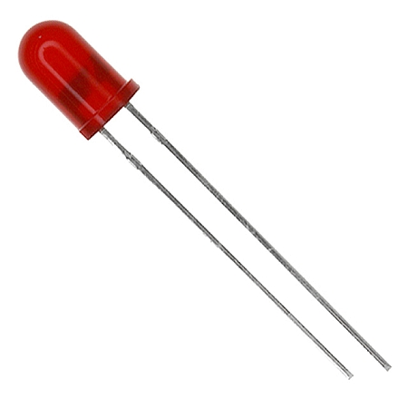
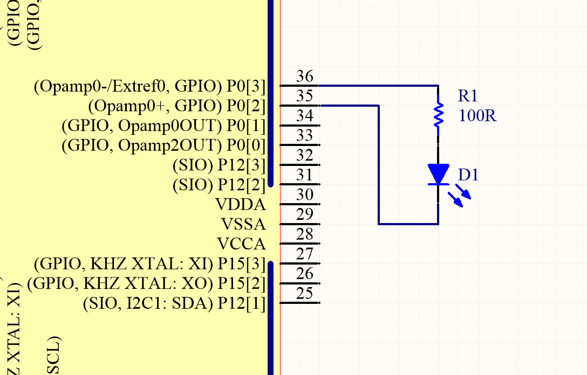
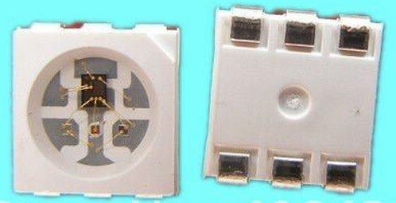
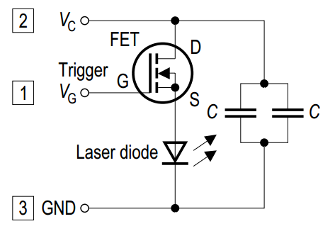
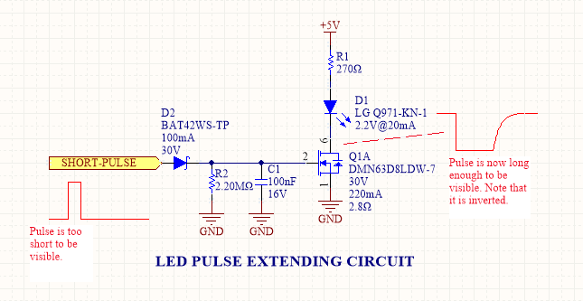
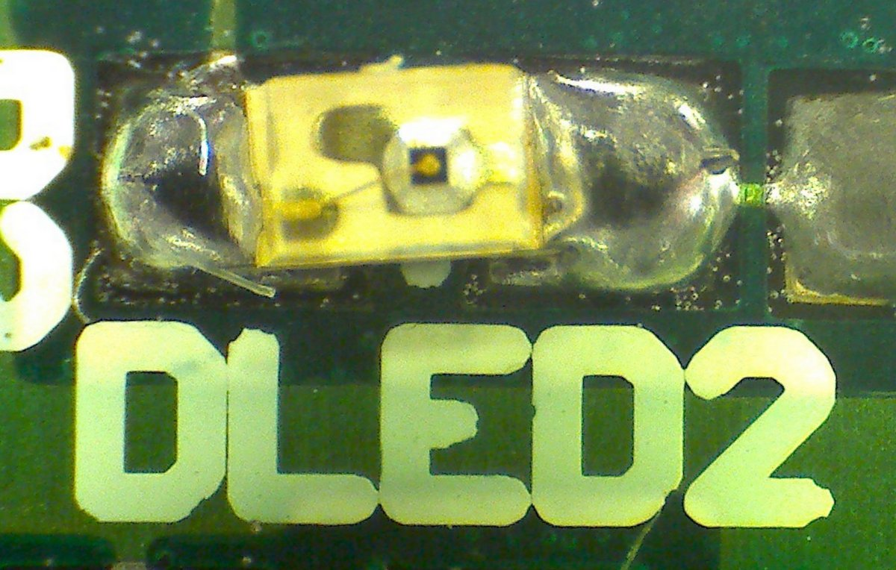

== Overview

Diodes are passive semiconductor components consisting of a single P-N junction. Their main property is that they only allow conduction of current in one direction, which makes them a useful component in many electronic circuits.

== General Purpose Diodes

=== Schematic Symbol And Designator

On schematics, general purpose diodes use the schematic symbol `D` (as do all most all types of diodes) and use the following symbol (most other types of diodes DO NOT use this symbol, they use slightly adjusted versions).

.The schematic symbol for a general purpose diode. The anode is the left pin and the cathode is on the right. Most other types of diodes (Schottky, Zener, e.t.c) use a slightly adjusted version of this symbol to distinguish themselves from the general purpose variety.

TIP: A handy mnemonic for remembering the polarity of a diode is to remember that the triangle in the symbol points in the direction of "forward" current (current when the diode is forward conducting).

Some believe that the diode symbol originated from the drawing of a point contact crystal diode, an early form of diode made from crystal and metal, used in things such as "crystal radio" sets<<bib-wikipedia-crystal-detector>>.

=== Parameters

[cols="2,1,5"]
|===
| Parameter | Symbol | Description

| Maximum Continuous Forward Current
| stem:[I_{f(cont)}]
| The maximum continuous current the diode can withstand, usually limited by overheating. Typically 20-500V.

| Forward Voltage
| stem:[V_f]
| The forward voltage drop, usually rated at maximum continuous current (stem:[I_f]). An ideal diode would have no forward voltage drop. Schottky diodes have the lowest forward voltage drop of any diode. Generally, the smaller the forward voltage drop, the larger the reverse-leakage. The higher the temperature, the smaller the forward voltage drop. Typically 0.3-1.2V.

| Reverse-leakage Current
| stem:[I_R]
| The leakage current when the diode is reverse-biased at the stand-off voltage. An ideal diode would have no reverse-leakage current. Generally, the smaller the reverse-leakage current, the larger the forward voltage drop. The higher the temperature, the higher the reverse-leakage current. Typically 10nA-1mA.

| Peak-surge forward current
| stem:[I_{FSM}]
| The forward current the diode can handle for a small amount of time. The exact time depends on the standard used to calculate this value (usually JEDEC). The is normally so you can determine the diode can handle inrush current/inductive energy pulses of a particular circuit.
|===

Some other important properties of diodes are their ability to prevent conduction until a certain, configurable breakdown voltage, and a conduction current that is related to the square of the voltage across it.

Diodes come in many link:/pcb-design/component-packages[component packages], one of the most common being the link:/pcb-design/component-packages/do-41-component-package[through-hole DO-41 package]. They also come in standard SMD packages. It is a good idea to add polarity marks to the silkscreen layer on  diode footprints. The picture below shows polarity marks being added to a diode with a 0603 footprint.

.Polarity marks have been added to the silkscreen layer for these 0603 diodes.
image::silkscreen-polarity-marks-on-0603-diode-footprint.png[width=500px]

=== Polarity

Most diodes have their polarity marked with a single line near the cathode (the "more negative" end when conducting current). They will let current flow from anode to cathode but not in the other direction.

NOTE: Some diodes, such as bi-directional TVS diodes, do not have a polarity.

SPICE model for the general-purpose `1N4148` diode:

[source]
----
.model 1N4148 D 
+ IS = 4.352E-9 
+ N = 1.906 
+ BV = 110 
+ IBV = 0.0001 
+ RS = 0.6458 
+ CJO = 7.048E-13 
+ VJ = 0.869 
+ M = 0.03 
+ FC = 0.5 
+ TT = 3.48E-9
----

=== Can Diodes Share Current?

The short answer: No!

The slightly longer answer...

Diodes have a **negative resistive thermal co-efficient**, that is, as they warm up, their resistance decreases. This means that if you connect two or more diodes in parallel to share the current, one will heat up a bit faster than the other, start to conduct more, heat up even further, start to conduct even more, e.t.c., until one is conducting almost all the current (and leading to thermal runaway!). This even occurs when the diodes are the same part number and from the same production run, due to the fact that there is always small differences between any two diodes. One way to prevent one diode from gobbling all the current is to add current-sharing resistors to each diode leg. They should be identical in resistance and have to drop at least stem:[0.3-0.4V] (when the diode has a nominal voltage drop of around stem:[0.7V]) to be effective.

=== Bridge Rectifiers

_Bridge rectifiers_ are 4 diodes connected in such a way that they **rectify** an AC voltage waveform into a DC one. <<bridge-rectifier-schematic>> shows how a bridge rectifier is made from four diodes, and where the input AC and output DC signals are connected. 

[[bridge-rectifier-schematic]]
.Basic circuit diagram showing the construction of a bridge rectifier from four general purpose diodes.

WARNING: Whilst the output of a bridge rectifier is technically DC, the voltage is still changing by a decent amount! The output begins to look like regular, stable DC once you start adding capacitance (and at stem:[50-60Hz] power line frequencies, a lot of it!).

The image below shows a bridge rectifier being used after a transformer to convert stem:[12VAC] (rms) into stem:[12VDC]. Note that the frequency of the ripple will be twice the AC input frequency (stem:[2\cdot 50Hz = 100Hz]).

.A schematic of an AC-DC power-supply that uses a bridge rectifier.
image::transformer-bridge-recitifier-cap-240vac-to-12vdc.png[width=800px]

Bridge rectifiers can have snubber elements attached to each diode. This helps reduce the high-frequency noise which can be induced when the diodes themselves switch on/off, due the leakage inductance and parasitic capacitance of the transformer (which cause oscillations when the diodes essentially change the output impedance). Typical values for the snubber circuit are a stem:[47pF] capacitor in series with a stem:[2k\Omega] resistor.

=== Ideal Diodes

One of the main departures that any physical diode has from the concept of an ideal diode is it's non-zero forward voltage drop. You can however compensate for this by making an _ideal diode_ circuit from an op-amp and a diode. See link:/electronics/components/op-amps/#_ideal_diodes[Op-Amps § Ideal Diodes] for more information.

=== Popular General Purpose Diode Part Numbers

==== 1N400x Family

The `1N400x` family of general purpose diodes have a forward current of 1A and reverse voltage ratings of 50-1000V. They come in the through-hole axial link:/pcb-design/component-packages/do-41-component-package/[DO-41 package].

.Specifications of the various diodes in the `1N400x` family<<bib-vishay-1n400x-datasheet>>.
|===
| Part Num.            | 1N4001 | 1N4002 | 1N4003 | 1N4004 | 1N4005 | 1N4006 | 1N4007

| Forward Current      | 1A     | 1A     | 1A     | 1A     | 1A     | 1A     | 1A
| Max. Reverse Voltage | 50V    | 100V   | 200V   | 400V   | 600V   | 800V   | 1000V
|===

== Schottky Diodes

_Schottky diodes_ (a.k.a. _Schottky barrier diode_ or _hot-carrier diode_) are diodes formed from a semiconductor-metal junction, rather than a semiconductor-semiconductor junction of a traditional diode. This creates a lower forward voltage drop than standard diodes (typically 0.3V instead of 0.7V), and consequentially also faster switching speeds. They are used in applications where:

* The input voltage is small.
* In high power applications in where the power consumption of the diode needs to be kept to a minimum (e.g. in a link:/electronics/components/power-regulators/switch-mode-power-supplies-smps/[SMPS]).
* High switching speed applications.

=== How They Are Made

Unlike general purpose diodes which are formed from the junction of N-doped and P-doped semiconductors, **Schottky diodes are formed from the junction of a semiconductor with a metal**<<bib-wikipedia-schottky>>. This semiconductor-metal junction is called a Schottky barrier, named after German physicist Walter H. Schottky.

=== Schematic Symbol And Designator

.The schematic symbol and designator for the Schottky diode. Note the curls on the bar, which differs from the general-purpose diode symbol. The anode is the left pin and the cathode is the right pin.

=== Popular Schottky Diode Part Numbers

==== BAT42/BAT43

The BAT42 and BAT43 are popular Schottky diodes, traditionally provided in the link:/pcb-design/component-packages/do-35-do-214ah-component-package/[axial DO-35 package]. Manufactured by Vishay and STMicroelectronics (among others). The main (and potentially only?) difference between the BAT42 and BAT43 seems to be that the forward voltage for the BAT42 is measured at 10 and 50mA, whilst for the BAT43 it is measured at 2 and 15mA.

==== 1N58xx Family

The 1N58xx family of Schottky diodes are typically provided in the link:/pcb-design/component-packages/do-41-component-package/[DO-41 package]. Part numbers increment from `1N5817` (20V, 1A) through to `1N5825` (40V, 5A).

.`1N58xx` Schottky diode part number breakdown.
[source,text]
----
  1N58    17
  |       |
Family    |
          |
Voltage/Current Rating
17-19=1A,20-22=3A,23-25=5A
----

## Photo Diodes

Note these are not be confused with photo-transistors, which are similar, but technically not photo diodes. Photo diodes have a faster response time than photo-transistors.

## Avalanche Photo-diodes (APDs)

Avalanche photo-diodes (APDs) are constructed in a similar manner to PIN diodes. The major difference is that they are operated with a much larger reverse voltage (100-200V for silicon based ones). This causes the avalanche effect (impact ionization) whenever photons strike the sensor, giving a current-gain of around 100. The current gain is roughly proportional to the applied reverse voltage, and for this reason some special avalanche diodes have been made which have a reverse breakdown voltage of over 1500V, allowing much higher gains (e.g. 1000).

Sometimes they can be operated above their maximum reverse voltage for short periods of time, giving even larger gains! When operated in this fashion, it is called **Geiger mode**.

APDs are used in range-finders and optical communications.

## Temperature Sensors

Diodes can be used as temperature sensors, as their forward voltage changes depending on the temperature. Most 3-pin active linear temperature sensors use a diode for the temperature measurement, along with additional circuitry to linearise and scale the reading. See the link:/electronics/components/sensors/temperature-sensors[Temperature Sensors page] for more information.

## Steering Diodes

Steering diodes is a name given to a configuration of two or more diodes that changes the direction of current depending on the polarity of the waveform.

They can be used to provide transient ESD protection.

.Steering diodes can be used for transient ESD protection. Image from http://www.protekdevices.com/Assets/Documents/Technical_Articles/ta1002.pdf.
image::steering-diodes-used-for-transient-esd-protection.png[width=500px]

They can be used alongside a potentiometer and 555 timer to create a PWM circuit.

.Schematic highlighting the steering diodes used to generate a variable duty-cycle PWM circuit using a 555 timer, without changing the frequency. Image from http://www.electroschematics.com/6950/555-duty-cycle-control/ (with modifications).
image::schematic-steering-diodes-used-for-555-timer-pwm-circuit.png[width=700px]

## Manufacturer Part Numbers

* **1N4148**: Common general-purpose diode family.
* **1N58xx**: Common Schottky diode family.
* **BZX384**: Series of Zeners in a SOD-323 package from Nexperia.
** **BZX384-B**: ±2% tolerance range.
** **BZX384-C**: ±5% tolerance range.
* **MM3Z**: Family of Zener diodes from Fairchild Semiconductor (now On Semiconductor). 
* **MMSZ52**: Family of Zener diodes from Diodes Incorporated.

== DIACs

The DIAC is a form of diode which conducts current only after it reaches it's breakover voltage. The diode then continues to conduct, even if the voltage reduces, until the point where current drops below it's holding current, at which point the DIAC goes back to it's initial non-conducting state.

=== Schematic Symbol

Below is the schematic symbol for the DIAC.

.The schematic symbol for a DIAC.
image::diac-diode-schematic-symbol.svg[width=300px]

== PIN Diodes

A PIN diode is a semiconductor diode with a wide undoped intrinsic semiconductor region between a p-type and n-type semiconductor region (hence the name PIN).

.A photo of a small, through-hole PIN diode.
image::pin-diode-photo-small.jpg[width=200px]

A "normal" PN diode has a very small intrinsic region, which is good when you wish to use the diode as a standard rectifier. The PIN diodes wide intrinsic region makes it an inferior rectifier, but makes it suitable for<<bib-wikip-pin-diode>>:

* Attenuators
* Fast switches
* Photodetectors (when used in a reversed-biased state)

=== Important Parameters

|===
| Parameter | Symbol | Units | Description

| Dark Current
| stem:[I_D]
| stem:[nA]
| Typically in the 0.1-5nA range.

| Extinction Ratio
| 
| none
| 

| Field of View
| FoV
|
|

| Output Rise Time
| stem:[t_r]
| s
|

| Responsivity
|
| A/W
|
|===

PIN diodes are normally operated in the reverse bias state.

Because of their good light-to-current linearity, they are commonly connected to a transimpedance amplifier (one which converts an input current into an output voltage). A typical example would be the Maxim MAX3658, which is designed for fibre-optic applications.

=== RF Applications

PIN diodes act as almost perfect resistors in the RF and microwave frequencies<<bib-wikip-pin-diode>>. The resistivity these AC waveforms see is dependent on the DC bias current flowing through the diode, and the intensity, wavelength and modulation rate of the incoming light.

Because the PIN diodes RF resistance is dependant on the DC bias current, they can be used as an RF switch or variable resistor. The RF resistance can range from about stem:[100m\Omega] to stem:[10k\Omega].

=== Reverse Recovery Time

PIN diodes have a very poor reverse recovery time.

== TVS Diodes

TVS (transient voltage suppressor) diodes are used to protect traces from high voltage spikes. They are designed to be operated in the reverse direction and work by shunting currents when the reverse voltage exceeds the **avalanche breakdown potential**. They are basically **high-power Zener diodes**, and are a specialized form of an _avalanche diode_.

They are part of a family of components used for ESD (electro-static discharge) protection, which also includes Zener diodes (however, ESD is not the only thing Zeners are used for). TVS diodes can handle large amounts of peak power (hundred's or thousands of Watts), but Zeners have a tighter voltage tolerance. TVS diodes have more capacitance than Zeners, which could be detrimental in some circumstances (e.g. when protecting the gate signal on a MOSFET).

They come in either uni-directional or bi-directional flavours. Uni-directional TVS diodes block up to the rated voltage in one direction, and behave like a normal conducting diode in the other. Bi-directional block up to the rated voltage in both directions (good for protecting AC waveforms). Use uni-directional diodes if possible, they are cheaper, and they have much faster turn-on times than their bi-directional counterparts (e.g. 4ps compared to 4ns).

=== Schematic Symbol

.My preferred schematic symbol for a uni-directional TVS diode (or any other type of avalanche diode for that matter). Notice the double bar distinguishing it from a Zener diode symbol.

=== Arrays

They can be grouped into IC packages called arrays. A typical schematic symbol for a diode array is shown below.

.The schematic symbol of a diode array, with a common anode connection.
image::schematic-symbol-esd-diode-array.png[width=300px]

=== Important Parameters

==== Breakdown Voltage

Symbol: stem:[V_{breakdown}] +
Units: stem:[V]

Also called the reverse breakdown voltage. This is the reverse voltage (cathode-to-anode) at which the diode "begins" to conduct. The point at which the diode begins to conduct is usually specified as a fixed current, typically 1mA.

==== Rated Power

Symbol: \( P \) +
Units: \( W \)

The maximum power the TVS diode can dissipate, for a specified time period. Typical values range between 400W-1.5kW.

==== Standoff Voltage

Symbol: \( V_{standoff} \) +
Units: \( V \)

This is the reverse voltage that the diode can withstand without drawing "any" current. This is one of the most important parameters, as you usually match this voltage to the maximum operating voltage of the wire you are connecting it to. Note that there is a small amount of current drawn at this voltage, this is called the reverse leakage current.

==== Leakage Current

The reverse-leakage of TVS diodes decreases as the stand-off voltage increases. Be warned, the leakage current of TVS diodes which have low voltage stand-offs (e.g. <10V), can have large leakage currents! A 5V stand-off TVS diode typically has a reverse-leakage current of around 500uA, but TVS diodes with a stand-off voltage of 10V or higher have a reverse-leakage of 1uA or less. Note that at low stand-off voltages, the leakage current of a bi-directional diode can be double that of a uni-directional diode for the same stand-off voltage.

.Leakage currents of TVS diodes with low stand-off voltages.
image::leakage-currents-of-tvs-diodes-with-low-standoff-voltage.png[width=1182px]

For more information, see the link:/electronics/circuit-design/esd-protection[ESD Protection] page.

=== Reverse Polarity Protection

Unusually, TVS diodes. along with a fuse or other current-limiting device, can act as a **very good reverse-polarity protection mechanism** on inputs to a PCB. They are usually present on a voltage rail input for the primary reason of reducing ESD. However, if the V+ and GND are connected to the PCB the wrong way around, the TVS diode will forward conduct and clamp the voltage to a normally non-destructive 0.7-1.5V. A current-limiting device like a fuse also has to be present to prevent the TVS diode from overheating.

They are especially suited to this role (when considering other diodes) as the are usually built to dissipate large amounts of heat.

.A TVS diode (along with a fuse) can also be a good mechanism for reverse-polarity protection.
image::tvs-diode-for-reverse-polarity-protection.png[width=700px]

In the schematic above, the **fuse will quickly blow** if the power supply is connected to the input connector the wrong way around.

=== Low Capacitance

There are a family of TVS diodes called low-capacitance (or ultra-low) TVS diodes. They have much less capacitance than standard TVS diodes (typical capacitances are between 0.4-0.9pF), and are designed for protecting high-speed data lines such as those used in USB, HDMI, DisplayPort, and Ethernet communication protocols and also for RF antennas such as GPS, FM radio and NFC antenna lines.

This low capacitance is achieved by adding a forward-biased general purpose diode in series with the usual reverse-biased TVS (zener-style diode). The schematic symbol for a low-capacitance TVS diode is shown below:

.The internal schematic of a low-capacitance TVS diode, showing the forward-biased general purpose diode added in series to greatly reduce the total capacitance of the component.
image::internal-schematic-of-low-capacitance-tvs-diode-annotated.png[width=500px]

The forward-biased general purpose diode has a much smaller parasitic capacitance than the zener diode. Because the parasitic capacitances are in series (grey capacitors in diagram), the total capacitance of the component is greatly reduced!

=== Special-Purpose TVS Diodes

==== RS-485 TVS Diodes

TVS diodes built specifically for protecting RS-485 communication protocol bus lines are bi-directional and have two different hold-off voltages to meet the RS-485 spec. They normally include the character sequence "SM712" in their part name (e.g. SM712-02HTG by Littelfuse and SM712-TP by Micro Commerical).

.The pintout and functional block diagram of the SM712-02HTG TVS diode, designed specifically for protecting RS-485 bus lines. Image from http://www.littelfuse.com/~/media/electronics/datasheets/tvs_diode_arrays/littelfuse_tvs_diode_array_sm712_datasheet.pdf.pdf.

More information on these diodes can be found in the link:/electronics/communication-protocols/rs-485-protocol#specialised-tvs-diodes[Specialised TVS Diodes section on the RS-485 Protocol page].

== Zener Diodes

Zener diodes are diodes which have a specified reverse blocking voltage at which they breakdown and begin to conduct. They are similar to TVS diodes, but generally have a more defined and precise breakdown voltage, but a lower power rating. The allows Zeners to be used a shunt-style voltage regulators to power small circuits and as such, are sometimes called _voltage regulator diodes_. Shunt voltage references are similar in concept to zener diodes, except that they are more precise but can't dissipate as much power.

Uses for zener diodes include:

* Low power/simple voltage reference
* Over-voltage protection for low power applications (use TVS diodes to dissipate high energy voltage spikes)
* To turn on a sub-circuit once a certain voltage level is reached (e.g. an LED in a simple battery charging circuit)

You can purchase Zeners with a reverse voltage drop as low as stem:[1.8V] all the way to above stem:[100V]. For voltage drops less than 1.8V, you can stack (i.e. place in series) multiple normal or schottky diodes in forward bias.

=== Schematic Symbol

.The schematic symbol for a Zener diode.

=== How To Read A Zener Diode Datasheet

A zener voltage stem:[ V_Z ] is given at a Zener test current stem:[ I_{ZT} ]. stem:[ V_Z ] is the voltage the Zener regulates to. The test current typically a current large enough to overcome the "knee" in the voltage vs. current curve, and put the Zener into it's "voltage regulation" state (where the voltage stays relatively stable with large changes in current).

=== Regulation Performance And Dynamic Resistance

Low voltage (1-4V) Zener diodes are notoriously bad at voltage regulation due to their high dynamic resistance compared to their high-voltage siblings.

=== Simple Voltage-Limiting Circuit With A Zener Diode

You can build a simple voltage limiting circuit from a Zener diode, a NPN BJT transistor, and a couple of resistors. The schematic below shows an example of this, used to limit the maximum voltage to the stem:[V_{in}\,] pin of the ADP8140 LED driver IC.

.A simple Zener/NPN based voltage limiter circuit for the input to the ADP8140 LED driver IC. Image from https://www.analog.com/media/en/technical-documentation/data-sheets/ADP8140.pdf.

The voltage at stem:[V_{in}\,] is regulated to approximately stem:[ V_Z - 0.7V ]. The current through stem:[R_Z] is:

[stem]
++++
I_{RZ} = \frac{V_{CC} - V_Z}{R_Z}
++++

For more information, see the link:/electronics/circuit-design/esd-protection[ESD Protection] page.

=== Popular Zener Diodes

==== BZX55 Series

The BZX55 series of Zener diodes was (and still is) a popular choice for a standard through-hole Zener diode, provided in the link:/pcb-design/component-packages/do-35-do-214ah-component-package/[axial DO-35 package]. Manufactured by Vishay. Zener voltages range from 2.4V to 74V with a power dissipation of 500mW<<bib-bzx55-datasheet>>.

.BZX55 zener diode part number breakdown.
[source,text]
----
         BZX55    B   3V3
Family --|        |   |
Tolerance --------|   |
B=2%, C=5%            |
Zener Voltage --------|
3V3=3.3V, 12=12V
----

== Light Emitting Diodes (LEDs)

There is a neat little link:http://led.linear1.org/led.wiz[LED Wizard] from LED Centre for working out what parallel/series combination of LED's you should use given a certain input voltage and number of LEDs you want in your array.

.A diffused-lens, red, 5mm through-hole LED.

=== Schematic Symbol

.Schematic symbol for an LED (light emitting diode).

=== Important Parameters

_Parameters are sorted alphabetically._

|===
| Name | Parameter Symbol | Typical Units | Description

| Dominant Wavelength
| stem:[\lambda_{dom}]
| stem:[n]
| This is the wavelength of the apparent color the human eye "sees" the LED as. It is a photometric quantity, and is not the same thing as the peak wavelength.

| Flux
| n/a
| n/a
| This will be used as a shorthand for either _radiometric flux_, _spectral flux_ or rarely, _photon flux_. You will have to deduce which based on the context.

| Forward Current
| stem:[I_F]
| stem:[mA]
| This is the maximum forward current the LED continuously be driven at. For small indicator LEDs, the maximum forward current is typically 20-30mA. Normally an indicator LED with a max. forward current of 20mA would be driven at less than the max., somewhere between 2-10mA. 

| Forward Surge Current
| stem:[I_{FM}]
| stem:[mA]
| Normally rated at a fixed temperature, duty cycle, and pulse length.

| Forward Voltage
| stem:[V_F]
| stem:[V]
| Rated at a fixed forward current.

| Irradiance
| stem:[E]
| stem:[mW/m^2]
| Irradiance is the power received per unit area of a surface which is illuminated by a light source. Irradiance is usually denoted with the symbol \(E\) as \(I\) is already used for radiant intensity. It is a radiometric quantity.

| Peak Wavelength
| stem:[\lambda_{peak}]
| nm
| The wavelength at the peak of the spectral density curve. This is the wavelength at which the LED emits the most power (or flux). It is a radiometric quantity, and is not the same thing as the dominant wavelength.

| Photon Flux
| stem:[\phi_e]
| stem:[umol/s]
| The number of photons emitted per second by the LED. This is a not a common property to be listed on LED datasheets, more typically the _radiometric flux_ is given.

| Photosynthetic Flux
| stem:[PPF]
| stem:[umol/s]
| Very similar to photon flux, except only photons within the photosynthetic active region (PAR) of 400-700nm are considered. Commonly used for LED light sources that will be used in agriculture for plant growth (e.g. high-pressure sodium lamps). Typical values range from 100-200umol/s.

| Radiation Pattern
| n/a
| Relative intensity (0-1)
| The radiation pattern (aka spatial distribution) is usually given on a semi-circular graph, showing the relative intensity of the emitted light vs. the angle from looking directly forward.

| Radiant Flux
| stem:[\phi_e]
| Watts, stem:[mW]
| The _radiant flux_ (also called the _radiant power_) is the total amount of light energy per unit time radiated from one region to another. In the context of an LED it is typically used to describe the total amount of light energy emitted by the LED each second. You can divide the radiant flux by the input power to calculate the efficiency of the LED, and to find out how much power will be lost as thermal energy. It is different to the photometric flux.

| Reverse Voltage
| stem:[V_R]
| Volts, stem:[V]
| The maximum voltage the LED can withstand when reverse biased. Typically LEDs are forward biased but in some applications their diode property of only allowing current to flow in one direction is used.

| View Angle
| stem:[2\theta_{\frac{1}{2}}]
| Degrees
| The total angle that the LED emits light at. This should be less than 180° as most LEDs emit light of a planar surface. The smaller this value the more focused the LED is. Some LEDs come package with a lens to focus the light.
|===

LED forward voltages for common LED colours are listed in the table below. You will notice that the **forward voltage increases with the increasing frequency of the light** (in simple terms, it takes more input energy to create photons with a higher energy), and the forward voltage is largely independent on the manufacturer or manufacturing process of the LED.

|===
| Colour | Forward Voltage

| Red    | 2.0V
| Orange | 2.0V
| Yellow | 2.1V
| Green  | 2.2V
| Blue   | 3.3V
| UV     | 3.0V (UVA) to 7.5V (UVC)
|===

Blue LEDs are GaN based.

=== Limiting The LED Current

A common mistake when working out the value of a current limiting LED resistor is to forget to include the forward voltage drop of the diode into the equations. This has a bigger effect when running the LED at lower voltages. The equation for working out the resistance needed to limit the current in an LED is:

[stem]
++++
\begin{align}
R = \frac{V_{dd} - V_{led,f}}{I_{led}}
\end{align}
++++

[.text-center]
where: +
stem:[R] is the resistance required in series of LED to limit current, in stem:[\Omega] +
stem:[V_{dd}] = supply voltage driving the LED (typ. 3.3, 5, 12V), in stem:[V] +
stem:[V_{led,f}] = forward voltage drop of the led (typ. 2.0V), in stem:[V] +
stem:[I_{led}] = required current through the led (typ. 5-20mA), in stem:[A] +

=== Reverse Mounting

Reverse mounting LED's are SMD LEDs which have the light source emitting in the reverse direction, e.g. toward the PCB they are mounted on. A hole is drilled in the PCB to let the light through to the other side. They are useful when using a PCB as a user interface panel, or when you want to use light guides (since the light guides can be mounted up against flat PCB).

WARNING: Be careful when soldering reverse-mount LEDs by hand, it is very easy to push too hard on the LED body and bend the legs!

.An Osram reverse-mount LED (P47K series).

=== Multiplexing

Multiplexing is a way of connecting LED's in an arrangement so that it minimises the number of microcontroller pins required to drive them. There is also a even greater pin-saving method, known as Charlieplexing.

Multiplexing is normally done in a row/column configuration, where the LED's are connected in a grid-like fashion, and one microcontroller output pin is used for each row and column. This gives the following equation linking the number of pins used and the number of LEDs:

[stem]
++++
\begin{align}
y = (\frac{x}{2})^2
\end{align}
++++

[.text-center]
where: +
stem:[y] = number of LEDs +
stem:[x] = number of microcontroller pins +

=== Charlieplexing

Charlieplexing is a more efficient (in terms of number of drive signals used) way of driving LEDs, compared to multiplexing.

The following equation is given linking the number of pins used and the number of LEDs:

[stem]
++++
\begin{align}
y = x^2 - x
\end{align}
++++

=== ESD

Even though all LEDs are susceptible to ESD damage, it is the GaN based LEDs (blue, white and some green colors) that are more sensitive to surge voltages caused by ESD.

The susceptibility for LEDs to ESD is low enough that no extra ESD protection measures (aside from the current-limiting resistor which acts somewhat as a ESD suppressor also) are taken for LEDs used for general purposes.

=== Light Detection With A LED

A little known fact about LEDs is that they can be used for light detection. Although not as sensitive as purpose-built photo-diodes, with a few external components, can be interfaced with a microcontroller and be used to detect variations in the light level.

The schematic below shows how to connect an LED up to a general microcontroller for light detection. The LED and resistor are connected up to GPIO pins.

.Schematic showing how to connect an LED to a general microcontroller for light detection. The LED and resistor are connected to GPIO pins.

The photocurrent of an LED is about 10-100 times smaller that that of a purpose-built photo-diode. The wavelength of peak sensitivity is usually a little less than the peak wavelength that it emits light at.HighLED is binned according to flux output. There are 5 bins:

=== RGB LEDs

RGB LEDs are LED's which have three diodes inside them, one red, one green, and one blue. Whats cool with these is, when controlled correctly, they can produce almost any visible colour (remember primary colours in science class?).

RGBs usually have at least four pins, one each for one side of the red, green, and blue diodes (either all anode or all cathode), and a common which connects all three of the other sides of the diodes. They are more complicated to control than a normal LED, normally requiring 3 different PWM signals, and a bit of firmware to calculate the appropriate duty cycles.

You can get RGD LEDs which already have the control and drive circuitry (e.g. the constant current source) for the LEDs inside them. These are normally connected to a microcontroller via a digital communication bus (e.g. link:/electronics/communication-protocols/spi-communication-protocol[SPI]), or sometimes a custom protocol).

One popular example, the WS8211, uses it's own custom communications protocol running at 800kHz.

.The WS2811, a popular RGD LED, with integrated controller and drive circuitry (constant current supply). Communicates via a custom 800kHz protocol to a microcontroller.

=== UV LEDs

UV LEDs are used for applications such as:

* UV curing (UVA: 365-405nm)
* 3D printing/additive manufacturing
* Disinfection and sterilization (UVC: 220-280nm)
* Fluorescence

=== LED Controllers

LED controllers are ICs designed specifically to make driving LEDs easier, by providing the correct current for the LEDs to operate and off-loading the processing power which would otherwise have to be done on a microcontroller. They normally allow you to control both the current and the PWM rate for each LED (to control both the brightness and colour). Some are specially designed for RGB LEDs.

Some feature logarithmic current output levels to best match up with what the human eye perceives.

==== PWM vs Current Control

There are two main ways to dim an LED, either by changing the current or with PWM. Since PWM only varies how long the LED is on for, and keeps the current through the LED the same, it does not really affect the colour of the LED, while the current-changing method does (the colour depends on the forward current).

==== Examples

The link:http://www.nxp.com/products/power_management/lighting_driver_and_controller_ics/i2c_led_display_control/series/PCA9634.html[PCA9634 8-Channel 25mA I2C LED Controller by NXP] is a simple LED driver for up to 8 single low-power (20mA) LEDs.

=== Lens Shapes

LEDs come with a variety of lens shapes. The major thing that the len shapes influences is the **radiant intensity or radiation pattern of the light**. Some lens shapes focus the light around a small angle (e.g. 10°), while others spread the light over nearly 180°.

Most standard LEDs used on circuit boards are either encapsulated or hemispherical.

Hemispherical lens concentrates the light into a tight beam, while the flat and encapsulated lens types spread the light more evenly than an LED with no lens at all.

=== Laser Diodes

Laser diodes are LEDs which emits 'lasered' light using a similar method to standard-light LEDs.

Some laser diodes have integrated switching FETs and capacitors for high-speed, high-power applications (such as laser range finding).

.A laser diode with an integrated FET and capacitor for high-seed, high-power switching.

=== Pulse-Width Extending

A common use for an LED is to connect it to a digital output pin of a microcontroller/IC which goes active upon a certain event (say the microcontroller receives a packet of data).

The problem with this is that the length of time that the output pin is active for can be a really short amount of time, e.g. microseconds or even nanoseconds. It the events are rare enough, this may make it impossible to see the LED flicker.

One way to fix this with hardware to to use a simple pulse-width extender circuit as shown below:

.The schematic for a LED pulse width extending circuit. It converts a short pulse that would not be seen into a longer pulse which is visible.

This circuit uses an RC network to form a time delay. When the short pulse arrives, the MOSFET is turned on almost immediately, and the LED lights up. When the pulse stops, the diode prevents the capacitor from discharging immediately, and instead has to discharge slowly through the resistor. The MOSFET/LED remain on until the voltage on the capacitor drops below the MOSFET's gate-source threshold voltage (or something close to that).

=== Peak vs. Dominant Wavelength

LEDs are usually given with two different quantifiers regarding their wavelength, both the _peak wavelength_ and the _dominant wavelength_.

Most LEDs emit a **narrow spectrum of light** (as opposed to filament-style bulbs, which emit a broad spectrum of light). The **spectral shape is approximately Gaussian** (a.k.a. the normal distribution).

.A graph of the relative intensity vs. wavelength for a 0603 green LED (LTST-C190KGKT). It has a peak wavelength of 574nm and a dominant wavelength of 571nm.

The peak wavelength is the wavelength at the peak of the spectral density curve. The dominant wavelength is a _colorimetric_ quantity that describes the perceived colour of the LED with respect to the human eye. The human eye essentially sees a weighted average of all the wavelengths emitted by the LED, and perceives a single colour based on this averaging.

The dominant wavelength is important for user interface designers as it determines the "colour" the user perceives.

=== Packaging

You can get LED's in a variety of SMD packages. Common SMD LED packages include the 0603 on 0402 chip packages.

.A picture of a 0603 LED up close on a PCB. You can see the filament running into the middle of the pad (the part which emits the light).

=== Lifetime And Reliability

The expected lifetime and reliability is not typically given on standard-issue LED datasheets, mainly due to:

* Typical LEDs last so long that lifetime of any product they are used in is determined by other factors
* It is expensive and time-consuming to measure LED reliability
* Lifetime and reliability information is considered somewhat confidential

However, some LED manufacturers to give lifetime and reliability information. This is typically done for higher power, specific purpose LEDs such as powerful illumination LEDs (think streetlights, car headlights) or agricultural growing lights. The lifetime is typically expressed as a curve of _power maintenance_ over time (in terms of hours the LED has been on for). Power maintenance is how powerful the LED (in terms of light output power) compared to when it was new. Typical single-value lifetimes can be described as the number of hours until the LED light outputs power reduces to 70 or 50% of it's initial output power (a 70 ro 50% power maintenance).

[bibliography]
== References

* [[[bib-bzx55-datasheet, 1]]] Vishay (2019, Mar 11). _BZX55 Series Datasheet_. Retrieved 2021-09-25, from https://www.vishay.com/docs/85604/bzx55.pdf.
* [[[bib-wikipedia-schottky, 2]]] Wikipedia. _Schottky diode_. Retrieved 2021-09-26, from https://en.wikipedia.org/wiki/Schottky_diode.
* [[[bib-vishay-1n400x-datasheet, 3]]] Vishay (2020, Apr 29). _1N400x Datasheet: General Purpose Plastic Rectifier_. Retrieved 2021-09-26, from https://www.vishay.com/docs/88503/1n4001.pdf.
* [[[bib-wikipedia-crystal-detector, 4]]] Wikipedia. _Crystal detector_. Retrieved 2021-09-26, from https://en.wikipedia.org/wiki/Crystal_detector.
* [[[bib-wikip-pin-diode, 5]]] Wikipedia. _PIN diode_. Retrieved 2021-11-25, from https://en.wikipedia.org/wiki/PIN_diode.
