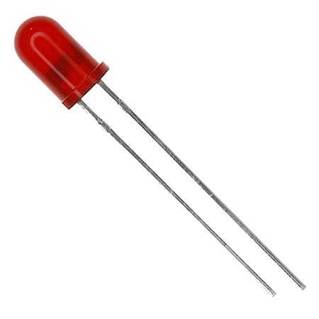
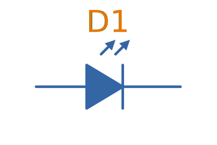
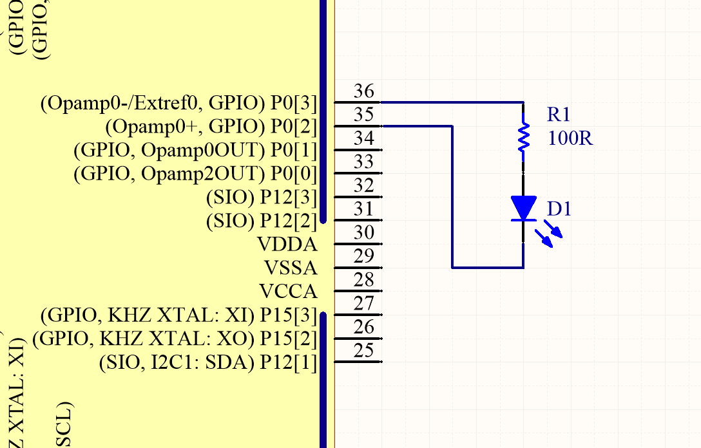
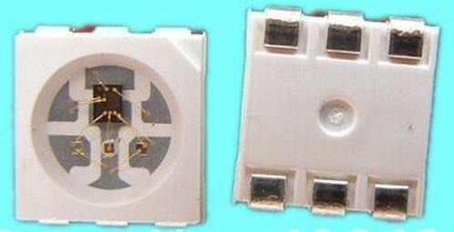
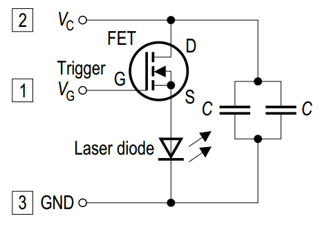
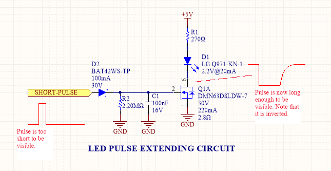
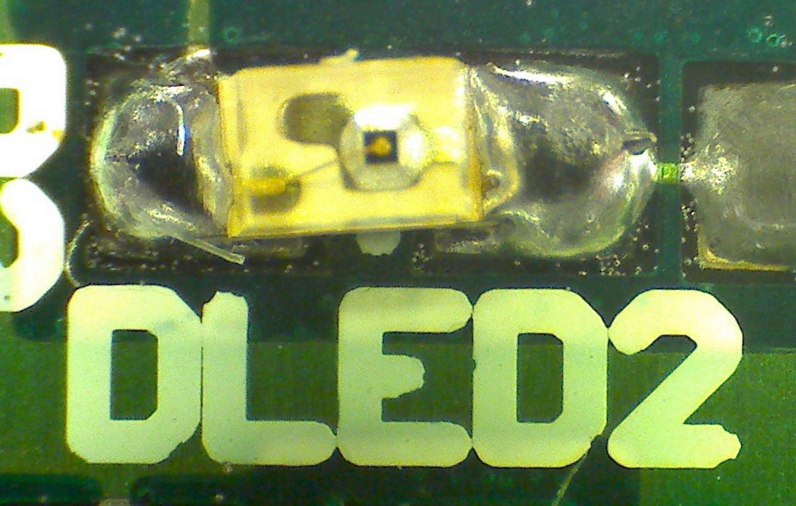

== Overview

There is a neat little link:http://led.linear1.org/led.wiz[LED Wizard] from LED Centre for working out what parallel/series combination of LED's you should use given a certain input voltage and number of LEDs you want in your array.

.A diffused-lens, red, 5mm through-hole LED.

## Schematic Symbol

.Schematic symbol for an LED (light emitting diode).

IMPORTANT: It's worth pointing out that the LED's schematic symbol looks very similar to a link:/electronics/components/diodes/photodiodes/[photodiodes], except the "light arrows" on a photodiode's symbol point inwards. 

## Important Parameters

_Parameters are sorted alphabetically._

### Dominant Wavelength

* Symbol: stem:[\lambda_{dom}]
* Units: stem:[nm]

This is the wavelength of the apparent color the human eye "sees" the LED as. It is a photometric quantity, and is not the same thing as the peak wavelength. Normally measured in nanometers (stem:[nm]).

### Flux

This will be used as a shorthand for either _radiometric flux_, _spectral flux_ or rarely, _photon flux_. You will have to deduce which based on the context.

### Forward Current

* Symbol: stem:[I_F]
* Units: stem:[mA]

This is the maximum forward current the LED continuously be driven at. For small indicator LEDs, the maximum forward current is typically 20-30mA. Normally an indicator LED with a max. forward current of 20mA would be driven at less than the max., somewhere between 2-10mA. 

### Forward Surge Current

* Symbol: stem:[I_{FM}]
* Units: stem:[mA]
 
Normally rated at a fixed temperature, duty cycle, and pulse length.

### Forward Voltage

* Symbol: stem:[V_F]
* Units: stem:[V]

Rated at a fixed forward current.

LED forward voltages for common LED colours are listed in the table below. You will notice that the **forward voltage increases with the increasing frequency of the light** (in simple terms, it takes more input energy to create photons with a higher energy), and the forward voltage is largely independent on the manufacturer or manufacturing process of the LED.

|===
| Colour | Forward Voltage

| Red    | 2.0V
| Orange | 2.0V
| Yellow | 2.1V
| Green  | 2.2V
| Blue   | 3.3V
| UV     | 3.0V (UVA) to 7.5V (UVC)
|===

Blue LEDs are GaN based.

### Irradiance

* Symbol: stem:[E]
* Units: stem:[mW/m^2]

Irradiance is the power received per unit area of a surface which is illuminated by a light source. Irradiance is usually denoted with the symbol \(E\) as \(I\) is already used for radiant intensity. It is a radiometric quantity.

### Peak Wavelength

* Symbol: stem:[\lambda_{peak}]
* Units: nm

The wavelength at the peak of the spectral density curve. This is the wavelength at which the LED emits the most power (or flux). It is a radiometric quantity, and is not the same thing as the dominant wavelength.

### Photon Flux

* Symbol: stem:[\phi_e]
* Units: stem:[umol/s]

The number of photons emitted per second by the LED. This is a not a common property to be listed on LED datasheets, more typically the _radiometric flux_ is given.

### Photosynthetic Flux

* Symbol: stem:[PPF]
* Units: stem:[umol/s]

Very similar to photon flux, except only photons within the photosynthetic active region (PAR) of 400-700nm are considered. Commonly used for LED light sources that will be used in agriculture for plant growth (e.g. high-pressure sodium lamps). Typical values range from 100-200umol/s.

### Radiation Pattern

* Symbol: n/a
* Units: Relative intensity (0-1)

The radiation pattern (aka spatial distribution) is usually given on a semi-circular graph, showing the relative intensity of the emitted light vs. the angle from looking directly forward.

### Radiant Flux

* Symbol: stem:[\phi_e]
* Units: Watts, stem:[mW]

The _radiant flux_ (also called the _radiant power_) is the total amount of light energy per unit time radiated from one region to another. In the context of an LED it is typically used to describe the total amount of light energy emitted by the LED each second. You can divide the radiant flux by the input power to calculate the efficiency of the LED, and to find out how much power will be lost as thermal energy. It is different to the photometric flux.

### Reverse Voltage

* Symbol: stem:[V_R]
* Units: Volts, stem:[V]

The maximum voltage the LED can withstand when reverse biased. Typically LEDs are forward biased but in some applications their diode property of only allowing current to flow in one direction is used.

### View Angle

* Symbol: stem:[2\theta_{\frac{1}{2}}]
* Units: Degrees

The total angle that the LED emits light at. This should be less than 180° as most LEDs emit light of a planar surface. The smaller this value the more focused the LED is. Some LEDs come package with a lens to focus the light.

== Limiting The LED Current

A common mistake when working out the value of a current limiting LED resistor is to forget to include the forward voltage drop of the diode into the equations. This has a bigger effect when running the LED at lower voltages. The equation for working out the resistance needed to limit the current in an LED is:

[stem]
++++
\begin{align}
R = \frac{V_{dd} - V_{led,f}}{I_{led}}
\end{align}
++++

[.text-center]
where: +
stem:[R] is the resistance required in series of LED to limit current, in stem:[\Omega] +
stem:[V_{dd}] = supply voltage driving the LED (typ. 3.3, 5, 12V), in stem:[V] +
stem:[V_{led,f}] = forward voltage drop of the led (typ. 2.0V), in stem:[V] +
stem:[I_{led}] = required current through the led (typ. 5-20mA), in stem:[A] +

== Reverse Mounting

Reverse mounting LED's are SMD LEDs which have the light source emitting in the reverse direction, e.g. toward the PCB they are mounted on. A hole is drilled in the PCB to let the light through to the other side. They are useful when using a PCB as a user interface panel, or when you want to use light guides (since the light guides can be mounted up against flat PCB).

WARNING: Be careful when soldering reverse-mount LEDs by hand, it is very easy to push too hard on the LED body and bend the legs!

.An Osram reverse-mount LED (P47K series).
image::osram-ls-p47k-reverse-mount-led-photo.png[width=450px]

== Multiplexing

Multiplexing is a way of connecting LED's in an arrangement so that it minimises the number of microcontroller pins required to drive them. There is also a even greater pin-saving method, known as Charlieplexing.

Multiplexing is normally done in a row/column configuration, where the LED's are connected in a grid-like fashion, and one microcontroller output pin is used for each row and column. This gives the following equation linking the number of pins used and the number of LEDs:

[stem]
++++
\begin{align}
y = (\frac{x}{2})^2
\end{align}
++++

[.text-center]
where: +
stem:[y] = number of LEDs +
stem:[x] = number of microcontroller pins +

== Charlieplexing

Charlieplexing is a more efficient (in terms of number of drive signals used) way of driving LEDs, compared to multiplexing.

The following equation is given linking the number of pins used and the number of LEDs:

[stem]
++++
\begin{align}
y = x^2 - x
\end{align}
++++

== ESD

Even though all LEDs are susceptible to ESD damage, it is the GaN based LEDs (blue, white and some green colors) that are more sensitive to surge voltages caused by ESD.

The susceptibility for LEDs to ESD is low enough that no extra ESD protection measures (aside from the current-limiting resistor which acts somewhat as a ESD suppressor also) are taken for LEDs used for general purposes.

== Light Detection With A LED

A little known fact about LEDs is that they can be used for light detection. Although not as sensitive as purpose-built photo-diodes, with a few external components, can be interfaced with a microcontroller and be used to detect variations in the light level.

The schematic below shows how to connect an LED up to a general microcontroller for light detection. The LED and resistor are connected up to GPIO pins.

.Schematic showing how to connect an LED to a general microcontroller for light detection. The LED and resistor are connected to GPIO pins.

The photocurrent of an LED is about 10-100 times smaller that that of a purpose-built photo-diode. The wavelength of peak sensitivity is usually a little less than the peak wavelength that it emits light at.HighLED is binned according to flux output. There are 5 bins:

== RGB LEDs

RGB LEDs are LED's which have three diodes inside them, one red, one green, and one blue. Whats cool with these is, when controlled correctly, they can produce almost any visible colour (remember primary colours in science class?).

RGBs usually have at least four pins, one each for one side of the red, green, and blue diodes (either all anode or all cathode), and a common which connects all three of the other sides of the diodes. They are more complicated to control than a normal LED, normally requiring 3 different PWM signals, and a bit of firmware to calculate the appropriate duty cycles.

You can get RGD LEDs which already have the control and drive circuitry (e.g. the constant current source) for the LEDs inside them. These are normally connected to a microcontroller via a digital communication bus (e.g. link:/electronics/communication-protocols/spi-communication-protocol[SPI]), or sometimes a custom protocol).

One popular example, the WS8211, uses it's own custom communications protocol running at 800kHz.

.The WS2811, a popular RGD LED, with integrated controller and drive circuitry (constant current supply). Communicates via a custom 800kHz protocol to a microcontroller.

== UV LEDs

UV LEDs are used for applications such as:

* UV curing (UVA: 365-405nm)
* 3D printing/additive manufacturing
* Disinfection and sterilization (UVC: 220-280nm)
* Fluorescence

== LED Controllers

LED controllers are ICs designed specifically to make driving LEDs easier, by providing the correct current for the LEDs to operate and off-loading the processing power which would otherwise have to be done on a microcontroller. They normally allow you to control both the current and the PWM rate for each LED (to control both the brightness and colour). Some are specially designed for RGB LEDs.

Some feature logarithmic current output levels to best match up with what the human eye perceives.

=== PWM vs Current Control

There are two main ways to dim an LED, either by changing the current or with PWM. Since PWM only varies how long the LED is on for, and keeps the current through the LED the same, it does not really affect the colour of the LED, while the current-changing method does (the colour depends on the forward current).

=== Examples

The link:http://www.nxp.com/products/power_management/lighting_driver_and_controller_ics/i2c_led_display_control/series/PCA9634.html[PCA9634 8-Channel 25mA I2C LED Controller by NXP] is a simple LED driver for up to 8 single low-power (20mA) LEDs.

== Lens Shapes

LEDs come with a variety of lens shapes. The major thing that the len shapes influences is the **radiant intensity or radiation pattern of the light**. Some lens shapes focus the light around a small angle (e.g. 10°), while others spread the light over nearly 180°.

Most standard LEDs used on circuit boards are either encapsulated or hemispherical.

Hemispherical lens concentrates the light into a tight beam, while the flat and encapsulated lens types spread the light more evenly than an LED with no lens at all.

== Laser Diodes

Laser diodes are LEDs which emits 'lasered' light using a similar method to standard-light LEDs.

Some laser diodes have integrated switching FETs and capacitors for high-speed, high-power applications (such as laser range finding).

.A laser diode with an integrated FET and capacitor for high-seed, high-power switching.

== Pulse-Width Extending

A common use for an LED is to connect it to a digital output pin of a microcontroller/IC which goes active upon a certain event (say the microcontroller receives a packet of data).

The problem with this is that the length of time that the output pin is active for can be a really short amount of time, e.g. microseconds or even nanoseconds. It the events are rare enough, this may make it impossible to see the LED flicker.

One way to fix this with hardware to to use a simple pulse-width extender circuit as shown below:

.The schematic for a LED pulse width extending circuit. It converts a short pulse that would not be seen into a longer pulse which is visible.

This circuit uses an RC network to form a time delay. When the short pulse arrives, the MOSFET is turned on almost immediately, and the LED lights up. When the pulse stops, the diode prevents the capacitor from discharging immediately, and instead has to discharge slowly through the resistor. The MOSFET/LED remain on until the voltage on the capacitor drops below the MOSFET's gate-source threshold voltage (or something close to that).

== Peak vs. Dominant Wavelength

LEDs are usually given with two different quantifiers regarding their wavelength, both the _peak wavelength_ and the _dominant wavelength_.

Most LEDs emit a **narrow spectrum of light** (as opposed to filament-style bulbs, which emit a broad spectrum of light). The **spectral shape is approximately Gaussian** (a.k.a. the normal distribution).

.A graph of the relative intensity vs. wavelength for a 0603 green LED (LTST-C190KGKT). It has a peak wavelength of 574nm and a dominant wavelength of 571nm.
image::green-led-relative-intensity-vs-wavelength-ltst-c190kgkt.png[width=650px]

The peak wavelength is the wavelength at the peak of the spectral density curve. The dominant wavelength is a _colorimetric_ quantity that describes the perceived colour of the LED with respect to the human eye. The human eye essentially sees a weighted average of all the wavelengths emitted by the LED, and perceives a single colour based on this averaging.

The dominant wavelength is important for user interface designers as it determines the "colour" the user perceives.

== LEDs For Agricultural Use

Many grow lights (lights that provide a "fake sun" for plants to trigger photosynthesis, typically used in indoor growing environments) now use LEDs (sodium lamps were a popular choice before LEDs became both powerful and cheap enough).

Sometimes you will have to convert between irradiance given in stem:[mW{\cdot}cm^{-2}] and PAR given in stem:[umol{\cdot}m^{-2}{\cdot}s^{-1}].

The Planck-Einstein equation gives a direct relationship between the frequency of a photon and it's energy<<bib-wp-planck-relation>>:

[stem]
++++
\begin{align}
E &= hf \\
\end{align}
++++

[.text-center]
where: +
stem:[E] is the energy of the photon, in stem:[J] +
stem:[h] is the Planck constant, stem:[6.62607015{\times}10^{-34} J{\cdot}Hz^{-1}]<<bib-wp-planck-constant>> +
stem:[f] is the frequency of the photon, in stem:[Hz] +

Of course you can use stem:[c = f\lambda] to write this in terms of the wavelength instead of frequency:

[stem]
++++
\begin{align}
E &= h\frac{c}{\lambda} \\
\end{align}
++++

Knowing this, you can convert an energy from stem:[mW] into a number of photons. One issue however is that the light from an LED is not emitted all at one precise frequency, it is usually spread across a small band of wavelengths known as it's spectrum. One approximation is to just pretend all the light is emitted at _peak wavelength_. A more precise method is to take the spectrum, digitize it, and then calculate the proportion of photons for each small increment in wavelength.

The number of photons per centimetre squared is:

[stem]
++++
\begin{align}
N_{photons} &= \frac{I\lambda_{peak}}{c} \\
\end{align}
++++

TODO: Finish this.

== Packaging

You can get LED's in a variety of SMD packages. Common SMD LED packages include the 0603 on 0402 chip packages.

.A picture of a 0603 LED up close on a PCB. You can see the filament running into the middle of the pad (the part which emits the light).

== Lifetime And Reliability

The expected lifetime and reliability is not typically given on standard-issue LED datasheets, mainly due to:

* Typical LEDs last so long that lifetime of any product they are used in is determined by other factors
* It is expensive and time-consuming to measure LED reliability
* Lifetime and reliability information is considered somewhat confidential

However, some LED manufacturers to give lifetime and reliability information. This is typically done for higher power, specific purpose LEDs such as powerful illumination LEDs (think streetlights, car headlights) or agricultural growing lights. The lifetime is typically expressed as a curve of _power maintenance_ over time (in terms of hours the LED has been on for). Power maintenance is how powerful the LED (in terms of light output power) compared to when it was new. Typical single-value lifetimes can be described as the number of hours until the LED light outputs power reduces to 70 or 50% of it's initial output power (a 70 ro 50% power maintenance).

[bibliography]
## References

* [[[bib-wp-planck-relation, 1]]] Wikipedia (2022, Jan 15). _Planck relation_. Retrieved 2022-02-23, from https://en.wikipedia.org/wiki/Planck_relation.
* [[[bib-wp-planck-constant, 2]]] Wikipedia (2022, Feb 6). _Planck constant_. Retrieved 2022-02-23, from https://en.wikipedia.org/wiki/Planck_constant.
