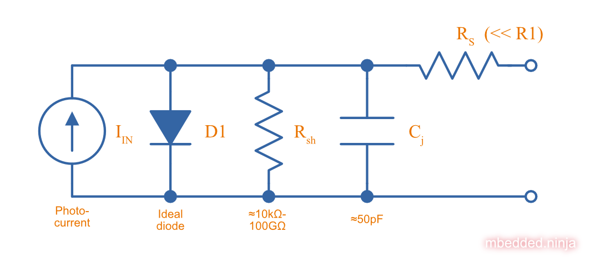

:imagesdir: 

WARNING: This page is in notes format, and may not be of the same quality as other pages on this site.

## Overview

A photodiode is a two terminal component which converts light into an electrical current. Just like a link:/electronics/components/diodes/[general-purpose diode], they consist of a normal semiconductor PN junction (or PIN junction). The difference is the photodiodes semiconductor junction is exposed to light through a transparent window rather than encapsulated in opaque material as in a standard diode.

Uses:

* Light sensors
* MOSFET gate drivers in opto-couplers

## Schematic Symbol

<<photodiode-schematic-symbol>> shows the common schematic symbol used for a photodiode.

[[photodiode-schematic-symbol]]
.Schematic symbol for a photodiode.
image::photodiode-schematic-symbol.png[width=300px,link="/photodiode-schematic-symbol.png"]

TIP: The photodiode schematic symbol is very similar to one for an link:/electronics/components/diodes/light-emitting-diodes-leds/[LED (light-emitting diode)], but the "light arrows" on an LED point away from the diode.

## Important Parameters

### Responsivity

* Units: stem:[AW^{-1}]
* Typical range: stem:[0.1{-}1AW^{-1}]

### Linearity

### Quantum Efficiency

### Spectral Range

* Units: stem:[nm]
* Typical range: stem:[400-1100nm]

### Sensitive Area

* Units: stem:[mm^2]
* Typical range: stem:[1-10mm^2]

The _sensitive area_ is the area of the PN junction that is exposed and responds to light. A larger sensitive area will result in a photodiode being able detect lower levels of light, and provide more bits of resolution.

.Mechanical outline showing the sensitive area on the top face of the Vishay BPW34 photodiode (DIP-2 package)<<bib-vishay-bpw34-ds>>.

## Basic Photodiode-based Transimpedance Amplifier Circuit

Photodiodes are commonly used to measure light intensities. But the output of a photodiode is a very small current, which isn't very useful for measuring. A common "analogue front-end" to add to a photodiode is a _transimpedance amplifier_ using an link:/electronics/components/op-amps/[op-amp], as shown in <<simple-transimpedance-photodiode-circuit>>. The transimpedance amplifier converts the very small current into a much larger voltage. This voltage can then be used to control other parts of a circuit or can be fed into an ADC for digitizing before being read by a microcontroller.

[[simple-transimpedance-photodiode-circuit]]
.A basic transimpedance amplifier circuit to convert the photodiodes light-dependent current into a measurable voltage. The output can be used to control other analog circuitry are can be connected to an link:/electronics/components/analogue-to-digital-converters-adcs/[ADC].
image::simple-transimpedance-photodiode-circuit.png[width=700px,link="/simple-transimpedance-photodiode-circuit.png"]

Because the op-amps non-inverting is tied to ground, the inverting input is a "virtual ground" (it also stays at 0V). Because the diode current stem:[I_D] has no-where to go but through the resistor stem:[R_f], this gives the simple equation:

[stem]
++++
\begin{align}
V_{OUT} &= I_D R_f
\end{align}
++++

TIP: Remember that the op-amp will drive it's output to whatever voltage is needed to keep it's inverting input at the same potential as it's non-inverting input (0V).

The current noise density of the circuit is<<bib-osi-photodiode-chars-and-apps>>:

[stem]
++++
\begin{align}
I_N = \sqrt{\frac{4kT}{R_f}}
\end{align}
++++

[.text-center]
where: +
stem:[I_N] is the current noise density, in stem:[A_{rms}Hz^{-0.5}] +
stem:[k] is Boltzmann's constant, stem:[1.38{\times}10^{-23}JK^{-1}] +
stem:[T] is the temperature of the photodiode, in stem:[K] +

## Gain Peaking Capacitor

A capacitor stem:[C_f] can be added in parallel with stem:[R_f] to prevent _gain peaking_.

## Biasing

When connected to a transimpedance amplifier, the photodiode can either be used with stem:[0V] potential across it (_photovoltaic mode_) or with a reverse bias (_photoconductive mode_)<<bib-osi-photodiode-chars-and-apps>>.

### Photovoltaic Mode

_Photovoltaic mode_ is when the photodiode is not operated with any DC bias across it (i.e. there is stem:[0V] across it). This is usually achieved by tying one side of the photodiode to ground, whilst the other side is held at "virtual ground" by an op-amp (as shown in <<simple-transimpedance-photodiode-circuit>>).

The photovoltaic mode of operation is recommended for low speed stem:[<350kHz] and low-light level applications<<bib-osi-photodiode-chars-and-apps>>. It also appears to be more linear, due to the less variations in response due to changes in temperature<<bib-osi-photodiode-chars-and-apps>>.

### Photoconductive Mode

_Photoconductive mode_ is when the photodiode is operated with a reverse-bias voltage across it. Applying a reverse-bias to a photodiode can improve the speed of the device, and is the preferred mode of operation for high-speed applications<<bib-osi-photodiode-chars-and-apps>>. The speed increase is because a greater reverse-bias increases the depletion region. This in turn reduces the junction capacitance, increasing the bandwidth of the device.

* Increased speed.
* Increased dark and noise current.

## Equivalent Circuit

<<photodiode-equivalent-circuit>> shows an equivalent circuit for a photodiode.

[[photodiode-equivalent-circuit]]
.An equivalent circuit for a photodiode. Based of the circuit in _Photodiode Characteristics and Applications_ by OSI Optoelectronics<<bib-osi-photodiode-chars-and-apps>>.

stem:[R_{sh}] represents the resistance in parallel with the current source, and is called the _shunt resistance_. You want this shunt resistance to be as high as possible, as this means more of the current is delivered to the load. Germanium photodiodes can have lower shunt resistance in the stem:[1-100k\Omega] range<<bib-aac-photodiode-equiv-circuit>>.

stem:[C_j] represents the junction capacitance, cause by the depletion region of the PN junction. Junction capacitance effects the photodiodes high-frequency response, as the capacitances impedance drops with increasing frequency. Lower capacitance photodiodes have better high frequency response. The value of stem:[C_j] is not constant -- in fact it is strongly dependent on the reverse-bias voltage. **The higher the reverse-bias, the lower the capacitance**. Thus you can improve a photodiodes high frequency response by reverse-biasing it at a high voltage.

.A graph showing the junction capacitance vs. reverse voltage for the Vishay BPW34 photodiode<<bib-vishay-bpw34-ds>>. You can clearly see the reduction of capacitance with increased reverse bias!

## Manufacturers

### Opto Diode

Opto Diode manufacture a range of silcon photodiodes in through-hole TO-5, TO-8 and TO-18 packages.

.Close-up photo of the ODD-5WISOL photodiode from Opto Diode in a TO-5 package<<bib-opto-diode-odd-5wisol-ds>>. This photodiode has an active area of approx. stem:[5mm^2] and responsivity of stem:[0.4A/W] at 632nm (red).

## Popular Parts

### Vishay BPW34

* Package: DIP-2
* Price: link:https://www.digikey.com/en/products/detail/vishay-semiconductor-opto-division/BPW34/1681149[US$0.48 (1000)]

Popular PIN photodiode with a spectral range from 400-1100nm.

[bibliography]
## References

* [[[bib-burr-brown-noise-perf-tia-vs-int, 1]]] Bonnie C. Baker (1993). _Comparison Of Noise Performance Between A FET Transimpedance Amplifier And A Switched Integrator_. Burr Brown (now Texas Instruments). Retrieved 2022-02-25, from https://www.ti.com/lit/an/sboa034/sboa034.pdf.
* [[[bib-aac-photodiode-equiv-circuit, 2]]] Robert Keim (2020, Dec 23). _Understanding the Photodiode Equivalent Circuit_. Retrieved 2022-02-27, from https://www.allaboutcircuits.com/technical-articles/understanding-the-photodiode-equivalent-circuit/.
* [[[bib-osi-photodiode-chars-and-apps, 3]]] OSI Optoelectronics. _Photodiode Characteristics and Applications_. Retrieved 2022-02-27, from http://www.osioptoelectronics.com/application-notes/an-photodiode-parameters-characteristics.pdf.
* [[[bib-opto-diode-odd-5wisol-ds, 4]]] Opto Diode (2022, Jan 27). _Photodiode 5 mm2 - Isolated: ODD-5WISOL (datasheet)_. Retrieved 2022-02-27, from https://optodiode.com/pdf/ODD-5WISOL.pdf. 
* [[[bib-vishay-bpw34-ds, 5]]] Vishay (2011, Aug 23). _BPW34, BPW34S: Silicon PIN Photodiode (datasheet)_. Retrieved 2022-02-27, from https://www.vishay.com/docs/81521/bpw34.pdf.
