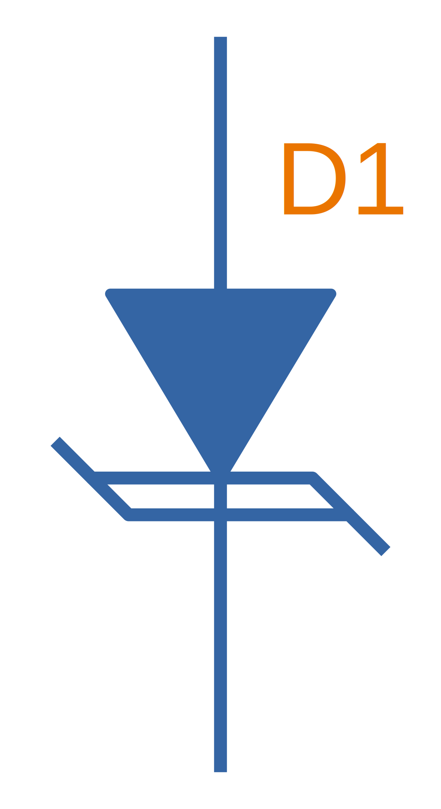
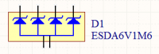

== Overview

TVS (transient voltage suppressor) diodes are used to protect traces from high voltage spikes. They are designed to be operated in the reverse direction and work by shunting currents when the reverse voltage exceeds the **avalanche breakdown potential**. They are basically **high-power Zener diodes**, and are a specialized form of an _avalanche diode_.

They are part of a family of components used for ESD (electro-static discharge) protection, which also includes Zener diodes (however, ESD is not the only thing Zeners are used for). TVS diodes can handle large amounts of peak power (hundred's or thousands of Watts), but Zeners have a tighter voltage tolerance. TVS diodes have more capacitance than Zeners, which could be detrimental in some circumstances (e.g. when protecting the gate signal on a MOSFET).

They come in either uni-directional or bi-directional flavours. Uni-directional TVS diodes block up to the rated voltage in one direction, and behave like a normal conducting diode in the other. Bi-directional block up to the rated voltage in both directions (good for protecting AC waveforms). Use uni-directional diodes if possible, they are cheaper, and they have much faster turn-on times than their bi-directional counterparts (e.g. 4ps compared to 4ns).

== Schematic Symbol

.My preferred schematic symbol for a uni-directional TVS diode (or any other type of avalanche diode for that matter). Notice the double bar distinguishing it from a Zener diode symbol.

## Arrays

They can be grouped into IC packages called arrays. A typical schematic symbol for a diode array is shown below.

.The schematic symbol of a diode array, with a common anode connection.

## Important Parameters

=== Breakdown Voltage

Symbol: \( V_{breakdown} \) +
Units: \( V \)

Also called the reverse breakdown voltage. This is the reverse voltage (cathode-to-anode) at which the diode "begins" to conduct. The point at which the diode begins to conduct is usually specified as a fixed current, typically 1mA. Also see [standoff voltage](/electronics/components/diodes/tvs-diodes/).

=== Rated Power

Symbol: \( P \) +
Units: \( W \)

The maximum power the TVS diode can dissipate, for a specified time period. Typical values range between 400W-1.5kW.

=== Standoff Voltage

Symbol: \( V_{standoff} \) +
Units: \( V \)

This is the reverse voltage that the diode can withstand without drawing "any" current. This is one of the most important parameters, as you usually match this voltage to the maximum operating voltage of the wire you are connecting it to. Note that there is a small amount of current drawn at this voltage, this is called the reverse leakage current.

## Leakage Current

The reverse-leakage of TVS diodes decreases as the stand-off voltage increases. Be warned, the leakage current of TVS diodes which have low voltage stand-offs (e.g. <10V), can have large leakage currents! A 5V stand-off TVS diode typically has a reverse-leakage current of around 500uA, but TVS diodes with a stand-off voltage of 10V or higher have a reverse-leakage of 1uA or less. Note that at low stand-off voltages, the leakage current of a bi-directional diode can be double that of a uni-directional diode for the same stand-off voltage.

.Leakage currents of TVS diodes with low stand-off voltages.
image::leakage-currents-of-tvs-diodes-with-low-standoff-voltage.png[width=1182px]

For more information, see the link:/electronics/circuit-design/esd-protection[ESD Protection] page.

## Reverse Polarity Protection

Unusually, TVS diodes. along with a fuse or other current-limiting device, can act as a **very good reverse-polarity protection mechanism** on inputs to a PCB. They are usually present on a voltage rail input for the primary reason of reducing ESD. However, if the V+ and GND are connected to the PCB the wrong way around, the TVS diode will forward conduct and clamp the voltage to a normally non-destructive 0.7-1.5V. A current-limiting device like a fuse also has to be present to prevent the TVS diode from overheating.

They are especially suited to this role (when considering other diodes) as the are usually built to dissipate large amounts of heat.



In the schematic above, the **fuse will quickly blow** if the power supply is connected to the input connector the wrong way around.

## Low Capacitance

There are a family of TVS diodes called low-capacitance (or ultra-low) TVS diodes. They have much less capacitance than standard TVS diodes (typical capacitances are between 0.4-0.9pF), and are designed for protecting high-speed data lines such as those used in USB, HDMI, DisplayPort, and Ethernet communication protocols and also for RF antennas such as GPS, FM radio and NFC antenna lines.

This low capacitance is achieved by adding a forward-biased general purpose diode in series with the usual reverse-biased TVS (zener-style diode). The schematic symbol for a low-capacitance TVS diode is shown below:



The forward-biased general purpose diode has a much smaller parasitic capacitance than the zener diode. Because the parasitic capacitances are in series (grey capacitors in diagram), the total capacitance of the component is greatly reduced!

## Special-Purpose TVS Diodes

### RS-485 TVS Diodes

TVS diodes built specifically for protecting RS-485 communication protocol bus lines are bi-directional and have two different hold-off voltages to meet the RS-485 spec. They normally include the character sequence "SM712" in their part name (e.g. SM712-02HTG by Littelfuse and SM712-TP by Micro Commerical).



More information on these diodes can be found in the [Specialised TVS Diodes section on the RS-485 Protocol page](/electronics/communication-protocols/rs-485-protocol#specialised-tvs-diodes).
