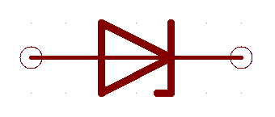
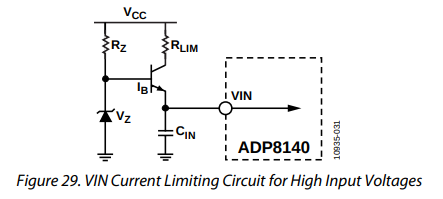

== Overview

Zener diodes are diodes which have a specified reverse blocking voltage at which they breakdown and begin to conduct. They are similar to TVS diodes, but generally have a more defined and precise breakdown voltage, but a lower power rating. The allows Zeners to be used a shunt-style voltage regulators to power small circuits and as such, are sometimes called _voltage regulator diodes_. Shunt voltage references are similar in concept to zener diodes, except that they are more precise but can't dissipate as much power.

Uses for zener diodes include:

* Low power/simple voltage reference
* Over-voltage protection for low power applications (use TVS diodes to dissipate high energy voltage spikes)
* To turn on a sub-circuit once a certain voltage level is reached (e.g. an LED in a simple battery charging circuit)

You can purchase Zeners with a reverse voltage drop as low as stem:[1.8V] all the way to above stem:[100V]. For voltage drops less than 1.8V, you can stack (i.e. place in series) multiple normal or schottky diodes in forward bias.

== Schematic Symbols

.The schematic symbol for a Zener diode.

== How To Read A Zener Diode Datasheet

A zener voltage stem:[ V_Z ] is given at a Zener test current stem:[ I_{ZT} ]. stem:[ V_Z ] is the voltage the Zener regulates to. The test current typically a current large enough to overcome the "knee" in the voltage vs. current curve, and put the Zener into it's "voltage regulation" state (where the voltage stays relatively stable with large changes in current).

== Regulation Performance And Dynamic Resistance

Low voltage (1-4V) Zener diodes are notoriously bad at voltage regulation due to their high dynamic resistance compared to their high-voltage siblings.

== Simple Voltage-Limiting Circuit With A Zener Diode

You can build a simple voltage limiting circuit from a Zener diode, a NPN BJT transistor, and a couple of resistors. The schematic below shows an example of this, used to limit the maximum voltage to the stem:[V_{in}\,] pin of the ADP8140 LED driver IC.

.A simple Zener/NPN based voltage limiter circuit for the input to the ADP8140 LED driver IC. Image from https://www.analog.com/media/en/technical-documentation/data-sheets/ADP8140.pdf.

The voltage at stem:[V_{in}\,] is regulated to approximately stem:[ V_Z - 0.7V ]. The current through stem:[R_Z] is:

[stem]
++++
I_{RZ} = \frac{V_{CC} - V_Z}{R_Z}
++++

For more information, see the link:/electronics/circuit-design/esd-protection[ESD Protection] page.