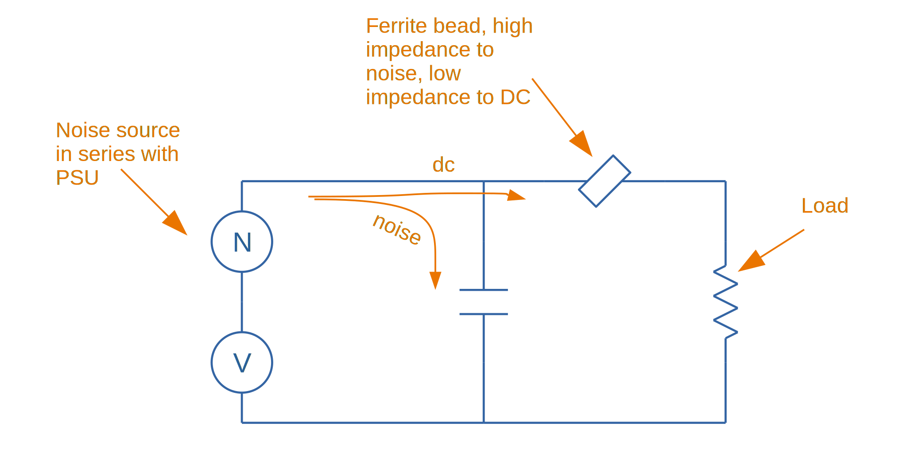

## Overview

Ferrite beads (also called ferrite chips) are inductors which are used for filtering out high frequencies. To do this, they are designed to have a large resistance at high frequency (i.e. they are lossy).

 The following graph shows the typical impedance of a ferrite bead across a range of frequencies.

.Graph showing the impedance-frequency characteristics of a range of ferrite beads.
image::impedance-frequency-characteristics-graph-of-ferrite-beads.png[width=644px]

This high impedance at high frequency property of ferrite beads reduces noise via two mechanisms:

. Absorbs this high frequency noise and dissipate it as heat.
. Present a high impedance path for high frequency noise, forcing it to travel through other components. This is commonly achieved by making a pi-filter from a ferrite bead and two capacitors.

The most basic ferrite bead is a piece of wire with encased in ferrite material, it is this ferrite material which is lossy at high frequencies.

.A USB cable with the in-cable ferrite bead highlighted.
image::usb-cable-with-ferrite-beads-annotated.png[width=450px]

Ferrite beads are good at filtering out high frequency differential mode noise. For filtering out common-mode noise, see the link:/electronics/components/common-mode-chokes[Common-mode Choke page].

## Schematic Symbol

The IEEE 315 standard dictates that a ferrite bead should have the following schematic symbol:

.The IEEE 315 schematic symbol for a ferrite bead.
image::ferrite-bead-schematic-symbol-ieee-315-slanted-rectangle.png[width=223px]

You might also see a ferrite bead symbol like this:

.The 'triple-line' type of schematic symbol for a ferrite bead.
image::ferrite-bead-schematic-symbol-triple-line.png[width=324px]

Unfortunately, you may even see them used with an inductor symbol (and with an L for it's designator)!

.Some schematics will use the inductor symbol for a ferrite bead.
image::inductor-schematic-symbol-curly-with-bar.png[width=361px]

However, although technically correct (a ferrite bead is an inductor, and does have a core, so the bar on top of the coil is correct also), I find this very confusing. You never use a ferrite bead for it's inductive properties (it's designed to be lossy at high frequencies, while most standard inductors are designed to be as loss-less as possible and return the energy to the circuit).

## Important Parameters

### Impedance (@ Frequency)

The frequency is usually 100MHz. This is good for comparing one ferrite bead against another. Manufacturers usually provide a frequency vs. impedance graph if you want more information.

## Use In Circuits

Ferrite beads are commonly placed in series on the power supply rails of electronic circuits.

.Simple schematic showing how ferrite beads absorb/block high frequency noise.

## Their Frequency Response Explained...

As the graph shows below, it is the ferrite beads resistance, not inductance, which is largely responsible for the increase in it's reactance. This is what we want, as resistance dissipates the noise as heat, while inductance only stores the energy ina magnetic field to return to the circuit at a later point in time.

.This graph shows a breakdown of the different components (resistive R and reactive X, which has both inductive and capacitive parts) contributing to the overall impedance Z.
image::impedance-frequency-characteristics-graph-of-ferrite-beads-showing-inductance-and-resistive-components.png[width=706px]

Ultimately, at higher frequencies (1-10GHz), it is their parasitic capacitance which causes the ferrite bead to become ineffective. This capacitance shorts out the inductive and resistive elements of the ferrite bead.

## Equivalent Circuit Model

The following image shows a common way of simulating a ferrite bead.

.A basic simulation model for a ferrite bead, and the equivalent representation in SPICE.
image::ferrite-bead-circuit-model-and-spice-simulation-setup.png[width=832px]

Another way to model a ferrite bead is a high-frequency transformer with a low valued resistance connected across it's secondary. The two transformer primary inputs are the two leads on the ferrite bead.

## Packages

They come in many link:/pcb-design/component-packages/[package sizes], including small link:/pcb-design/component-packages/chip-eia-component-packages/[0603 sized SMD packages]. Ferrite beads tend to be smaller than general purpose inductors because they are not used for their inductance (which is what requires space). They usually have milli-Ohms of DC resistance, which increases to stem:[50-500\Omega] (typically) at 100MHz (which is the usual rated frequency, but they also provide a continuous frequency vs. impedance graph).

This really great PDF, link:http://lpvo.fe.uni-lj.si/fileadmin/files/Izobrazevanje/RES/Gradiva/07/Ferrite%20beads.pdf[Understanding Ferrite Bead Inductors], explains them well.
