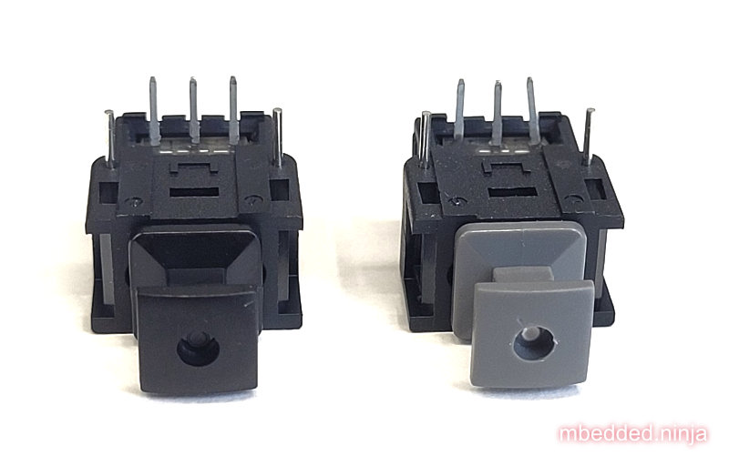
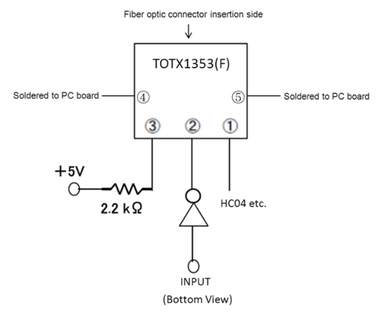
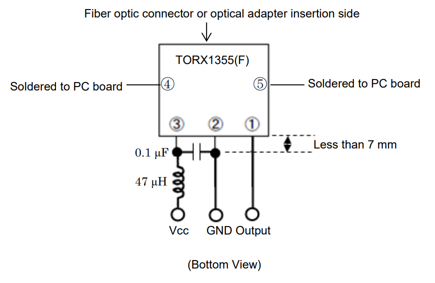
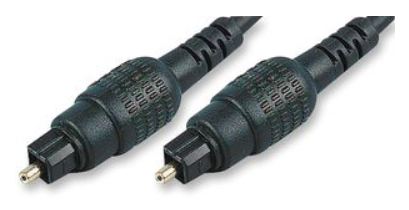
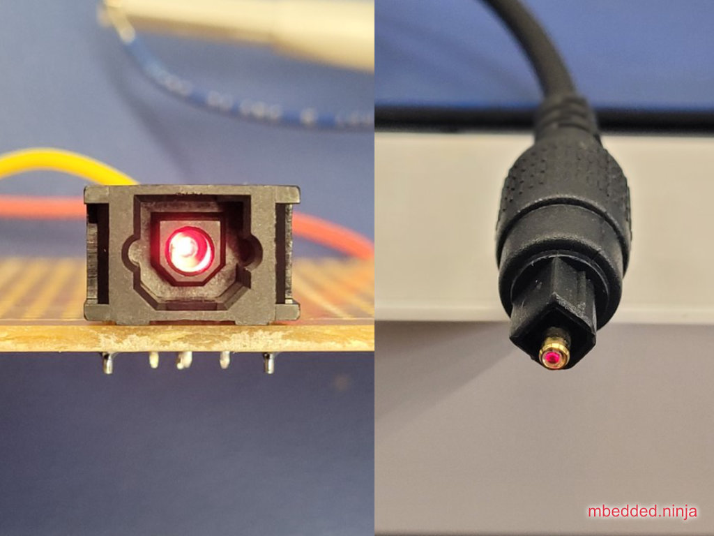
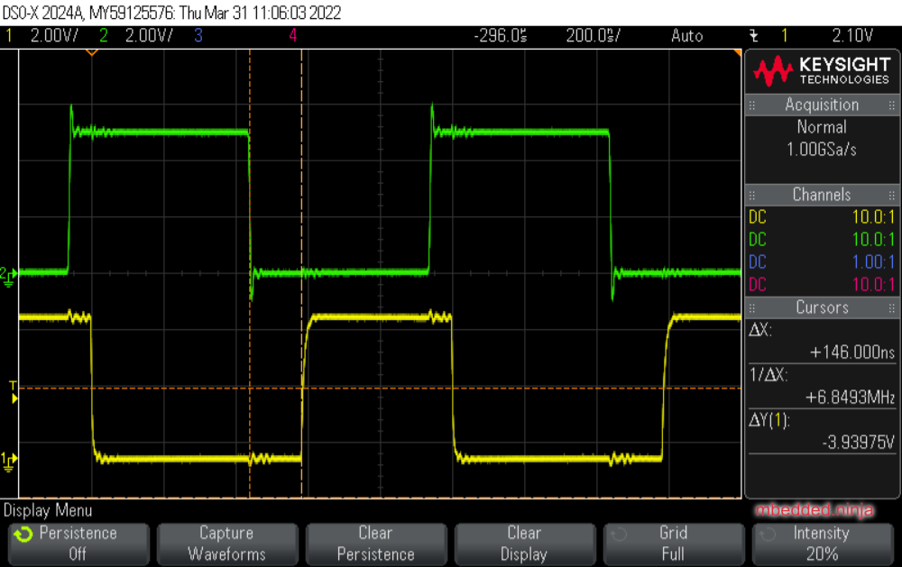
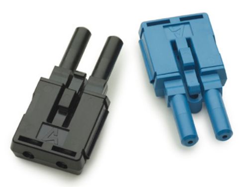
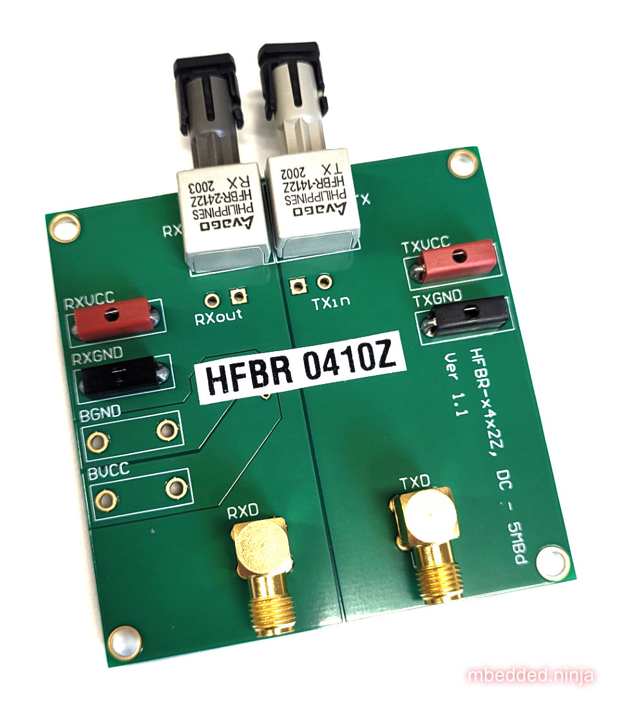
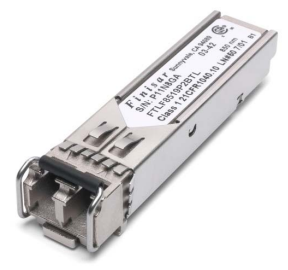

:imagesdir: 

WARNING: This page is in notes format, and may not be of the same quality as other pages on this site.

## Overview

_Fibre optics_ is a digital communication method by sending light (both visible or "light" outside our visible spectrum) down transparent fibres. They are typically used instead of electrically conductive cables when:

* Transmission distances are large, and standard copper cables would give too much attenuation.
* The EMI generated by standard cables would be too high (fibre optic cables don't really radiate any EMI!)
* The transmission speed of copper is too slow.

_Simplex_ cables only have one fibre optic strand, meaning one-way communication. _Duplex_ cables have two fibre optic strands, allowing two-way communication. Duplex cables are usually constructed in a zip-cord fashion so you can easily split them apart at the ends to terminate into separate transmitters and receivers.

Some fiber optic transmitter/receiver pairs are DC-coupled, which extends the bandwidth right down to DC, whilst others are not, and impose a minimum switching frequency on the digital data.

## Standards

### TOSLINK

Basic fibre-optic standard designed for transmitting audio using 1mm plastic fiber. Uses visible red LEDs (at 650nm) which means you can easily see when it's working (and which end is the transmitter). Common bandwidths for TOSLINK connections are from DC to 10Mbps<<bib-toshiba-torx1355f-ds>>.

.Photo of the TOSLINK TORX1355(F) receiver and TOTX1353(F) transmitter.

The TOSLINK transmitter components just contains the LED (e.g. the `TOTX1353(F)`), hence the need for a current-limiting resistor and driver. The driver can be open-collector/open-drain, as it only needs to sink current.

.Typical surrounding circuitry required to drive the TOTX1353(F) transmitter<<bib-toshiba-totx1353f-ds>>. 

The receiver contains more circuitry than the transmitter, including _automatic threshold control_ (ATC) to compensate for widely different input optical power levels<<bib-toshiba-torx1355f-ds>>.

.Typical surrounding circuitry to receive signals via the TORX1355(F) receiver<<bib-toshiba-torx1355f-ds>>. The large 47uF inductor in series with the power supply (presumably to form a low-pass LC filter) is an interesting recommendation!).

TOSLINK components are becoming harder to find these days, although TOSLINK patch cables can usually be found at places which sell TVs, computers and other audio/video equipment (TOSLINK being used to transmit audio).

.Photo of a 5m TOSLINK cable from Multicomp Pro with plugs on both ends (part number JR9907.5M D=4MM BLK)<<bib-e14-toslink-cable>>.

.Photo showing the clearly visible illumination when TOSLINK is in working. On left, the TOTX1353(F) transmitter being driven with 1.5mA of current. On right, the same signal but now with a 5m cable plugged into the transmitter, with this photo being taken of the other end.

The image below shows an oscilloscope capture of a TOSLINK system in use. The upper green waveform is a 1MHz, 5V square wave being fed into a TOTX1353(F) transmitter (with a 2.2kΩ resistor to limit the LED current). The lower yellow waveform is the resulting output from a TORX1355(F) receiver connected to the transmitter via a 5m TOSLINK cable.

TIP: The 5V input square wave is fed into the cathode of the transmitters LED (as per the recommended application circuit in the datasheet), so the LED is turned on when the signal is low, hence the inversion of the signal.

[[toslink-5m-in-vs-out-1mhz]]
.Oscilloscope capture showing the input and output waveform of a TOSLINK system in use.

The difference between an edge on the input and the edge appearing on the output (time between the dotted vertical "cursor" lines) is 148ns. **Light travels at 3e8m/s, so would take 17ns to travel down the 5m cable. The remaining 131ns of the 148ns must be due to processing delays in the TOSLINK transceiver and receiver**. Time delays of the oscilloscope probes is small and consistent for both input and output, so should have a negligible effect on this measurement.

### Versatile Link (VL)

_Versatile Link_ (VL) was first introduced by Hewlett-Packard.

Field-installable connections are relatively simple with Versatile Link connectors. For example, the Avago AFBR-4526Z and AFBR-452BZ duplex connectors show in their datasheet a four-step process involving cutting the fibre (with simple wire cutters), fitting the cable into the connector housing, trimming and polishing (polishing is optional, using a purpose-made fibre holding tool and various grit sand paper), and final finishing<<bib-avago-afbr-4526z-ds>>.

.Photo of the Avago AFBR-4516Z (black) and AFBR-452BZ (blue) fibre optic "Versatile Link" connectors<<bib-avago-afbr-4526z-ds>>.

Development kits such as the HFBR-0410Z shown in are available for quick prototyping with with fibre-optic system. Note that the dev kit does not come with any cable!

.Photo of the HFBR-0410Z fiber optic development kit.

### ST/SC

### LC

The LC connector was first developed by Lucent Technology for telecommunication applications<<bib-fiber-optic-solutions-lc-fiber>>.

## Transceivers

850nm Oxide VCSEL laser transmitter.

Industry standard 1x9 SIP package.

|===
| Manf. Part Num. | Manf. | Image | Directionality | Speed | Price (USD, 100) | Datasheet | Mounting

| FTLF8519P3BNL
| Finisar Corporation
a| 
| TX/RX
| 2.125Gbps
| link:https://www.digikey.com/en/products/detail/finisar-corporation/FTLF8519P3BNL/3507745[$30.21 (80)]
| link:https://ii-vi.com/product/1000base-sx-and-2g-fibre-channel-2gfc-500m-extended-temperature-sfp-optical-transceiver/[Datasheet]
| Pluggable, SFP

|===

Fibre optic transceivers can be found on DigiKey at https://www.digikey.com/en/products/filter/fiber-optics-transceiver-modules/118.

## Connectors

* Versatile Link: 
* LC Duplex: LC is a range of fibre-optic connectors from Molex. They come in simplex and duplex varieties.
* ST: 

Small Form Factor Pluggable Multi-Sourcing Agreement (MSA)?

Small Form Factor Pluggable (SFP)?

SFF-8472

Fast Ethernet, FDDI, and Asynchronous Transfer Mode 
(ATM)

## Fiber

Glass-based fibers have lower attenuation than plastic-based fibers, allowing for longer transmission distances.

APF: All-plastic fiber.
HCS: Hard-clad Silica fiber (a.k.a. polymer-clad fiber, PCF) is optical fiber with a 200um core of silica glass.  
PCF: Plastic-clad glass fiber.
POF: :.

[bibliography]
## References

* [[[bib-avago-afbr-4526z-ds, 1]]] Avago (now Broadcom). _AFBR-4526Z, AFBR-452BZPlastic optical fiber duplex connector for AFBR-5972xZ (datasheet)_. Retrieved 2022-02-10, from https://docs.broadcom.com/doc/AV02-2926EN.
* [[[bib-fiber-optic-solutions-lc-fiber, 2]]] Fiber Optic Solutions (2018). _LC Fiber Connector Definition, Types And User Guide_. Retrieved 2022-02-10, from https://www.fiber-optic-solutions.com/lc-fiber-connector-definition.html.
* [[[bib-e14-toslink-cable, 3]]] Element14. _JR9907.5M D=4MM BLK: Audio / Video Cable Assembly, TOSLINK Plug, TOSLINK Plug, 16.4 ft, 5 m, Black (product page)_. Retrieved 2022-03-01, from https://nz.element14.com/pro-signal/jr9907-5m-d-4mm-blk/lead-optical-5m-toslink/dp/4258472.
* [[[bib-toshiba-totx1353f-ds, 4]]] Toshiba (2014, May 20). _TOTX1353(F): Fiber Optic Transmitting Module (datasheet)_. Retrieved 2022-03-31, from https://nz.mouser.com/datasheet/2/408/TORX1355(F)_datasheet_en_20200312-1108723.pdf.
* [[[bib-toshiba-torx1355f-ds, 5]]] Toshiba (2020, Mar 12). _TORX1355(F): Fiber Optic Receiving Module (datasheet)_. Retrieved 2022-03-31, from https://nz.mouser.com/datasheet/2/408/TORX1355(F)_datasheet_en_20200312-1108723.pdf.
