## Overview

At it's most basic level, an _operational amplifier_ (op-amp) is a **discrete analogue integrated circuit which acts as a voltage-amplifier with very high gain**.

An op-amp's gain can be adjusted with the appropriate external circuitry (the op-amp's internal gain does not change, but the gain of the entire circuit does). This is almost always done for any op-amp that is used as an amplifier. External circuitry can also manipulate the op-amp to act as as a current amplifier or perform "mathematical" operations on signals.

## Schematic Symbol

An op-amp is commonly drawn on schematics as:

.The basic schematic symbol for an op-amp.
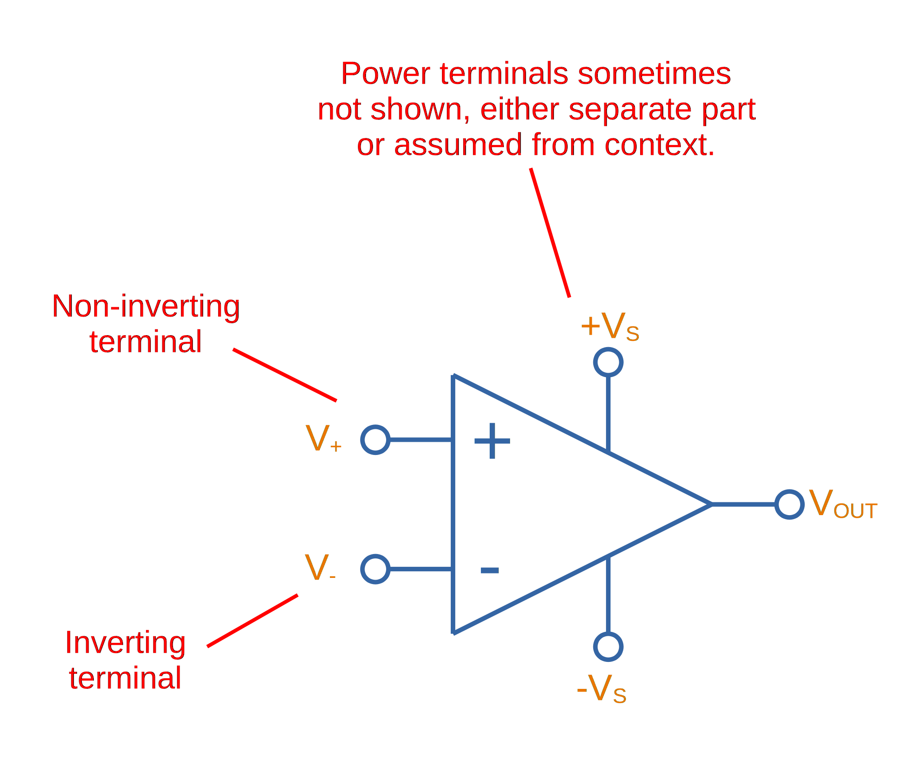

You may see this symbol with or without the voltage supply pins stem:[ +V_{S} ] and stem:[ -V_{S} ]. If they are not present, it is assumed that they are connected up to a power source which should be obvious from the design intent.

WARNING: Always take note of the position of the inverting (-) and non-inverting (+) input terminals. **Sometimes they can be drawn swapped around relative to the symbol shown above**.

## Uses

* Buffers (a.k.a. voltage followers)
* Linear amplifiers, non-linear amplifiers
* Pre-amplifiers (amplifier's with a input voltage of 10mV or less)
* Analogue mathematical operations (differentiators, integrators, summer, subtracters, e.t.c)
* Voltage to current (transconductance) and current to voltage conversions (transimpedance)

## Op-Amp Topologies

### Voltage Followers (a.k.a. Buffers)

A _voltage follower_ (also known as a _buffer_) is one of the most basic circuits you can make with an op-amp.

.An op-amp configured as a voltage follower (aka buffer).
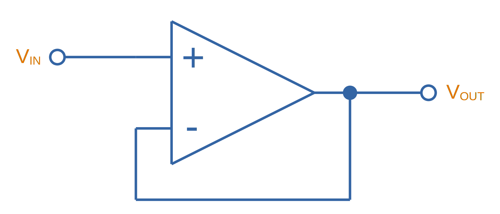

The output voltage for a voltage follower is just simply:

[stem]
++++
\begin{align}
\label{eq:buffer-vout-eq-vin}
v_{out} &= v_{in}
\end{align}
++++

As shown in Eq stem:[\ref{eq:buffer-vout-eq-vin}], the output voltage is the same as the input voltage. Well isn't this pointless? No, the key point to a voltage follower/buffer is that it can convert a **high-impedance input into a low impedance output**. Practically, this means that you can now sink/source more current from the output without the voltage changing. Buffers are great for boosting signals that travel across long distances, or for signals which get split and go to many devices (this is called **fan-out**, and is common with digital clock signals).

A simulation schematic for a voltage-follower op-amp is shown below:

.A simulation schematic for an op-amp configured as a voltage-follower (buffer).
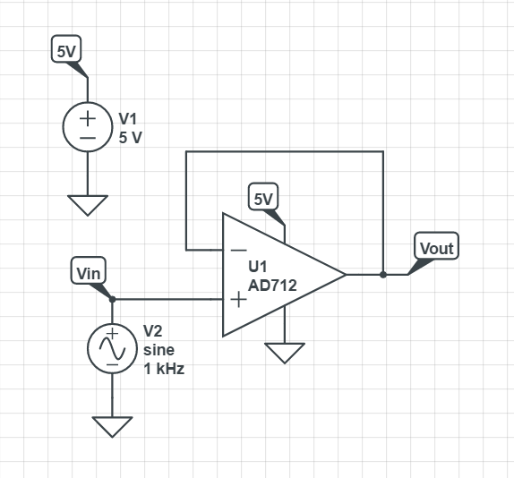

The results of the simulation:

.The simulation results for an op-amp configured as a voltage-follower (buffer). Note how the output voltage mirrors the input voltage exactly.
image::output-voltage-vs-input-voltage-op-amp-voltage-follower.png[width=600px]

### Non-Inverting Amplifiers

A op-amp in the non-inverting amplifier configuration is shown in <<non-inverting-amplifier-schematic>>.

[[non-inverting-amplifier-schematic]]
.An op-amp configured as a non-inverting amplifier.
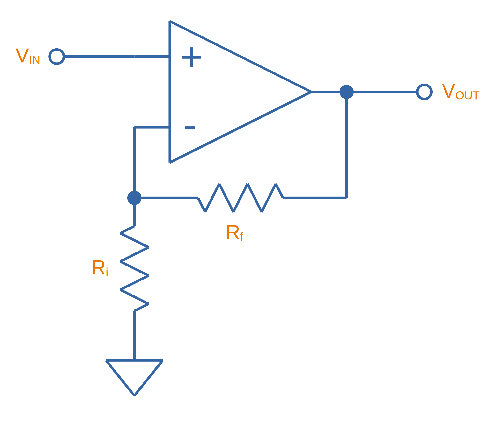

The equation for the output voltage of the non-inverting amplifier is:

[stem]
++++
\begin{align}
v_{out} = (1 + \frac{R_f}{R_i}) v_{in}
\end{align}
++++

Notice the stem:[1] in the gain equation? This means that no matter what you set the resistors stem:[R_f] and stem:[R_i] to, you can **never get a gain which is less than one**. This is one of the disadvantages of the non-inverting amplifier (you can have a gain of less than one with an inverting amplifier).

WARNING: There is no one common convention for labelling these feedback resistors. Sometimes they are called stem:[R_i] and stem:[R_f], other times stem:[R_1] and stem:[R_2] (with either resistor being stem:[R_1])

Here is a simulation schematic (circuit) for a non-inverting op-amp amplifier running from a single-ended supply. Because R1 (stem:[R_f]) and R2 (stem:[R_i]) are both stem:[1k\Omega], the op-amp has a voltage gain stem:[A_V] of:

[stem]
++++
A_V = 1 + \frac{R_f}{R_i} \\  
A_V = 1 + \frac{1k\Omega}{1k\Omega} \\  
A_V = 2
++++

.The simulation schematic for a non-inverting op-amp amplifier.
image::non-inverting-op-amp-amplifier-simulation-schematic.png[width=450px]

The results of the simulation are shown below. As you can see, the output voltage stem:[v_{out}] is exactly twice the input voltage stem:[v_{in}].

.A graph of stem:[v_{out}] vs. stem:[v_{in}] for a non-inverting op-amp amplifier circuit.
image::vout-vs-vin-non-inverting-op-amp-amplifier-gain-of-2.png[width=700px]

### Inverting Amplifiers

A op-amp amplifier in the inverting configuration is shown in <<inverting-amplifier-schematic>>.

[[inverting-amplifier-schematic]]
.An op-amp configured as an inverting amplifier.
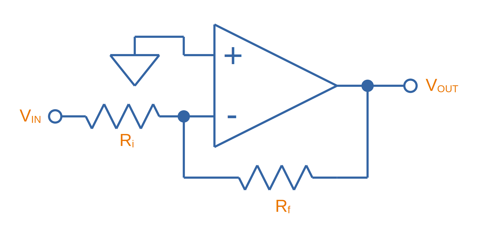

The equation for the output voltage of an inverting amplifier is:

[stem]
++++
v_{out} = - \frac{R_f}{R_i} v_{in}
++++

The negative sign is to show that the output is the inverse polarity of the input. Notice that, unlike the non-inverting amplifier, **an inverting amplifier lets you obtain a gain of less than 1**.

Below is the schematic used for simulating the behaviour of an inverting op-amp. Note how is requires a negative voltage power supply.

.A schematic for simulating the behaviour of an inverting op-amp.
image::inverting-op-amp-simulation-schematic.png[width=600px]

And below are the simulation results for the above schematic:

.stem:[v_{out}] vs. stem:[v_{in}] for an inverting op-amp with a gain of -1.
image::vout-vs-vin-inverting-op-amp-gain-neg-1.png[width=700px]

### Differential Amplifiers

A differential amplifier amplifies the difference between two electrical signals, but does not amplify any signal that is common to both inputs. The schematic is shown in <<differential-amplifier-schematic>>.

[[differential-amplifier-schematic]]
.An op-amp configured as a differential amplifier.
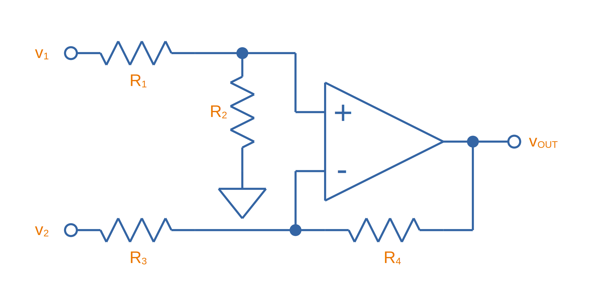

The output voltage is given by the equation:

[stem]
++++
v_{out} = \frac{R_2}{R_1 + R_2}(1 + \frac{R_4}{R_3})v_1 - \frac{R_4}{R_3}v_2
++++

TIP: It's easy to confuse a differential amplifier (what we are discussing here) with a _differentiator amplifier_, which performs the mathematical function of differentiation (opposite of integration).

Below is a schematic for simulating the behaviour of a differential op-amp:

.A schematic for simulating the behaviour of a differential op-amp.
image::differential-op-amp-simulation-schematic.png[width=800px]

This schematic produces the following results:

.A graph Vout vs. Vin1 and Vin2 for a op-amp configured as a differential amplifier.
image::differential-op-amp-simulation-graph-vin1-vin2-vout.png[width=700px]

=== Integration Amplifiers

An _integration amplifier_ performs mathematical integration on the input signal -- It's output voltage is proportional to the integral of the input voltage w.r.t. time. <<integration-amplifier-schematic-ideal>> shows an **ideal** op-amp based integrator.

[[integration-amplifier-schematic-ideal]]
.An op-amp configured as an ideal integrator.
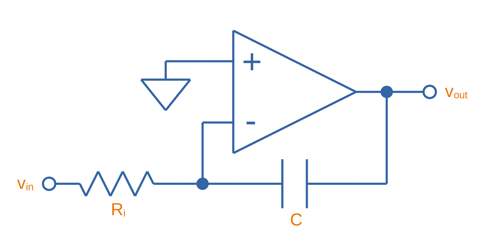

Eq. stem:[\ref{eq:vout-vin-ideal-integrator}] shows the relationship between input and output voltage.

[stem]
++++
\begin{align}
\label{eq:vout-vin-ideal-integrator}
v_{out} = \frac{1}{R_i C} \int_0^t v_{in}\ dt
\end{align}
++++

**However, this circuit is normally not practical in real world situations**. Any errors such as the output offset voltage and input bias current (which all op-amps invariably have), as well as a non-perfect input signal with small amounts of DC bias, will cause the output to drift, until it reaches saturation.

A way to fix this problem is to insert a high-valued feedback resistor, stem:[R_f], to limit the DC gain, as well as a resistor, stem:[R_{bias}], on the non-inverting input terminal to compensate for the input bias current.

.An op-amp configured as a non-ideal (real world) integrator, with feedback resistor stem:[R_f] to slowly remove DC offset and stem:[R_{bias}] to compensate for input bias current.
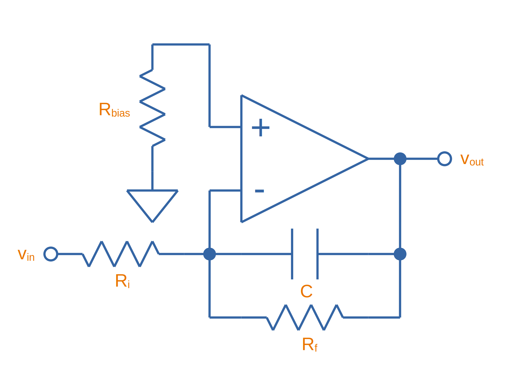

[stem]
++++
\begin{align}
v_{out} &= \frac{1}{R_i C} \int_0^t v_{in}\ dt \\
R_{bias} &= R_i\ ||\ R_f ||\ R_L \\
V_E &= (\frac{R_f}{R_i} + 1) V_{OS}
\end{align}
++++

=== Differentiator Amplifiers

TODO: Add content here.

### Transconductance Amplifiers

A _transconductance amplifier_ is an op-amp topology which is used to **convert a voltage into a current**. Coincidentally, it is also known as a _voltage-to-current converter_.

A basic transconductance amplifier can be built with an op-amp in a non-inverting configuration.

A transconductance amplifier is useful creating an industry standard 4-20mA (or 0-20mA) current-loop signal. The input voltage can come from something like a potentiometer or microcontroller (coupled with either using a VDAC peripheral or PWM/RC-filter technique to create a variable voltage).

One disadvantage with this design is that the current output is not ground referenced, that is, ground is not used as the return path for the current. This complicates the wiring.

### Current Sinks

An op-amp can be easily wired up with a MOSFET and sense resistor to make a voltage controlled current sink. The following schematic shows such a device which can control between 0-1A through the load (shown as stem:[R_{load}]):

.Schematic of a basic op-amp based current sink.
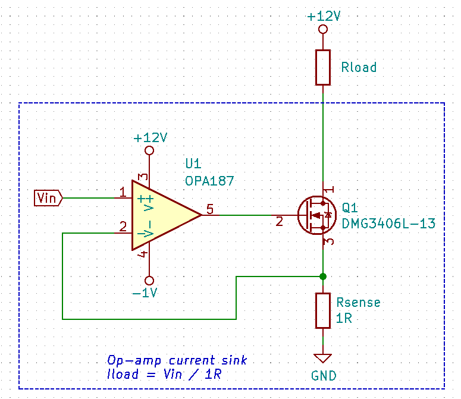

You set the desired load current by providing a voltage to stem:[V_{in}]. This voltage typically comes from a resistor divider (fixed current), potentiometer (manually variable current) or DAC (digitally variable current). The load current is given by the simple Ohm's law equation:

[stem]
++++
I_{load} = \frac{V_{in}}{R_{sense}}
++++

The circuit works like this:

. Desired voltage to set current is provided to stem:[V_{in}] which is applied to the positive input of the op-amp, stem:[V_{op+}].
. The op-amp will then drive it's output high in an attempt to bring it's stem:[V_{op-}] to the same voltage.
. As the op-amp raises the voltage on it's output, this is connected to the gate of the MOSFET, which will begin to turn it on.
. As the MOSFET turns on, current begins to flow through the load and sense resistor, stem:[R_{sense}].
. The op-amp will keep turning the MOSFET on until the voltage drop across stem:[R_{sense}] is equal to stem:[V_{in}], meaning stem:[V_{op-}] is the same as stem:[V_{op+}].
. This voltage drop will occur when we have the desired amount of current flowing through it, leading to the equation stem:[ I_{load} = \frac{V_{in}}{R_{sense}} ].

Things to note:

* The op-amp is powered here with a slightly negative voltage rail on it's stem:[V_{SS}] pin. This is that the op-amp remains operational when you set it at low current levels. At low current levels, the voltages at stem:[V_{op+}] and stem:[V_{op-}] are very close to zero. Even rail-to-rail op-amps can have trouble performing well if the negative voltage rail was at stem:[0V].
* The power dissipation through the MOSFET and sense resistor has to be considered. The sense resistor is easy, just make sure it can handle the power given by stem:[P = I^2 R] at the maximum current. The MOSFET power dissipation will depend on the load current and voltage drop across it. The MOSFET is used in it's active region --- the region where it is not fully on nor fully off. The MOSFET will drop the remaining voltage from the voltage source provided to the load, once the load voltage drop and sense resistor voltage drop has been subtracted. Use the equation stem:[P = VI] to determine the power dissipation in the MOSFET.
* The gate capacitance of the MOSFET can load the op-amp output to the point that it introduces enough phase lag to cause the circuit to go unstable. See below to recommended compensation circuitry to add to the basic schematic to make the design more stable.

**Current Sinking Accuracy**

The accuracy of the current sink primarily depends of three aspects:

* The input offset voltage of the op-amp.
* The accuracy of the DAC (or other voltage source) providing the voltage to stem:[V_{in}].
* The tolerance of the current-sense resistor.

**MOSFET Gate Capacitance Compensation**

The gate capacitance of the MOSFET can load the op-amp output to the point that it introduces enough phase lag to cause the circuit to go unstable. Compensation circuitry can be added as shown in the below circuit to limit the phase lag and prevent the circuit from becoming unstable.

.A schematic showing gate capacitance compensation circuitry on a op-amp based current sink using the LT1492. Image retrieved 2020-12-25 from https://www.analog.com/media/en/technical-documentation/data-sheets/14923f.pdf.
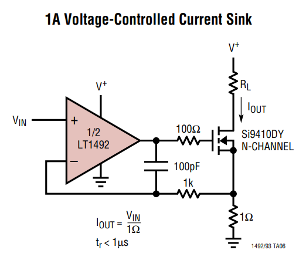

Read https://electronics.stackexchange.com/questions/69506/stability-problem-in-unity-gain-opamp for more information.

## Important Variables

Sorted by function.

### Common-Mode Input Voltage Range

The _common-mode input voltage range_ is the range of voltages that can appear at the input to the op-amp and it still work correctly. For standard single-supply op-amps, the typical range is approximately stem:[0V] to stem:[V_+ - 1.5V]. Note how it includes the most negative rail stem:[V_-] (which is 0V for a single-supply op-amp) but only gets within `1.5V` of the most positive rail, stem:[V_+]

### Input Offset Voltage (Vos/Vio)

**The _input offset voltage_ stem:[V_{OS}] (or sometimes called stem:[V_{IO}]) is the voltage difference required between the two input pins to force the output to 0**. It is a DC measurement parameter. In an ideal op-amp, the op-amp only amplifies a difference between the inputs, and so the output is 0V when the difference is 0V, hence the input offset voltage is 0V. However, real-world op-amps always have some unavoidable differences in the internal components that make up the op-amps (specifically, in the input differential stage of the internal circuitry), and thus the inputs are not perfectly identical. <<input-offset-voltage-model>> shows how the input offset voltage is modelled as a voltage source in series with one of the inputs of an ideal op-amp.

[[input-offset-voltage-model]]
.The input offset voltage is modelled as a voltage source in series with one of the inputs of an ideal op-amp (it doesn't matter which input, as the input offset voltage can be positive or negative).
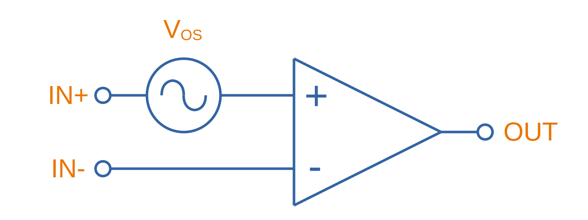

A non-zero input offset voltage results in gain errors between the input and output of a op-amp. The input offset voltage is typically in the following ranges:

* 1-5mV for good general purpose op-amps, 5-15mV for really bad ones.
* 200uV-1mV for specialized low input offset voltage op-amps
* 10uV-200uV for the best "ultra" low input offset voltage op-amps.
* < 1uV for chopper-stabilized (auto-zero) op-amps.

For example, the general purpose LM324 has a typical input offset voltage of 2mV and a maximum of 3mV, at stem:[T_A = 25°C]<<bib-ti-lm234-datasheet>>. "Low" input offset voltage op-amps will have a stem:[V_{OS}] in the range of 50-200uV. For example, the OPAx196 family of op-amps has a max. stem:[V_{IO}: 100uV]<<bib-ti-opax196-datasheet>>.

Input offset voltages vary by op-amp transistor technology. Bipolar op-amps typically have the lowest input offset voltage, followed by CMOS and the BiFET op-amps<<bib-ti-app-report-input-offset-voltage>>.

==== Input Offset Voltage Drift

The _input offset voltage_ varies with both temperature and time (drift). The variation with temperature is usually represented by stem:[T_C V_{OS}] (I've also seen stem:[\Delta V_{IO}/\Delta T] used<<bib-onsemi-lm324>>). Typical temperature drift for precision op-amps is in the range of stem:[1-10uV^{\circ}C]<<bib-analog-devices-input-offset-voltage>>. The venerable LM324 has a stem:[T_C V_{OS} = 7uV^{\circ}C] (max)<<bib-onsemi-lm324>>.

The change of input offset voltage with time is called aging. Aging is normally specified in stem:[uV/1000hours]. But since aging is a physical process that follows the "random walk pattern" (Brownian motion), it is more accurate to describe it proportional to the square root of elapsed time.

==== Trimming Input Offset Voltage

If your op-amp lacks a dedicated trim pin, you can make your own trimming circuit as shown in <<input-offset-voltage-trimming-inverting>>. This is for an op-amp in the inverting configuration. stem:[VR1] is a potentiometer, manually adjusted until it cancels out the op-amps input offset voltage. 

[[input-offset-voltage-trimming-inverting]]
.A popular way of performing external input offset voltage trimming with a inverting op-amp.
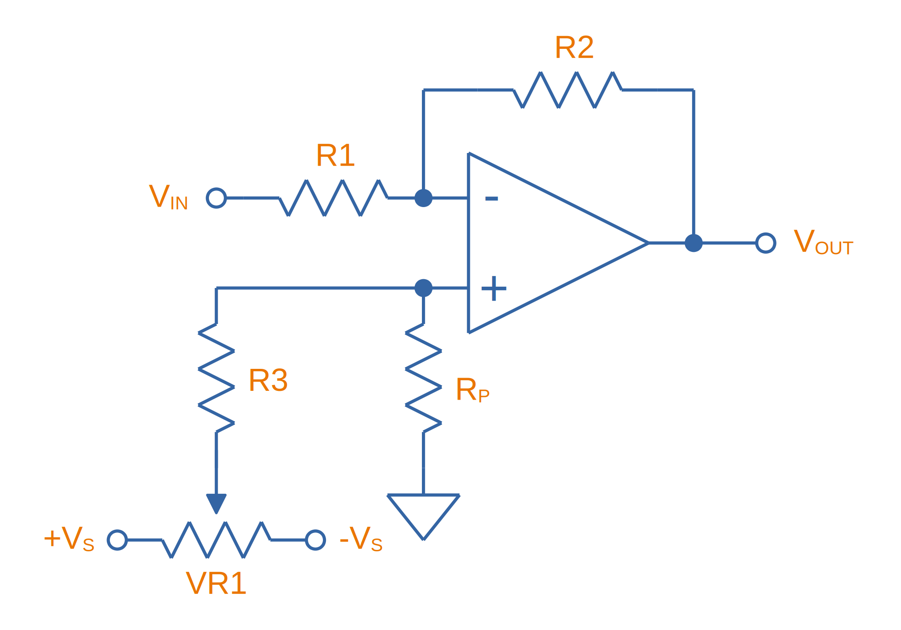

The maximum input offset voltage you can compensate for with this circuit is given by Eq stem:[\ref{eq:trim-inverting-offset}]<<bib-analog-devices-input-offset-voltage>>.

[stem]
++++
\begin{align}
\label{eq:trim-inverting-offset}
V_{offset} =  \pm(1 + \frac{R2}{R1}) (\frac{R_P}{R_P + R3}) V_R
\end{align}
++++

### Input Bias Current (Ib+ and Ib-)

The _input bias current_ stem:[I_{B+}] and stem:[I_{B-}] describe the currents that flow in and out of the op-amps input pins. In an ideal op-amp, no current flows into/out of the input pins (the op-amp has infinite input impedance). In reality, always some small amount of current will flow. Typical input bias currents range from 1-10nA.

The amount and behaviour of input bias current depends on the op-amp transistor technology. A FET-based op-amp's input bias current will double with every 10°C rise in temperature<<bib-analog-devices-input-bias-current>>.

Input bias currents are a problem because these currents will flow through external circuitry connected to the op-amps inputs. This current when flowing through resistors and other impedances will create unwanted voltages which will increase the systematic errors.

The _input offset current_ stem:[I_{OS}] is the difference between the input bias current at the `+` pin and the `-` pin.

### Input Impedance

The input impedance is the internal resistance to ground from the two input pins. In an ideal op-amp, this value is infinite. For most op-amps, this value is somewhere between 1-10MΩ.

### Gain-Bandwidth (GBW) Product

The gain-bandwidth product can be initialised as _GBWP_, _GBW_, _GBP_ or _GB_. It is an important parameter which basically puts a limit on the maximum gain and frequency. **An op-amp's maximum possible gain reduces as the frequency of the signal increases.** The multiplication of the gain with the frequency gives the gain-bandwidth product, which is **relatively constant** for a particular op-amp.

Hence if the gain bandwidth of a particular op-amp is 1Mhz, and the gain is 10, the maximum frequency that the op-amp can operate linearly at (still provide a gain of 10) is at 100kHz. Or if the gain was set to 100, then the maximum frequency is 10kHz. **This also means that an op-amp has a built-in low-pass filter, as the gain drops for very high frequencies.**

An example of an ultra-high gain bandwidth is 1700MHz, which are present in 'Wideband CFB" op-amps, designed for applications such as RGB line drivers (such as the OPA695). A 'normal' GBW can be anywhere between 100kHz and 10MHz. A low gain-bandwidth is around 1kHz (reminiscent of less advanced, older op-amps). **Remember gain is unit-less (V/V), so gain bandwidth is expressed as a frequency only.** Not realising this can be confusing! The GBW product is closely related to the slew rate (see below).

### High Level Output Voltage

The high level output voltage (stem:[V_{OH}]) defines the highest voltage which the op-amp can drive the output to (with respect to the power supply stem:[V_+]).

### Low Level Output Voltage

The low level output voltage (stem:[V_{OL}]) defines the lowest voltage which the op-amp can drive the output to. The LM324 is rumoured to only be able to drive the output near ground if it is sourcing current, but only to 0.5V minimum if sinking (see this EDA Forum post, link:http://www.edaboard.com/thread209783.html[LM324 Opamp Gain Instability]).

### Slew Rate

The _slew rate_ of an op-amp defines the **maximum rate the output voltage can change with respect to time**. In an ideal op-amp, this would be infinite. It has the SI units V/s, and is commonly expressed in uV/s. It can be thought of as the slope of the output waveform if one of the inputs of the input was subjected to a step voltage change. 

Op-amps have a limited output slew rate due to internal compensation capacitor combined with a finite output drive current. Charing a capacitive output with a constant current (a good approximation) gives a linear increase in voltage (recall that the equation relating voltage to current for a capacitor is stem:[i = C \frac{dV}{dt}]).

The **max. slew rate of an op-amp limits the amplitude of output waveforms it can produce at high frequencies without distortion**. This parameter usually increases as the GBW of the op-amp increases. Higher slew rate op-amps also tend to have higher quiescent currents.

### Quiescent Current

The _quiescent current_ (current with no load, device in steady-state) is generally constant over the total rated supply voltage range. Obviously, if there is a load on the op-amp, the current drawn through the power pins (the supply current) will be the sum of the quiescent current and the current going through the load.

Quiescent currents for standard op-amps are typically between 1.5-4mA. A 'low-power' op-amp has a typical quiescent current between 0.5-1.5mA (such as the `LM258N`). Then there are ultra-low power op-amps that only draw 5-20pA (such as the `LMC6464`). You normally sacrifice slew-rate and gain-bandwidth for ultra-low power. Likewise, higher gain-bandwidth and higher slew rate op-amps typically have larger quiescent currents. 

## Cascading Op-Amps

Cascading op-amps is concept when the output of one op-amp is connected to the input of another. There can be an arbitrary number of op-amps in the cascade, but usual limits are 3-4.

For a fixed-gain, cascading op-amps can also be used to **increase the bandwidth**, as each individual op-amp now can operate at a lower gain and therefore has a larger bandwidth as defined by the gain-bandwidth product. Note though that each additional op-amp added to increase the bandwidth gives diminishing returns. Also important to note that op-amp bandwidth is defined as the -3dB gain points. Hence the bandwidth does not stay the same (total bandwidth gets smaller) when two identical op-amps are cascaded, as these will now the -6dB points. A practical limit for fixed-total-gain increased-bandwidth cascading is about 3-4 op-amps.

### The Gain

When cascading op-amps, the total gain is the product of all of the individual op-amps gains, i.e.:

[stem]
++++
A_{total} = A_0 A_1 A_2 ... A_n
++++

### The Bandwidth

The bandwidth of cascaded op-amps is not as simple to calculate as the gain.

If all of the op-amps are identical, then the following equation can be used:

[stem]
++++
BW_{tot} = BW \times \sqrt{2^{\frac{1}{N}} - 1}
++++

[.text-center]
where: +
stem:[ BW_{tot} ] = the total bandwidth of the cascaded op-amp system +
stem:[ BW ] = the bandwidth of the individual op-amps (remember, they have to be identical) +
stem:[ N ] = the number of op-amps in the cascaded system

The above equation gives diminishing returns with every additional op-amp added.

## Feedback Resistor Values

As a rule-of-thumb, you should use the lowest acceptable resistances in op-amp feedback paths to reduce instabilities.

## Types Of Op-Amps

### General Purpose

General purpose op-amps typically have parameters in the following ranges:

* Gain Bandwidth Product: 1MHz
* Input Bias Current: 15pA
* Input Voltage Offset: 1mV
* Output Current: 20-50mA
* Icc: 1mA

### Rail-to-Rail Op-Amps

A _rail-to-rail_ op-amp is an op-amp which supports input voltages **near** the power rails, and can drive the output close to the one or more  of the power rails. We must stress the word **NEAR**, as the op-amp's output voltage will never get exactly to the rail, due to the finite voltage drop across the output-stage transistors. Rail-to-rail op-amps just support wider ranged input voltages and can drive closer to the rails than general purpose op-amps can. Look for the **low level output voltage** (stem:[V_{OL}]) parameter in the op-amp's datasheet. For "rail-to-rail" op-amps, this will usually be about 100-200mV about ground at normal load currents.

WARNING: "_Rail-to-rail_" op-amps cannot really output either rail voltage, just closer to it that general purpose op-amps.

This also means that a rail-to-ral single-supply op-amp cannot output 0V. **To achieve a true ground output, you need a negative voltage supply.** There are dedicated ICs designed to provide a small negative power supply to op-amps so that they can output true ground. One such example is the link:http://www.ti.com/product/LM7705[Texas Instruments LM7705], a "_Low Noise Negative Bias Generator_". This IC only generates -230mV, which allows the designer to use CMOS-based op-amps which usually have a maximum supply voltage of 5.5V.

.The typical application schematic for the Texas Instruments LM7705, a 'Low-Noise Negative Bias Generator' for the negative supply of an op-amp. This allows the op-amp to output true 0V. Image from http://www.ti.com/.
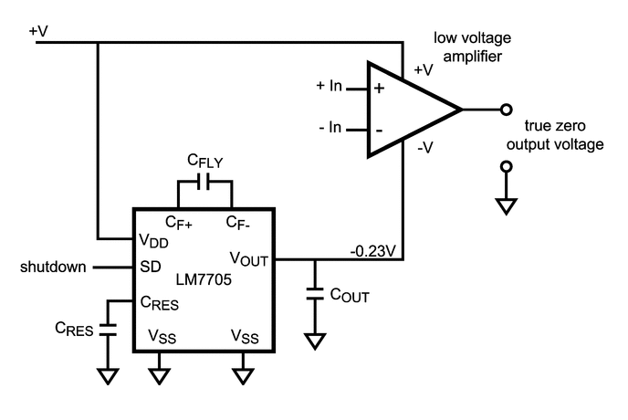

### Micropower Op-Amps

_Micropower_ is a termed used for extremely low quiescent current op-amps that are designed for battery or energy recovery-based power supplies. The supply current of micropower op-amps is typically within the range of 50-100uA at a supply voltage of 2-10V. Because they are designed for battery-based systems, they are also commonly single-supply op-amps.

### Instrumentation Amplifiers

Instrumentation amplifiers are analog voltage amplifier circuits that, although are drawn the the same symbol as an op-amp, are typically made up internally from three op-amps (and passives). You can either make an instrumentation amplifier out of discrete op-amps or purchase a instrumentation amplifier IC which contains all the op-amps within the same chip.

## Manufacturer Part Number Families

* **INA**
  * **INAx126**: Precision instrumentation amplifiers by Texas Instruments. The INA126 has one amplifier per package, the INA2126 has two.
  * **INA290**: Precision current-sense amplifier.
* **LM741**: Very popular and old "741" style op-amp produced by Texas Instruments, ON Semiconductor and Rochester Electronics. 
* **LT**: The prefix Linear Technology (now Analog Devices) uses for their range of op-amps.
  * **LT1006**: Precision, single-supply op-amp.
  * **LT1077**: Micropower, single-supply op-amp.
  * **LT1167**: Instrumentation amplifier.
* **MAX**: Op-amps by Maxim.
  * **MAX4194**: Instrumentation amplifier.
* **OP07**: Analog Devices/Texas Instruments ranges of low input offset voltage op-amps.
  * **OP07C**: ±3-18V VCC, -40 to +85°C industrial temp. range
    * **OP07CP**: DIP-8 package
    * **OP07CS**: SOIC-8 package
  * **OP07D**: ±4-18V VCC
  * **OP07E**: 0 to 70°C commercial temp. range
* **OPA**: Texas Instruments (previously Burr-Brown) family of op-amps.
  * **OPAx187**: Zero-drift 36V rail-to-rail op-amps. Includes the OPA187 (1 op-amp), OPA2187 (2 op-amps) and OPA4187 (4 op-amps).
  * **OPA241**: Single-supply
  * **OPA251**: Dual-supply
  * **OPA27**: Texas Instruments (previously Burr-Brown) family of ultra-low noise, precision op-amps. Internally compensated for unity-gain stability.
  * **OPA37**: Uncompensated version of the OPA27.
* **TLE202**: Texas Instruments family of "high-speed low-power" precision operational amplifiers. Belong to the _Excalibur_ family of TI op-amps which uses "isolated vertical PNP transistors" to give unity-gain bandwidth and slew rate improvements.
* **TLV**: Texas Instruments family of op-amps.
  **TLV27**:

## The Different Types Of Gain, Explained

Open-loop gain stem:[A_V] (sometimes written as stem:[A_{OL}]) is the gain of the op-amp without any feedback.

Closed loop gain stem:[G_V] is the over-all gain of the op-amp with feedback.

.How the open-loop and closed-loop gain of an op-amp changes with increasing frequency.
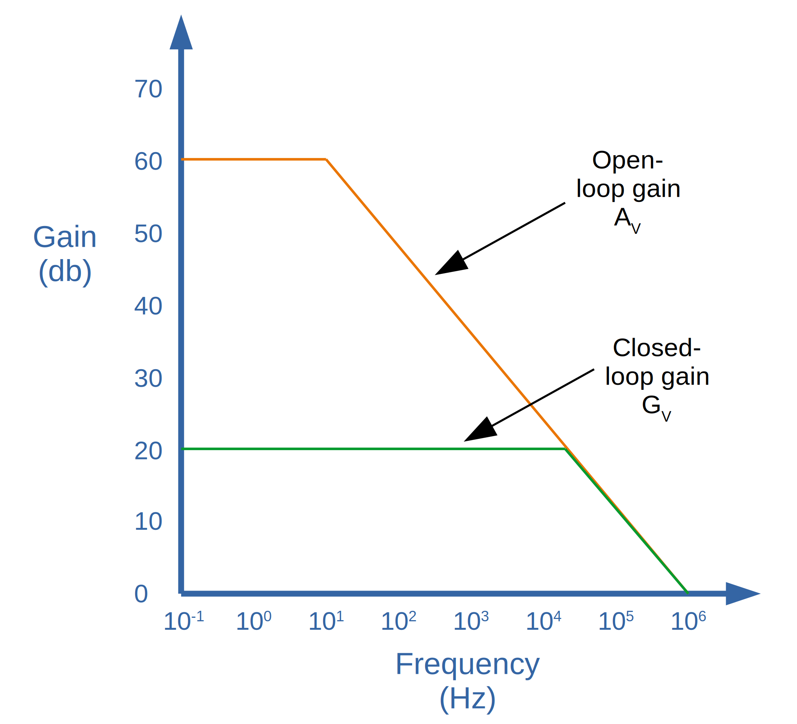

We can generalize the circuit of an op-amp with negative feedback to the block diagram shown below. 

.A block diagram showing a generalized op-amp configuration with negative feedback.
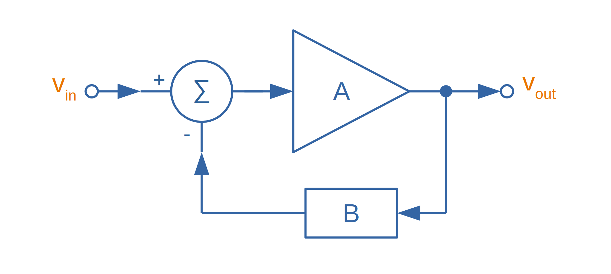

From the above block diagram we can write an equation for stem:[v_{out}]:

[stem]
++++
\begin{align}
v_{out} &= A\times v_{sum} \\
        &= A(v_{in} - Bv_{out}) \\
\end{align}
++++

What we are really interested is an equation for the closed-loop gain stem:[G_V] which is equal to stem:[\frac{v_{out}}{v_{in}}]...all we need to do is to re-arrange the equation as shown below:

[stem]
++++
\begin{align}
v_{out} &= Av_{in} - ABv_{out}  & \text{Expanding} \\
v_{out}(1 - AB) &= Av_{in}      & \text{Shift $v_{out}$ onto left side and factor.} \\
\frac{v_{out}}{v_{in}} &= \frac{A}{1 - AB}  & \text{Jiggle things to get $\frac{v_{out}}{v_{in}}$} \\
\end{align}
++++

And so we come to an equation for the closed loop gain stem:[G_V] as:

[stem]
++++
\begin{align}
G_V &= \frac{A}{1 - AB}
\end{align}
++++

We can take this one step further, since normally the open-loop gain stem:[A] for an op-amp is very large, in the range of stem:[100,000] to stem:[1,000,000]. With that, we can simply the closed loop gain to be:

[stem]
++++
\begin{align}
G_V &\approx \frac{1}{B}
\end{align}
++++

|===
| Name       | Equation

| Open-loop gain | stem:[A]
| Loop gain  | stem:[-AB] 
| Closed-loop gain | stem:[\approx \frac{1}{B}]
|===

## Examples

Below are some examples of op-amps that stand out from the crowd for some reason, be it popularity, years in service, or functionality wise.

++++
<table>
  <thead>
    <tr>
      <th>Manufacturer Code</th>
      <th>Description</th>
      <th>Approximate Price (1 unit, US$)</th>
    </tr>
  </thead>
  <tbody>
    <tr>
      <td>AD860x</td>
      <td>Good for high precision stuff! Awesome for photo-diode amplification (both current-to-voltage and voltage-to-voltage configurations).</td>
      <td>$3.50</td>
    </tr>
    <tr>
      <td>LM32x</td>
      <td>A common family of op-amps that has been around for along time, they can operate of a single supply and can swing right to ground, but cannot swing to the rail voltage. The LM321 has one op-amp, the LM328 has two (dual), and the LM324 has 4 (quad).</td>
      <td></td>
    </tr>
    <tr>
      <td>LM833</td>
      <td>One of the cheapest 'audio' op-amps available (about US$0.20 as of 2011). Features a high GBW for it's price.</td>
      <td></td>
    </tr>
    <tr>
      <td>OPA695</td>
      <td>This is a ultra-wideband, current-feedback op-amp. If you need an op-amp with a ridiculously high gain-bandwidth product, this is along the lines of what you want to use. It has a GBW of 1700Mhz and a maximum slew-rate of 4300V/us.</td>
      <td>$3.50</td>
    </tr>
    <tr>
      <td>OP07</td>
      <td>A op-amp with a "ultra" low input offset voltage (resistors are trimmed at production time to achieve this), guranteed to be no more than 75uV. This op-amp also features offset nulling pins to further reduce the input offset voltage by performing trimming once the op-amp is installed in a circuit.</td>
      <td>n/a</td>
    </tr>
  </tbody>
</table>
++++

## Negative Voltage Rails

Dedicated charge-pump topology power supply ICs are available that supply a small negative voltage to the op-amps `V-` pin.

## Isolation Amplifiers

Isolation amplifiers provide galvanic isolation between the input (sensor) and output (measurement circuitry). They are used to protect the sensor measurement and recording circuitry (e.g. a microcontroller with on-board ADC) from dangerously high voltages at the sensor, and also the opposite, to protect the sensor environment from potentially dangerous voltages on the rest of the system.

.A simplified schematic of the Texas Instruments AMC1200, a fully-differential isolated amplifier. Image from http://www.ti.com/.
image::fully-differential-isolation-amplfier-ti-amc1200-simplified-schematic.pdf.png[width=700px]

A common application would be to isolate and amplify the voltage across a current-sense resistor on a high-power motor, or to protect humans with medical sensors connected to them from the measurement system.

Basic isolation amplifiers require two power supplies (one for each side of isolation), while others incorporate built-in transformers so that you only have to provide one power source.

## Input Resistors

One of the first things you learn about an op-amp is that the input impedance on the input pins are very large (ideally infinite). So naturally you would start to question why resistors would be connected to the input pins of an op-amp like shown in the diagram below:

.Schematic showing a resistor on the positive input to a op-amp.
image::op-amp-input-pin-resistors.png[width=500px]

These input resistors serve to limit the input current if the voltage on the input pin goes above stem:[V_{CC}]. Most op-amps have protection/clamping diodes from the input pins to stem:[V_{CC}] (typically you can determines this if in the datasheet the input pins max voltage is rated to stem:[V_{CC} + 0.3V], which is one diode voltage drop). If there was no resistor there, the built-in diode would conduct and sink a large current from the input pin to stem:[V_{CC}], possibly damaging the op-amp. The resistor limits this current to a safe value.

## Offset Nulling Circuits

Some op-amps which are designed to have very low input offset voltages also come with _offset nulling pins_ to further trim the input offset voltage once the op-amp is installed in circuit. The OP07 is one op-amp which has these pins. Typically, a stem:[10-50k\Omega] potentiometer is connected across these pins with the wiper going to stem:[V_{CC}], as shown in the example schematic below:

.Image from https://www.analog.com/media/en/technical-documentation/data-sheets/OP07.pdf.
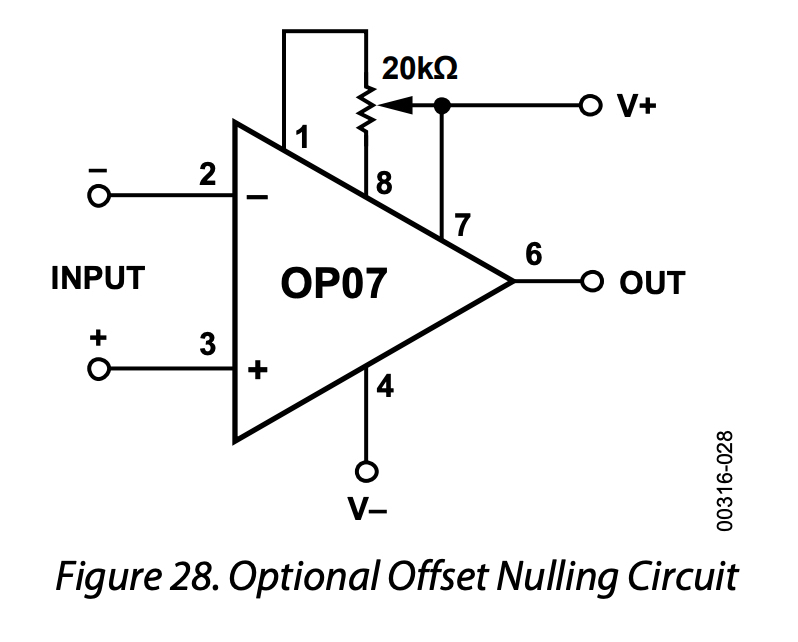

IMPORTANT: If not using the trim pins, leave them not connected (open circuit). Do NOT connect them to ground.

## Negative Impedance Converters (NICs)

### What Is A NIC?

A _negative impedance converter_ (NIC) is a clever op-amp circuit which creates negative impedance (you might be wondering what negative impedance actually is, more on this later). A NIC can be constructed from an op-amp and a few passive components as shown in the following schematic:

.Schematic of a negative impedance converter (NIC) created from an op-amp and a few passive components.
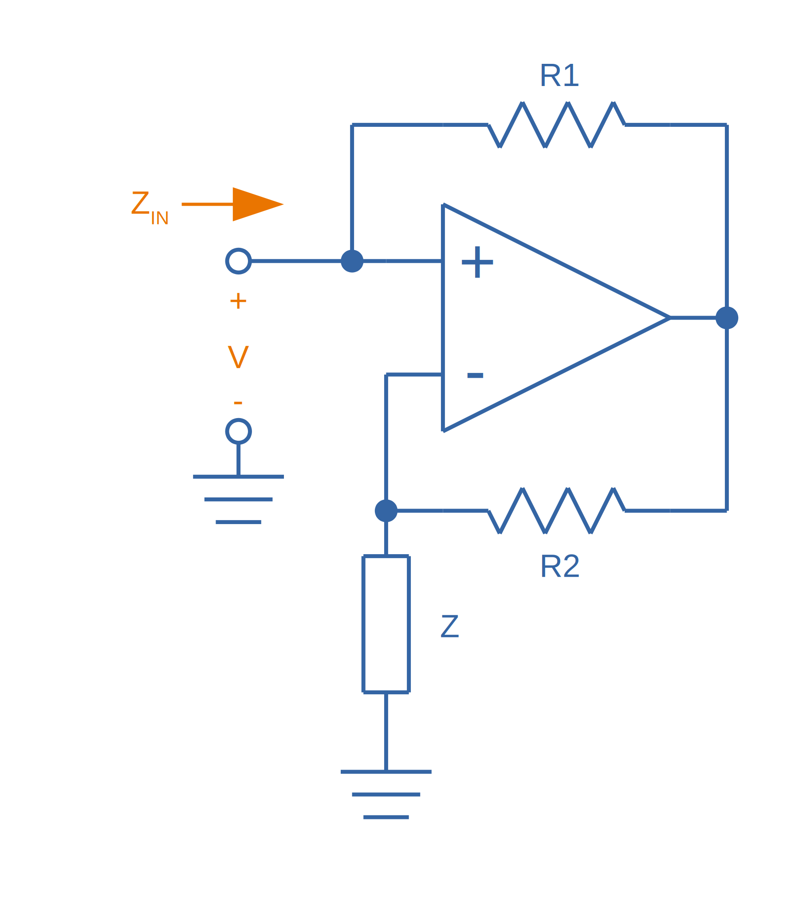

Typically the two resistances are the same (stem:[R1 = R2]), and then the input impedance stem:[Z_{IN}] is:

[stem]
++++
\begin{align}
Z_{IN} = -Z
\end{align}
++++

[.text-center]
stem:[Z_{IN}] is the input impedance, in Ohms (stem:[\Omega]) +
stem:[-Z] is the impedance of the component connected between the inverting terminal and ground, as shown on the diagram, in Ohms (stem:[\Omega])

### What Does Negative Impedance Actually Mean?

What does negative impedance actually mean? If stem:[Z] is just a simple resistor with resistance stem:[R] (the most basic kind of NIC), then the impedance is stem:[Z_{IN} = -R]. This means the circuit behaves just like a simple resistor connected to ground, **except that the current comes out of the resistor, not into it**.

Things get more interesting when you replace this resistor with a capacitor.

TODO: Add explanation of what happens when capacitor is added.

### NIC Input Impedance Proof

NOTE: Skip this section if you are not interested in the maths.

To prove stem:[Z_{IN} = -Z], we need to find the input current at inverting terminal, and then use stem:[Z_{IN} = \frac{V}{I_{IN}}]. The input current can be found by application of Ohm's law and the golden rules of op-amps. Using the rule that the voltage at the two input terminals will be the same, we know the voltage across the impedance stem:[Z] is going to be:

[stem]
++++
\begin{align}
\label{eqn:vzeqv}
V_Z = V
\end{align}
++++

Using Ohm's law, the current through the impedance stem:[Z] is therefore:

[stem]
++++
\begin{align}
I_Z = \frac{V}{Z}
\end{align}
++++

Because there is no current going into the inverting terminal of the op-amp, this current stem:[I_Z] must also be flowing through stem:[R2]:

[stem]
++++
\begin{align}
\label{eqn:i_r2}
I_{R2} = \frac{V}{Z}
\end{align}
++++

Now knowing the voltage at the inverting terminal and the current through stem:[R2] we can write an equation for the voltage at the output of the op-amp:

[stem]
++++
\begin{align}
\label{eqn:vout_eq}
V_{OUT} &= V_Z + V_{R2} \\
        &= V_Z + I_{R2} \cdot R \\
        &= V + \frac{V}{Z} \cdot R &  &\text{Subs. in \ref{eqn:vzeqv} and \ref{eqn:i_r2}}
\end{align}
++++

Now that we know the voltage on both sides of stem:[R1] we can find the voltage across it:

[stem]
++++
\begin{align}
\label{eqn:v_r1}
V_{R1} &= V_{OUT} - V                   &\\
       &= V + \frac{V}{Z} \cdot R - V   & &\text{Subs. in \ref{eqn:vout_eq}} \\
       &= \frac{V}{Z} \cdot R           & &\text{Simplifying}
\end{align}
++++

Now we know the voltage across stem:[R1] we can find the current going through it using Ohm's law:

[stem]
++++
\begin{align}
\label{eqn:i_r1}
I_{R1} &= \frac{V_{R1}}{R}                &\\
       &= \frac{\frac{V}{Z} \cdot R}{R}   & &\text{Subs. in \ref{eqn:v_r1}} \\
       &= \frac{V}{Z}                     & &\text{Simplifying}
\end{align}
++++

Because the voltage on the right-hand side of stem:[R1] is higher, this current is flowing right-to-left. Since no current flows into the inverting terminal of the op-amp, this also must be current flowing "out" of the input terminal. Thus:

[stem]
++++
\begin{align}
\label{eqn:i_in}
I_{IN} = -\frac{V}{Z}
\end{align}
++++

Knowing the input current and voltage, we can finally write an equation for stem:[Z_{IN}]:

[stem]
++++
\begin{align}
\label{eqn:z_in}
Z_{IN} &= \frac{V_{IN}}{I_{IN}}       & &\text{Ohms law} \\
       &= \frac{V}{-\frac{V}{Z}}      & &\text{Subs. in \ref{eqn:i_in}} \\
       &= -Z                          & &\text{Simplifying}
\end{align}
++++

Proof complete!

## Chopper-Stabilised Op-Amps

TODO

## Capacitive Loading

TODO

## Industry Standard Package Pinouts For Op-Amps

Op-amps are usually packaged in industry standard through-hole and surface mount packages. For many of these packages, there are industry standard pinouts which means you can easily find pin-compatible alternatives for any given op-amp. This section aims to illustrate some of these industry standard pinouts.

For 8-pin packages:

.The standard pinout for two op-amps in an 8-pin package. This includes the DIP-8, TSSOP-8, SOIC-8 and MSOP-8 component packages.
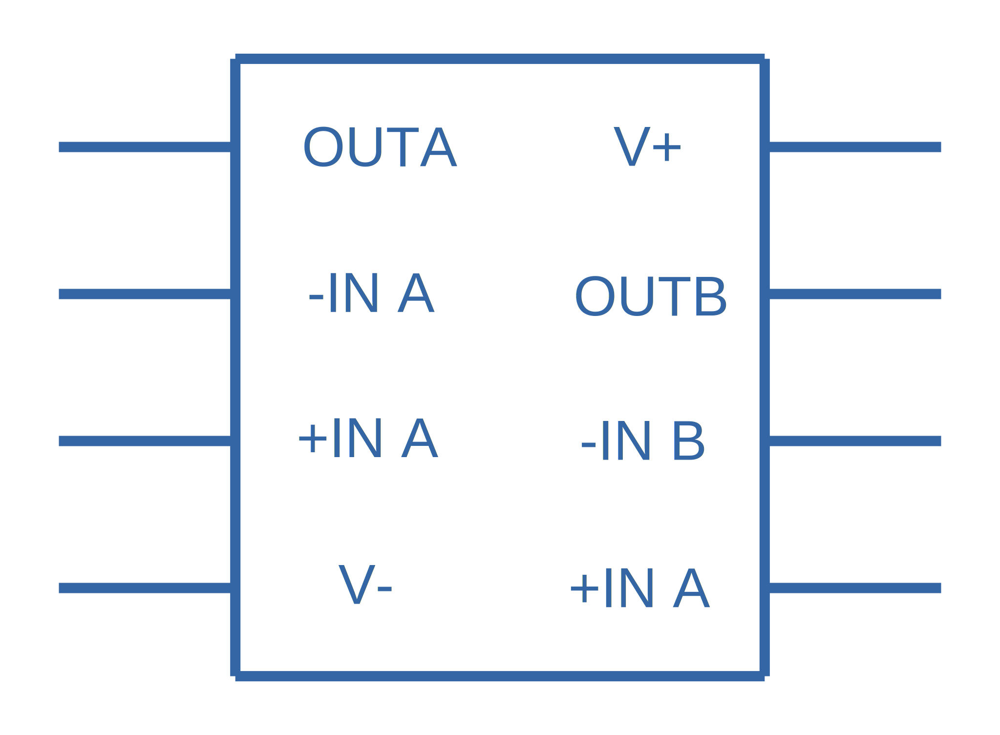

[bibliography]
== References

* [[[bib-ti-lm234-datasheet, 1]]]: Retrieved 2020-10-20, from https://www.ti.com/lit/ds/snosc16d/snosc16d.pdf.
* [[[bib-ti-app-report-input-offset-voltage, 2]]]: Retrieved 2020-10-20, from https://www.ti.com/lit/an/sloa059/sloa059.pdf.
* [[[bib-analog-devices-input-bias-current, 3]]]: Retrieved 2020-10-20, from https://www.analog.com/media/en/training-seminars/tutorials/MT-038.pdf.
* [[[bib-ti-opax196-datasheet, 4]]]: https://www.ti.com/lit/ds/symlink/opa196.pdf
* [[[bib-analog-devices-input-offset-voltage, 5]]] Analog Devices (2008, Oct.). _MT-037: Op Amp Input Offset Voltage_. Retrieved 2021-09-03, from https://www.analog.com/media/en/training-seminars/tutorials/MT-037.pdf.
* [[[bib-onsemi-lm324, 6]]] OnSemiconductor (2021, Aug.). _Single Supply Quad
Operational Amplifiers (Datasheet)_. Retrieved 2021-09-03, from https://www.onsemi.com/pdf/datasheet/lm324-d.pdf. 