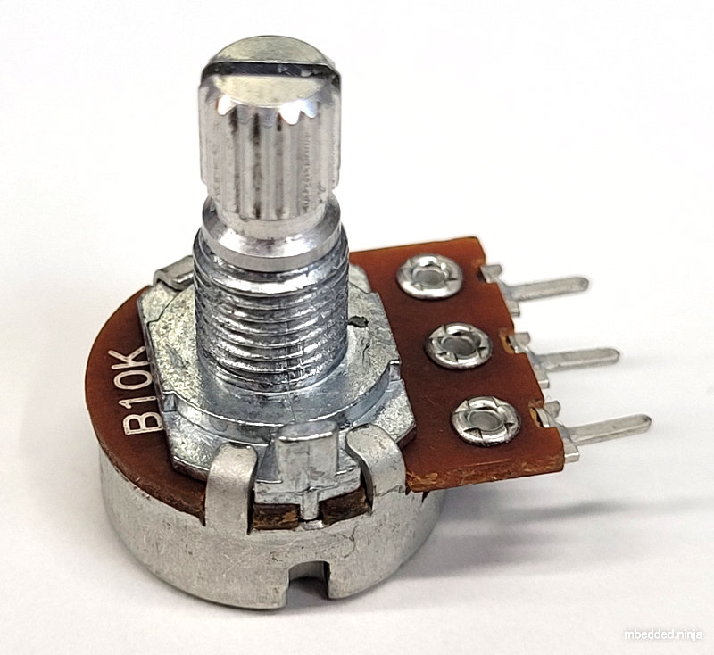
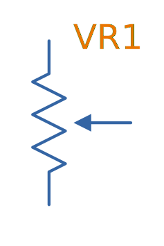
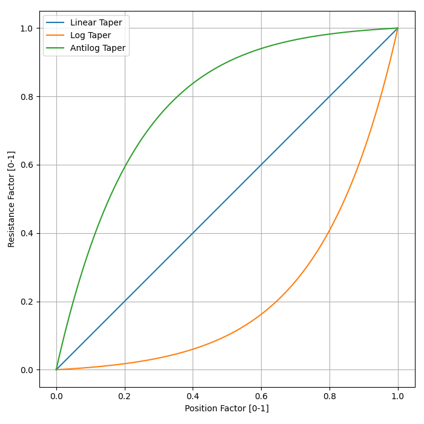
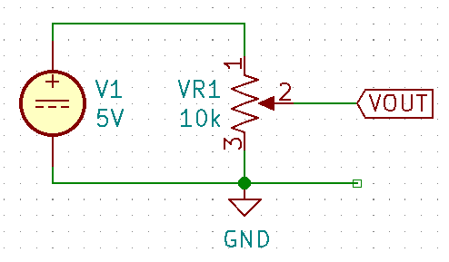
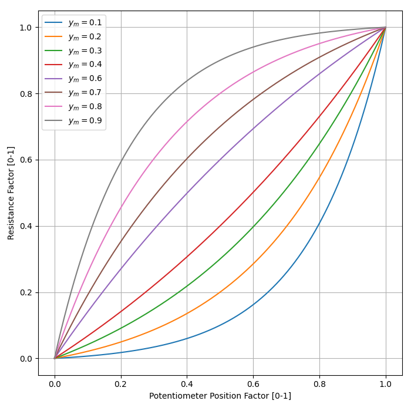
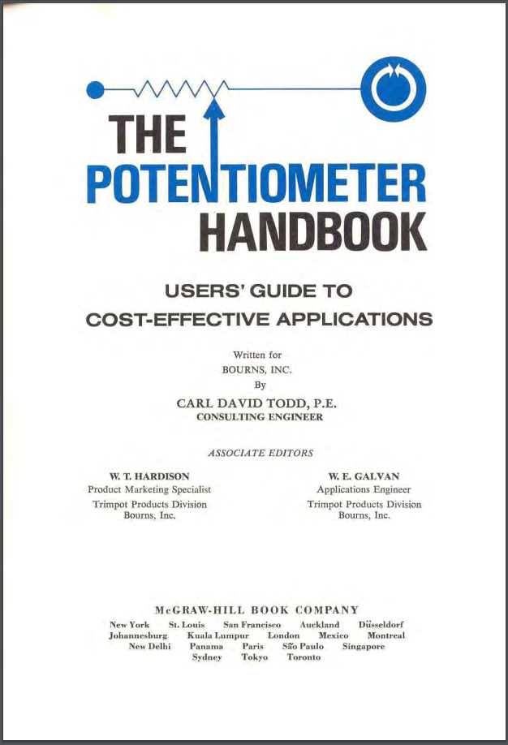

:imagesdir: 

## Overview

This page is about mechanically adjustable resistors called potentiometers and rheostats. For fixed resistors, see the link:/electronics/components/resistors/[Resistors page]. For digitally controlled potentiometers, see the link:/electronics/components/digital-potentiometers-dpots[Digital Potentiometers (DPOTS) page].

_Potentiometers_ are 3 terminal resistors whose resistance can be varied by means of a mechanical wiper or similar actuating device. They consist of two outer terminals which provide connections to a fixed resistance made from a conductive track, and a middle pin which connects to the wiper. The potentiometer can be turned so that the wiper slides from one end of the track to the other, changing the resistance between it and the two outer pins. A rheostat (which is also called a _variable resistor_) is simply a potentiometer but with one of the outside pins missing. They typically come in values of 5, 10, 20, 50 and 100kΩ.

.A photo of a panel-mount, through-hole potentiometer from BI Technologies/TT Electronics (part number P160KNP-0EC15B10K). The outer pins have a fixed resistance across them of stem:[10k\Omega]. The middle pin is connected to the wiper, and it's resistance varies between the outer pins (linearly in this case, but other tapers exist such as logarithmic) as the knob is turned.

Potentiometers are commonly used for user interfaces (e.g. volume control on an audio amplifier), once-off manufacturing calibration, and cheap mechanical rotation to digital converters.

## Designator Prefixes And Schematic Symbols

Designator prefixes for potentiometers and rheostats include:

* `VR` (**V**ariable **R**esistor, my preferred choice)
* `RV` (`VR` the other way around, KiCAD style)
* `POT`

The schematic symbol looks like a normal resistor, but with a third pin added to the side of the resistor with an arrow, indicating the wiper. An example (with the US style squiggly resistor) is shown below:

.The schematic symbol for a potentiometer, with the US-style 'squiggly' resistor.

See the link:/electronics/circuit-design/component-schematic-symbols-and-designators#resistors-r-vr[Resistors section of the Component Schematic Symbols and Designators page] for more information.

## Resistive Track

The resistive track is most cheap potentiometer is made from graphite. Others may be made from carbon or wound wire.

## Style

The _style_ of a potentiometer can be:

* Rotary (most common)
* Trimmer
* Slide

## Taper

The taper is the relationship between position and resistance. It is also sometimes called the "**law"**. The _taper_ of a potentiometer can either be:

* **Linear taper**: Most common form of taper. Value changes linearly with knob rotation.
* **Logarithmic taper** or **Audio taper**: Commonly used in audio applications for volume control to achieve a more natural change in volume (human ears perceive loudness logarithmically). However, "logarithmic taper" is a misnomer, they are actually exponential (opposite of logarithmic) to compensate for logarithmic hearing<<bib-eepower-potentiometer-taper>>!
* **Reverse logarithmic taper**: Also called the _antilog taper_. Exact opposite response of a logarithmic taper pot. Used for applications such as audio volume controls which need to rotate counter-clockwise rather than clockwise<<bib-eepower-potentiometer-taper>>. These pots actually have a logarithmic response.

The below plot gives you an idea on the shapes of these tapers. For the equation used to generate these tapers, see the below section <<#_the_ideal_logarithmic_taper_equation, The Ideal Logarithmic Taper Equation>>. 

.Plot of the approximation of three common potentiometer tapers, the linear, log and antilog taper.

WARNING: Log and antilog tapers are usually never very precise (unless you pay big money), and in cases are just two piece-wise linear tapers of different gradients. The plot above just shows the **approximate shape**.

_Taper codes_ exist to inform the user of a potentiometers taper. There are two types of taper codes in use (confusing!).

|===
| Taper               | Old Code | New Code

| Linear              | A        | B
| Logarithmic (Audio) | C        | A
| Antilog             | F        | n/a
|===

### Tapering Resistors

TODO: Add info here.

## Tolerance

Tolerance on potentiometers normally ranges from 2-15%. Note that this is much higher than standard 1% chip SMD fixed resistors, don't expect potentiometers to be as cheap and accurate!

## Labelling

Potentiometers are labelled according to their resistance value and resistance layout of the track (taper).

## Resistance

The resistance is of potentiometers is easy to read, a usually indicated by a three-digit number and a multiplier. For example, 100K would symbolise a 100kΩ pot.

## Travel (Rotation)

### Partial-turn

Partial-turn potentiometers are the most common and cheapest form of potentiometer. The _total mechanical travel_ (rotation) is usually between 250-330°. The _total electrical travel_ is usually less than this, which means there is some dead-zone and the start and end of the travel in where the resistance does not changed.

Partial-turn potentiometers are commonly used in human-operated situations (the potentiometer is rotated by hand). They provide enough resolution for things such as amplifier volume control.

### Multi-turn

A common number of turns for multi-turn potentiometers is 10. They are usually MUCH MORE expensive than their partial turn counterparts (as of June 2016, US$20 (100) for a "cheap" 3-turn wire-wound potentiometer).

Multi-turn potentiometers are used when more resolution is required, or the "thing" rotating the potentiometer is going to go through 1 or more revolutions (e.g. if the potentiometer was connected to an axle or pulley which rotated back and forth through 4 revolutions).

## Common Uses And Example Circuits

The most common use for a potentiometer to provide a variable output voltage based on how the far the potentiometer has been turned. This voltage then can be used to control any number of things, such as the volume of music as the user turns the volume dial. The two ends of the potentiometer are connected across a constant voltage source, in the example below, this is stem:[ 5V ]. The wiper then forms the variable mid-point of a voltage divider. As you turn the potentiometer, one of the "resistors" increases while the other decreases, and thus the wiper varies in voltage from one end point to the other. In the example below the wiper voltage varies from stem:[ 0V ] to stem:[ 5V ]:

.A very common way to use a potentiometer in a circuit to provide a variable output voltage.

A word of caution...Make sure you do not draw too much current from the wiper. Ignoring the wiper resistance, the output impedance of the potentiometer changes depending on the wiper position. When the wiper is at either end, the output impedance is stem:[ 0 \Omega ] (great you may say). But the output impedance increases to the worst case when the wiper is exactly half-way between the two ends, in which case it is stem:[ \frac{R_{pot}}{4} \, \Omega ] (two resistors in parallel, each resistor being stem:[ \frac{R_{pot}}{2} \, \Omega ]).

If we assume the worst-case, **the output impedance of a potentiometer is**:

[stem]
++++
\begin{align}
\b{Z_O} = \frac{R_{pot}}{4}
\end{align}
++++

[.text-center]
where: +
\(\b{Z_O}\) is the output impedance, in \( \Omega \) +
\( R_{pot} \) is the end-to-end resistance of the potentiometer, in \( \Omega \)

## The Ideal Logarithmic Taper Equation

We can write the general equation to map a linear scale to a logarithmic scale as:

[stem]
++++
\begin{align}
y = ab^x + c
\end{align}
++++

Let stem:[x] be the percentage of total potentiometer rotation in where stem:[0 \le x \le 1], and stem:[y] be the percentage of total resistance, again varying from stem:[0 \le y \e 1]. stem:[a], stem:[b] and stem:[c] are free parameters to fit the desired curve (they are constrained below).

For an ideal potentiometer, we want the resistance to be stem:[0] when the rotation is stem:[0], e.g. stem:[y = 0] when stem:[x = 0]. Therefore:

[stem]
++++
\begin{align}
0 = a + c \\
c = -a
\end{align}
++++

This allows us to remove stem:[c] from the equation, giving:

[stem]
++++
\begin{align}
y = ab^x - a
\end{align}
++++

Also, we want to have maximum resistance when the potentiometer is rotated to maximum. So stem:[y = 1] when stem:[x = 1].

[stem]
++++
\begin{align}
1 = ab - a
\end{align}
++++

Let's solve for stem:[a] in terms of stem:[b]:

[stem]
++++
\begin{align}
1 &= ab - a \\
  &= a(b - 1)
a = \frac{1}{b - 1}
\end{align}
++++

Substituting stem:[a] into our equation now gives:

[stem]
++++
\begin{align}
y &= \frac{1}{b - 1}b^x - \frac{1}{b - 1} \\
  &= \frac{1}{b - 1}(b^x - 1) \\
  &= \frac{b^x - 1}{b - 1} \\
\end{align}
++++

We are almost there, except we still have one degree of freedom! How do we choose the value of stem:[b]? One way is to define the value of stem:[y] when the potentiometer is rotated half-way to max, i.e. at stem:[x = 0.5]. We'll call this resistance stem:[y_m] (y at midpoint).

[stem]
++++
\begin{align}
y_m &= \frac{b^{0.5} - 1}{b - 1} \\
    &= \frac{1}{\sqrt{b} + 1} \\
\end{align}
++++

Let's solve for stem:[b]:

[stem]
++++
\begin{align}
y_m &= \frac{1}{\sqrt{b} + 1} \\
y_m(\sqrt{b} + 1) &= 1 \\
\sqrt{b} + 1 &= \frac{1}{y_m} \\
\sqrt{b} &= \frac{1}{y_m} - 1 \\
b &= \left( \frac{1}{y_m} - 1 \right)^2 \\
\end{align}
++++

The below graph shows the shape of the potentiometers response for different values of stem:[y_m], starting at stem:[0.1] and ending with stem:[0.9].

NOTE: At stem:[y_m = 0.5] the resistance factor goes to stem:[\infty], so stem:[y_m = 0.5] is not plotted.

.Plot of the ideal potentiometer log taper equation for various values of stem:[y_m].

In reality, potentiometers with a "log taper" can be roughly approximated with stem:[y_m = 0.1], whilst those with an "antilog taper" with stem:[y_m = 0.9].

## Further Reading

_The Potentiometer Handbook_ by Bourns is a great resource for anything potentiometer related (a hefty 227 pages). Available for free (as of 2022) from https://www.bourns.com/pdfs/onlinepotentiometerhandbook.pdf.

.Screenshot of the "front cover" from the online edition of "The Potentiometer Handbook" by Bourns<<bib-bourns-the-potentiometer-handbook>>.

[bibliography]
## References

* [[[bib-bourns-the-potentiometer-handbook, 1]]] Bourns (2008). _The Potentiometer Handbook_. Retrieved 2022-04-19, from https://www.bourns.com/pdfs/onlinepotentiometerhandbook.pdf.
* [[[bib-eepower-potentiometer-taper, 2]]] EE Power. _Potentiometer Taper_. Retrieved 2021-12-13, from https://eepower.com/resistor-guide/resistor-types/potentiometer-taper/#.
