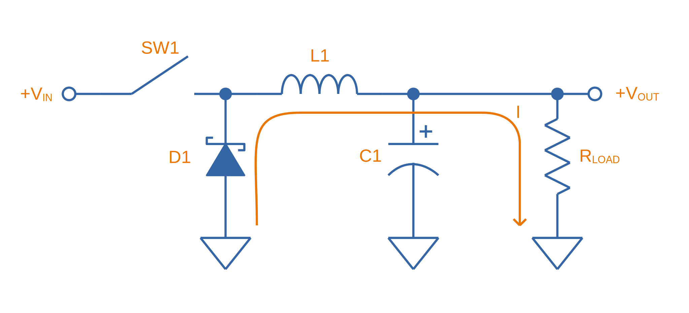

== Overview

_Switch-mode power supplies_ (SMPS) are power conversion circuits that **efficiently convert input voltages/currents (power) into different output voltages/currents**. This page only looks at non-isolated SMPSs, i.e. topologies that don't use a transformer. For info on isolated SMPS regulator designs, see the link:/electronics/components/power-regulators/isolated-switch-mode-power-supplies/[Isolated Switch Mode Power Supplies page]. SMPS can either:

* Decrease the voltage (<<Buck Converters, buck converter>>)
* Increase the voltage (<<Boost Converters, boost converter>>)
* Increase or decrease the voltage (buck-boost, <<SEPIC, SEPIC>>, <<Ćuk Converter, Ćuk Converter>>)
* Increase or decrease AND invert the voltage (<<Inverting Buck-Boost Converters, inverting buck-boost converter>>)

Unlike linear regulators which act as a dynamic series resistance to dump energy as heat and produce a lower output voltage, **SMPSs efficiently perform voltage conversion by storing energy in the magnetic field of an inductor and electric field of a capacitor** (and are not limited to just producing lower output voltages, they can produce higher output voltages also).

== Buck Converters

=== Overview

Buck converters use a switching element, inductor and capacitor to convert an input voltage into a **lower** output voltage. It is a type of _switch-mode power supply_ (SMPS).

.The basic schematic of a buck converter. SW1 is typically a MOSFET switched by control logic (not shown).
image::buck-converter-basic-schematic.svg[width=600px]

=== How It Works

The output voltage of a buck converter is purely determined by the input voltage stem:[V_{IN}] and the percentage of time that the switch spend on during each switching cycle, stem:[D]:

[stem]
++++
\begin{align}
\label{eq:vout-d-vin}
V_{OUT} = DV_{IN}
\end{align}
++++

stem:[D] is the duty cycle, and varies from stem:[0] to stem:[1]. It is defined as:

[stem]
++++
\begin{align}
D = \frac{t_{on}}{T}
\end{align}
++++

[.text-center]
where +
stem:[t_{on}] is the on time of the switch, in seconds +
stem:[T] is the switching frequency, in seconds (stem:[t_{on} + t_{off}])

NOTE: The simple equation showing stem:[V_{OUT}] is only dependent on stem:[V_{IN}] and stem:[D] is only true when all components act ideally (e.g. no voltage drop across the diode, no ESR in the capacitor, no resistance through the inductor). In the real world this is never true, however this equation is still a good first approximation.

The following steps show a way to **intuitively understand how a buck converter produces a lower output voltage** (and derive Eq stem:[\ref{eq:vout-d-vin}]):

. The average voltage across the inductor, over an entire switching cycle, must be 0 (other ways of saying is this is that the integral must be 0, or the volt-seconds must be 0). If it wasn't, then because stem:[V = L \frac{di}{dt}] (the basic equation for an inductor), **the current in the inductor would increase without bound**. 
. When the switch is closed (stem:[t_{on}]), the voltage across stem:[L1] is stem:[V_{IN} - V_{OUT}] during this phase.
. When the switch is open (stem:[t_{off}]), stem:[D1] is forward biased, and if we assume it's a perfect diode (no forward voltage drop), the voltage across stem:[L1] is stem:[-V_{OUT}] during this phase.
. The average (or integral) over the entire switching cycle has to be 0, so:
[stem]
++++
\begin{align}
(V_{IN} - V_{OUT})t_{on} - V_{OUT}t_{off} &= 0 \nonumber \\
V_{IN}t_{on} - V_{OUT}t_{on} - V_{OUT}t_{off} &= 0 \nonumber \\
V_{IN}t_{on} &= V_{OUT}(t_{on} + t_{off}) \nonumber \\
V_{OUT} &= \frac{t_{on}}{t_{on} + t_{off}} V_{IN} \nonumber \\
        &= D V_{IN} \nonumber 
\end{align}
++++

TIP: This analysis method of realizing the average voltage across the inductor must be 0 over an entire switching cycle also works for other switching topologies. 

When the switch is closed, the current flows from the input through the inductor to the output, as shown in <<buck-converter-schematic-current-path-ton>>:

[[buck-converter-schematic-current-path-ton]]
.Current path when the switch is **closed** (during stem:[t_{on}]).

When the switch opens, the input is disconnected. Because the inductor doesn't like changes in current, it keeps a current flowing through the load by forward biasing stem:[D1], as shown in <<buck-converter-schematic-current-path-toff>>:

[[buck-converter-schematic-current-path-toff]]
.Current path when the switch is **open** (during stem:[t_{off}]).

stem:[C1] (which is also called stem:[C_{OUT}]) is to reduce the voltage ripple at the output/load.

=== Control Methods

99% of the time, you want a fixed (regulated) and stable output voltage, which does not depend on the input voltage and one which does not start to sag as you draw more current. To achieve this, it is insufficient to drive the switch at a fixed duty cycle. More complex control mechanisms with feedback are required. The most popular two are _voltage-mode control_ and _current-mode control_, which are explained in the following sections.

==== Voltage-Mode Control (Constant Frequency)

_Voltage-mode (VM) control_ is the simplest control method, originating in approx. the 1970's<<bib-microsemi-v-i-mode>>. It works by taking a proportion of the output voltage and comparing it with a fixed reference voltage. The difference between these two is called the error voltage and is amplified by an _error amplifier_. This error voltage is then fed into a comparator, with the other input being a sawtooth signal (triangular waveform). The switch is turned on at the start of the sawtooth period, and turned off when the sawtooth exceeds the error voltage. An SR latch is normally used to prevent multiple triggers per cycle due to noise. Voltage-mode control is named as such because the duty cycle is proportional to the control voltage.

.The basic logical components used for voltage-mode control.

==== Current-Mode Control (Constant Frequency)

_Current-mode (CM) control_ is a very common control method for buck converters.

It has the following advantages over VM:

* Simpler external frequency compensation than VM 
* Faster load transient response than VM.

However, one big disadvantage is the extra control circuitry complexity. However, this is somewhat mitigated in more recent years as all of this circuitry is integrated into a cheap silicon IC.

Peak current measurement is a common way of "measuring" the average output current.

A transconductance amplifier (amplifier that converts a input voltage to an output current) is used to compare the voltage at a feedback pin (typically labelled _FB_) to an internal voltage reference.

PCM: Peak current mode

See the excellent link:https://www.ti.com.cn/cn/lit/an/snva555/snva555.pdf[SNVA555: Understanding and Applying Current-Mode Control Theory] by TI for more information on current-mode control theory.

==== Hysteretic Control

Hysteretic control is when the output voltage is directly monitored by a comparator, rather than going through an error amplifier. If the output voltage falls or exceeds below a certain value, the buck converter switch is turned on/off. Because the control is performed by measuring the ripple in the output voltage, this method is also called the _ripple control method_.

There are two ways on controlling the switch:

. Detect when the voltage falls BELOW a set threshold, and turn the switch ON for a fixed amount of time, OR
. Detect when the voltage rises ABOVE a set threshold, and turn the switch OFF for a fixed amount of time

Hysteretic control has the benefit of being extremely fast to respond to transient current changes, since it is directly monitoring the output voltage and there is no error amplifier. It also does not need any compensation. These advantages make it suitable for powering the rapidly changing current demands of high power CPUs and FPGAs.  

=== Inductor Selection

You can use the following equations to select the main inductor for a buck converter.

First, calculate the maximum average inductor current using:

[stem]
++++
I_L = I_{OUT} \frac{V_{OUT}}{0.8 V_{IN}}
++++

[.text-center]
where: +
stem:[V_{IN}] = the input voltage to the buck regulator +
stem:[V_{OUT}] = the output voltage of the buck regulator

Then, calculate the value of inductance required with:

[stem]
++++
L = \frac{V_{IN} (V_{OUT} - V_{IN})}{\Delta I_L \cdot f \cdot V_{OUT}}
++++

[.text-center]
where: +
stem:[\Delta I_L] = the desired ripple current in the inductor +
stem:[f] = the switching frequency +
and everything else as mentioned previously

=== Capacitor Selection

The output capacitance is primarily determined by the maximum allowed output voltage ripple. This ripple is determined by the capacitance of the capacitor and it's ESR (equivalent series resistance). The output capacitance of a boost converter can be found using the following equation.

[stem]
++++
C_{min} = \dfrac{I_O (V_{OUT} - V_{IN})}{f  \Delta V V_{OUT}}
++++

[.text-center]
where: +
stem:[\Delta V] = the maximum desired output voltage ripple +
and everything else as mentioned previously

The actual ripple will be slightly larger than this due to the ESR of the capacitor.

[stem]
++++
\Delta V_{ESR} = I_O R_{ESR}
++++

[.text-center]
where: +
stem:[R_{ESR}] = the parasitic series resistance of the output capacitor

The total output ripple is the sum of the ripple caused by the capacitance, and the ripple cause by the ESR. 

TIP: These equations assume a constant load. Load transients (fluctuations in the load current) will also cause voltage ripple.

=== Down Conversion

Some boost converters also have a built in regulator to provide regulation when the input voltage exceeds the desired output voltage. This is normally a linear regulator, so your efficiency will drop and you will have to take into account the thermal dissipation. This is normally called **down conversion**.

.The internal schematic of a boost converter with in-built down conversion capability (the ability to drop the input voltage).
image::schematic-of-boost-converter-with-down-conversion-capability.png[width=507px]

The price you pay for this added down conversion feature is a slightly higher cost, and slightly higher quiescent current (e.g. some of TI's boost converters have 19uA quiescent current without down conversion, and 25uA with down conversion).

=== Input Voltage Range

Typically, boost ICs with an internal switch (a converter) can support lower input voltages than those that require an external switch (a controller). A typical minimum input voltage for a converter is in the range 0.3-0.9V, while a controller's minimum is in the range 0.9-1.8V.

=== Buck Converter Calculator

You can find a buck converter calculator as part of link:http://ninja-calc.mbedded.ninja/buck-converter-calculator[mbedded.ninja's NinjaCalc web app].

.A screenshot of the buck converter calculator in NinjaCalc (as of v2.2.0).
image::ninja-calc-buck-converter-calculator-screenshot.png[width=956px]

=== Synchronous Rectification

When using a P-channel MOSFET for synchronous rectification, it's body diode is forward-biased when the converter is in shutdown mode. This can **drain the power source** into the output. More advanced buck converters have extra circuitry to disconnect this P-channel MOSFET when the device is not active.

=== Examples

==== Tiny (Nano) Buck Converters

Texas Instruments released a series of very small (3.5x3.5x1.8mm) buck converter modules in 2015. One of the most impressive features is that this includes the inductor (external capacitors are still required). One example is the LMZ20502, which can provide up to 2A of current with an input voltage range of 2.7-5.5V and a output voltage range of 0.8-3.6V.

.A photo of the LMZ20502 buck converter. Image from http://www.digikey.co.nz/product-detail/en/LMZ20502SILT/296-38656-1-ND/.
image::photo-of-lmz20502-buck-converter.jpg[width=306px]

Notice how most of the volume on the module is taken up the chip inductor (the big brown thing that dominates most of the image). The dimensions of the package are shown in the diagram below.

.The dimensions of the MicroSIP component package, used by the Texas Instruments 'Nano' buck converters. Image from http://www.ti.com/lit/ds/symlink/lmz20502.pdf.
image::microsip-component-package-dimensions.png[width=500px]

== SMPS Modes Of Operation

SMPS can work in different modes of operation:

* Continuous conduction mode (CCM)
* Discontinuous conduction mode (DCM)
* Critical conduction mode (CrCM)
* Burst-mode

We'll explain these a little in the following sub-sections before moving on to boost converters.

=== Continuous Conduction Mode (CCM)

_Continuous conduction mode_ (CCM) is when the **current through the inductor never falls to 0** during the switching cycle. In the case of converter with multiple inductors (e.g. <<SEPIC, SEPIC>>, <<Ćuk Converter, Ćuk Converter>>), CCM is when the current never falls to 0 in **any** of the inductors.

For the same output current, the peak current through the inductor is lower when the SMPS is operating in CCM, compared on any other mode of operation.

CCM encounters turn-on losses through the switch. These can be exacerbated by the diodes reverse recover charge (stem:[ Q_{rr} ]). Ultra-fast diodes with low (stem:[Q_{rr}]) are therefore recommended.

=== Discontinuous Conduction Mode (DCM)

_Discontinuous conduction mode_ (DCM) is when the **current through the inductor falls to 0** (and stays there for a period of time, if it just reaches 0 but does not stay there it is in <<Critical Conduction Mode (CrCM), Critical Conduction Mode>>) during a switching cycle of the SMPS.

The switch (lets assume a MOSFET) is turned on at zero current, which means there is little turn-on loss.

=== Critical Conduction Mode (CrCM)

Critical conduction mode (CrCM) is at the boundary between CCM and DCM. 

In CrCM, the peak inductor current is exactly twice the average value. This increases the switching element's RMS current and turn-off current.

CrCM is good for low to medium power boost converter designs. At higher power levels the low filtering ability and high peak inductor currents start to become disadvantageous. Above this point boost converters operating in CCM are more preferable.

=== Burst-Mode

Burst-mode is a favourite for saving power when the load needs very little current. In burst-mode operation, the regulator operates for a period of time, charges up the output capacitor to a set threshold, and then shuts down completely. When the output voltage sags below a set threshold, the converter turns back on and the cycle restarts. This works well when there is little load current and so the converter can "sleep" for a significant period of time before it has to turn on again.

When the converter enters sleep, a number of power consuming components of the SMPS control circuit can be disabled (e.g. oscillators, voltage references, op-amps), saving power.

=== Advanced Asynchronous Modulation (AAM)

AAM is not supported by all buck converters, and is a mode used at low output currents to reduce the power consumption of the SMPS.

== Boost Converters

=== Schematics

Boost converters use a switching element, inductor, diode, and capacitor to convert an input voltage stem:[V_{in}] into a higher or equal output voltage stem:[V_{out}].

.The basic schematic of a boost converter. SW1 is typically a MOSFET switched by control logic (not shown).

=== Design Procedure

==== Duty Cycle

The duty cycle for a boost converter is given by:

[stem]
++++
D = 1 - \eta \cdot \frac{V_{IN}}{V_{OUT}}
++++

As you can see, the duty cycle is dependent only on the ratio between the input and output voltages. This has to be one of the simplest boost converter equations. This equation ignores the specific voltage drops across the switching element and rectifier, but rather lumps them together into the efficiency term.

==== Inductance

The inductance can be determined using:

[stem]
++++
L = (\frac{V_{in}}{V_{out}})^2 \cdot (\frac{V_{out} - V_{in}}{I_{out} \cdot f_s}) \cdot (\frac{\eta I_L}{\Delta I_L})
++++

You don't know stem:[ I_L ] or stem:[ \Delta I_L ] yet, but the trick is here to assume a maximum inductor ripple current stem:[ \Delta I_L ] as a percentage of the average inductor current, stem:[ I_L ]. A rule-of-thumb is to assume a maximum ripple current of 35% (assuming it is operating in CCM mode). Thus,

[stem]
++++
\frac{\Delta I_L}{I_L} = 0.35
++++

Now the equation for the inductance becomes:

[stem]
++++
L = (\frac{V_{in}}{V_{out}})^2 \cdot (\frac{V_{out} - V_{in}}{I_{out} \cdot f_s}) \cdot (\frac{\eta }{0.35})
++++

which can be solved as we know all of the variables.

==== Output Current

The maximum output current is given by:

[stem]
++++
I_{OUT(max)} = (I_{SW(max)} - \frac{\Delta I_L}{2})(1 - D)
++++

==== Diode Selection

The maximum reverse voltage of the diode must be at least equal to the output voltage of the boost converter. This is because diode sees the full load voltage when the switch is closed (in a reverse-biased setup).

=== PCB Routing

The same rules apply for routing boost converters as with any SMPS. See the PCB Routing section on the SMPS page for more information.

=== Light Load Instabilities

Bad things can happen when boost converters are operated with light/no load. If the controller isn't smart enough to reduce the duty cycle down to near 0 when there is no or little load, the voltage across the capacitor can build up to a point where it causes damage to part of the circuitry.

Also, if the converter is in DCM and the load current suddenly increases, the output voltage can sag greatly.

=== Turning Off/Disabling

While most boost controllers have an enable/disable pin, this doesn't actually disconnect the input from output, as the switching device is not in series with input and output, as it is in a buck Converter. Thus if you need the load completely disconnected from the input, you will need to add something like a P-Channel MOSFET or load switch to the front-end of the boost converter.

=== Start-up vs. Runtime Minimum Input Voltage Requirements

Some boost converters have differing start-up and runtime minimum input voltage requirements. Typically, the boost converter requires a higher minimum input voltage to start (e.g. 18V), but once running, can run of a lower voltage (e.g. 500mV).

=== Bypass

Some boost converters designed for ultra-lower power applications have a **bypass mode**. When the output voltage is not needed to be higher than the input voltage, the converter enters a bypass mode in where most of the control circuitry is disabled, the converter stops switching, and the input voltage is "bypassed" straight to the output.

=== Max. Current Ratings

One gotcha: The "max. current" rating that a manufacturer will provide with a boost controller with an integrated switch will usually be the maximum current rating of the switch. **This is not the maximum output current**, but rather the maximum input current. The maximum output current, assuming you have a higher output voltage, will be less than this.

=== Compensation Loop

The compensation loop is part of the feedback mechanism. The below diagram shows a current-mode controlled boost converter with a transconductance amplifier (\( g_m \)) providing the feedback.

.A simplified diagram of a current-mode boost converter with a transconductance amplifier (gm). Image from Texas Instruments Application Report SLVA452 - Compensating the Current-Mode-Controlled Boost Converter.
image::simplified-diagram-current-mode-boost-converter-with-gm-amplifier.png[width=550px]

The above model is only valid for when the boost converter is acting like a current-mode controlled regulator. This is the case when the ripple current is within the normal operating region (0.2-0.4 times the average input current). When the inductor is oversized to further reduce current ripple through the inductor (less than 0.2 times the average input current), the boost converter behaves more like a voltage-mode controlled regulator and this above model is no longer valid.

External compensation can be added if the manufacturer provides a compensation pin (typically called COMP). The pin is the output of the internal transconductance amplifier.

.The external loop compensation components for the TPS61087 boost regulator. Image from the Texas Instruments TPS61087EVM User's Guide with annotations.

A resistance between 5-100kR and a capacitance between 1-10nF is typical. A higher resistance corresponds to a faster response time. A lower capacitance corresponds to a higher phase margin.

== Inverting Buck-Boost Converters

An inverting buck-boost is a type of switch-mode power supply (SMPS) that converts an input voltage into a higher or lower output voltage. It is given the name inverting because it generates a negative output voltage.

.The basic schematic of a inverting buck-boost converter. SW1 is typically a MOSFET switched by control logic (not shown).

=== Output Voltage

Again, the output voltage for an ideal SEPIC is purely determined by the input voltage and the duty cycle stem:[D], as given in the following equation:

[stem]
++++
\begin{align}
V_{OUT} = -\frac{D}{1 - D} V_{IN}
\end{align}
++++

To give you an idea of how varying the duty cycle can produce either a higher or lower output voltage, see <<vout-to-vin-vs-duty-cycle-buck-boost>> which shows how the output voltage can vary from a small fraction of stem:[V_{IN}] to many times larger than stem:[V_{IN}], and they are equal when the duty cycle is set at 50%.

[[vout-to-vin-vs-duty-cycle-buck-boost]]
.Relationship between duty cycle and the voltage ratio for a inverting buck-boost converter, ignoring the sign (so applicable for a SEPIC also). Dotted line drawn where stem:[V_{OUT} = V_{IN}], at stem:[D=0.5].
image::vout-to-vin-vs-duty-cycle-buck-boost.png[width=500px]

As the duty cycle approaches 100%, the ideal output voltage approaches infinity! In practise, non-idealities and component absolute maximums limit the the output voltage to something in the range of 10x the input voltage.

== SEPIC

=== Overview

SEPIC (single-ended primary inductance converter) is a switch-mode power supply (SMPS) which can both up and down-convert, similar to a buck/boost. It can be viewed as a boost converter followed by a buck-boost converter.

.The basic schematic of a SEPIC (single-ended primary inductance converter). Capacitor C1 is shown as polarized, but in some cases may be unpolarized to prevent problems if the voltage changes polarity (which can occur if the switch has a high duty cycle).
image::sepic-basic-schematic.svg[width=700px]

Like a <<Ćuk Converter>>, a SEPIC has one switch and two inductors. It's advantages over a buck-boost alone is that is has a non-inverted output voltage, DC decouplement from input to out (through a series power-transferring capacitor), which makes it easier to handle things such as short circuits on the output, and true turnoff of the output (when the switch is off, the output truly goes to 0V).

Like other SMPS, the SEPIC converter uses a switching element of control the output. The power transferring capacitor between input and output is sometimes called the **AC capacitor**.

=== Output Voltage

In continuous-conduction mode (CCM), the equation linking the input voltage stem:[V_{IN}], output voltage stem:[V_{OUT}] and duty cycle stem:[D] of a SEPIC is:

[stem]
++++
V_{OUT} = \frac{D}{1-D} V_{IN}
++++

Like before, this equation assumes all components are ideal. This equation is identical to the one for a inverting buck-boost except for the negative sign (a buck-boost inverts the output, while a SEPIC does not).

=== Inductor(s)

The SEPIC has two inductors, just like the <<Ćuk Converter>>. They can either be wound on separate cores and not share any magnetic field (_uncoupled inductors_), or be wound on the same core and share a magnetic field (a _coupled dual-winding inductor_). Using a coupled dual-winding inductor has the advantages of reducing the component count, and lowering the total inductance requirements, but can be hard to find for high-power requirements. Coupled inductors used in a SEPIC also benefit from some leakage inductance, which reduces the AC losses.

The equations are different for coupled and un-coupled inductor designs. For a coupled inductor, the equation to calculate the inductance stem:[L] is:

[stem]
++++
L = \frac{V_{IN}^2 d_{min}^2}{2f_s P_{OUT(min)}(1 + d_{min}\frac{1 - n}{n})}
++++

And for two uncoupled inductors:

[stem]
++++
L_1 = \frac{d_{min} V_{IN(max)}^2 n}{2f_s P_{OUT(min)}}
++++

[stem]
++++
L_2 = \frac{(1 - d_{min}) V_{OUT}^2}{2f_s P_{OUT(min)}}
++++

The above equations determines the minimum inductance required for CCM operation at maximum input voltage and minimum load (the worst-case scenario for a SEPIC).

NOTE: Even though the equations above show this, it is still worth pointing out that in an decoupled design, the inductances **do not have to be the same value**. This is a common misconception, this rule only applies to the coupled SEPIC design.

=== Capacitor

Sometimes the AC capacitor needs a series RC snubber circuit to make the SEPIC stable. A low resistance between 1-10R and a large capacitance between 50-1000uF can sometimes fix this.

=== Examples

The LT from Linear Technology can be used in a SEPIC configuration to control a series of high-power LEDs.

== Ćuk Converter

The _Ćuk converter_ is a buck-boost topology that only requires a single switch, but two inductors (just like the link:#_sepic[SEPIC]). It also has the additional property of 0 output ripple current when it's two inductors are coupled. It produces an output voltage which is opposite in polarity to the input (i.e. it is _inverting_).

**Advantages:**

* 0 output ripple current (when the two inductors are coupled).

**Disadvantages:**

* High current stress in the switch.
* Inverting (depending on the application, this could be an advantage!)

== Floating Buck-Boost Converters

A _floating buck-boost converter_ is a rarer form of SMPS topology that can generate an output voltage that is either lower or higher than the input voltage. It is labelled "floating" because neither of the output terminals is connected to ground. LEDs do not normally need to be ground referenced, and for this reason it is almost exclusively used for LED driver circuits (configured with feedback so the SMPS output a constant current rather than a constant voltage).

**Advantages:**

* Buck-boost ability with only a single inductor.

**Disadvantages:**

* Floating load (not referenced to ground).

.Schematic of a floating buck-boost converter. Note that stem:[V_{IN}] is referenced to ground, but stem:[V_{OUT}] is not (measured across stem:[R_{LOAD}] as shown).

<<floating-buck-boost-converter-current-when-switch-closed>> shows the current paths through the floating buck-boost converter when the switch is closed<<bib-onsemi-floating-buck-boost>>. stem:[V_{IN}] provides a linearly increasing charging current to stem:[L1], whilst output capacitor stem:[C_{OUT}] provides current to the load. stem:[D1] is reverse-biased and so open-circuit.

[[floating-buck-boost-converter-current-when-switch-closed]]
.Current paths through the floating buck-boost converter when the switch is **closed** (during stem:[t_{on}]).

<<floating-buck-boost-converter-current-when-switch-open>> shows the current paths when the switch is open. stem:[L1] had current going through it the moment stem:[SW1] was opened, and isn't too happy about having it's current interrupted. So it generates a voltage which forward biases stem:[D1] and provides current to both the load and to re-charge the output capacitor stem:[C_{OUT}].

[[floating-buck-boost-converter-current-when-switch-open]]
.Current paths through the floating buck-boost converter when the switch is **open** (during stem:[t_{off}]).
image::floating-buck-boost-converter-current-when-switch-open.svg[width=500px]

=== Output Voltage To Duty Cycle Equation

Like the other topologies, we can find the equation linking the input voltage, output voltage and duty cycle by remembering the simple rule that the **average voltage across the inductor must be 0 over a switch cycle**. The voltage across the inductor when the switch is on (during stem:[t_{on}]) is just stem:[V_{IN}] (taking the left side of the inductor as positive). The voltage across the inductor when the switch is off (during stem:[t_{off}]) is stem:[-V_{OUT}] (ignoring the forward voltage drop across the diode, and remembering we had defined the positive side of the inductor to be the on the left, hence stem:[V_{OUT}] is negative). So: 

[stem]
++++
\begin{align}
V_{IN}t_{on} + (-V_{OUT})t_{off} = 0 \nonumber \\
\label{eq:vout-vin-ton-toff}
\frac{V_{OUT}}{V_{IN}} = \frac{t_{on}}{t_{off}} \\
\end{align}
++++

Using:

[stem]
++++
\begin{align}
\label{eq:d-eq-ton-t}
D = \frac{t_{on}}{T} \\
\label{eq:one-d-eq-toff-t}
1 - D = \frac{t_{off}}{T} \\
\end{align}
++++

We can then write stem:[\frac{V_{OUT}}{V_{IN}}] in terms of stem:[D]:

[stem]
++++
\begin{align}
\frac{V_{OUT}}{V_{IN}} &= \frac{DT}{(1 - D)T} & \text{Subs. \ref{eq:d-eq-ton-t} and \ref{eq:one-d-eq-toff-t} into \ref{eq:vout-vin-ton-toff}.} \nonumber \\
                        \label{eq:floating-buck-boost-vout-vin-d}
                       &= \frac{D}{1 - D} \\
\end{align}
++++

Eq. stem:[\ref{eq:floating-buck-boost-vout-vin-d}] is the classic equation for a buck-boost converter.

=== ICs That Support The Floating Buck-Boost Topology

* link:https://www.onsemi.com/pdf/datasheet/ncp3020-d.pdf[OnSemi NCP3020A]: 4.7-28V input, requires external switch.
* link:https://www.ti.com/product/TPS92001[TI TPS92001]: 12-21V input, 2A output max. Requires external switch.

[bibliography]
== References

* [[[bib-microsemi-v-i-mode, 1]]] Maniktala, Sanjaya (2012). _Voltage-Mode, Current-Mode (and Hysteretic Control)_. Microsemi. Retrieved 2021-08-22, from https://www.microsemi.com/document-portal/doc_view/124786-voltage-mode-current-mode-and-hysteretic-control.
* [[[bib-onsemi-floating-buck-boost, 2]]] OnSemi (2011, May). _Design Note DN05002/D: Buck-Boost Converter for 3A LEDs_. Retrieved 2021-09-16, from https://www.onsemi.com/pub/Collateral/DN05002-D.PDF.