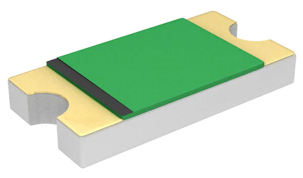
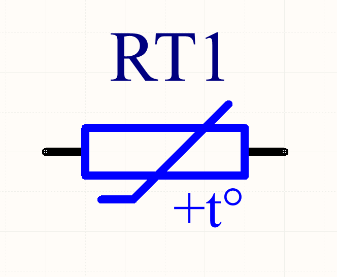

## Overview

A _PTC resettable fuse_ (or just PTC) is a passive electronic component used to **protect against excessive load currents and short-circuits in electronic circuits**. The key difference between standard blowable fuses and PTC resettable fuses is that a PTC resettable is _resettable_ -- once the fault condition is cleared the fuses resets and the circuit can work normally again, without any manual replacement of fuses. PTC stands for positive temperature coefficient and references the fact that the components resistance increases with increasing temperature.

.3D render of a 1206 chip sized PTC fuse from Bel Fuse Inc<<bib-digikey-bel-fuse-0zcj0035ff2g>>.

For information on just plain old resistors, see the link:/electronics/components/resistors[Resistors page].

## How They Work

It is essentially a resistor whose resistance increases as temperature increases (hence PTC or _positive temperature coefficient_). They are commonly used as a "resettable fuse" in circuit protection applications.

## Schematic Symbol And Designator

I prefer to use the designator prefix `RT` (e.g. `RT1`) and the following schematic symbol for a PTC-type thermistor. 

.Schematic symbol and designator for a PTC (positive-temperature co-efficient) thermistor.

I use the designator prefix `RT` for thermistors (**R**esistance depends on **T**emperature), while using `RV` for varistors (**R**esistance depends on **V**oltage).

## Important Parameters

### Hold, Trip And Max Current

* **Hold current**: This is the _maximum_ current the PTC can take without tripping.
* **Trip current**: This is the _minimum_ current the PTC is guaranteed to trip at.
* **Max current**: This is the _maximum_ current the PTC can withstand whilst in it's tripped state without causing any damage.

When choosing a PTC, you want to make sure it's hold current is above the current the load will draw under normal conditions.

Typically the trip current is around double the hold current (e.g. a hold current of 1A, and a trip current of 2A).

### Rated Voltage

The _rated voltage_ (a.k.a. _maximum voltage_, _voltage (max)_, stem:[V_{max}], stem:[V_{DC}]) is the maximum voltage the PTC can handle across it's two pins without damage. This is usually applicable when the PTC is in it's tripped state and the PTC is dropping almost the full supply voltage across it.

### Time To Trip

The _time to trip_ is the time the PTC fuse takes to transition from the normal to tripped state, when conducting a specific amount of current. The current that time to trip is provided at is usually a little higher than the _trip current_. The time to trip typically varies between 50ms to 5s. Generally, a fast time to trip is desirable.

### Rmin/R1max

stem:[R_{min}] is the minimum resistance of the PTC in it's initial (unsoldered) state. However, after a PTC trips and then is allowed to cool to reset, it does not usually fall back down to stem:[R_{min}] quickly, but can take days to reach this initial stem:[R_{min}] state. Instead, a stem:[R_{1max}] (a.k.a. stem:[R_{TRIP}]) value is specified which is the resistance it returns to after some fixed time period, usually an hour. Note that soldering methods such as reflow soldering cause the same resistance change effect as tripping (after all, both processes heat it up!).

TIP: stem:[R_{min}] is useful for determining the _peak fault current_ that will occur if a short-circuit occurs (before the PTC trips). stem:[I_{max} = \frac{V_{in}}{R_{min}}]. This rate at which this peak current will drop will depend on the <<_time_to_trip, time to trip>>.

The conditions to measure stem:[R_{1max}] varies slightly between manufacturers. For example, LittelFuse specifies stem:[R_{1max}] in it's `60R` series as:

> Maximum resistance of device at 20°C measured one hour after tripping or reflow soldering of 260°C for 20 sec<<bib-littelfuse-60r-ds>>.

You typically have to design the load so it can operate under normal conditions with a PTC whose resistance in somewhere between stem:[R_{min}] and stem:[R_{1max}].

### Max. Power Dissipation

The _maximum power dissipation_ (a.k.a. stem:[P_{d, max}]) is the maximum power that the PTC can dissipate when in a tripped state under specified environmental conditions such as the ambient air temperature and PCB footprint (PCB footprint is more relevant for SMD devices than through-hole devices). Power dissipation above this limit can cause damage to the device due to overheating.

## Types

### Linear

Linear thermistors are those which have a roughly linear response in resistance to a temperature change. They are also known as _silistors_, as the are normally made with silicon.

### Switching

TODO

## Applications

PTC fuses can be used in a range of applications including:

* Overload protection on `VBUS` (the positive voltage rail) on USB 2/3 ports.
* Overload protection in DC motors.
* Preventing rechargeable batteries from overheating or overcharging (or discharging to fast).

## PTC Thermistors vs. Fuses

When should a circuit designer use a PTC thermistor, and when should they use a fuse?

As already mentioned, a huge point of difference between a PTC thermistor and a fuse is the fact that a **PTC thermistor is resettable, while a fuse is a blow once and replace** component. This makes PTC thermistors suitable for applications where you might expect over-current conditions to occur frequently, and it would be inconvenient for the user to have to continually replace the fuse.

Conversely, this makes fuses better for applications where over-current conditions should not occur at all, and if they do, there is a higher chance of something being dangerous (e.g. live mains wiring that has shorted to the case). In these scenarios it can be safer to highlight the problem to the user and let the user/technician decide whether it is safe to replace the fuse and re-apply power.

Another **advantage of PTC thermistors is cost** in price-sensitive circuit board designs. As of the year 2016, a cheap SMD fuse in a chip package costs about US$0.40 in quantities of a 100, while a PTC thermistor for the same current rating in a similar SMD chip package costs about US$0.10, 4 times cheaper.

One consideration to make is that a **PTC never reaches a complete open-circuit when it is tripped** -- it always lets a small current flow through the load. This is generally o.k. it most cases, but if you do need a proper open-circuit when a fault occurs, a fuse might be more suitable.

## How To Calculate The Triggered Resistance

Most PTC thermistor datasheets will tell you the nominal off resistance (and/or it's range of values), but not the triggered resistance! However, you can calculate this using the typical power value (stem:[P_D]) that they provide.

stem:[P_D] is the typical power dissipated by the device when in a tripped state and in a fixed temperature (usually 23-25°C) still air environment. This is somewhat independent of the voltage applied to the thermistor, due to an increased voltage causing more heating, which in turn increases the resistance, which lowers the current and therefore dissipated. This is a form of negative feedback, and because this dissipated power is independent of the supply voltage, it can be specified as a property of the component on the datasheet.

To calculate the triggered resistance, use the following equation:

[stem]
++++
R_{triggered} = \frac{V^2}{P_D}
++++

[.text-center]
where: +
stem:[R_{triggered}] is the triggered resistance of the PTC thermistor, in Ohms +
stem:[V] is the voltage across the PTC thermistor (usually equal to the open-circuit supply voltage) +
stem:[P_D] is the dissipated power of the PTC thermistor when in it's triggered state, as given by it's datasheet +

The triggered resistance should be many orders of magnitude larger than the off resistance.

## Manufacturers

* Eaton: Eaton sells a range of PTC fuses under the brandname _Polytron_.
* Bourns: They sell a family of resettable PTC fuses under the brand name _Multifuse_, with the part numbers beginning with _MF-_. See https://www.bourns.com/products/circuit-protection/resettable-fuses-multifuse-pptc.
* Bel
* Littelfuse: Littelfuse sells PTCs under their brand name POLYFUSE<<bib-littelfuse-60r-ds>>.

## Supplier Links

* DigiKey: https://www.digikey.com/en/products/filter/ptc-resettable-fuses/150

[bibliography]
## References

* [[[bib-digikey-bel-fuse-0zcj0035ff2g, 1]]] DigiKey. _Bel Fuse Inc. 0ZCJ0035FF2G (product page)_. Retrieved 2021-12-14, from https://www.digikey.com/en/products/detail/bel-fuse-inc/0ZCJ0035FF2G/4156131.
* [[[bib-littelfuse-60r-ds, 2]]] Littelfuse. _POLYFUSE® Resettable PTCs: Radial Leaded > 60R Series (datasheet_. Retrieved 2021-12-14, from https://www.littelfuse.com/data/en/data_sheets/littelfuse_60r.pdf.
