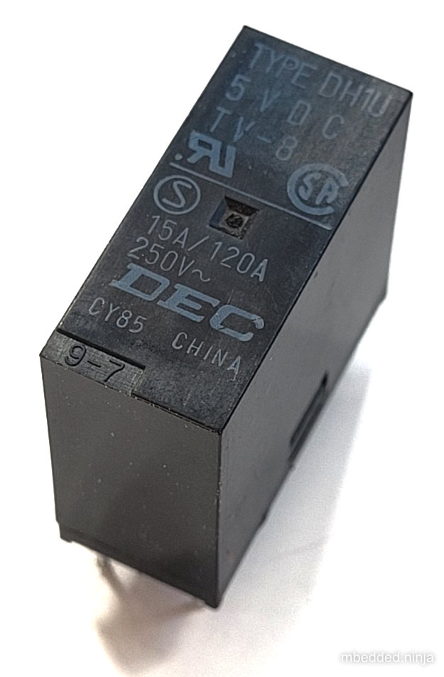
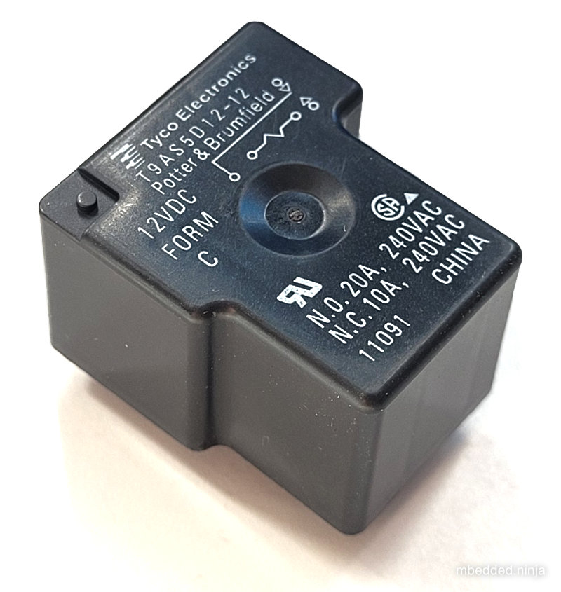
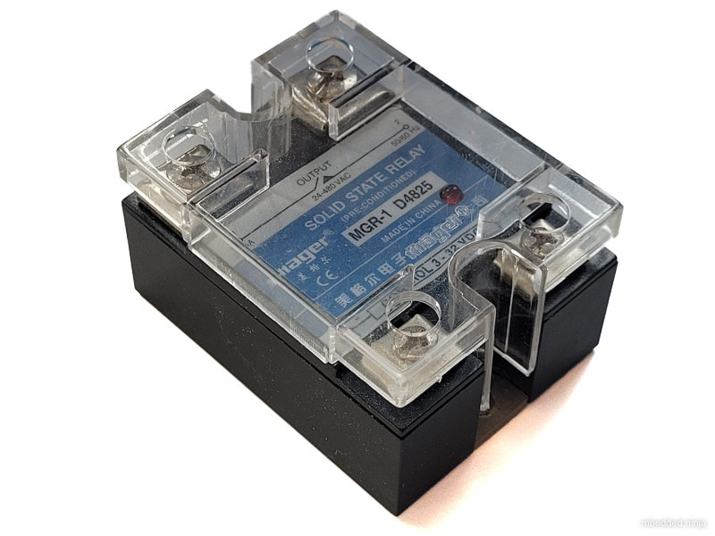
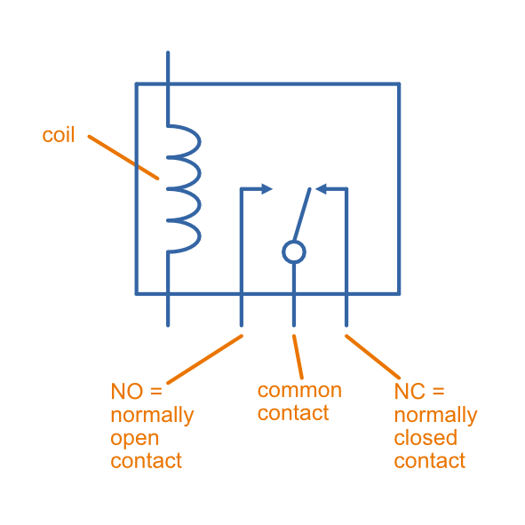
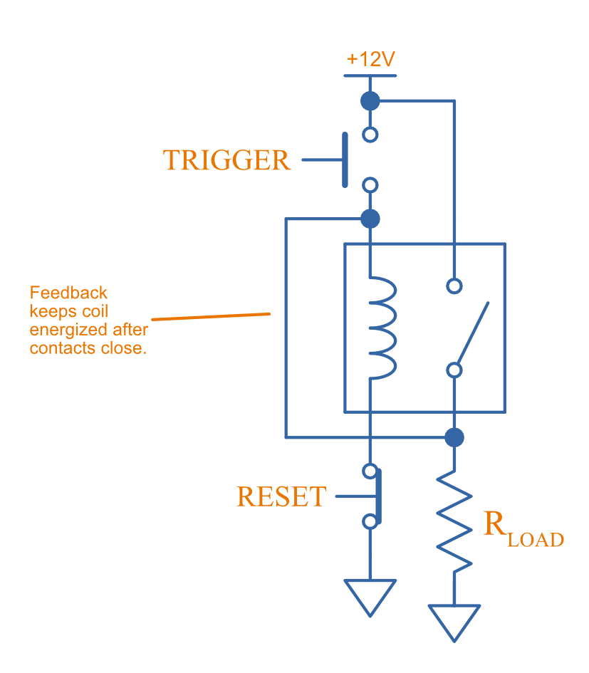
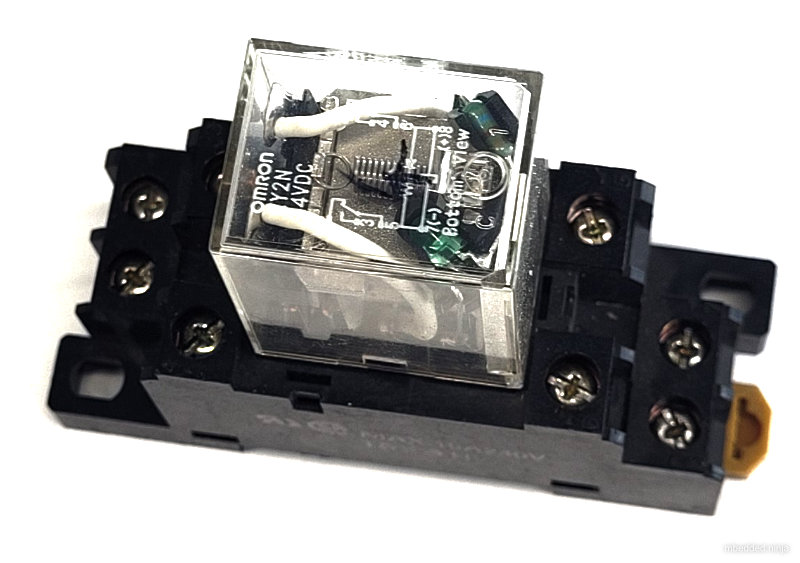

## Overview

Relays are traditionally electro-mechanical devices used for switching electronic circuits. There now exists "sold-state relays", which are purely electronic and contain no moving parts.

Uses:

* Turing on mains voltage devices from 5-12V circuits, while providing isolation
* Switching large currents

Relays with built in timers.

## Terminology/Parameters

* The Coil: The windings which turn the relay on when you apply a voltage
* The Contacts: The output pins when get connected or disconnected when the relay turns on
* Rated Coil Voltage: The recommended voltage that should be applied to the coil to turn the relay on.
* Rated Coil Current: The current the relay coil will draw when the rated coil voltage is applied to it.
* Contact Current Rating: The maximum current that the relay can conduct through the contacts

.The DEC DH1U-5VDC relay that can switch 250VAC at 15A.

.The Tyco T9AS5D12 relay. Coil is driven with 12VDC and switches 240VAC. Notice the two different contact ratings, 10A for the N.C. (normally closed) and 20A for the N.O. (normally open).

## Solid State Relays

Solid-state relays are relay's that don't have any moving mechanical parts involved in the switching. They use semi-conductor devices to perform the switching instead.

.The MGR-1 D4825 solid state relay from Mager. The input takes 3-32VDC to switch the output 24-480VAC contacts at up to 25A.

The normal way of doing this is to perform the switching with back-to-back N-channel link:/electronics/components/transistors/mosfets/[MOSFETs] whose gates are activated by a isolating opto-coupler (LED and receiver).

Below is the typical schematic symbol for a solid-state relay, along with a resistor connected to the input to limit the current through the internal LED.

.This is the typical schematic symbol for a solid-state relay, along with a resistor connected to the input to limit the current through the internal LED.
image::solid-state-relay-in-schematic-with-input-resistor.png[width=600px, link="solid-state-relay-in-schematic-with-input-resistor.png"]

## Contact Arrangements

* **Normally open (NO):** Contacts which are open-circuit when the coil is not energized, and become short-circuit to common when the coil is energized.
* **Normally open (NO):** Contacts which are short-circuit to common when the coil is not energized, and become open-circuit when the coil is energized.

Single-pole, single-throw (1A)

Double-pole, single-throw (1C)

.Schematic symbol for a relay with a normally-open (NO), normally-closed (NC) and common contact.

## Inductive Kickback

Protect with diode in anti-parallel. This diode can keep the relay turned on for longer than expected, and this turn-off time is called the relay drop-out time. This slower off-time can decrease the life of the relay due to arcing.

## Latching

With a little external componentry, a mechanical relay can be made to latch-on after triggered, and will only reset once a reset button has been pushed (or power disconnected).

.A simple latching relay circuit. The RESET pushbutton can be replaced with short if you only need the circuit to reset on power off.

## Common Relay Packages

Most PCB-mount relays have an asymmetric lead configuration so that it cannot be installed incorrectly.

You can get DIN mounted relay "sockets" for mounting relays onto DIN rail, as shown in <<relay-in-din-socket>>.

[[relay-in-din-socket]]
.An Omron relay on a DIN mounted relay "socket".

## Supplier Links

* DigiKey: http://www.digikey.com/product-search/en/relays
* TE: http://www.te.com/catalog/relays/menu/en/16453
