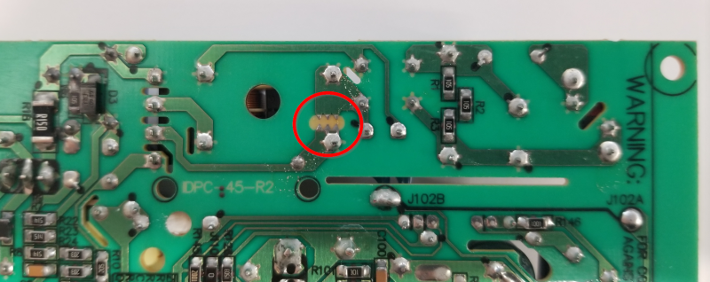

WARNING: This page is in notes format, and may not be of the same quality as other pages on this site.

.A PCB copper based spark gap on the underside of a Mean Well IDPC-45-350 constant-current LED driver.
