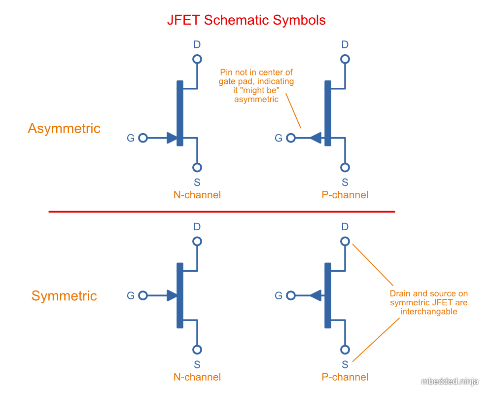

WARNING: This page is in notes format, and may not be of the same quality as other pages on this site.

## Overview

A _junction-gate field-effect transistor_ (JFET) is a **voltage controlled, three terminal transistor**. It is closely related to the more popular link:/electronics/components/transistors/mosfets/[MOSFET] (another form of field-effect transistor).

The **main differences between a MOSFET and a JFET** is that the JFET has more gate current due to the absence of the gate oxide layer, and JFETs only come in depletion mode (JFET is on at stem:[V_{GS} = 0V], and turns off as stem:[V_{GS}] goes negative), whilst MOSFETs come in both enhancement mode and depletion mode types.

## Schematic Symbols

<<jfet-schematic-symbols>> shows the commonly used schematic symbols for JFETs. As with MOSFETs, there is an arrow pointing in towards the body for the N-channel, and an arrow pointing outwards for the P-channel.

[[jfet-schematic-symbols]]
.Schematic symbols of asymmetric and symmetric JFETs, both having N-channel and P-channel variants.

Interestingly, when you learn about the basic construction of a JFET, you would assume that the **drain and source pins are interchangeable** due to the symmetric nature of it's design. That leads you to being able to use a schematic symbol with the gate pin in the middle of the gate. However, **not all JFET pins are symmetric**, and in that case it's better to use the symbols shown which move the gate pin closer to the source (similar to how a MOSFET symbol is drawn).

## Uses

JFETs are used for:

* Simple current sources
* Low noise op-amp input circuitry
* As a switch (although MOSFETs are more commonly used for this)
* Amplifiers

## Datasheet Parameters

### Gate-Source Cutoff Voltage Vgs(off)

This is the gate-source voltage at which the JFET is pretty much "turned off", i.e. the current flowing through the drain has dropped to almost 0. Typically it is specified as the voltage at which the drain current drops down to a current of stem:[10nA]. Unfortunately for JFETs, this value varies significantly due to manufacturing tolerances and typically a Vgs(off) min. to max. range of >5V can be given! Taking the OnSemi 2N5457 for example, it's datasheet specifies a stem:[V_{GS(off)}] min. of stem:[-0.5V] and a max. of stem:[-6.0V] (ignore that because we are dealing with negative numbers, the max. is actually a "smaller" number than the min.).

### Zero Gate Voltage Drain Current (Idss)

This is the current through the drain when stem:[V_{GS} = 0V].

### Gate-Source Breakdown Voltage V(br)gss

The gate-source breakdown voltage stem:[V_{(BR)GSS}] is the maximum voltage the gate can withstand (relative to the source) before breakdown occurs.

## Current Source

JFETs can be used to make two-terminal current sources which can be useful in circuit design due to their simplicity. They can also be used to make low-noise current sources.

You first calculate the required gate-source voltage<<bib-vishay-an103-jfet-constant-current-source>>:

[stem]
++++
\begin{align}
V_{GS} = V_{GS(off)} [ 1 - (\frac{I_D}{I_{DSS}})^{1/k} ]
\end{align}
++++

[.text-center]
where: +
stem:[V_{GS}] is the gate-source voltage required to bias the JFET at the correct current, in stem:[V] +
stem:[V_{GS(off)}] is the gate-source cutoff voltage, a parameter you can get from the JFETs datasheet, in stem:[V] +
stem:[I_D] is the current you want the current source to drive at, in stem:[A] +
stem:[I_{DSS}] is the zero gate-source drain current, a parameter you can get from the JFETs datasheet, in stem:[A] +
stem:[k] is the conduction parameter for the JFET, and depends on the device geometry. This is not normally mentioned in the datasheet, however for this equation you can generally assume it to be stem:[2]. +

You can then find the value of stem:[R_S] with:

[stem]
++++
\begin{align}
R_S = \frac{V_{GS}}{I_D}
\end{align}
++++

## Common Components

* **2N5457**: Common "general purpose" N-channel JFET.
* **J202**: N-channel JFET by ON Semiconductor that originally came in a TO-92 package, but now comes in a SOT-23-3 package.

[bibliography]
## References

* [[[bib-vishay-an103-jfet-constant-current-source, 1]]] Siliconix (now Vishay) (1997, Mar 10). _AN103: The FET Constant-Current Source/Limiter_. Retrieved 2021-04-29, from https://www.vishay.com/docs/70596/70596.pdf.
