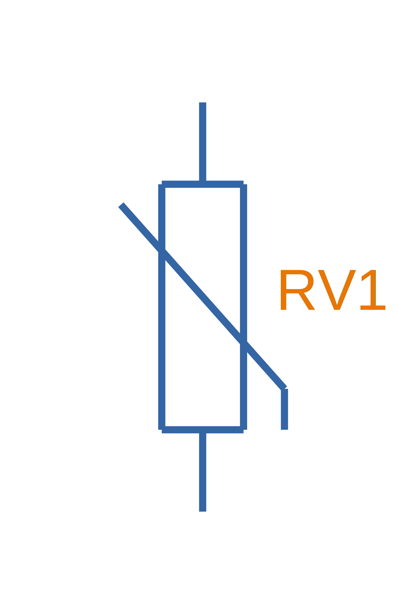

== Overview

A varistor (also known as a voltage-dependent resistor, VDR) is an electrical component whose resistance depends on the applied voltage. As the voltage increases, the resistance of a varistor drops. Their voltage-resistance behaviour is similar to that of a diode, except a varistor exhibits this behaviour with voltages of both polarities (where diodes are a one-way device).

They can also be called MOVs, but is strictly a type of varistor named after it's inclusion of a metal-oxide chemical.

They are commonly used as a form of circuit-protection against voltage transients, especially in mains and other high voltage applications. For more information about their use for ESD protection, see the link:/electronics/circuit-design/esd-protection/[ESD Protection page].

Because their resistance in not fixed, they are called _non-Ohmic devices_.

== Schematic Symbol and Designators

.The schematic symbol for a varistor (a.k.a. voltage-dependent resistor, VDR).

Common designators used for varistors:

* `RV` (my preferred choice)
* `MV`
* `MOV`

== How They Work

In the "normal" varistor region of operation (above the leakage current region and below the upturn region), the voltage and current through the varistor is approximated well by the following equation<<lf-theory>>:

[stem]
++++
I = kV^\alpha
++++

[.text-center]
where: +
stem:[I] is the current, in Amps stem:[A] +
stem:[k] is a constant +
stem:[V] is the varistor voltage, in Volts stem:[V] +
stem:[\alpha] is a device specific constant (more on this below) +

stem:[\alpha] is a "figure of merit" and device specific. It has a very strong relationship to the composition of the device, and can be somewhat generalized by device makeup:

[%autowidth]
|===
| Composition | stem:[\alpha]

| SiC (silicon carbide) | 5
| ZnO (zinc oxide) | 25
|===

== Important Parameters

=== Varistor Voltage

This is the voltage at which the varistor starts to "conduct". The varistor is considered conducting when the current through it exceeds some small threshold amperage (typically 1mA).

=== Surge Current

The surge current rating is an indication of how much current the varistor can withstand during a voltage transient event.

=== Energy Rating

Typically a one-off (non-repetitive) and repetitive pulse energy rating is given for the varistor. The ratings are normally given for standardised transients, such as the 8/10 or 10/1000.

== Comparison With Other Forms Of Circuit Protection

Varistors are preferred over TVS diodes when the product is price-sensitive, higher surge energy absorption is required, when physical space is not a constraint, or when high operating voltage capability is required.

[bibliography]
== References

* [[[lf-theory]]] Littelfuse. (1999, July). _Littelfuse Varistors - Basic Properties,
Terminology and Theory_. Retrieved 2021-07-11, from https://www.littelfuse.com/~/media/electronics_technical/application_notes/varistors/littelfuse_varistors_basic_properties_terminology_and_theory_application_note.pdf
