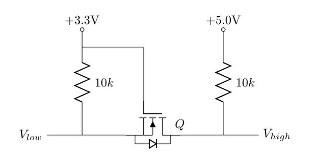
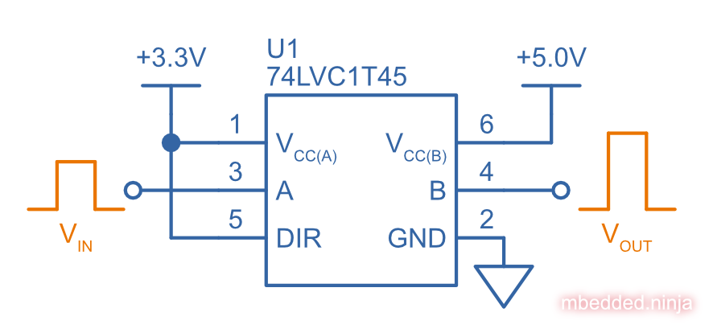
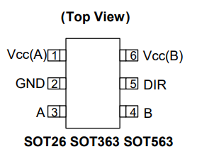

:imagesdir: 

WARNING: This page is in notes format, and may not be of the same quality as other pages on this site.

## Overview

Voltage-level translators (and hence, voltage-level translation) refers to the conversion to digital logic signals from one voltage level (e.g. +3.3V) to another (e.g. +5.0V) (the different voltage levels are also called _voltage domains_). It is commonly used to provide communication capability between two ICs which are operating of a different voltage rail.

Voltage-level translators can also be used to prevent _backfeeding_ (whether or not the two sides of the circuitry are at different voltage levels).

IMPORTANT: Do not confuse voltage-level translation with voltage converters (e.g. linear regulators or SMPS) which are designed to provide power.

## Discrete MOSFETs

The below schematic shows a simple circuit for voltage-level translation using a single MOSFET and pull-up resistors. It supports bi-directional digital signal translation.

.An example schematic of bi-directional voltage-level translation using a MOSFET.

**What happens if stem:[V_{low}] is driven?**

If stem:[V_{low}] is driven high, then the gate-source voltage of the N-channel MOSFET (stem:[V_{GS}]) is stem:[0V], and the MOSFET is OFF. This means that stem:[V_{high}] is pulled high by its stem:[10k\Omega] resistor.

If stem:[V_{low}] is driven low, then the gate-source voltage of the N-channel MOSFET (stem:[V_{GS}]) is now stem:[+3.3V], and the MOSFET is ON. This means that stem:[V_{high}] is driven LOW through the MOSFET.

**What happens if stem:[V_{high}] is driven?**

If stem:[V_{high}] is driven high, the body-diode of the MOSFET will be reverse-biased, and OFF. This means that the source of the MOSFET will be pulled to stem:[+3.3V] by the stem:[10k\Omega] resistor, (stem:[V_{GS}]) will be stem:[0V], the MOSFET OFF, and stem:[V_{low}] also high because of it's stem:[10k\Omega] resistor.

If stem:[V_{high}] is driven low, the body-diode of the MOSFET will be forward-biased, and switch ON. This will start pulling stem:[V_{low}] to ground plus the forward voltage drop of the diode (stem:[0V + 0.7V = 0.7V]). As the voltage on stem:[V_{low}] drops, the (stem:[V_{GS}]) of the MOSFET will start to increase, and the MOSFET will soon turn ON. At this point stem:[V_{low}] will be driven fully to ground (0V).

## Dedicated ICs

Plenty of dedicated ICs exist for performing level translation, from dedicated low-to-high translations, high-to-low, anything-to-anything, along 1-bit to 16-bit versions. `1T` means 1 gate with voltage translation, `45` means 1-bit transceiver with direction control.

.A 74LVC1T45 being used to voltage translate a 3.3V logic-level signal to a 5.0V voltage domain.

74AUP1T45: Nexperia, 1-bit

### 74LVC1T45Z6-7: Diodes Incorporated, 1-bit

stem:[I_{OFF}] is activated when one or more of the power rails is at stem:[0V]

.The pinout for the single bit Diodes Inc 74LVC1T45Z6-7 voltage translator in the SOT-563 package<<bib-diodes-inc-74lvc1t45z6-7-ds>>.

### Unidirectional vs. Bidirectional

Some have DIR pins. Some have OE pins. Some have auto-direction sensing with no DIR pin.

### IOFF Circuitry

stem:[I_{OFF}] is activated when one or more of the power rails is at stem:[0V]

### Clamping Diodes

[quote, Voltage translation: How to manage mixed-voltage designs with NXP level translators]
____
NXP’s LV, HC, and HEF families have input clamping diodes to VCC and can be used with current-limiting
resistors for high-to-low level translation<<bib-nxp-voltage-translation>>.
____

## Suppliers

Confusingly, voltage level translators can be found in two separate sections (both under the Logic section) on DigiKey:

. Integrated Circuits (ICs) > Logic - Buffers, Drivers, Receivers, Transceivers. One example is https://www.digikey.com/en/products/detail/nexperia-usa-inc/74AUP1T45GW-125/1300776.
. Integrated Circuits (ICs) > Logic - Translators, Level Shifters. One example is https://www.digikey.com/en/products/detail/diodes-incorporated/74lvc1t45z6-7/4898825.

[bibliography]
## References

* [[[bib-diodes-inc-74lvc1t45z6-7-ds, 1]]] Diodes Incorporated (2018, Oct). _74LVC1T45: Single Bit Dual Power Supply Translating Transceiver With 3 State Outputs_. Retrieved 2022-03-11, from https://www.diodes.com/assets/Datasheets/74LVC1T45.pdf.
* [[[bib-nxp-voltage-translation, 2]]] NXP (2014, May). _Voltage translation: How to manage mixed-voltage designs with NXP level translators_. Retrieved 2022-03-11, from https://www.nxp.com/docs/en/nxp/brochures/75017511.pdf.
