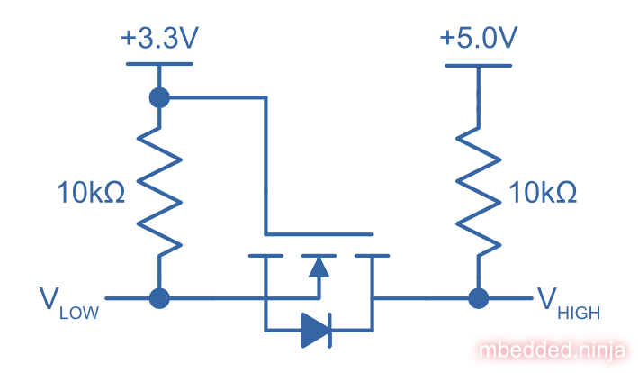

:imagesdir: 

WARNING: This page is in notes format, and may not be of the same quality as other pages on this site.

## Overview

Voltage-level translators (and hence, voltage-level translation) refers to the conversion to digital logic signals from one voltage level (e.g. +3.3V) to another (e.g. +5.0V) (the different voltage levels are also called _voltage domains_). It is commonly used to provide communication capability between two ICs which are operating of a different voltage rail. Voltage-level translators are also called _level shifters_<<bib-nexperia-voltage-translators-product-page>>.

Voltage-level translators can also be used to prevent _backfeeding_ (whether or not the two sides of the circuitry are at different voltage levels).

IMPORTANT: Do not confuse voltage-level translation with voltage converters (e.g. linear regulators or SMPS) which are designed to provide power.

## Discrete MOSFETs

The below schematic shows a simple circuit for voltage-level translation using a single MOSFET and pull-up resistors. It supports bi-directional digital signal translation.

.An example schematic of bi-directional voltage-level translation using a MOSFET.

**What happens if stem:[V_{low}] is driven?**

If stem:[V_{low}] is driven high, then the gate-source voltage of the N-channel MOSFET (stem:[V_{GS}]) is stem:[0V], and the MOSFET is OFF. This means that stem:[V_{high}] is pulled high by its stem:[10k\Omega] resistor.

If stem:[V_{low}] is driven low, then the gate-source voltage of the N-channel MOSFET (stem:[V_{GS}]) is now stem:[+3.3V], and the MOSFET is ON. This means that stem:[V_{high}] is driven LOW through the MOSFET.

**What happens if stem:[V_{high}] is driven?**

If stem:[V_{high}] is driven high, the body-diode of the MOSFET will be reverse-biased, and OFF. This means that the source of the MOSFET will be pulled to stem:[+3.3V] by the stem:[10k\Omega] resistor, (stem:[V_{GS}]) will be stem:[0V], the MOSFET OFF, and stem:[V_{low}] also high because of it's stem:[10k\Omega] resistor.

If stem:[V_{high}] is driven low, the body-diode of the MOSFET will be forward-biased, and switch ON. This will start pulling stem:[V_{low}] to ground plus the forward voltage drop of the diode (stem:[0V + 0.7V = 0.7V]). As the voltage on stem:[V_{low}] drops, the (stem:[V_{GS}]) of the MOSFET will start to increase, and the MOSFET will soon turn ON. At this point stem:[V_{low}] will be driven fully to ground (0V).

## Dedicated ICs

Plenty of dedicated ICs exist for performing voltage-level translation, from dedicated low-to-high translations, high-to-low, anything-to-anything, and bit widths of 1-bit to 16-bit. `1T` means 1 gate with voltage translation, `45` means 1-bit transceiver with direction control.

.A 74LVC1T45 voltage-level translator IC being used to voltage translate a 3.3V logic-level signal to a 5.0V voltage domain.

### Directionality (Unidirectional, Bidirectional, Auto-directional)

Some have DIR pins. Some have OE pins. Some have auto-direction sensing with no DIR pin.

**How Does Auto-Direction Work?**

Auto-direction voltage-level translator ICs use a clever technique to remove the need for a direction pin to specify which side is an input and which side is an output. They work by driving pins with a weak signal (e.g. a CMOS totem-pole driver but with a stem:[4k\Omega] resistor in series with the output<<bib-ti-txb0104-ds>>) that can be overridden by an external signal.

To fix the problem of these weak drives causing slow edge transitions, one shot timers monitor each side for rising or falling-edges. On a transition, the one shot timers momentarily turn on a strong drive (standard CMOS totem-pole) to create a fast transition. The timer quickly expires, turning of the strong drive and letting the weak drive take over until the next transition.

.Architecture of a single cell inside the TXB0104 IC, showing how the auto-direction sensing circuitry works<<bib-ti-txb0104-ds>>.

### Powered Off Protection (IOFF)

Powered off protection is activated when one or more of the power rails is at stem:[0V]. Texas Instruments commonly uses the name stem:[I_{OFF}] to describe this feature.

[[cmos-powered-off-protection-circuit-ioff-ti]]
.Circuit showing how a CMOS "totem-pole" driver is modified to provide "powered off protection". Addition diode added between the substrate and the source of the P-channel MOSFET as circled, which prevents current from the output flowing back to stem:[V_{CC}] in the case that the power rail is at stem:[0V]<<bib-ti-powered-off-protection>><<bib-ti-logic-in-live-insertion-apps>>.

### Propagation Delay

Generally, you want voltage-level translator ICs to have a low _propagation delay_ (commonly abbreviated as stem:[t_{pd}]). Most voltage-level translator circuits have a propagation delay between 0.4ns (really fast) and 20ns (quite slow, but still fast enough for many applications). 

### Clamping Diodes

[quote, Voltage translation: How to manage mixed-voltage designs with NXP level translators]
____
NXP’s LV, HC, and HEF families have input clamping diodes to VCC and can be used with current-limiting
resistors for high-to-low level translation<<bib-nxp-voltage-translation>>.
____

### Examples

#### 74LVC1T45Z6-7: Diodes Incorporated, 1-bit

stem:[I_{OFF}] is activated when one or more of the power rails is at stem:[0V]

.The pinout for the single bit Diodes Inc 74LVC1T45Z6-7 voltage translator in the SOT-563 package<<bib-diodes-inc-74lvc1t45z6-7-ds>>.
image::74lvc1t45-diodes-inc-voltage-translator-pinout.png[width=300px,link=/74lvc1t45-diodes-inc-voltage-translator-pinout.png"]

#### TXB0104

|===
| Manufacturer              | Texas Instruments
| Num. Bits                 | 4-bit
| Auto-direction            | Yes
| Voltage, stem:[V_{CCA}]   | 1.2-3.6V
| Voltage, stem:[V_{CCB}]   | 1.65-5.5V
| Package                   | BGA-12, SOIC-14, QFN-12, 
| Cost                      | US$1.64 (TXB0104D, quantities of 100)
|===

The Texas Instruments _TXB0104_ is a popular 4-bit, auto-directional voltage level translator that comes in a number of different packages, including larger SOIC-14 packages all the way down to BGA-12.

SparkFun makes a breakout board for this IC, the link:https://www.sparkfun.com/products/11771[SparkFun Voltage-Level Translator Breakout - TXB0104 (part num. BOB-11771)].

.The SparkFun breakout board for the TXB0104<<bib-sparkfun-txb0104-breakout>>.

## Suppliers

Confusingly, voltage level translators can be found in two separate sections (both under the Logic section) on DigiKey:

. Integrated Circuits (ICs) > Logic - Buffers, Drivers, Receivers, Transceivers. One example is https://www.digikey.com/en/products/detail/nexperia-usa-inc/74AUP1T45GW-125/1300776.
. Integrated Circuits (ICs) > Logic - Translators, Level Shifters. One example is https://www.digikey.com/en/products/detail/diodes-incorporated/74lvc1t45z6-7/4898825.

[bibliography]
## References

* [[[bib-diodes-inc-74lvc1t45z6-7-ds, 1]]] Diodes Incorporated (2018, Oct). _74LVC1T45: Single Bit Dual Power Supply Translating Transceiver With 3 State Outputs_. Retrieved 2022-03-11, from https://www.diodes.com/assets/Datasheets/74LVC1T45.pdf.
* [[[bib-nxp-voltage-translation, 2]]] NXP (2014, May). _Voltage translation: How to manage mixed-voltage designs with NXP level translators_. Retrieved 2022-03-11, from https://www.nxp.com/docs/en/nxp/brochures/75017511.pdf.
* [[[bib-ti-powered-off-protection, 3]]] Shreyas Rao (2016, Nov 2). _Logic gates and switches with Ioff or powered-off protection: empowering you to power down (blog post)_. Texas Instruments. Retrieved 2022-03-13, from https://e2e.ti.com/blogs_/b/analogwire/posts/logic-gates-and-switches-with-ioff-empowering-you-to-power-down.
* [[[bib-ti-logic-in-live-insertion-apps, 4]]] Jose M. Soltero and Ernest Cox (2002, Jan). _SCEA025: Logic in Live-Insertion Applications With a Focus on GTLP (Application Report)_. Texas Instruments. Retrieved 2022-03-13, from https://www.ti.com/lit/an/scea026/scea026.pdf.
* [[[bib-nexperia-voltage-translators-product-page, 5]]] Nexperia. _Voltage translators (level-shifters) (product page)_. Retrieved 2022-03-17, from https://www.nexperia.com/products/analog-logic-ics/asynchronous-interface-logic/voltage-translators-level-shifters/.
* [[[bib-sparkfun-txb0104-breakout, 6]]] SparkFun. _SparkFun Voltage-Level Translator Breakout - TXB0104 (product page)_. Retrieved 2022-03-18, from https://www.sparkfun.com/products/11771.
* [[[bib-ti-txb0104-ds, 7]]] Texas Instruments (2020). _TXB0104 4-Bit Bidirectional Voltage-level Translator With Automatic Direction Sensing and ±15-kV ESD Protection (datasheet)_. Retrieved 2022-03-18, from https://www.ti.com/lit/ds/symlink/txb0104.pdf.
