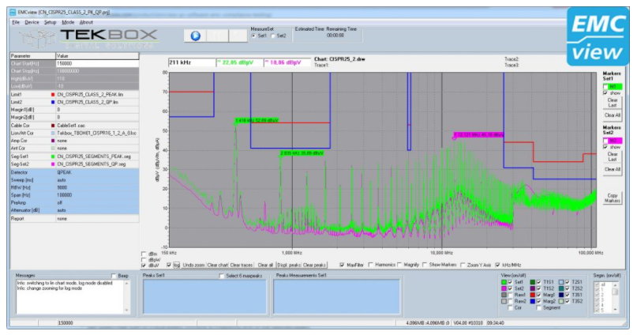
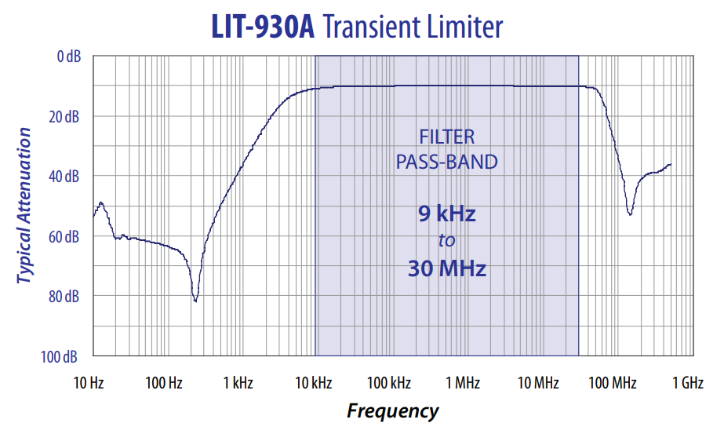

WARNING: This page is in notes format, and may not be of the same quality as other pages on this site.

== Overview

Circuits emit electrical noise. They emit radiated electromagnetic noise, and conductive noise (noise that travels down any external electrical connections). Many electronic standards define maximum values of noise and disruption that a circuit can emit.

Reduce these levels requires careful circuit design, in both the components used, the layout, the number of layers, and shielding.

== Pre-compliance Testing

Because official compliance testing is generally expensive, in-house _pre-compliance_ testing is a popular way of gaining confidence the DUT will pass once it is submitted for official testing.

=== Software

The link:https://www.tekbox.com/product/emcview-pc-software-emc-compliance-testing/[TekBox EMCview software] can control the spectrum analyzer to do multiple sweeps across the frequency range, collate the data, and display the results with comparison/thresholds for the popular EMC standards. It currently supports a range of spectrum analysers from Rigol, Siglent, R&S and others<<bib-tekbox-emcview>>.

.Screenshot of the Texbox EMCview software<<bib-tekbox-emcview>>. Image © 2021, Texbox.

=== Attenuators

_Attenuators_ are devices which reduce the power of a signal without distorting the waveform. A note, for what is little-more than a well-tuned and shielded resistor divider, RF-rated attenuators can be expensive (US$100+)!

=== Transient Limiters

_Transient limiters_ are another level of protection to a spectrum analyzer above and beyond what a simple attenuator can provide. They are commonly used whilst performing conducted EMI measurements using a LISN. `10dB` of flat in-band attenuation is common, across a frequency range of 9kHz to 30MHz. Maximum input is typically somewhere between +-10-20V DC at 2-5W of continuous power. N-type connectors are typically provided for the input and output.

.Frequency response of the LIT-930A transient limiter by Com-Power<<bib-com-power-lit-930a-ds>>. Graph shows a flat 10dB attenuation across the pass-band between 9kHz and 30MHz. Image © Com-Power.

[bibliography]
== References

* [[[bib-com-power-lit-930a-ds, 1]]]: Com-Power. _Transient Limiters: LIT-153A and LIT-930A (Datasheet)_. Retrieved 2021-11-11, from https://www.com-power.com/uploads/pdf/LIT-930A-1.pdf.
* [[[bib-tekbox-emcview, 2]]] Texbox. _EMVView PC Software For EMC Pre-Compliance Testing_. Retrieved 2021-11-11, from https://www.tekbox.com/product/emcview-pc-software-emc-compliance-testing/.
