== Overview

Descriptions, usages, pictures and more info of various tools used by embedded engineers.

== Oscilloscopes

An _oscilloscope_ (or just _scope_) is to an electrical engineer what a hammer is to a builder. It is a general purpose tool which lets you view voltages (and currents) in a circuit over time. It's cheaper counterpart is a digital multimeter, however they can typically only display the voltage with an update rate of a few Hertz, and only display a discrete value, not the waveform over time. Oscilloscopes can also measure much faster signals and much faster rates and trigger (take a snapshot) on specific conditions. They typically also have multiple input channels (at least two) so you can compare two voltage waveforms side-by-side.

Mixed-signal oscilloscopes (MSOs) measure both traditional analogue signals as well as digital signals.

=== Oscilloscope Specifications

==== Bandwidth

The bandwidth of a scope defines the range of frequencies it can measure. The upper limit is defined when the observed signal drops by -3dB (drops to 70.7%) of the true value. Because all oscilloscopes start measuring at DC (0Hz), this also defines the highest frequency the scope can measure. El cheapo scopes have a bandwidth of 100MHz. 

=== Probes

* Passive: Non-powered
* Active: Powered with active buffering and/or amplification of the signal within the probe itself (before it gets to the oscilloscope).

10:1 probes are the industry standard. Almost all oscilloscopes have an input impedance of `\(1M\Omega\)` when looking into the connector on the front panel of the scope.

Capacitance increases when you go from 10:1 to 1:1. e.g. a 10:1 passive probe may have 10pF of capacitance while an equivalent 1:1 probe may have approx. 100pF. You also lose some input resistance, e.g. it drops from `\(10M\Omega\)` to `\(1M\Omega\)`.

1:1 probes can be good for measuring small levels of noise as they effectively increase the minimum resolution of the oscilloscope by 10 (compared to a 10:1 probe).

=== Probe Compensation

Some scope probes allow you to adjust the probes compensation.

Without the variable capacitor, the resistance of the probe combined with the resistance and capacitance of the scope will create a low-pass filter that will greatly distort high frequency measurements. The variable capacitor is added in parallel with the `\(9M\Omega\)` probe resistance so that there is both a resistive and capacitive potential divider. The capacitance is then adjusted so that both the resistor divider and capacitor divider have the same division ratio. This ensures the response of the probe is flat across the frequencies of interest.

=== Maths Functions

I have never had great success using the maths functions on a scope to measure differential signals (by using two single-ended inputs and subtracting one from the other).

=== Manufacturers

==== Keysight

Mid to high-end scope manufacturer, in the same class as Tektronix.

==== Tektronix

Mid to high-end scope manufacturer, in the same class as Keysight.

==== Tenma

Low-end scope manufacturer.

== Multimeters

Multimeters are multi-purpose electrical measurement devices used by both electricians and electronics engineers (among other disciplines).

Some multimeters are designed for electricians (people who deal primarily with 240VAC), which are not as suitable for electronics engineers.

=== Ghost Voltages (Low-Impedance Voltage Measurements)

Typically, voltage measurements are done at the highest-impedance achievable (stem:[>1M\Omega]) by the multimeter so that the multimeter does not effect the circuit it is measuring. However, this can sometimes lead to "ghost voltages". This is when a real but high-impedance voltage is present on a circuit, normally due to the circuit picking up noise from near-by circuits via phenomenon such as capacitive coupling. This voltage, although real, is misleading as it does not represent the voltage a load (or person getting a shock) would actually see. For this reason these voltages are called _ghost voltages_.

Some newer digital multimeters come with a low impedance voltage measurement mode to ignore these ghost voltages. This is especially useful for when working with mains power (115/240VAC) and trying to determine if a voltage on a wire is a significant danger or not. Examples of multimeters which have a low-impedance voltage measurement setting include the link:https://www.fluke.com/en/product/electrical-testing/digital-multimeters/fluke-117[Fluke 117 Digital Multimeter].

Older, analogue multimeters are not as susceptible to the ghost voltage problem as they typically have a lower impedance when measuring voltages, normally around stem:[10k\Omega].

Low-impedance mode should not be used when working with sensitive, small-signal circuitry. The low-impedance of the multimeter might draw enough current to disrupt the circuit and will give you incorrect readings.

== Logic Analysers

Logic analysers are electronic tools which connect to digital circuitry and decode serial or parallel communication protocols.

High-end oscilloscopes now include logic analysers, either built-in or as an additional module/license. Tektronic charges a license per communication protocol. 

=== Saleae

Saleae is probably the most expensive well-known logic analyzer brand. As of April 2020, the 8-channel, 500MS/s (Samples/second), 100MHz, USB3.0 Saleae logic analyzer (the _Logic Pro 8_) will cost USD$699, which is quite a lot of money for JUST a logic analyzer.

=== DreamSourceLab

DreamSourceLab provides the _DSView_ software for viewing the digital signals from the _DSLogic_ series of logic analysers. _DSView_ is compatible with Windows, MacOS and Linux. It uses the _sigrok project_ to provide all of the protocol decoders and therefore supports many of the protocols listed on https://sigrok.org/wiki/Protocol_decoders.

.A screenshot of the DSView v1.1.2 software.
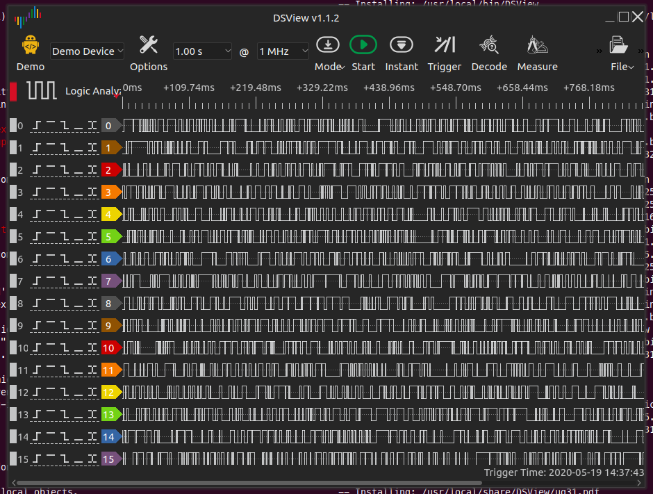

Whilst a setup `.exe` is provided for Windows and a `.dmg` for MacOS, no pre-built executables are provided for Linux, and you have to build yourself from the source code. Easy instructions are provided in the `INSTALL` text file.

== AC/DC Electronics Loads

A _AC_ or _DC_ _Electronic Load (a.k.a. _Active Load_) is a piece of electronic test equipment which can act as either a programmable resistance, voltage sink (voltage source, but can only sink power, not produce it) or current sink. They act as a load by converting the incoming electrical power into heat, just like a resistor. However, rather than using a standard fixed resistor (or sequence of switched fixed resistors), they typically use a transistor(s) to dissipate the energy so that it's "resistance" can be changed electronically, hence why they are also known as _active_ loads. They are usually designed to dissipate 100's of Watts or more of power (depending on the model). They are separated into two distinct families:

* DC electronic loads (the most common variety)
* AC electronic loads

AC and DC electronic loads are used to:

* Load up power supplies to test their response under a range of operating conditions (incl. 0A to full current, and 0V to highest voltage)
* Act as constant-current sinks to drive LEDs when performing testing/design validation.

=== TekBox TBOH02

The _TekBox TBOH02_ DC load is a great, simple, low-cost DC load. It is self-powered, meaning it powers itself from the energy dissipated via the "load" it pretends to be. 25W continuous power dissipation with no fan, 100W with fan. The advantage of it being an analogue, self-powered load means that there will be no digital/PSU/control-circuitry noise superimposed onto the measurements you are making.

.The TekBox TBOH02 Self-Powered Active Load. Image from https://www.tekbox.com/product/tboh02-self-powered-active-load/.
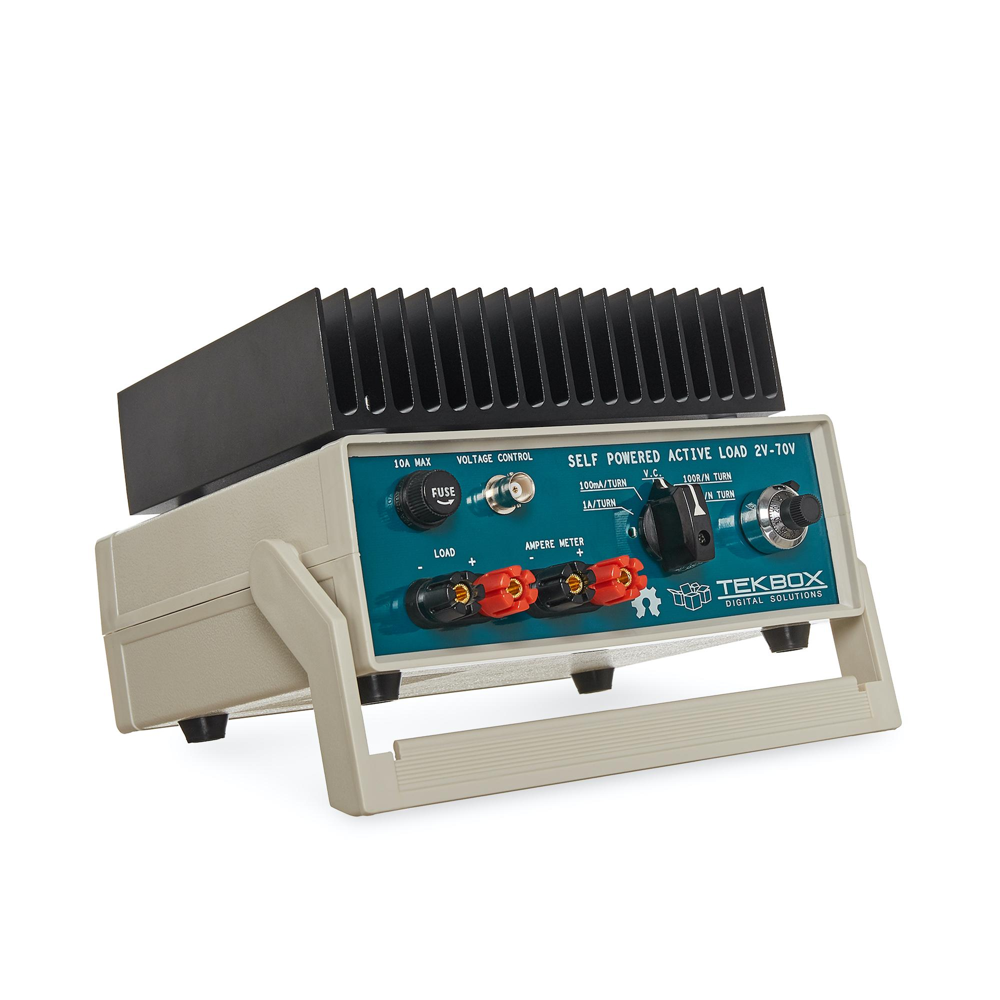

This device is open-source hardware (design is based of https://www.edn.com/precision-active-load-operates-as-low-as-2v/, however EDN's link to the PDF/schematics is broken as of 2021-06-22), the full schematics, board files and BOM are provided at https://www.tekbox.com/product/tboh02-self-powered-active-load/. Schematics and board files are in the Eagle file format.

== USB-to-Serial Converters

=== FTDI Converters

FTDI (Future Technology Devices International Ltd.) is a popular and reputable designer and manufacturer of USB-to-Serial converters. They make a range of ICs for this purpose, as well and manufacturing useful products which use these ICs (such as USB-to-serial cables).

As of 2016, their ICs are commonly found in good quality USB-to-serial hardware (more so than one of their main competitors, Prolific).

=== Latency

USB-to-Serial converters introduce a fair bit of delays into serial communications. and depending on your latency requirements, this may effect your design.

.The conditions which will cause an FTDI IC to send received serial data to the computer. Especially notice the 16ms 'latency timer'. Image from 'FTDI – AN232B-04 – Data Throughput. Latency and Handshaking'.
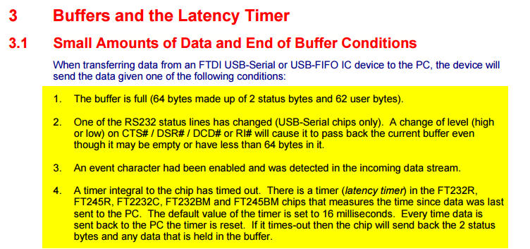

The below image is a screenshot of FTDI RX/TX data captured with a logic analyser. The computer was running Java code which sent an `0x02` response as soon as it received an `0x01` byte.

.FTDI RX and TX data captured by a logic analyser, with the computer running Java code which responds to 0x01 with 0x02. The 'latency timer' on the FTDI IC has been reduced to 1ms, which gives a much faster response time from the computer (about 1.5ms delay).
image::screenshot-fast-computer-response-ftdi-java-set-latency-timer.png[width=700px]

=== Drivers

FTDI provides the Java D2xx API for Android systems. The API is packaged into a file called d2xx.jar and can be downloaded from http://www.ftdichip.com/Android.htm.

Basic information on the driver software can be found at http://www.ftdichip.com/Support/Documents/TechnicalNotes/TN_147_Java_D2xx_for_Android.pdf.

== LISNs

A _line impedance stabilization network (LISN)_ is a tool used when performing EMC/EMI tests. A LISN is essentially a low-pass filter placed between a power source and the DUT (device under test).

A LISN performs the following functions:

* Provides a well-known impedance to the power input of the DUT.
* Prevents high-frequency noise from the power supply entering into the DUT, making the measurements of the DUT seem worse than they actually are (isolation of the power supply).

A "50uH" LISN is a common choice, which provides impedance control down to 10kHz. Below 10kHz, impedance control is difficult<<bib-mil-std-461e>>.

MIL-STD-461E mandates the use of LISNs to control the impedance of power sources for many of it's measurement procedures:

[quote, MIL-STD-461E, Section 40.3.6 (4.3.6): Power source impedance]
____
The impedance of power sources providing input power to the EUT shall be controlled by Line
Impedance Stabilization Networks (LISNs) for all measurement procedures of this document
unless otherwise stated in a particular test procedure.
____

=== CISPR 25

CISPR 25 sets limits and procedures for the measurement for EMI in the frequency range of 150kHz to 2.5GHz<<bib-cispr-25>>. Among other utilities, the standard is applicable to vehicles, and it is a popularly referenced standard among automobile electronic design. It specifies the uses of a stem:[5uH] LISN when performing EMI measurements, is one of the main reasons you will see stem:[5uH] LISN devices available for purchase.

The TexBox TBOH01 (5uH LISN) is a LISN designed to be compliant with CISPR 25, and retails for around US$250.

== Microscopes

=== Digital

Digital microscopes are a great tool to have on an electronics workbench. Coupled with a screen, they allow you to look up close at a PCB without having to peer down the sights of a optical microscope.

* Depth-of-field: The larger the depth of field, the less zooming you have to do to get different height components and tracks on your PCB into focus.

=== Optical (Analogue)

==== AmScope 7X-45X Simul-Focal Stereo Lockable Zoom Microscope on Dual Arm Boom Stand

Link: https://amscope.com/products/sm-4ntp

== Reflow Ovens

=== The Infamous Puhui T-962 (and variants)

The Puhui T-962 (and T-962A, T-962C variants) are cheap static desktop reflow soldering ovens.

The T-962A has the same design except is a larger unit and provides and effective soldering area of 300x320mm.

|===
| Model Number  | Rated Power | Panel Area | Cost (1, approx.) | Image

| T-962         | 800W        | 180x235mm  | US$200                  
a|
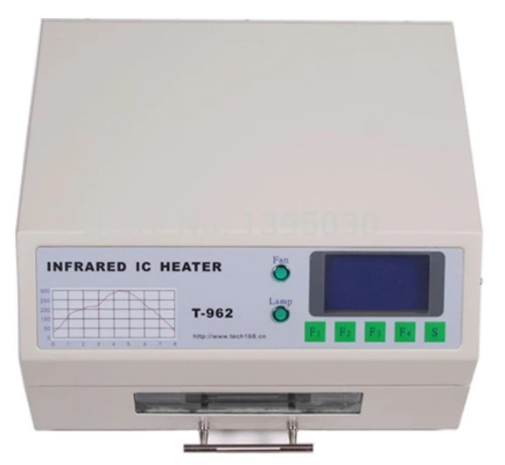

| T-962A        | 1500W       | 300x320mm  |                   |

| T-962C        | 2900W       | 585x400mm  | US$750            
a|
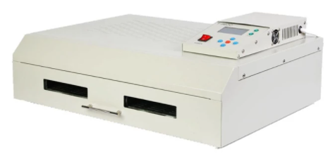
|===

It appears there are "2020 New Versions" of the above reflow ovens which have exhaust pipe brackets added onto the back so you can clamp on a pipe to vent exhaust fumes.

It is known to produce bad-smelling fumes when in use, especially when it is new. This is because the manufacturer uses aluminium tape and masking tape in the unit which is not designed for high temperatures, which melts!!! It is recommended to replace the masking tape with kapton tape after purchase (see the upgrade section below for more info).

Third parties have made "upgrade kits" for these reflow ovens which aim to to provide better thermal control of the soldering process and improve the UI experience. For example, link:https://www.estechnical.co.uk/products/reflow-oven-controllers?gclid=EAIaIQobChMI3KXlo7X_5gIVknZgCh11oAU-EAMYASAAEgIFtfD_BwE[ES Technical provides upgrade packages] for both the T-962 and T-962A. link:https://github.com/UnifiedEngineering/T-962-improvements[UnifiedEngineering redesigned the firmware] to run on the existing microcontroller, with the hardware addition of a temperature sensor for cold junction compensation.

Clones? The Atten AT-R3028 looks VERY similar to the T-962.

== Thermal Cameras

Thermal cameras are great tools to have in an electronics lab for inspecting the thermal behaviour for PCBs and other electrical devices. They can be used to:

* See how heat spread across a PCB
* Detect if things are getting too hot
* Work out where heat sinking is needed
* Calculate {}.
* Find short-circuits

In the context of hand-held thermal cameras, 80x80 is a small number of pixels, 160x120 is moderate, and 640x480 is a large amount.

=== Parameters

NETD: _Noise Equivalent Temperature Difference_: This is the minimum temperature difference that is resolvable by the camera. You could think of this as the _sensitivity_. It is bad practise to refer to this as the resolution as this will get confused with the pixel (spatial) resolution. NETD of thermal cameras is typically between 100-500mk (100-500m°C). The NETD is measure by pointing the camera at a very stable and uniform black body at a specific temperature. The NETD is the standard deviation of the varying pixel values recorded by the camera over a specific period of time<<bib-movitherm-netd>>.

=== Brands

==== Keysight

Keysight has one range of handheld thermal cameras called TrueIR. Within this range there are 3 separate devices, with the key difference between them being the maximum measurement temperature. They all have a medium resolution of 160x120 pixels.

.A marketing photo for the Keysight U5856A thermal camera.
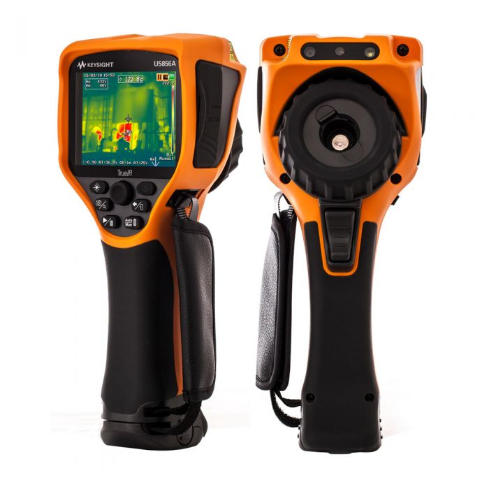

A unique selling point of the Keysight TrueIR range is the small minimum focal distance of 100mm (most other hand-held thermal cameras have a minimum focal length of 300-500mm), which makes them especially useful for inspecting PCBs.

The 350C camera (U5855A) starts at about US$2500, going up to US$3500 for the 1200C camera (U5857A).

**Software**

TrueIR Analysis And Reporting Tool

Windows only. Includes ability to stream video from the IR camera when plugged in via USB cable.

.A screenshot of the Keysight TrueIR software tool.
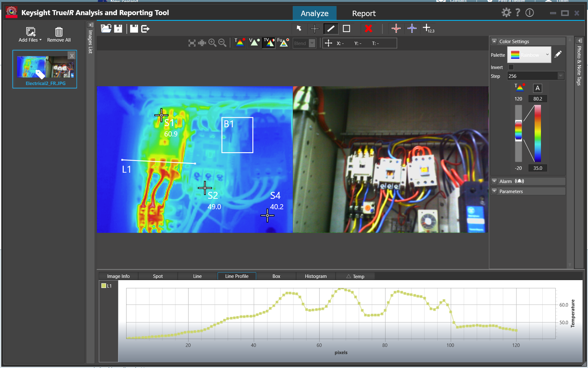

==== FLIR

I was not impressed with the FLIR software (called _Fluke Connect Desktop_). It took account registration and email link clicking to even get to the point to be able to download it. I then encountered issues installing it without having and old version of Microsoft Word present (the software was looking for this so it could generate reports).

==== Fluke

==== Optris

.A photo of the Optris Xi 400 spot finder IR camera.
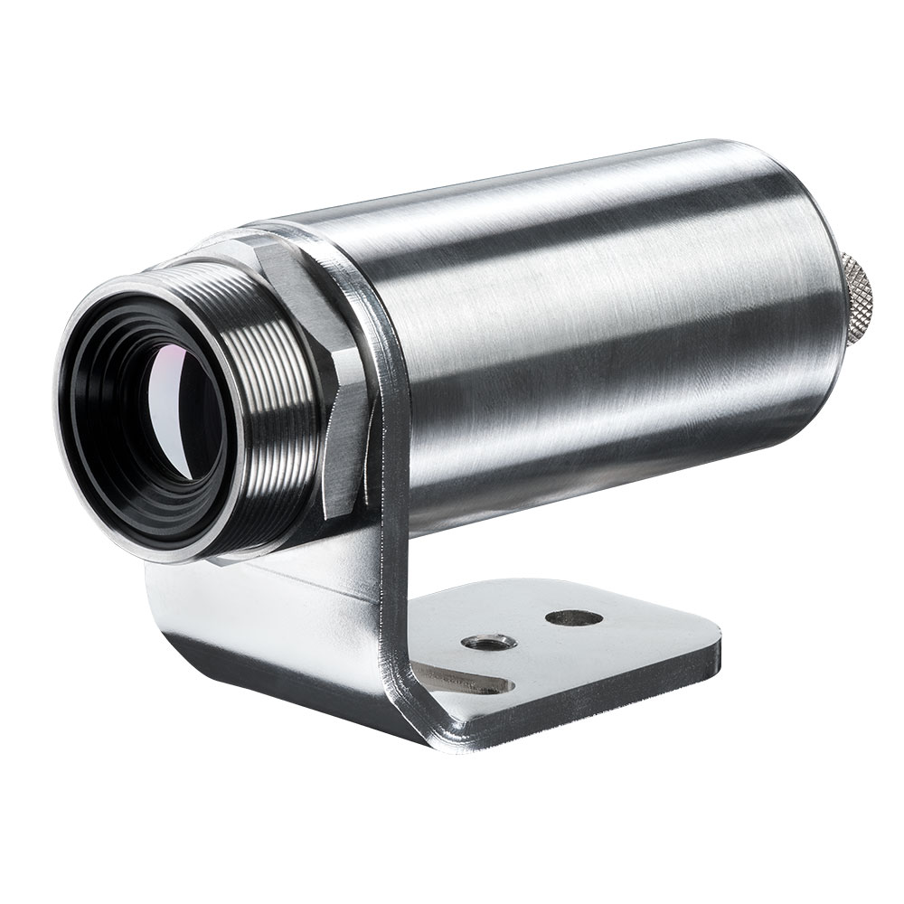

==== Testo

Testo 865: 160x120 pixels, measurement range -20 to 280°C.
Testo 868: 160x120 pixels, measurement range -50 to 650°C.

Minimum focal distance of 0.5m, not so suitable for viewing PCBs.

"SuperResolution" takes the raw infrared pixel resolution of 160x120 and upscales it to 320x240pixels. However I'm not sure how more advanced this is other than just up-sampling the image in the digital realm.

*Software*

IRsoft

==== RS Pro

RS Pro is RS Components self-owned brand.

== Signal Generators

=== Output Voltage Not What You Expect?

Most signal generators have a "Load Impedance" setting. Whilst the signal generator almost always has an output of `\(50\Omega\)`, the signal generator will take this load impedance setting into account and generate a voltage that will result in the set peak-to-peak/amplitude at the output.

However, if this load impedance setting is set to say, 50R, but connected to a high-impedance load (for example, connected straight up to the oscilloscope), you will measure twice the expected voltage at the output!

== Ultrasonic Cleaners 

Fill up with mixture of water and detergent. Standard kitchen detergent will do. Expensive cleaning solutions aimed at the professional electronics market. Do they perform any better?

GT Sonic Ultrasonic Cleaner 6L: Large enough for most PCBs.

Synergy Electronics Ltd, NZ supplier of the GT Sonic range.

=== Components That Don't Like Ultrasonic Baths

* MEMS Oscillators: link:/electronics/components/oscillators#mems-oscillators[Ultrasonic cleaners can cause permanent damage or long-term reliability issues to the MEMS resonator] inside a MEMS oscillator.
* Crystal Resonators (XTALs): The ultrasonic bath could excite a XTAL into a resonant frequency (or harmonic) that causes damage. 32.678kHZ crystals are especially sensitive since they operate at about the same frequency as an ultrasonic bath uses for it's cleaning action. MHz XTALs are far less sensitive.

== Soldering Irons And Stations

* Quick-change tips
* Maximum heating power
* Heating rate (high quality soldering irons can heat-up to the set temperature within about 2 seconds!)
* Stable temperature control under different loads

For all but the lightest of work you will want to choose a _soldering station_ instead of a _soldering iron_. The station provides a holder for the iron, keeping it in a safe place while you do other work (so you don't burn yourself!). It also allows to a lighter and higher power iron, as most of the electronics can now be located in the freestanding control unit rather than in the handheld iron.

=== Brands

==== Hakko

An American company with a vivid and memorable blue/yellow brand color.

==== JBC

The creme-de-la-creme of soldering iron brands. JBC makes some of the highest-quality soldering stations, but as expected, this comes at a very high price.

==== Weller

The Weller brand is associated with quality, second only to JBC. Naturally, their products are generally cheaper than JBCs to compensate.

=== Hobbyist Range

==== Hakko FX888D

No quick change tips

==== Weller WE1010

No quick change tips

=== Professional Range

==== Hakko FM203-15

A dual port soldering station. For use with the FM-2027 soldering iron which takes the Hakko _T12_ range of tips. Note that the T12 range are quick-change, and you start paying more than double for quick-changes tips (versus the T18 range).

**Note that that tips are not truly quick change until you also purchase extra _Soldering Pencil Sleeves_**. These are proprietary hand-grips that slide onto the tip. Once each tip has one of these, you can quickly change tips by unclipping the sleeve + tip from the rest of the iron and inserting a new one. These sleeves also remove the need for using pliers or a rubber mat to remove hot tips.

.A green soldering pencil sleeve from Hakko. You have to purchase one of these per tip before your soldering iron truly becomes 'quick change'. Image from https://nz.element14.com/hakko/b3219/soldering-pencil-sleeve-green/dp/1676853.
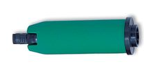

This soldering station can also accept Hakko tweezers. A great choice for popping off and on small 0402/0603/0805 chip resistors and capacitors is the FM-2023 Mini SMD Hot Tweezers with the T9-1L tips:

.Close up of the T9-1L tips on the Hakko FM-2023 Mini SMD Hot Tweezers. Great for popping on and off small 0402/0603/0805 chip resistors and capacitors.
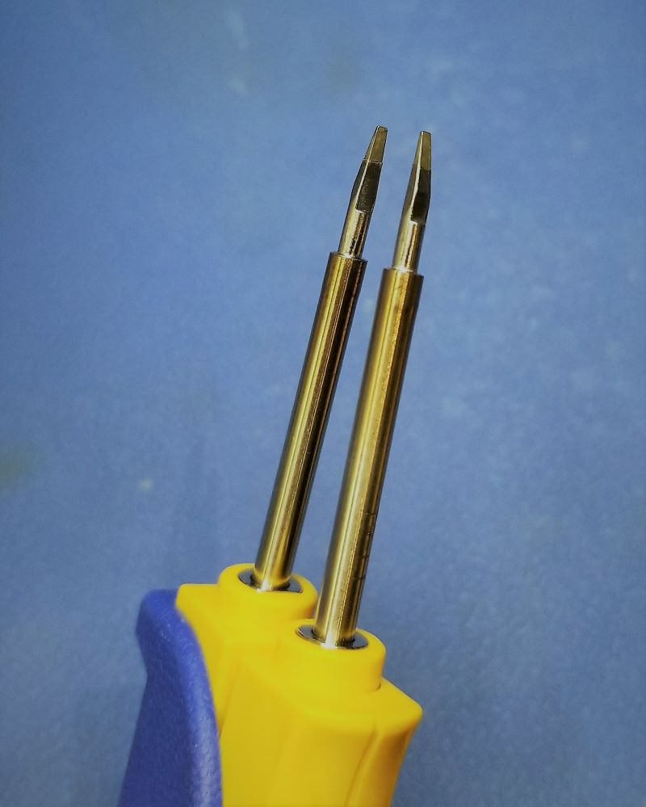

==== Weller WT 1010

Single port. 95W. 550°C max temp. For use with the WTP90 soldering iron, which takes the XT tips.

==== Weller WT2010M

Dual port.
75W x2
450°C

=== Preheating Stations

Most heater elements are between 600-1200W. The body material of the heating element is usually ceramic.

Yihua
UYUE

==== PUHUI T-862

Adjustable temp. range from 0-450°C.

==== GORDAK 853

250x220x110mm
600W

==== PJLSW

430x350x180mm

== Current Probes

Current probes are measurement devices which are used to measure the current flowing through a conductive material, typically a wire or track on the PCB (usually with an appropriate connection loop).

The main disadvantage with a hall-effect or transformer-based current-probe is that the probe tip must encircle the conductor under test. To do this you must use a wire, or provide a special PCB cut-out around the current-carrying trace. Fluxgate magnetometer-based current probes do not have this issue.

A typical current-probe will add a few nH of inductance to the conductor under test. Any additional wire added to the conductor to accommodate the current-probe might add around 10nH per centimetre.

The sensitivity of a current probe can be increase by increasing the number of turns of the wire. Be careful to divide the displayed current on the oscilloscope by the number of turns to get the actual current. Note that increasing the number of turns increases the insertion impedance (the inductance rises with the square of the number of turns).

=== Price

Current probes are not cheap! They are significantly more expensive than their voltage-measuring brothers. As of 2016, you can find cheap no-brand ones for US$60-700, and more expensive Tektronics or Keysight Technologies (the new Agilent) current probes for US$1000-8000.

=== Hall-Effect Probes

Hall-effect current probes use the hall-effect phenomenon to measure the current travelling through a conductor. Their main advantage over the transformer-based current probes is that they can measure DC currents. However, they do not perform well at higher frequencies (20kHz seems to be a rough upper limit).

The hall-effect sensor is an active sensor, and therefore the probe requires an external power source. This may be provided by an internal replaceable battery (e.g. 9V battery), and external power supply connector, or from the oscilloscope through a specialised connector (this is common on the more expensive, brand specific ones).

Like the AC transformer-based current probes, they require the wire to be inserted into a loop. 

=== Standard AC/DC Current Probes

A combined AC/DC current probe is the most versatile current measurement probe. Traditionally, it uses a transformer to measure AC current, and a hall-effect sensor to measure DC currents (originally patented by Tektronics). Hall-effect sensors are active sensors, so AD/DC current probes require a power source.

The probes are normally **split-core**, which allows you to open the probe tip up to inset the wire under test. 

AC/DC probes output a voltage which is proportional to the current flowing through the wire under test. This voltage is measured by the oscilloscope and displayed on a current-scaled waveform. High-end current probes which are built for specific oscilloscopes may draw power from the single oscilloscope connection, as well as automatically changing the units on the scope and auto-scaling.

=== Fluxgate Magnetometer Current Probes

The main advantage is that the measuring device does not need to fully encircle the track/wire under test, and you can design a probe-styled instrument that can measure track/wire current just by bringing the probe tip into close proximity.

=== Aim I-Prober 520

Aim has patents around it's fluxgate magnetometer based current probe, so it might be a while before other manufacturers make similar probes.

.The AIM I-Prober 520 current probe based on fluxgate magnetometer technology. Image from http://www.tti-test.com/.
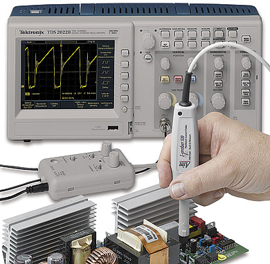

== EM Probes

=== Beehive Non-contact EM Probes

The Beehive Electronics probes set contains three H-field probes (100A, 100B, 100C) and one E-field probe (100D). All are non-contact probes.

.The four non-contact EM probes made by Beehive Electronics. Three are for magnetic field measurement and one is for electric field measurement.
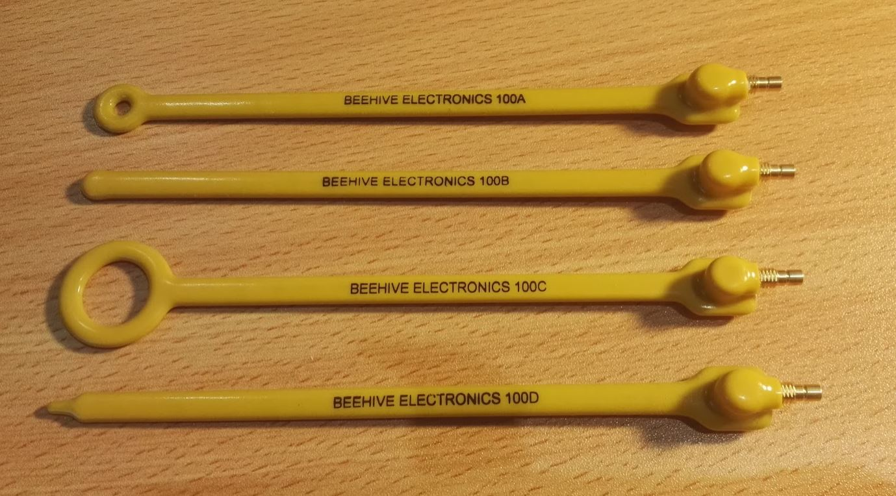

The magnetic flux density can be calculated for the H-field probes using the equation below:

.The equation to work out the magnetic flux density as measured by any of the three magnetic EM probes made by Beehive Electronics.
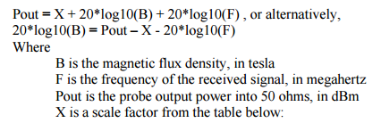

The scale factors for each of the magnetic probes is given below:

.The scale factors and resonances for each of the three magnetic field probes made by Beehive Electronics.
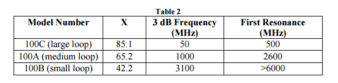

== Flux

Flux is a substance used in the soldering process to remove metal corrosion and improve the adhesion of the molten solder to the metal surfaces.

=== Solder Compatibility

Typically, fluxes are compatible with a broad range of solder compounds, including both leaded and higher-temperature lead-free solders.

=== Activity

Flux activity is a measure of the strength/aggressiveness of the flux in it's ability to clean metals while soldering. Low activity fluxes are weak fluxes and as usually mild acids. High activity fluxes are strong fluxes and are usually low pH acids.

=== Types Of Flux

==== Rosin Flux

Rosin fluxes are the oldest types of flux (well, charcoal was first!). Rosin is the name of refined **pine sap**. Rosin flux is typically a solid at room temperature, but quickly melts and flow easily at soldering temperatures. It is usually a light or dark amber colour. Rosin fluxes have a **low flux activity**.

.A tin of rosin-based flux. Image from https://en.wikipedia.org.
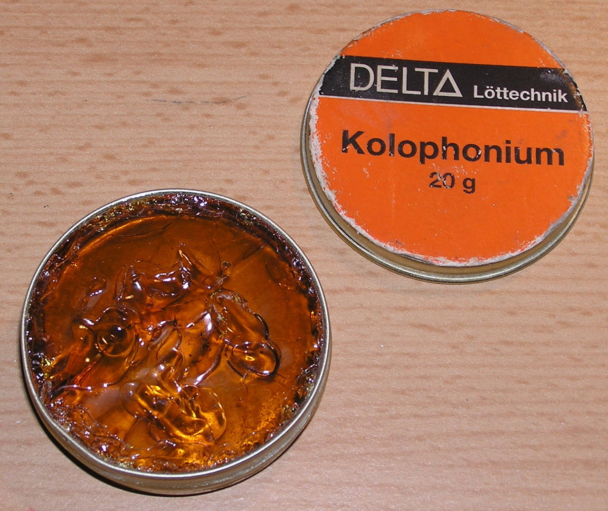

As such, it is usually inert while as a solid, and therefore **safe to leave** on the PCB after soldering. This is of course unless during normal operation the PCB temperature rises enough to melt the rosin flux.

Rosin fluxes are usually non-polar and therefore cannot be washed off with plain water. Non-polar solvents like isopropyl alcohol, acetone, or paint thinner can be used to clean rosin fluxes. Semi-aqueous solvents or water with

Some types of solder contain a rosin core to aid the soldering process, and saves you time because you do not have to apply the flux manually.

.A brand of solder which has a rosin-based flux core.
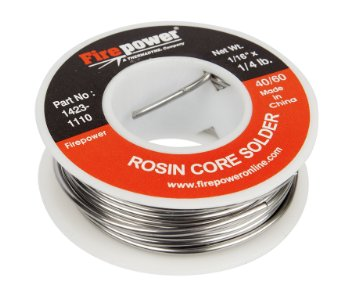

For the chemically-minded people, rosin flux usually has a formula of:

[stem]
++++
C_{19}H_{19}COOH
++++

Obviously, being a naturally produced substance, the make-up of a rosin flux will change.

==== Organic Acid Flux

Organic acid flux is typically made of a weak, organic-based acid such as citric, lactic or stearic acid. The acid is dissolved in a solvent such as a mixture of isopropyl alcohol and water.

They can be a good compromise between reliability, flux activity and cleanability.

==== Inorganic Acid Flux

The most aggressive type of flux, **inorganic fluxes are usually a blend of aggressive chemicals such as hydrochloric acid, zinc chloride and ammonium chloride**. They have a **high activity**. They are normally used for non-electronics related soldering such as a joining of copper pipes (also called brazing).

Inorganic acid fluxes should not be used for electronic soldering because they can leave chemically active residues which cause reliability problems.

==== "No Clean" Flux

The term "no clean" flux is used for fluxes whose residue will not effect the long-term reliability of the PCB. The two important qualities

A disadvantage of no clean flux is the poor aesthetics of leaving the flux residue on the PCB, it can make the PCB appear dirty, old, and may give people the perception that the build quality is not high (only relevant if people actually see the PCB during it's normal use).

The IPC-610 standard specifies some the required properties of no clean flux to be compliant.

=== Flux Applicators

==== Syringes

Flux can be shipped in a syringe. The syringe tip is either a large-diameter (compared to most medical syringes) metal or plastic needle. Syringes offer more precise application of flux than a syringe pen or rod.

==== Pens

Flux pens are permanent marker ("sharpies" for all the Americans) sized pens which contain flux inside them. The tip is made from a porous material which applies flux to the surface and draws more up via the capillary action (much like a normal pen). To promote proper flowing, fluxes used in flux pens are typically of a lower viscosity than the ones in syringes or standard containers.

.A no-clean solder flux pen from ChemTools (part number CT-NC-DP).
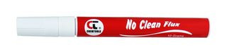

Flux pens are great to have on the work bench for quick, on-off flux applications for reworking. The tips are usually quite thick and do not offer the same precision as flux syringes, but normally this extra precision is not necessary (flux can be "slopped" around the board with little consequence).

=== Soldering Fumes

During the soldering process fumes are released. The amount of fumes increases drastically as flux is used.

It is generally not a good thing to inhale these fumes on a long term basis. Fume extractors can be used to remove the fumes safely.

[bibliography]
== References

* [[[bib-movitherm-netd, 1]]] MoviTHERM. _What is NETD in a Thermal Camera?_. Retrieved 2020-09-03, from https://movitherm.com/knowledgebase/netd-thermal-camera/.
* [[[bib-mil-std-461e, 2]]] Department of Defense (1999, August 20). _MIL-STD-461E: Requirements for the Control of Electromagnetic Interference Characteristics of Subsystems and Equipment_. Quick Search. Retrieved 2021-06-30, from https://quicksearch.dla.mil/qsDocDetails.aspx?ident_number=35789
* [[[bib-cispr-25, 3]]] IEC (2016). _Vehicles, boats and internal combustion engines - Radio disturbance characteristics - Limits and methods of measurement for the protection of on-board receivers_. Retrieved 2021-07-02, from https://webstore.iec.ch/publication/26122